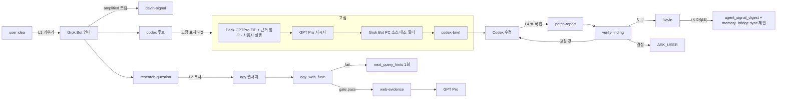

# 오케스트라 시너지 — 다섯 고리 (L1~L5)

같은 신호 줄기(parentId 체인)에서 에이전트 사이 왕복이 **2회**를 넘으면
자동으로 `ASK_USER`로 올린다(`route-rules.json`의 `roundtripLimit`).
막힌 줄기는 `hold`, 나머지 줄기는 계속.

| 고리 | 입력 신호 | 출력 신호 | 담당 | 완료 조건 | 최대 왕복 |
|---|---|---|---|---|---|
| L1 키우기 | idea (kind=idea, 흐릿함) | amplified → devin-signal/codex 후보/research-question | grokbot (부재 시 agy=AGY_AS_GROKBOT) | amplified가 2개 이상의 다음 신호로 쪼개짐 | 2 |
| L2 조사 | research-question | web-evidence | agy | agy_web_fuse gate.pass 또는 next_query_hints 1회 후 종료 | 2 (재조사 1회 포함) |
| L3 고점 | GPTPRO_THEN_CODEX 대상 신호 + web-evidence | gptpro-brief → codex-brief | gptpro → grokbot 필터 → codex | Grok Bot 대조 통과 + codex-brief가 lease·checkpoint·Acceptance 포함 | 2 |
| L4 짝 작업 | patch-report (Codex 완료 보고) | verify-finding | devin | verify-finding이 고칠 것/도구/결정 셋 중 하나로 닫힘 | 2 |
| L5 마무리 | done 신호 모음 | digest 요약 + bridge sync 제안 | devin | BOARD.md에 다음 붙여넣을 줄 또는 없음 표시 | 1 |

- 신호 보관: `data/agent-handoff/orchestra/{inbox,outbox,archive}/`
- 사람용 출력: `var/orchestra/BOARD.md`, `var/orchestra/outbox/PASTE_*.txt`
- 비용 순서(모든 틀에 표기): Codex 크레딧 → 외부 유료 → 무료 → Ollama 마지막
- 예산 기본값: 라이브 호출 0, 재시작 0 (신호 `budget` 필드로만 상향)
