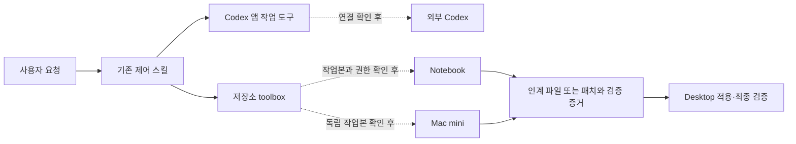

# 외부 스킬 · 장비 제어 허브

**Desktop · Notebook · Mac mini · 외부 Codex**

필요한 스킬을 찾고, 장비에 작업을 전달하고, 결과를 검증할 때 사용하는 저장소 안내입니다.
진입 스킬은 **`$demo1-mcp-control-tower`**입니다. 설치된 외부 스킬의 위치와 활용 절차를
이 저장소에서 찾아볼 수 있도록 정리했습니다.

> 시작 위치: `C:\AbandonWare\demo-1\demo-1\src`  
> 구성: 한국어 안내 + 기존 제어 스킬 + 도구별 사용법 + 장비별 실행 절차

## 바로 시작

아래 문장을 이 저장소를 연 Codex에 붙여 넣으세요.

```text
$demo1-mcp-control-tower
Desktop, Notebook, Mac mini와 외부 Codex의 현재 연결 상태를 확인해줘.
지금 가능한 작업, 필요한 외부 스킬, 연결 증거가 더 필요한 항목을 구분해줘.
```

| 하려는 일 | 바로 가기 | 결과 |
| --- | --- | --- |
| 도구·외부 스킬 고르기 | [외부 스킬 사용 안내](.agents/skills/demo1-mcp-control-tower/references/external-skills.md) | 역할, 호출 예시, 원본 위치, 사용 조건 |
| 장비별 작업 전달하기 | [장비별 실행 절차](.agents/skills/demo1-mcp-control-tower/references/node-playbook.md) | 연결 확인 → 전달 → 수신 → 검증 |
| Codex가 읽을 진입점 확인하기 | [제어 스킬](.agents/skills/demo1-mcp-control-tower/SKILL.md) | 현재 요청에 맞는 절차 선택 |
| 기존 명령·JSON 형식 확인하기 | [제어 도구 명령집](.agents/skills/demo1-mcp-control-tower/references/control-tower-reference.md) | 저장소 toolbox와 PatchDrop 사용법 |

## 장비별 역할

| 대상 | 기본 역할 | 확인할 증거 |
| --- | --- | --- |
| Desktop | 기준 저장소, 최종 적용과 검증 | 현재 루트·대상 파일·검증 결과 |
| Notebook | 조사·인계, 또는 명시적으로 요청된 보호 절차 아래의 수정 | 작업 모드, Y드라이브 동일성 또는 독립 작업본, 대상별 권한 |
| Mac mini | 독립 작업본에서 조사·패치 제작 | 작업본 격리, 노드 실행 증거, 완전한 PatchDrop 묶음 |
| 외부 Codex | 연결된 호스트의 기존 작업 확인·계속하기·인계 | 실제 반환된 호스트·프로젝트·작업 ID, 작업 상태 |



점선은 연결을 확인한 뒤 사용할 경로입니다. 이 그림은 현재 장비가 접속 중이라는 표시가 아닙니다.

## 요청한 도구 모음

| 도구 | 사용 목적 | 요청 예시 |
| --- | --- | --- |
| Superpowers | 설계, 디버깅, 계획 실행, 완료 검증 | “승인한 구성으로 스킬을 작성하고 검증해줘.” |
| 컴퓨터 | Windows 앱의 실제 UI 조작 | “지정한 앱의 설정 화면을 확인해줘.” |
| 브라우저 | 탭 조작, localhost 화면·동작 확인 | “이 로컬 화면의 메뉴 동작을 검증해줘.” |
| Sites | 필요한 안내 사이트·작업 화면 제작 | “이 안내를 로컬 전용 사이트로 만들어줘.” |
| Deep Research | 공식 근거가 필요한 외부 조사 | “원격 연결 방식을 공식 문서로 비교해줘.” |
| Plugin Management | 플러그인 기능·권한·의존성 확인 | “이 작업에 필요한 플러그인의 연결 조건을 확인해줘.” |
| Data Analytics | 실제 작업 기록을 이용한 수치 분석 | “제공한 기록의 장비별 소요 시간과 실패 원인을 분석해줘.” |
| Visualize | 관계·흐름·비교를 대화 안에서 설명 | “작업이 장비 사이를 이동하는 과정을 보여줘.” |
| GLM worker | 사용 가능할 때 범위가 제한된 읽기 전용 조사 | “GLM 사용 조건부터 확인하고, 가능하면 이 경로만 조사해줘.” |

가능한 기능을 폭넓게 찾되, 실행할 때는 요청을 해결하는 도구만 선택합니다.
도구 이름을 한꺼번에 붙이는 것만으로 외부 장비 연결이나 수정 권한이 생기지는 않습니다.

## 자주 쓰는 요청

**다른 Codex 작업 확인**

```text
$demo1-mcp-control-tower
내가 지정한 기존 Codex 작업의 최근 결과와 남은 검증을 확인해줘.
대상은 현재 작업 목록에서 찾아서 확정해줘.
```

**Notebook → Desktop 인계**

```text
$demo1-mcp-control-tower
Notebook에서 조사한 내용을 Desktop이 이어갈 수 있도록 인계 파일을 만들어줘.
수정할 파일은 없고, 관측한 사실과 다음 검증 절차를 담아줘.
```

**Mac mini 작업 준비**

```text
$demo1-mcp-control-tower
Mac mini의 확인된 독립 작업본에 전달할 패치 작업 지시를 준비해줘.
대상 파일과 완료 조건을 명시하고 기존 PatchDrop 절차를 사용해줘.
```

## 연결 상태를 읽는 방법

| 표시 | 뜻 |
| --- | --- |
| 파일 확인 | 해당 스킬 또는 실행 파일이 존재함 |
| 호출 도구 확인 | 현재 작업에 해당 도구가 노출됨 |
| 대상 연결 확인 | 실제 대상 호스트·프로젝트에 접근했다는 현재 증거가 있음 |
| 실행 검증 | 요청한 작업의 결과가 완료 조건을 충족함 |
| `evidence_needed` | 다음 판단에 필요한 증거가 부족함 |

문서를 만든 시점의 기능 확인과 이후의 실제 장비 상태는 별개입니다. 새 작업은 연결 상태부터 다시 확인합니다.
스킬 검증 통과는 원격 접속이나 명령 실행 성공을 뜻하지 않습니다.

## 원본·검증·유지 관리

- 외부 스킬 원본 위치와 확인일은 [외부 스킬 안내](.agents/skills/demo1-mcp-control-tower/references/external-skills.md)에 있습니다.
- 저장소의 권한과 작업 규칙은 [AGENTS.md](AGENTS.md)가 기준입니다.
- 문서를 수정한 뒤에는 [스킬 후처리 검증](.agents/skills/demo1-skill-family-postprocessor/SKILL.md)을 사용합니다.
- 호스트가 바뀌거나 플러그인이 갱신되면 현재 스킬 목록에서 원본 위치를 다시 찾습니다.

공식 문서: [스킬 만들기](https://learn.chatgpt.com/docs/build-skills) ·
[원격 연결과 작업 인계](https://learn.chatgpt.com/docs/remote-connections)
