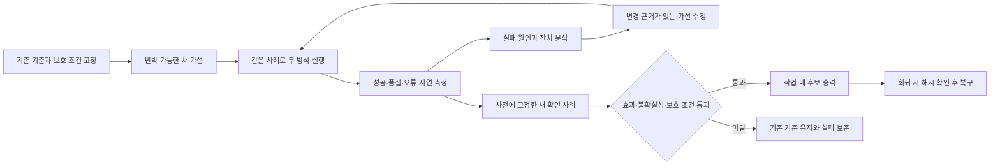

# 의미 기반 스킬 정리와 실험형 룰 개선 — 구현 결과

사용자의 “설계대로 진행”에 따라 파일을 실제로 정리·연결하는 인덱스와
계측 가능한 실험 실행기를 구현했다. 원본 스킬·지시서는 이동하거나
삭제하지 않았다. 새 기능은 `demo1-adaptive-rule-lab`으로 진입한다.

## 바로 사용할 파일

| 목적 | 파일 |
|---|---|
| 사람용 분류·관계 인덱스 | [.agents/skills/SEMANTIC_INDEX.md](../.agents/skills/SEMANTIC_INDEX.md) |
| 에이전트용 의미 메타데이터 | [semantic-catalog.yaml](../.agents/skills/semantic-catalog.yaml) |
| 재현 가능한 기계 인덱스 | [semantic-index.json](../.agents/skills/semantic-index.json) |
| 재사용 실행 룰 | [SKILL.md](../.agents/skills/demo1-adaptive-rule-lab/SKILL.md) |
| 명령·계측·승격 계약 | [experiment-contract.md](../.agents/skills/demo1-adaptive-rule-lab/references/experiment-contract.md) |
| 검증·실험 산출물 | [acceptance](../data/agent-handoff/adaptive-rule-lab/acceptance/) |

저장소 루트에서 실행한다.

```powershell
python -B -X utf8 .agents/skills/demo1-adaptive-rule-lab/scripts/catalog.py search --query "반증"
python -B -X utf8 .agents/skills/demo1-adaptive-rule-lab/scripts/catalog.py suggest
python -B -X utf8 .agents/skills/demo1-adaptive-rule-lab/scripts/catalog.py validate
python -B -X utf8 .agents/skills/demo1-adaptive-rule-lab/scripts/catalog.py build --write
```

`build`는 `--write`가 없으면 읽기만 한다. 원본 해시가 달라지면 기존
분류와 관계를 오래된 것으로 표시한다. 에이전트는 변경 의미를 다시
검토하고 메타데이터를 갱신한 뒤 파생 인덱스를 만든다.

## 정리 결과

최종 검증 시점에 **330개 항목, 21개 관계, 진단 오류 0건**을 확인했다.
같은 입력을 두 번 빌드한 결과 해시도 같았다.

| 종류 | 개수 |
|---|---:|
| 스킬 | 80 — 저장소 68, 개인 루트 12 |
| 참고 문서 | 149 |
| AGENTS 룰 절 | 20 |
| 명시적으로 등록된 도구 | 8 |
| 지시서 | 49 |
| 프롬프트 팩 | 21 |
| 독립 프롬프트 | 3 |

고정된 단일 폴더 분류 대신 기능·목적·입출력·제약·의존성 배열과
다중 개념 라벨을 사용한다. 80개 스킬의 설명은 의미 검토했고,
도구 1개는 모듈 설명 수준 검토, 59개는 제목 수준 검토,
68개는 상위 스킬에서 물려받은 참고 분류, 122개는 어휘 기반 후보로
구분했다. 후보를 완전한 의미 검토로 표시하지 않았다.

사용 빈도는 이번 작업에서 관측한 호출 1건만 기록했다. 나머지 329개는
`unknown/null`이다. 사용 기회 수는 계측하지 않아 null이며, 수정 시각이나
문서 언급 횟수로 호출 빈도를 추정하지 않는다.

바이트가 같은 원본 중복 그룹은 **0개**였다. 기능이 겹치는 50쌍은
[병합 검토 결과](../data/agent-handoff/adaptive-rule-lab/acceptance/merge-review.json)에
남겼다. 가설 생성·반대 근거 수집·근거 판정처럼 입력과 권한이 다른 역할은
`keep_distinct`로 유지했다. 이미 존재하는 observed-debugging 메타 스킬도
측정 공급자로 연결했으며 새로운 실험 승격 권한과 합치지 않았다.

## 실험형 작업을 지원하는 동작



- **계측:** 평가기 코드·입력·정책·환경 해시를 고정하고 AB/BA 순서로
  실행한다. 실제 경과 시간과 성공, 질의 품질, 디버깅 검증, 오류 유형을
  저장한다. 실패·timeout·형식 오류도 분모에 남는다.
- **점수:** 질의는 `100 × (0.50 성공 + 0.30 품질 + 0.20 지연 효용)`이다.
  디버깅 프로필은 품질 자리에 실제 검증 결과를 사용한다. 성공하지 못한
  시도는 빨리 실패해도 지연 보너스를 받지 않는다.
- **보호 조건:** 품질·성공·디버깅·오류 회귀와 명시적인 기능 손실을
  별도로 검사한다. 점수 증가로 보호 기능 상실을 상쇄할 수 없다.
- **불확실성:** 독립 사례의 쌍별 차이에 보수적인 Hoeffding 하한을
  적용한다. 쌍별 bootstrap과 정확 McNemar 진단도 함께 제공하되,
  진단의 작은 p값이나 0폭 구간으로 승격을 우회하지 않는다.
- **예산:** 기본 15분, 후보 가족 3개, 가족당 최대 3개 버전, 평가당
  60초이다. 확인용 사례 묶음은 등록 때 정하고 순서대로 전부 소비한다.
  중간 사례만 고르거나 사용한 묶음을 재사용하는 시도는 거부한다.
- **기록:** 후보별 가설, 변경 근거, 부모 버전, 실패 잔차, 비교 보고서와
  모든 정상화된 시도를 유지한다. 같은 메커니즘을 설명만 바꿔 반복할 수 없다.
- **승격과 복구:** 완전한 확인 평가와 해시 재검증 후 작업 내 추천 포인터만
  바꾼다. 공용 룰 수정은 기존 소유자·리스·preimage·검증 절차를 따른다.
  복구는 현재 포인터가 예상 해시와 일치할 때만 이전 포인터로 돌아간다.

## 실제 파일을 사용한 비교

질의는 공개적으로 작성한 로컬 스킬 탐색 사례이다. 일반 챗봇의 답변 품질이나
서비스 성공률을 측정한 결과는 아니다. 개발 사례에서 가설을 수정한 뒤,
미리 고정한 별도 확인 사례를 다른 프로세스로 실행했다.

| 평가 | 사례 | 제목 검색 기준 | 의미 검색 후보 | 후보 점수 | 결과 |
|---|---:|---:|---:|---:|---|
| 개발 v1 | 16 | 0/16 | 10/16 | 61.38 | 의미 검색 실패 6건 분석 |
| 개발 v2 | 16 | 0/16 | 16/16 | 97.58 | 역할별 개념과 저장소 스킬 뷰로 수정 |
| 별도 확인 v2 | 12 | 1/12 | 10/12 | 81.76 | 공용 룰 승격 보류 |

확인 평가의 평균 차이는 **+73.57점**이지만, 보수적인 하한은
**−19.46점**으로 최소 개선폭 +3점을 넘지 못했다. 실제 `promote` 호출도
`measured-improvement-not-established`로 거부됐고 추천 포인터는 null이었다.
표본은 목적별 수작업 사례이며 독립성·대표성이 외부에서 검증된 모집단은 아니다.
지연 시간은 로컬 프로세스 시작과 호스트 부하를 포함하므로 운영 성능 개선으로
일반화하지 않는다. 원본 카탈로그는 유지하고 개선 후보를 별도 파일로 보존했다.

기록은 [catalog-20260914 캠페인](../data/agent-handoff/adaptive-rule-lab/campaigns/catalog-20260914/)에 있다.
이후 확인 묶음 순서와 복구 사유 저장을 보강해 실행기 해시가 달라졌으므로,
이 캠페인은 당시 고정 버전의 완료 증거이다. 현재 실행기에서 무심코 재개하면
`changed-frozen-campaign`으로 거부한다. 최신 코드의 수명주기 검증은
최종 테스트와 별도 JUnit 수집 캠페인이 입증한다.

## 검증 결과와 한계

- 핵심·수명주기 **26개 테스트 통과**, 추가 JUnit 어댑터 **3개 테스트 통과**.
  전체 29개는 같은 최종 공용 구현을 대상으로 검증했다. 별도로 실제 집중
  테스트 20개를 실행하여 JUnit으로 기록하고, 해시를 고정해 디버깅 계측기에
  넣었다. 수집 결과는 `debugVerified=1`, 동일 결과 비교는 승격 불가였다.
- 잘못된 수치, 누락·중복 사례, 오래된 메타데이터, 양쪽 관계 해시, 확인용
  사례 재사용·일부 선택, 빠른 전체 실패, 보호 기능 손실, 보고서 변조,
  포인터 CAS 복구, timeout, 한글 하위 프로세스 전달을 검증했다.
- 스킬 frontmatter·메타데이터 검증과 현행 스킬-family 자체 테스트가 통과했다.
  새 스킬은 `artifact_ready`; 민감 패턴 검사는 0건이다.
- 기존 `test_codex_instruction_governance` 전체 실행은 **통과하지 않았다**.
  변경 전 보관본에도 `ROUTE_SCHEMA_INVALID`, `ROUTE_UNEXPECTED`가 있었고,
  기존 추가 스킬 2개와 새 스킬은 과거 고정 목록에 없다. 이번 새 항목은
  기존 필드 스키마와 실제 source/pairedArtifact 연결을 별도로 통과했다.
  고정 목록을 바꾸거나 다른 작성자의 라우트를 덮어쓰지 않았다.
  [차이 증거](../data/agent-handoff/adaptive-rule-lab/acceptance/governance-delta.json)를
  남겼으며, 다음 관련 변경은 해당 거버넌스 소유자가 추가 라우트 정책을 반영하는 것이다.
- 독립 검토가 발견한 빠른 실패 승격·확인 사례 선택 허점을 보완했다.
  한글 입력 인코딩 문제로 두 번의 검증이 실패했고 체크포인트가 8개 파일을
  각각 복구했다. 실패 기록은 삭제하지 않았다. 한 JUnit 추가 배치에서는
  앞선 Git 작업 가드 결과를 확인하기 전에 작성한 절차 오류가 있었다.
  이후 추가 작성을 중단하고 두 파일의 소유 해시와 새 범위를 다시 확인해
  `allowed=true`를 받은 뒤 재검증했다. 이 이력도
  [guard-revalidation.json](../data/agent-handoff/adaptive-rule-lab/acceptance/guard-revalidation.json)에 남겼다.

작동 범위는 현재 등록된 평가기와 이 스킬을 사용하는 에이전트이다. 일반
Codex 도구 전체를 가로채는 계측기나 예약 watcher는 설치하지 않았다.
새 도구는 정규화 어댑터 또는 실제 호출 경계의 usage 이벤트로 연결한다.
개인·플러그인 원본, 애플리케이션 소스, 데이터베이스·자격 증명·배포는
수정하지 않았다. 외부 보조 검토 한 건은 90초 제한으로 종료됐고 재호출 없이
로컬 검증으로 대체했으며, 모델 응답 성공으로 기록하지 않았다.

**상태:** `catalog_ready=true`, `loop_ready=true`, `shared_rule_promoted=false`.
실험 메커니즘은 준비됐고, 현재 후보의 운영 승격 근거는 아직 부족하다.
