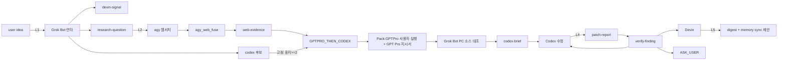

# 오케스트라 시너지 (orchestra-synergy)

> 2026-10-03 · 신규. 사용자 아이디어 → Grok Bot 키우기 → lane 라우팅 →
> 에이전트별 붙여넣기 줄 생성까지의 얇은 조율층. **자동 전송 없음** —
> 사용자가 파일을 복사해 에이전트 창에 붙여넣는다.

## 구성 파일

| 파일 | 역할 |
|---|---|
| `scripts/orchestra_signal.py` | awx.orchestra-signal.v1 저장소: `new/validate/link/move/list`, 내용 해시 id 중복 차단, 비밀값 패턴 거부 |
| `scripts/orchestra_route.py` | lane 결정. 기존 분류기 3개(`codex_question_classifier`, `awx_skill_router`, `devin_task_orchestrate plan`)를 subprocess로 호출해 근거로 남김 |
| `scripts/fixtures/orchestra/route-rules.json` | lane 규칙·고점 표지·왕복 상한·비용 순서 — 사용자가 바꿀 수 있는 SSOT |
| `scripts/orchestra_board.py` | `agent_signal_digest --json` + 신호 저장소 → 30줄 이내 BOARD.md |
| `scripts/orchestra_paste.py` | 라우팅된 신호 → 에이전트별 `PASTE_<AGENT>_<topic>_<yyyymmdd>.txt` + `말로:` 줄 |
| `scripts/Orchestra-Board.bat` | board `--md` 래퍼 |
| `scripts/agent_quick_signal.py` | 원스톱 퀵 CLI: `emit`(new+route+paste 1회) / `inbox` / `copy`(클립보드) / `done` / `counts` |
| `scripts/Agent-Signal.bat` | 위 CLI의 윈도우 래퍼: 무인자면 `[Codex: N] [Devin: N] [Grok: N]` + 번호 메뉴, 인자면 그대로 위임 |
| `data/agent-handoff/orchestra/` | 신호 저장소(`inbox/<agent>/`, `outbox/<agent>/`, `archive/`) |
| `var/orchestra/` | 사람용 출력(BOARD.md, outbox/PASTE_*) |

## 역할 분담 (사용자 지정 2026-10-03, dot 줄 추가 2026-10-05)

- **dot (ChatGPT "UnlimitedAbandon")**: **지시서 작성·Downloads 배달 담당
  (아침 페이스, 2026-10-05 재고정).** 목표·스킬·자료를 받으면
  `PASTE_CODEX_*.md`/`PASTE_<AGENT>_*.txt` 지시서를 만들고 Downloads sha12
  MATCH까지가 완료. 세션 적용은 사용자가 손수 붙여넣기 — 자동 발송·자동
  감시·패치 후 룰 자동 갱신 루프 금지(사용자 요청 단건 companion만).
  상세: `docs/agents-rules/DEMO1-DOT-CONTROL-TOWER.md`.
- **Grok Bot**: 아이디어·신호 키움(긍정/부정/반례 → 중립 판정 연타). 결과를
  devin-signal / codex 후보 / research-question으로 쪼갬. PC 밖에서
  `Downloads\PASTE_*.txt`로 지시서를 넘긴다.
- **Devin**: 신호를 받아 도구·스크립트·규칙·검증을 만든다. Codex가 고친 뒤
  검증하고 verify-finding 신호로 돌려준다.
- **Codex**: 제품 소스 수정. 고점 높은 일(설계 큼/멀티 seam/바깥 최신 정보
  필요)은 GPT Pro가 쓴 지시서를 받아 진행.
- **GPT Pro**: ZIP 스냅샷 + 웹서치로 분석·지시서 초안 (사용자가 직접 업로드).
- **agy**: **4대 특화 우선** — 문서 수집, 코덱스용 정제 전달(3-Pack), 지시서
  작성, 서브 리포터 (`docs/agents-rules/DEMO1-AGY-SPECIALIZATION.md`).
  웹서치로 근거 수집 → web-evidence 신호로 회수. Grok Bot 부재 시
  `demo1-agy-grokbot-mode`로 서브 역할.

위계 (2026-10-05, 아침 페이스 재고정):
- dot = 지시서 작성 + Downloads 배달(무엇을·누가 제안은 dot이 지시서로
  만든다; 세션 적용·발송은 사용자 손수). Codex = 제품 소스 작성자.
  Devin = 룰·도구·검증 지원(dot 지시서를 도구로 굳힘, 뒤집지 않음).
  Grok Bot = 사용자 옆 분석·지시서 보조. agy·Grok CLI = 하위 작업자
  (조사·단건 위임).
- 충돌 시 우선순위: **사용자 직접 지시 > dot 최신 지시서 > 기존 SSOT 문구**.
  단 비밀값·PROTO_OPEN·lease 안전 규칙은 누구도 못 바꾼다.
- dot이 PC에 못 붙을 때도 구조는 그대로: 사용자가 지시서 파일(Downloads
  또는 카드 경유)을 받아 Codex에 손수 붙여넣으면 같은 효력.
- dot 대체 금지: 다른 에이전트가 dot의 지시서 작성 역할을 가져가지 않는다.
  Grok Bot·Devin은 dot 지시서에 **보조 지시서**(companion)만 쓴다.
- SERIAL_LANE (2026-10-05): 한 Codex/dot 작업 세션 = **활성 지시서(PASTE)
  1개**. 새 목표는 현재 목표를 Acceptance/HOLD로 닫은 뒤 새 세션·새 PASTE로만
  진행 — 같은 컨텍스트 합치기 금지 (SSOT:
  `docs/agents-rules/DEMO1-DOT-CONTROL-TOWER.md` §1-B, 잠금 INV-S1~S3).

## lane 규칙 (route-rules.json 기본값)

| lane | 조건 | 다음 |
|---|---|---|
| DEVIN | 도구·스크립트·규칙·검증·정리·현황판, 제품 소스 수정 없음 | devin |
| CODEX_DIRECT | 제품 소스, 범위 좁고 근거 PC 확인 | codex |
| GPTPRO_THEN_CODEX | 고점 표지 ≥2: 제품 파일≥3 또는 멀티 seam / 설계 선택지≥2 / 바깥 최신 정보 필요 / 품질 상한 상향 / 이전 시도 2회 실패 | gptpro → codex |
| AGY_RESEARCH | 사실 확인·최신 정보·비교 조사가 먼저 + 문서 수집·코덱스용 정제 전달 등 agy 4대 특화 | agy |
| GROKBOT_AMPLIFY | 아이디어 흐릿함 | grokbot |
| AGY_AS_GROKBOT | Grok Bot 부재 | agy |
| ASK_USER | 되돌릴 수 없는 결정만 (공개 비용·데이터 삭제·권한 정책) | user |

## 다섯 고리 (L1~L5)



| 고리 | 입력 | 출력 | 담당 | 완료 조건 | 최대 왕복 |
|---|---|---|---|---|---|
| L1 키우기 | idea | amplified → 3종 분할 | grokbot/agy | 분할 신호 ≥1개 생성 | 2 |
| L2 조사 | research-question | web-evidence | agy | fuse gate.pass 또는 힌트 1회 후 종료 | 2 |
| L3 고점 | 고점 신호 + web-evidence | codex-brief | gptpro→grokbot→codex | 지시서가 lease/checkpoint/Acceptance 포함 | 2 |
| L4 짝 작업 | patch-report | verify-finding | devin | finding이 Codex/도구/ASK_USER로 닫힘 | 2 |
| L5 마무리 | done 신호 | digest 요약 + sync 제안 | devin | BOARD.md 갱신 | 1 |

**왕복 상한:** 같은 줄기(parentId 체인)에서 발신자가 3번 바뀌면(왕복 >2)
다음 라우팅은 무조건 ASK_USER. 막힌 줄기는 `hold`, 나머지는 계속.

## 지킴이 (O7)

- **겹침**: 라우팅 시 활성 lease의 targetPaths와 다른 진행 중 신호의 files를
  비교 → 겹치면 "같은 줄기로 묶거나 순서 정하기" 경고. 남의 lease는 절대
  건드리지 않음.
- **비용**: 신호 `budget` 없으면 라이브 호출 0·재시작 0. 보드에 `n/상한` 표시.
- **401/403/429**: 재시도 신호를 만들지 않고 `kind=question` 원인 신호로
  변환 (401/403→ASK_USER, 429→DEVIN).
- **증거 등급**: mock·dry-run 결과는 `확인됨` 금지 — `보고됨`/`추론`만.

## 사용 흐름

```powershell
# 1) Grok Bot의 PASTE를 신호로
python -B scripts/orchestra_signal.py new --from grokbot --kind amplified `
  --text-file $env:USERPROFILE\Downloads\PASTE_DEVIN_x.txt --to devin

# 2) lane 결정 + 근거
python -B scripts/orchestra_route.py --signal <id> --apply

# 3) 현황
scripts\Orchestra-Board.bat   # var\orchestra\BOARD.md

# 4) 다음 에이전트용 붙여넣기 파일 + 말로 줄
python -B scripts/orchestra_paste.py --id <id> --agent codex
```

## 3대 에이전트 핑퐁 규칙 (Codex ↔ Devin ↔ Grok)

위 4단계를 한 번에 처리하는 퀵 경로가 `scripts/agent_quick_signal.py`
(배치 `scripts\Agent-Signal.bat`)이다. 단계를 나눠 부를 필요가 없을 때 —
작업 완료 통지, 검증 요청, 아이디어 한 줄 전달 — 에 사용한다.

- 각 에이전트가 작업을 마치면 **1줄 신호**를 권고 포맷으로 남긴다:

  ```powershell
  scripts\Agent-Signal.bat emit --from <me> --to <target> --summary "..." --files <목록>
  # 예) devin이 codex에게 검증 요청을 넘길 때
  scripts\Agent-Signal.bat emit --from devin --to codex --summary "x 패치 검증 요청" --files scripts/x.py
  ```

- `--clip`을 붙이면 생성된 `PASTE_<AGENT>_*.txt` 본문이 Windows
  클립보드(`clip.exe` → `powershell Set-Clipboard` 순서로 시도)에 복사된다.
- 받은 쪽은 `scripts\Agent-Signal.bat inbox --agent <me>`로 대기 신호를 확인하고,
  `copy --id <id>`로 해당 PASTE 본문을 클립보드에 옮겨 창에 붙여넣는다.
- 처리가 끝난 신호는 `done --id <id>`로 `archive/` 이동 + `status=done`.
- 배치를 인자 없이 실행하면 `[Codex: N] [Devin: N] [Grok: N]` 대기 현황과
  번호 메뉴(1. 신호 생성, 2. 최신 PASTE 복사, 3. 현황판, 4. 종료)가 뜬다.
- `emit`은 내부적으로 `orchestra_signal.py new` → `orchestra_route.py
  --apply` → `orchestra_paste.py`를 순서대로 subprocess 호출한다 — 분류기·
  라우터 로직을 복사하지 않는다. `--no-classify`를 주면 근거 수집 호출을 건너뛴다.
- 여전히 자동 전송은 없다. 생성된 `말로:` 줄을 사용자가 해당 에이전트 창에
  직접 붙여넣는다. 비밀값 패턴은 `orchestra_signal.py`가 그대로 거부한다.
