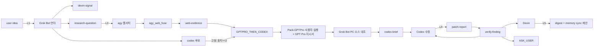

# 오케스트라 시너지 (orchestra-synergy)

> 2026-10-03 · 신규. 사용자 아이디어 → Grok Bot 키우기 → lane 라우팅 →
> 에이전트별 붙여넣기 줄 생성까지의 얇은 조율층. **자동 전송 없음** —
> 사용자가 파일을 복사해 에이전트 창에 붙여넣는다.

## 구성 파일

| 파일 | 역할 |
|---|---|
| `scripts/orchestra_signal.py` | awx.orchestra-signal.v1 저장소: `new/validate/link/move/list`, 내용 해시 id 중복 차단, 비밀값 패턴 거부 |
| `scripts/orchestra_route.py` | lane 결정. 기존 분류기 3개(`codex_question_classifier`, `awx_skill_router`, `devin_task_orchestrate plan`)를 subprocess로 호출해 근거로 남김 |
| `scripts/fixtures/orchestra/route-rules.json` | lane 규칙·고점 표지·왕복 상한·비용 순서 — 사용자가 바꿀 수 있는 SSOT |
| `scripts/orchestra_board.py` | `agent_signal_digest --json` + 신호 저장소 → 30줄 이내 BOARD.md |
| `scripts/orchestra_paste.py` | 라우팅된 신호 → 에이전트별 `PASTE_<AGENT>_<topic>_<yyyymmdd>.txt` + `말로:` 줄 |
| `scripts/Orchestra-Board.bat` | board `--md` 래퍼 |
| `data/agent-handoff/orchestra/` | 신호 저장소(`inbox/<agent>/`, `outbox/<agent>/`, `archive/`) |
| `var/orchestra/` | 사람용 출력(BOARD.md, outbox/PASTE_*) |

## 역할 분담 (사용자 지정 2026-10-03)

- **Grok Bot**: 아이디어·신호 키움(긍정/부정/반례 → 중립 판정 연타). 결과를
  devin-signal / codex 후보 / research-question으로 쪼갬. PC 밖에서
  `Downloads\PASTE_*.txt`로 지시서를 넘긴다.
- **Devin**: 신호를 받아 도구·스크립트·규칙·검증을 만든다. Codex가 고친 뒤
  검증하고 verify-finding 신호로 돌려준다.
- **Codex**: 제품 소스 수정. 고점 높은 일(설계 큼/멀티 seam/바깥 최신 정보
  필요)은 GPT Pro가 쓴 지시서를 받아 진행.
- **GPT Pro**: ZIP 스냅샷 + 웹서치로 분석·지시서 초안 (사용자가 직접 업로드).
- **agy**: 웹서치로 근거 수집 → web-evidence 신호로 회수. Grok Bot 부재 시
  `demo1-agy-grokbot-mode`로 서브 역할.

## lane 규칙 (route-rules.json 기본값)

| lane | 조건 | 다음 |
|---|---|---|
| DEVIN | 도구·스크립트·규칙·검증·정리·현황판, 제품 소스 수정 없음 | devin |
| CODEX_DIRECT | 제품 소스, 범위 좁고 근거 PC 확인 | codex |
| GPTPRO_THEN_CODEX | 고점 표지 ≥2: 제품 파일≥3 또는 멀티 seam / 설계 선택지≥2 / 바깥 최신 정보 필요 / 품질 상한 상향 / 이전 시도 2회 실패 | gptpro → codex |
| AGY_RESEARCH | 사실 확인·최신 정보·비교 조사가 먼저 | agy |
| GROKBOT_AMPLIFY | 아이디어 흐릿함 | grokbot |
| AGY_AS_GROKBOT | Grok Bot 부재 | agy |
| ASK_USER | 되돌릴 수 없는 결정만 (공개 비용·데이터 삭제·권한 정책) | user |

## 다섯 고리 (L1~L5)



| 고리 | 입력 | 출력 | 담당 | 완료 조건 | 최대 왕복 |
|---|---|---|---|---|---|
| L1 키우기 | idea | amplified → 3종 분할 | grokbot/agy | 분할 신호 ≥1개 생성 | 2 |
| L2 조사 | research-question | web-evidence | agy | fuse gate.pass 또는 힌트 1회 후 종료 | 2 |
| L3 고점 | 고점 신호 + web-evidence | codex-brief | gptpro→grokbot→codex | 지시서가 lease/checkpoint/Acceptance 포함 | 2 |
| L4 짝 작업 | patch-report | verify-finding | devin | finding이 Codex/도구/ASK_USER로 닫힘 | 2 |
| L5 마무리 | done 신호 | digest 요약 + sync 제안 | devin | BOARD.md 갱신 | 1 |

**왕복 상한:** 같은 줄기(parentId 체인)에서 발신자가 3번 바뀌면(왕복 >2)
다음 라우팅은 무조건 ASK_USER. 막힌 줄기는 `hold`, 나머지는 계속.

## 지킴이 (O7)

- **겹침**: 라우팅 시 활성 lease의 targetPaths와 다른 진행 중 신호의 files를
  비교 → 겹치면 "같은 줄기로 묶거나 순서 정하기" 경고. 남의 lease는 절대
  건드리지 않음.
- **비용**: 신호 `budget` 없으면 라이브 호출 0·재시작 0. 보드에 `n/상한` 표시.
- **401/403/429**: 재시도 신호를 만들지 않고 `kind=question` 원인 신호로
  변환 (401/403→ASK_USER, 429→DEVIN).
- **증거 등급**: mock·dry-run 결과는 `확인됨` 금지 — `보고됨`/`추론`만.

## 사용 흐름

```powershell
# 1) Grok Bot의 PASTE를 신호로
python -B scripts/orchestra_signal.py new --from grokbot --kind amplified `
  --text-file $env:USERPROFILE\Downloads\PASTE_DEVIN_x.txt --to devin

# 2) lane 결정 + 근거
python -B scripts/orchestra_route.py --signal <id> --apply

# 3) 현황
scripts\Orchestra-Board.bat   # var\orchestra\BOARD.md

# 4) 다음 에이전트용 붙여넣기 파일 + 말로 줄
python -B scripts/orchestra_paste.py --id <id> --agent codex
```
