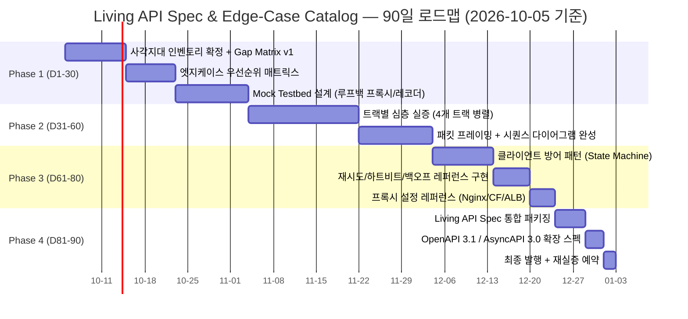

# 00. 90일 로드맵 & The Gap Matrix

> Living API Spec & Edge-Case Catalog — 실행 계획서 (WP1)
> 문서 ID: `APISPEC-00` · 버전: 1.0 · 작성일: 2026-10-05 (KST)
> 리뷰 주기: 30일 · 자동 만료: 작성일 +90일 (2027-01-03 이후 재실증 필요)
> 상위 인덱스: [README.md](README.md)

## 목적과 범위

실무에서 널리 쓰이지만 **웹에 실전 장애 복구 정보가 거의 없는** 4대 API 규격군의
비공개 엣지케이스를 90일(12주) 동안 단계적으로 실증·문서화한다.

- **Track 1 — AI Agent**: [01_AI_AGENT_PROTOCOLS.md](01_AI_AGENT_PROTOCOLS.md)
  (MCP stdio/Streamable HTTP, OpenAI Realtime WebRTC, Anthropic tool_use 스트리밍)
- **Track 2 — Zero-Trust Auth**: [02_ZERO_TRUST_AUTH.md](02_ZERO_TRUST_AUTH.md)
  (RFC 9449 DPoP, DPoP-Nonce, jti, RFC 8693 토큰 교환)
- **Track 3 — Streaming Transport**: [03_STREAMING_TRANSPORT.md](03_STREAMING_TRANSPORT.md)
  (SSE 프록시 버퍼링, Last-Event-ID, WebSocket 하트비트, gRPC-Web)
- **Track 4 — Rate Limit / Idempotency**: [04_RATELIMIT_IDEMPOTENCY.md](04_RATELIMIT_IDEMPOTENCY.md)
  (RateLimit 헤더 3계열, Retry-After, Full Jitter, Idempotency-Key)

### 비범위 (Out of Scope)

- 제품 코드(`main/`, `app/`, `frontend/`, `configs/`) 수정 — 본 카탈로그는 문서 자산이다.
- 유료 외부 API 라이브 호출 — 모든 실증은 RFC 명세 분석 + 로컬 Mock Testbed 기준.
- 특정 벤더 SDK 내부 구현 비판 — 와이어 규격(wire spec)과 클라이언트 방어 패턴만 다룬다.

## 90일 로드맵

| Phase | 기간 | 목표 | 주요 산출물 | 검증 게이트 |
|---|---|---|---|---|
| 1 | Day 1–30 | 사각지대 인벤토리 확정, 엣지케이스 매트릭스, Mock Testbed 설계 | Gap Matrix v1 (본 문서), Testbed 설계도 | 트랙당 엣지케이스 ≥5건, 재현 시나리오 각 1건 |
| 2 | Day 31–60 | 트랙별 심층 실증, 와이어 프레이밍·시퀀스 완성 | 01~04 문서 실증본, 패킷 캡처 요약 | 모든 시퀀스 다이어그램 ↔ 실제 프레임 1:1 대조 |
| 3 | Day 61–80 | 프로덕션급 클라이언트 방어 패턴, 프록시 설정 레퍼런스 | State Machine 명세, Nginx/CF/ALB 설정 카드 | 방어 패턴별 실패 주입(fault-injection) 통과 |
| 4 | Day 81–90 | 통합 패키징, OpenAPI/AsyncAPI 확장, 최종 발행 | `x-edge-cases` 확장 스펙, 발행본 | `validate_api_catalog.py` exit=0 + 외부 리뷰 1회 |

### Phase별 검증 게이트 상세

- **P1 게이트**: Gap Matrix 모든 행에 `재현 가능성` 등급(High/Med/Low) 부여 완료.
- **P2 게이트**: 각 트랙 문서의 Mermaid 시퀀스가 Mock 캡처와 순서·필드명 일치.
- **P3 게이트**: 방어 패턴 코드 스켈레톤이 컴파일 가능한 수도코드 수준 이상.
- **P4 게이트**: 카탈로그 검증기 통과 + OpenAPI `x-` 확장 키 네이밍 규칙 확정.

## The Gap Matrix

공식 문서 유무와 무관하게 **실전 장애 시 복구 지침의 웹 가용성**을 기준으로 평가한다.
위험도: `Critical` = 데이터 손실·보안 실패 가능 / `High` = 장애·재연결 실패 / `Medium` = 성능·UX 저하.

| # | 규격 / 항목 | 공식 문서 | 웹 검색 가용성 | 위험도 | 실무 엣지케이스 요약 |
|---|---|---|---|---|---|
| G01 | MCP stdio NDJSON vs Content-Length 프레이밍 | 있음 (spec 전이 중) | 낮음 | High | LSP식 `Content-Length` 프레이밍 혼용 시 파서 교착. 개행 프레임만 허용 |
| G02 | MCP `notifications/cancelled` 경합 | 있음 (개념만) | 매우 낮음 | High | 취소 도착 전 응답 시작 경합; 진행 중 tool call의 취소 의미론 미정의 |
| G03 | MCP Streamable HTTP 세션 만료 (404) | 있음 | 낮음 | High | `Mcp-Session-Id` 404 수신 시 재-initialize 의무; 무헤더 요청 거절 |
| G04 | OpenAI Realtime ephemeral token 수명 | 있음 (짧은 언급) | 낮음 | Critical | 토큰 수명 ~1분 추정 — SDP 교환 전 만료 시 핸드셰이크 실패, 사전 로테이션 필수 |
| G05 | Realtime ICE 재연결 시 세션 컨텍스트 | 없음 | 매우 낮음 | Critical | ICE restart 후 data channel 재수립해도 대화 상태 비보장 — 수동 재주입 |
| G06 | Realtime Barge-in 오디오 버퍼 | 부분 (이벤트명만) | 낮음 | High | `speech_started` 수신 시 로컬 재생 버퍼 즉시 플러시 + `response.cancel` |
| G07 | Anthropic tool_use Partial JSON 누적 | 있음 | 낮음 | High | `input_json_delta` 불완전 JSON을 실행하면 안 됨 — 중단 시 도구 호출 폐기 |
| G08 | DPoP `htu` 정규화 (query/hash 제외) | 있음 (RFC 9449) | 낮음 | Critical | 쿼리 포함 서명 → RS 검증 실패; L7 프록시 재작성 URI와 불일치 |
| G09 | DPoP-Nonce 챌린지 루프 | 있음 (RFC 9449) | 매우 낮음 | High | `DPoP-Nonce` 수신 → `nonce` 클레임 재서명 필수; 무한 루프 방지 상한 |
| G10 | DPoP `jti` 재시도 재서명 | 있음 | 낮음 | Critical | 동일 proof 재사용 = replay 거절; 재시도마다 신규 jti+iat 재서명 |
| G11 | SSE 프록시 버퍼링 (X-Accel-Buffering) | 벤더 문서 분산 | 중간 | High | Nginx `proxy_buffering on` 기본값이 이벤트를 수분간 지연 |
| G12 | `Last-Event-ID` 유실 + 링버퍼 백프레셔 | 있음 (WHATWG) | 낮음 | High | 재연결 시 ID 누락 → 전체 재전송 또는 gap; 링버퍼 소진 시 resync 정책 |
| G13 | HTTP/2 유휴 타임아웃 + 코멘트 핑 | 없음 (관측 지식) | 낮음 | High | HTTP/2 PING 프레임은 앱 계층에 전달 안 됨 → `: keepalive` 코멘트 필수 |
| G14 | gRPC-Web `trailers-only` 응답 | 있음 (프로토콜 문서) | 낮음 | High | 본문 내 트레일러 프레임(MSB 0x80); 브라우저는 실 트레일러 접근 불가 |
| G15 | RateLimit 헤더 3계열 비정규화 | 있음 (IETF draft) | 중간 | High | draft `RateLimit-Reset`=delta-초 vs GitHub `X-RateLimit-Reset`=epoch 혼재 |
| G16 | `Retry-After` date/float 혼재 파싱 | 있음 (RFC 9110) | 중간 | Medium | HTTP-date + 비표준 float 초 동시 파싱; 과거 시각 = 즉시 재시도 아님 |
| G17 | `Idempotency-Key` in-flight 중복 | 있음 (IETF draft) | 낮음 | High | 동일 키 요청 진행 중 재전송 → 409 vs 대기-재생; TTL 만료 경합 상태 |
| G18 | (부록) Webhook HMAC 서명 검증 | 벤더별 분산 | 중간 | Medium | 타임스탬프+서명 동시 검증, 리플레이 윈도우 — 부록 후보군 (ASK_ONCE 기본값) |

> 위험도 판정 근거는 각 트랙 문서의 `## 엣지케이스 카탈로그` 표에 사례 단위로 기록한다.
> `공식 문서` 열의 "있음"은 규격 존재를 뜻하며 **실전 복구 지침 존재와 무관**하다.

## 운영 규칙

1. **Living 문서**: 30일 리뷰 / 90일 자동 만료. 만료된 항목은 `stale` 표시 후 재실증 또는 아카이브.
2. **근거 등급**: 모든 주장에 `사실`(RFC/공식 문서 확인), `실증`(Mock 재현), `관측`(필드 경험),
   `추정`(근거 부족) 중 하나를 명시한다. `추정`은 Phase 2까지 `사실/실증`으로 승격 의무.
3. **벤더 변동**: 토큰 수명·헤더명 같은 가변 스펙 값은 인용 시점 날짜를 함께 기록한다.
4. **검증기 연동**: 구조 변경 시 `python -B scripts/validate_api_catalog.py` exit=0이 커밋 조건.
5. **비용 원칙**: 전 과정 로컬 $0. 라이브 유료 API 호출은 사용자 명시 승인이 있을 때만 별도 ledger로.

## 관련 문서

- [README.md](README.md) — 카탈로그 인덱스와 치트시트
- [01_AI_AGENT_PROTOCOLS.md](01_AI_AGENT_PROTOCOLS.md) — Track 1
- [02_ZERO_TRUST_AUTH.md](02_ZERO_TRUST_AUTH.md) — Track 2
- [03_STREAMING_TRANSPORT.md](03_STREAMING_TRANSPORT.md) — Track 3
- [04_RATELIMIT_IDEMPOTENCY.md](04_RATELIMIT_IDEMPOTENCY.md) — Track 4
