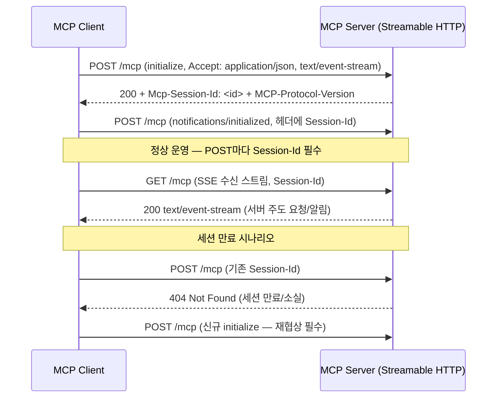
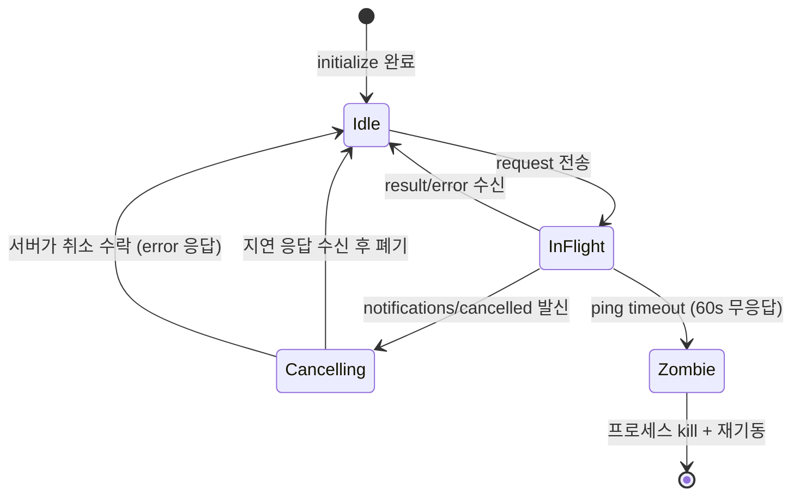
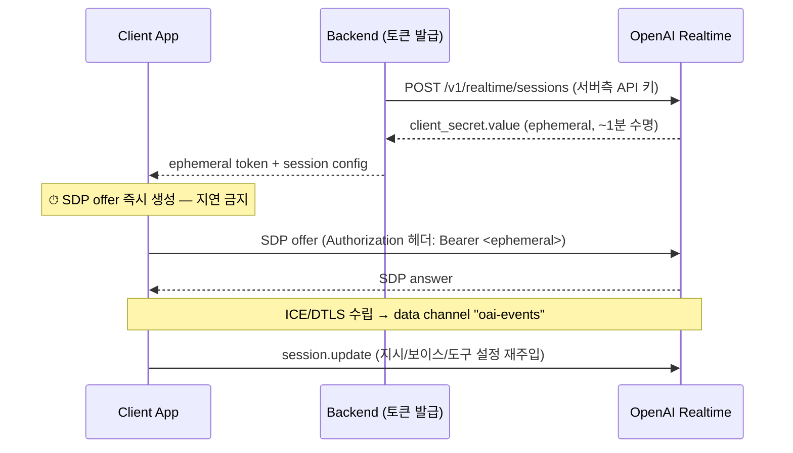
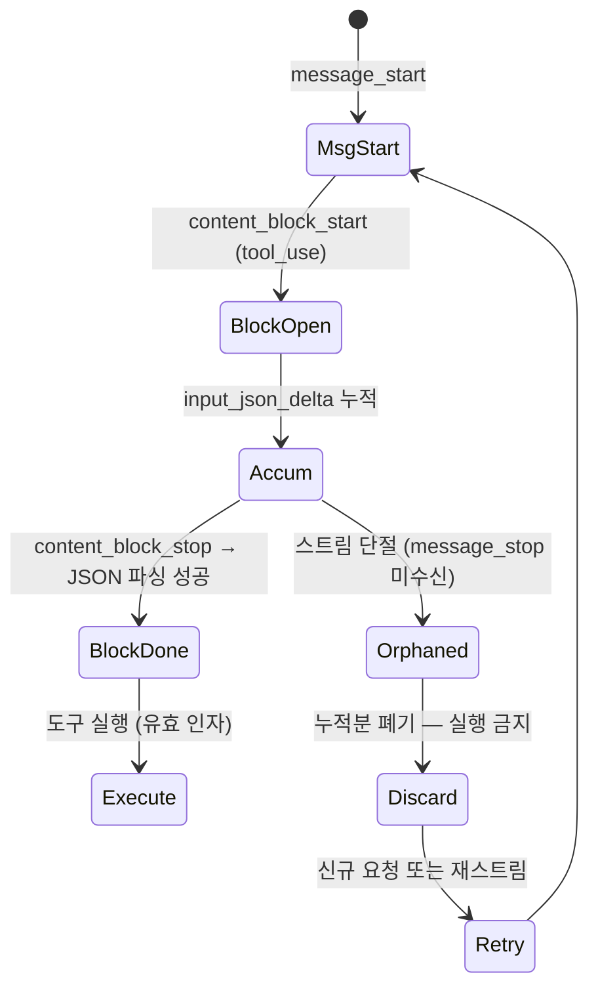

# 01. Track 1 — AI Agent / Realtime 프로토콜 엣지케이스

> 문서 ID: `APISPEC-01` · 버전: 1.0 · 작성일: 2026-10-05 (KST)
> 대상: MCP (stdio / Streamable HTTP), OpenAI Realtime (WebRTC), Anthropic Messages tool_use 스트리밍
> 인덱스: [README.md](README.md) · 로드맵: [00_ROADMAP_AND_GAP_MATRIX.md](00_ROADMAP_AND_GAP_MATRIX.md)

## 공식 레퍼런스

| 규격 | 공식 URL | 비고 |
|---|---|---|
| MCP Specification (2025-06-18) | https://modelcontextprotocol.io/specification/2025-06-18 | Transports/Lifecycle 섹션 |
| MCP Transports | https://modelcontextprotocol.io/specification/2025-06-18/basic/transports | stdio + Streamable HTTP |
| JSON-RPC 2.0 | https://www.jsonrpc.org/specification | MCP 메시지 프레이밍의 기반 |
| OpenAI Realtime (WebRTC) | https://platform.openai.com/docs/guides/realtime-webrtc | ephemeral token, SDP 교환 |
| OpenAI Realtime API (세션) | https://platform.openai.com/docs/api-reference/realtime | 세션/이벤트 스키마 |
| Anthropic Messages Streaming | https://docs.claude.com/en/api/messages-streaming | SSE 이벤트 타입 정의 |
| SSE (WHATWG) | https://html.spec.whatwg.org/multipage/server-sent-events.html | 이벤트 스트림 와이어 포맷 |

> 벤더 문서 URL·필드명은 가변 스펙이다 — 인용 시점(2026-10-05) 기준으로 기록하고,
> 적용 전 반드시 공식 문서를 재확인한다 (mutable-spec 정책).

## MCP

### 전송(transport) 프레이밍 차이 — 사각지대의 핵심

MCP는 두 가지 공식 전송을 정의한다. **프레이밍이 완전히 다르다**는 점이 첫 번째 함정이다.

| 전송 | 프레이밍 | 방향 | 세션 |
|---|---|---|---|
| stdio | **개행 구분 JSON(NDJSON)** — UTF-8 라인, 메시지 내 개행 금지 | 양방향 (stdin/stdout 파이프) | 없음 (프로세스 수명 = 세션) |
| Streamable HTTP | HTTP POST 요청/응답 + 응답을 SSE 스트림으로 업그레이드 가능 | 요청-응답 + 선택적 서버 푸시 | `Mcp-Session-Id` 헤더 |

stdio 규격의 자주 틀리는 지점:

- **Content-Length 헤더를 쓰지 않는다.** LSP와 달리 MCP stdio는 순수 개행 프레이밍이다.
  `Content-Length: 123\r\n\r\n` 접두를 붙이면 파서가 개행을 못 찾아 교착한다.
- 메시지는 **반드시 단일 라인** — pretty-printed JSON을 그대로 쓰면 프레임이 쪼개진다.
- stderr는 로깅 전용으로 허용되지만, stdout에는 JSON-RPC 메시지 **만** 쓴다.
  디버그 print가 stdout으로 새면 클라이언트 파서가 죽는다 (가장 흔한 실전 장애).

```text
# stdio 와이어 (정상)
{"jsonrpc":"2.0","id":1,"method":"initialize","params":{...}}\n
{"jsonrpc":"2.0","id":1,"result":{...}}\n

# stdio 와이어 (파탄 사례) — stdout 로그 오염
[server] listening...\n{"jsonrpc":"2.0","id":1,...}\n
```

### Streamable HTTP 세션 라이프사이클



엣지 규칙:

- 서버는 **언제든 세션을 만료**시킬 수 있다. 404 수신 시 클라이언트는 새 `initialize`부터
  재개해야 하며, 진행 중이던 요청 id는 전부 폐기한다.
- `Mcp-Session-Id`를 빼먹은 POST는 서버 구현에 따라 400 또는 묵살 — 라이브러리가
  헤더를 자동 부착하는지 반드시 확인한다.
- 구 `HTTP+SSE` 전송(2024-11-05 리비전: 별도 `/sse` GET + `/messages` POST)은
  deprecated지만 구형 서버가 남아 있다. 전환기에는 **두 엔드포인트 형태를 모두 탐지**해야 한다.

### 취소와 구독 — 명세의 빈틈

- 취소는 JSON-RPC 알림 `notifications/cancelled` (`{"requestId": ..., "reason": ...}`)로 전달된다.
  **`$cancellation` 같은 메서드는 존재하지 않는다** — 지시 문서의 해당 표기는 오기로 판정한다.
- 취소는 **최선 노력(best-effort)** 이다: 서버가 이미 result를 생성했으면 취소가 무시될 수 있고,
  클라이언트는 취소 후에도 늦게 도착한 응답을 requestId로 매칭해 버려야 한다.
- `resources/subscribe` 구독은 `notifications/resources/updated`를 수신하지만,
  **구독 해지 시점/만료 시맨틱이 리비전마다 미묘하게 다르다** — 명세 버전 헤더를 고정할 것.
- **하트비트 부재 극복**: MCP에는 전용 heartbeat 프레임이 없다. 프로토콜 수준 `ping`
  메서드를 주기 호출하거나(stdio도 동작), Streamable HTTP에서는 SSE 스트림의
  유휴 감지로 대체한다. stdio의 "침묵"은 프로세스 생사와 무관하므로
  ping 타임아웃(권장 30–60s)으로 좀비 서버를 감지한다.



## OpenAI Realtime (WebRTC)

### Ephemeral Token 수명과 사전 로테이션

- 서버 세션 생성 엔드포인트(`POST /v1/realtime/sessions`)가 발급하는 `client_secret.value`
  (ephemeral key)는 **수 분 내 만료로 설계된 단기 자격증명**이다 (문서상 ~1분대 언급 —
  실측/공지 변경 추적 대상, `추정+사실` 혼합 표기).
- 이 토큰은 **SDP 교환 시점에만** 필요하다. 수립된 WebRTC 세션은 토큰 만료와 무관하게 살지만,
  토큰 발급 → SDP offer 전송 사이에 지연(네트워크, UI 대기)이 끼면 핸드셰이크 자체가 실패한다.
- 방어 패턴: **just-in-time 발급** — offer 직전에 민팅하고, UI에 토큰을 캐시하지 않는다.
  토큰을 미리 발급해 두는 설계라면 만료 30초 전에 반드시 재발급한다.



### ICE 재연결과 세션 컨텍스트 소실

- ICE disconnect/failed → 브라우저가 자동 재협상을 시도하지만, **Realtime 세션의 대화 상태는
  새 data channel로 자동 이전되지 않는다** (공식 문서 미명시, `관측` 등급).
- 방어 패턴: 세션 상태를 로컬에 미러링한다.
  1. 수신한 모든 `conversation.item.created`의 item id와 역할을 로그한다.
  2. 재연결 시 새 세션을 만들고 `conversation.item.create`로 핵심 컨텍스트를 재주입하거나,
     `session.update`의 `instructions`에 압축 컨텍스트를 싣는다.
  3. 응답 생성 중이었다면 `response.create`를 재트리거한다.
- STUN/TURN: OpenAI가 공인 STUN을 제공하지만, 기업 NAT/UDP 차단 환경에서는 자체 TURN이
  필요할 수 있다. UDP 완전 차단 시에는 **WebSocket 전송으로 폴백**하는 것이 규격상 정답이다
  (WebRTC 전용 고집 금지).

### Barge-in (사용자 끼어들기)

- `input_audio_buffer.speech_started` 이벤트 수신 = 사용자가 말하기 시작했다는 서버 판정.
- 클라이언트 의무:
  1. **로컬 재생 큐를 즉시 플러시**한다 (재생 중이던 어시스턴트 오디오를 끊지 않으면 에코/혼선).
  2. 진행 중 응답이 있으면 `response.cancel`을 보낸다.
  3. 이미 재생된 오디오 구간은 `conversation.item.truncate`로 서버 측 대화 상태와 정합시킨다
     (잘리지 않은 오디오가 대화 이력에 남으면 후속 응답이 유령 문맥을 참조한다).

## Anthropic Messages — tool_use 스트리밍

### Partial JSON 파싱

스트리밍 모드에서 tool_use 블록의 입력 인자는 `input_json_delta` 이벤트의
`partial_json` **문자열 조각**으로 도착한다. 조각 자체는 유효한 JSON이 아니다.

```text
event: content_block_start
data: {"type":"content_block_start","index":1,"content_block":{"type":"tool_use","id":"toolu_01","name":"get_weather","input":{}}}

event: content_block_delta
data: {"type":"content_block_delta","index":1,"delta":{"type":"input_json_delta","partial_json":"{\"location\": \"Par"}}

event: content_block_delta
data: {"type":"content_block_delta","index":1,"delta":{"type":"input_json_delta","partial_json":"is\"}"}}
```

방어 패턴:

- `index`별로 `partial_json`을 **문자열 누적**하고, `content_block_stop`에서만 파싱한다.
  증분 파서로 미리보기 UI를 만들 순 있지만 **누적본이 완성되기 전에 도구를 실행하면 안 된다.**
- 누적 문자열이 최종적으로 깨진 JSON이면(네트워크 단절로 스트림이 끊긴 경우 포함)
  해당 tool_use를 `tool_error`로 처리한다 — 부분 인자로 도구를 호출하는 것은
  잘못된 파라미터 실행보다 위험하다.

### 네트워크 단절 시 도구 호출 상태 복구



- `message_stop` 없이 연결이 끊기면 응답 전체를 미완성으로 간주한다. Anthropic 스트림은
  재개(resume) 규격이 없으므로 **같은 요청을 재전송**한다 — 이때 멱등성은 애플리케이션 책임이다
  ([04_RATELIMIT_IDEMPOTENCY.md](04_RATELIMIT_IDEMPOTENCY.md) 참조).
- 스트림 중간에 `error` 이벤트(`overloaded_error` 등)가 오면 그 시점까지의 델타는
  부분 응답일 뿐 완성 메시지가 아니다.

## 엣지케이스 카탈로그

| ID | 항목 | 근거 등급 | 증상 | 방어 |
|---|---|---|---|---|
| T1-E1 | stdio stdout 로그 오염 | 사실 | JSON-RPC 파서 즉사 | 디버그는 stderr 전용, 라이브러리 래퍼로 stdout 보호 |
| T1-E2 | stdio에 Content-Length 프레이밍 | 사실 | 개행 대기 교착 | NDJSON 단일 라인 직렬화 |
| T1-E3 | Session-Id 누락/만료 미처리 | 사실 | 400/404 루프 | 404 → 자동 재-initialize |
| T1-E4 | cancel 경합 — 지연 응답 | 사실 | 취소했는데 결과 도착 | requestId tombstone 테이블로 지연 응답 폐기 |
| T1-E5 | heartbeat 부재 — 좀비 stdio 서버 | 실증 | 무한 대기 | `ping` 30–60s 타임아웃 + 프로세스 감시 |
| T1-E6 | ephemeral token 지연 사용 | 사실+추정 | SDP offer 401 | just-in-time 민팅, 캐시 금지, 30s 사전 로테이션 |
| T1-E7 | ICE 재연결 후 컨텍스트 소실 | 관측 | 재연결 후 백지 응답 | 로컬 미러 → 재주입, session.update 압축 컨텍스트 |
| T1-E8 | barge-in 버퍼 미플러시 | 사실 | 에코/중복 발화 | speech_started → 큐 플러시 + response.cancel + truncate |
| T1-E9 | UDP 차단 환경 WebRTC | 사실 | ICE failed 영구 | TURN 준비 또는 WebSocket 폴백 |
| T1-E10 | partial_json 조각 실행 | 사실 | 깨진 인자로 도구 호출 | content_block_stop 전까지 실행 금지 |
| T1-E11 | message_stop 미수신 스트림 재사용 | 사실 | 잘린 응답을 완성으로 채택 | 미완성 표시 + 재요청 (멱등성은 04 참조) |

## 미실증 항목 (Phase 2 과제)

- Realtime 세션의 서버측 대화 상태가 ICE 재협상 후 실제로 보존되는지 — Mock 불가,
  공식 문서 재확인 + 향후 유료 승인 시 1회 실측.
- MCP `ping`이 모든 주요 서버 구현에서 지원되는지 — 구현체별 매트릭스 작성 예정.

## 관련 문서

- [README.md](README.md) · [00_ROADMAP_AND_GAP_MATRIX.md](00_ROADMAP_AND_GAP_MATRIX.md)
- [02_ZERO_TRUST_AUTH.md](02_ZERO_TRUST_AUTH.md) — Realtime/OAuth 자격증명 연계
- [03_STREAMING_TRANSPORT.md](03_STREAMING_TRANSPORT.md) — SSE/WS 전송 계층 공통 함정
- [04_RATELIMIT_IDEMPOTENCY.md](04_RATELIMIT_IDEMPOTENCY.md) — 재전송·멱등성 패턴
