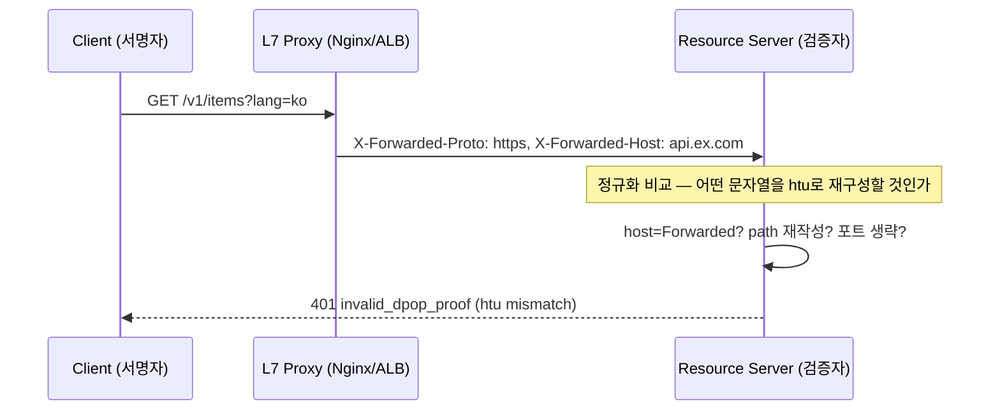
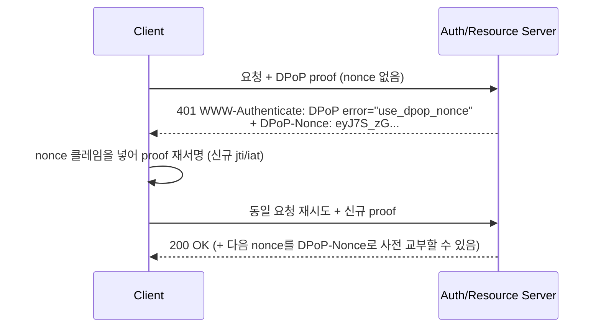

# 02. Track 2 — Zero-Trust Auth: DPoP / OAuth 2.1 엣지케이스

> 문서 ID: `APISPEC-02` · 버전: 1.0 · 작성일: 2026-10-05 (KST)
> 대상: RFC 9449 DPoP proof 생성·검증, DPoP-Nonce 챌린지, jti 유일성, RFC 8693 토큰 교환
> 인덱스: [README.md](README.md) · 로드맵: [00_ROADMAP_AND_GAP_MATRIX.md](00_ROADMAP_AND_GAP_MATRIX.md)
> 범위 격리: 본 문서는 참조 규격(Architecture Reference)이다 — 현재 PROTO_OPEN
> 로컬 런타임에 인증/DPoP 게이트를 추가하지 않는다 (README §범위 및 아키텍처 격리 선언).

## 공식 레퍼런스

| 규격 | 공식 URL | 비고 |
|---|---|---|
| RFC 9449 — OAuth 2.0 DPoP | https://www.rfc-editor.org/rfc/rfc9449 | proof JWT, htu/htm/jti, nonce, ath |
| RFC 9110 — HTTP Semantics | https://www.rfc-editor.org/rfc/rfc9110 | target URI, WWW-Authenticate |
| RFC 7638 — JWK Thumbprint | https://www.rfc-editor.org/rfc/rfc7638 | `cnf.jkt` 바인딩의 해시 규칙 |
| RFC 8693 — Token Exchange | https://www.rfc-editor.org/rfc/rfc8693 | subject/actor token, 위임 |
| RFC 6750 — Bearer Token | https://www.rfc-editor.org/rfc/rfc6750 | 비교 기준 (bearer의 한계) |
| OAuth 2.1 (draft) | https://datatracker.ietf.org/doc/draft-ietf-oauth-v2-1/ | PKCE 의무화 맥락 |

## DPoP

### 개념 — bearer의 한계와 sender-constrained 토큰

Bearer 토큰은 "탈취 = 탈취자의 것"이다. DPoP는 클라이언트가 생성한 **비대칭 키쌍**에
액세스 토큰을 바인딩해(`cnf.jkt` = JWK thumbprint, RFC 7638), 요청마다 해당 개인키로
**DPoP proof JWT**를 서명·첨부하게 한다. 증명서를 도난당해도 개인키 없이는 재사용 불가다.

와이어 형식 — 모든 요청에 두 헤더가 함께 간다:

```text
POST /resource HTTP/1.1
Host: api.example.com
<Authorization 헤더>: DPoP eyJhbGciOiJFUzI1NiJ9...
<DPoP 헤더>: eyJ0eXAiOiJkcG9wK2p3dCIsImFsZyI6IkVTMjU2IiwiandrIjp7Imt0eSI6IkVDIiwieC
       I6ImwyX3dyR09fUVA...ifQ.eyJqdGkiOiItQndDM0VTYzZhY2MybFRjIiwiaHRtIjoi
       UE9TVCIsImh0dSI6Imh0dHBzOi8vYXBpLmV4YW1wbGUuY29tL3Jlc291cmNlIiwiaWF0
       IjoxNTYyMjYyNjE2fQ.2-GxEY0xN0c2Q...
```

### Proof JWT 계약 (RFC 9449 §4.2)

```json
// JOSE 헤더
{
  "typ": "dpop+jwt",          // 정확히 이 값 — "JWT" 등 다른 typ은 거절 대상
  "alg": "ES256",             // 비대칭 알고리즘만 허용 (none·HS* 절대 금지)
  "jwk": { "kty": "EC", ... } // 공개키 — 개인키/비밀 파라미터 포함 시 전체 거절
}
// 페이로드
{
  "jti": "uuid-or-random-unique-per-proof",
  "htm": "POST",
  "htu": "https://api.example.com/resource",   // query·fragment 제외!
  "iat": 1709000000,
  "nonce": "<AS/RS가 부과한 값 — 있을 때만>",
  "ath": "fUHyO2r2Z3DZ53EsNrWBqDg="            // RS 호출 시 access_token의
}                                              // base64url(SHA-256) — 필수
```

### `htu` 정규화 — 가장 흔한 검증 실패

RFC 9449 §4.2: `htu`는 **query와 fragment를 제외한** target URI다. 서명자와 검증자가
서로 다른 문자열을 쓰면 proof가 무효가 된다.



실전 불일치 소스:

1. **쿼리/해시 포함 서명** — 클라이언트가 `?lang=ko`까지 넣어 서명하면 표준 검증자는 거절.
   서명 전 strip 규칙: `scheme://host[:port]/path` 만 남긴다.
2. **프록시 재작성 경로** — `/api/v1/items → /v1/items`로 strip되면 내부 서버는 다른 htu를 본다.
   검증자는 **외부(공개) URI 기준**으로 재구성해야 하며, 이를 위해 `X-Forwarded-*`를
   신뢰 경계 내에서만 소비한다 (신뢰 프록시 목록 외 헤더는 무시 — 스푸핑 방어).
3. **포트·대소문자** — `:443` 명시 vs 생략, `HTTPS://API.EX.COM` vs 소문자.
   검증기는 scheme/host 소문자화 + 기본 포트 제거 + 경로 정규화 후 비교한다.
4. **trailing slash** — `/resource` vs `/resource/`는 RFC상 다른 URI다.
   라우터가 둘을 동일시해도 htu 비교는 문자열 수준 — 클라이언트가 요청에 실제 쓴
   path를 그대로 넣는다.

### `htm`과 `ath`

- `htm`은 실제 요청 메서드와 **대소문자까지** 일치해야 한다 (GET ≠ get). 프록시가
  메서드를 재작성(HEAD→GET 등)하지 않는지 확인한다.
- 리소스 서버 제시 시 proof에 **`ath` 클레임이 필수** — access_token의
  `base64url(SHA-256(access_token))`. `ath` 없는 proof로 RS를 호출하는 클라이언트는
  토큰 교환형 재사용 공격에 열려 있다 (AS 전용 proof와 RS 전용 proof는 다른 문서다).

## DPoP-Nonce

### 챌린지 루프

AS/RS는 replay 윈도우를 좁히기 위해 nonce 사용을 강제할 수 있다. 흐름:



방어 규칙:

- nonce 챌린지에 대한 재시도는 **반드시 proof를 재서명**한다 — 원본 proof 재사용은
  jti 재전송으로 replay 거절된다 (아래 jti 섹션).
- **무한 챌린지 루프 상한**: nonce를 받았는데도 계속 `use_dpop_nonce`가 오면
  최대 2회 재시도 후 중단 — 시계 skew나 nonce 파싱 버그를 루프로 두지 않는다.
- nonce는 서버가 response 헤더로 사전 교부하기도 한다 — 수신하면 다음 proof에
  적극 재사용해 챌린지 왕복을 줄인다.

### Clock skew (`iat`) 허용치

- 검증자는 `iat`가 허용 윈도우 밖이면 proof를 거절한다. 실무 표준 윈도우는
  **과거 방향 수 분(통상 300s), 미래 방향 소량(30–60s)** — 미래 `iat`를 크게 허용하면
  미리 만들어둔 proof 재사용이 가능해진다.
- 클라이언트는 서버 `Date` 응답 헤더로 skew를 추정해 보정하고, 반복 `invalid_dpop_proof`
  (iat 사유) 시 NTP 상태를 점검한다.
- nonce 도입 서버는 iat 윈도우를 더 좁혀도 된다 — nonce가 이미 freshness를 보장하므로.

## jti

### 유일성과 재시도 규칙

- `jti`는 **proof마다 유일**해야 한다 (UUID v4 또는 128bit+ 난수).
  검증자는 `(jkt, jti)` 쌍을 iat 윈도우 기간 동안 캐시해 재전송을 거절한다.
- **재시도 = 새 proof.** 네트워크 타임아웃 후 같은 요청을 다시 보낼 때도
  새 `jti` + 새 `iat`로 재서명한다. "같은 proof를 그대로 재전송"하는 클라이언트는
  정상 구현에서 replay-attack으로 분류된다.
- 서버 입장에서 jti 캐시는 메모리/공유 캐시 모두 가능하나, **다중 RS 인스턴스는
  캐시를 공유**해야 한다 — 인스턴스별 캐시는 replay 검출을 무력화한다.

## Token Exchange (RFC 8693) × DPoP

### 바인딩 영속성 (Binding Persistence)

위임/사칭(impersonation) 토큰 교환 후에도 DPoP 키 바인딩이 유지되어야 sender-constrained
보증이 깨지지 않는다.

```json
// 교환 요청 (개념 예시)
{
  "grant_type": "urn:ietf:params:oauth:grant-type:token-exchange",
  "subject_token": "<DPoP-bound access token>",
  "subject_token_type": "urn:ietf:params:oauth:token-type:access_token",
  "actor_token": "<서비스 계정 토큰>",
  "requested_token_type": "urn:ietf:params:oauth:token-type:access_token"
}
```

- 교환 결과 토큰의 `cnf.jkt`는 **원본 subject 토큰의 바인딩을 계승**해야 한다.
  AS가 새 토큰을 bearer로 발급해 버리면 다운스트림에서 proof 검증이 불가능해지고
  (sender-constrained → bearer 강등) 보안 수준이 조용히 낮아진다.
- 호출자는 교환 후에도 **자기 DPoP 키로 계속 서명**한다 — actor(대리 서비스)가
  자기 키로 재바인딩하려면 그 바인딩이 토큰 `act` 클레임과 함께 명시되어야 한다.
- 중첩 교환(체인)에서 `may_act`/`act` 체인과 `cnf` 체인이 어긋나면
  "누구의 키로 proof를 쓸 것인가"가 모호해진다 — 체인 길이 상한을 정책으로 둔다.

## 엣지케이스 카탈로그

| ID | 항목 | 근거 등급 | 증상 | 방어 |
|---|---|---|---|---|
| T2-E1 | `htu`에 query/hash 포함 | 사실 (RFC 9449 §4.2) | invalid_dpop_proof | 서명 전 query·fragment strip |
| T2-E2 | 프록시 경로 재작성 불일치 | 사실 | 내부 RS만 거절 | 외부 URI 기준 재구성 + 신뢰 X-Forwarded-* |
| T2-E3 | 기본 포트/대소문자 미정규화 | 사실 | 간헐적 검증 실패 | scheme/host 소문자화, :443/:80 제거 |
| T2-E4 | `typ` 값 오기 | 사실 | 즉시 거절 | 정확히 `dpop+jwt` |
| T2-E5 | 대칭/none alg 수용 | 사실 | proof 위조 가능 | 비대칭 alg allowlist(ES256/PS256 등) |
| T2-E6 | `ath` 누락 RS 호출 | 사실 | 토큰 스왑 재사용 | RS 경로에 ath 필수 검증 |
| T2-E7 | nonce 챌린지 무한 루프 | 실증 | 401 반복 | 재시도 상한 2 + skew 점검 |
| T2-E8 | 재시도에 동일 proof | 사실 | replay 거절 | 재시도마다 jti/iat 재서명 |
| T2-E9 | 미래 iat 과도 허용 | 사실 | 예약 proof 재사용 | 미래 skew ≤60s |
| T2-E10 | 다중 인스턴스 jti 캐시 분리 | 실증 | replay 통과 | 공유 캐시/중앙 저장소 |
| T2-E11 | 교환 후 cnf 상실 (강등) | 사실 (8693+9449 조합) | 다운스트림 bearer화 | cnf 계승 검증, 강등 감지 로그 |
| T2-E12 | actor 키 재바인딩 모호 | 사실 | proof 서명 주체 혼선 | act/cnf 체인 정합성 + 체인 길이 상한 |

## 미실증 항목 (Phase 2~3 과제)

- 주요 AS 벤더(Keycloak, Auth0, Entra ID)의 `DPoP-Nonce` 강제 여부·형식 차이 — 벤더별 매트릭스.
- 브라우저 SPA에서의 DPoP 키 저장(WebCrypto non-extractable)과 SW 교착 패턴 — Phase 3 방어 패턴.

## 관련 문서

- [README.md](README.md) · [00_ROADMAP_AND_GAP_MATRIX.md](00_ROADMAP_AND_GAP_MATRIX.md)
- [01_AI_AGENT_PROTOCOLS.md](01_AI_AGENT_PROTOCOLS.md) — Realtime ephemeral token 연계
- [03_STREAMING_TRANSPORT.md](03_STREAMING_TRANSPORT.md) — SSE/WS에서의 인증 헤더 전달
- [04_RATELIMIT_IDEMPOTENCY.md](04_RATELIMIT_IDEMPOTENCY.md) — 재시도 공통 규칙
