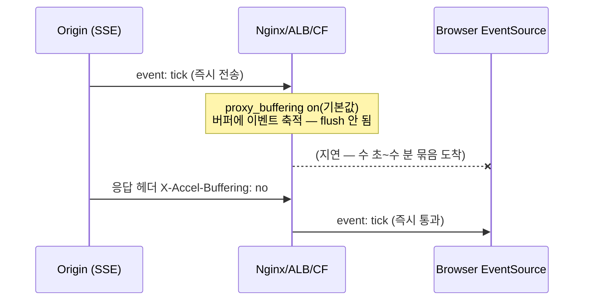
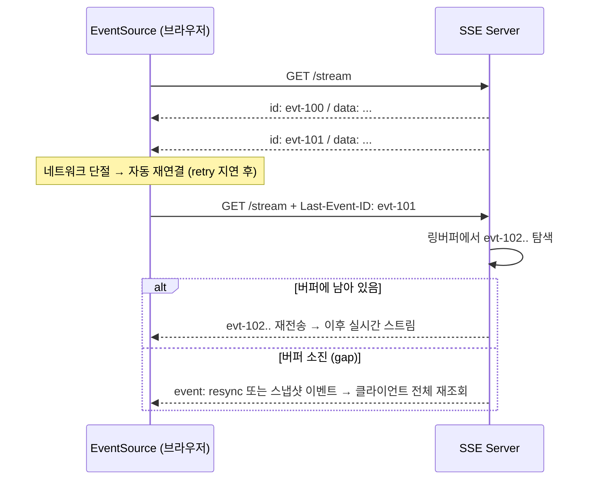

# 03. Track 3 — Streaming Transport 엣지케이스

> 문서 ID: `APISPEC-03` · 버전: 1.0 · 작성일: 2026-10-05 (KST)
> 대상: SSE(EventSource), WebSocket, gRPC-Web — 프록시/로드밸런서 구간의 장애 대응
> 인덱스: [README.md](README.md) · 로드맵: [00_ROADMAP_AND_GAP_MATRIX.md](00_ROADMAP_AND_GAP_MATRIX.md)

## 공식 레퍼런스

| 규격 | 공식 URL | 비고 |
|---|---|---|
| WHATWG SSE / EventSource | https://html.spec.whatwg.org/multipage/server-sent-events.html | 와이어 포맷·재연결·Last-Event-ID |
| RFC 6455 — WebSocket | https://www.rfc-editor.org/rfc/rfc6455 | ping/pong 제어 프레임, close 코드 |
| gRPC-Web 프로토콜 | https://github.com/grpc/grpc/blob/master/doc/PROTOCOL-WEB.md | 프레이밍, trailers-only |
| Nginx proxy 모듈 | https://nginx.org/en/docs/http/ngx_http_proxy_module.html | proxy_buffering, X-Accel-Buffering |
| RFC 9110 — HTTP Semantics | https://www.rfc-editor.org/rfc/rfc9110 | 상태코드·헤더·유휴 연결 |

## SSE

### 와이어 포맷 복습 — 프레임 경계가 규격의 전부

```text
: keepalive (코멘트 — 클라이언트가 무시하지만 바이트는 흐른다)\n
\n
event: hint\n
data: {"seq": 41, "text": "..."}\n
id: evt-00041\n
retry: 3000\n
\n
data: multi-line 첫 줄\n
data: 둘째 줄 (data 필드 누적 → 개행으로 조인)\n
\n
```

- 이벤트 경계는 **빈 줄(`\n\n`)** — CRLF 엔드포인트에서는 `\r\n\r\n`.
- `:`로 시작하는 줄은 코멘트. 이벤트로 해석되지 않지만 연결에 바이트를 흘려 보낸다
  — **유휴 타임아웃을 리셋하는 유일한 "무의미하지만 합법적" 트래픽**이다.

### 프록시 버퍼링 — "연결됐는데 아무것도 안 온다"



실전 체크리스트:

1. **Origin**: `Content-Type: text/event-stream`, `Cache-Control: no-cache`,
   `X-Accel-Buffering: no` (Nginx가 읽는 응답 헤더 — 공식 문서 확인됨, `사실`).
   `Content-Encoding`은 gzip이 버퍼를 잡아두므로 SSE 응답에는 끄거나 스트림 친화 설정.
2. **Nginx**: 경로 단위 `proxy_buffering off;` 또는 헤더 방식 선택. `proxy_read_timeout`은
   스트림 수명보다 길게 (기본 60s — 무전송 60s면 연결 절단, `사실`).
3. **Cloudflare**: `/cdn-cgi/`·캐시 대상이 아닌 SSE도 엣지 버퍼링 관측 사례가 있다(`관측`).
   `Cache-Control: no-store` + `X-Accel-Buffering: no` + 필요 시 Bypass Cache 규칙.
4. **HTTP/1.1 vs HTTP/2**: HTTP/1.1은 청크 전송으로 스트리밍. HTTP/2는 DATA 프레임이라
   "청크" 개념이 없어 일부 구형 프록시가 변환 중 버퍼링한다.

### HTTP/2 유휴 타임아웃과 코멘트 핑

- HTTP/2의 PING 프레임은 **전송 계층 신호이지 애플리케이션 데이터가 아니다** —
  EventSource 앞단의 L7(A LB idle timeout, Cloudflare ~100s, 브라우저 자체)은
  앱 바이트가 흐르지 않으면 유휴로 본다 (`관측` — 벤더별 수치는 비공개/변동).
- 방어: 서버가 **15–25초 간격**으로 `: keepalive\n\n` 코멘트를 쓴다.
  간격은 경로상 가장 타이트한 유휴 타임아웃의 절반 이하로 잡는다 (예: 60s 타임아웃 → ≤25s).
- 앱 레벨 이벤트가 자연스럽게 자주 흐르는 스트림이라도 **최악 무전송 구간**을 기준으로
  핑을 넣는다 — "평소엔 이벤트가 많아서 괜찮다"는 재해의 시작이다.

### `Last-Event-ID`와 링버퍼 백프레셔



유실·gap의 실전 원인:

- **폴리필/fetch 기반 구현**은 `Last-Event-ID`를 자동 부착하지 않는다 — 재연결 요청에
  수동으로 헤더를 넣어야 한다 (네이티브 EventSource만 자동, `사실`).
- 프록시가 요청 헤더를 정제(allowlist)하면 `Last-Event-ID`가 날아간다 — 관측이 어려운
  유실 원인 1위. 헤더 전달 로깅을 켜서 확인한다.
- **링버퍼 설계**: id는 단조 증가 값(DB 시퀀스/오프셋). 버퍼 용량 = 최대 재연결 지연
  × 피크 이벤트율 × 안전 계수(≥2). 버퍼 밖 id 요청에는 `204` 대신 **명시적 resync
  이벤트**를 권한다 — 204는 WHATWG 규격상 "재연결 중지" 신호라 클라이언트를 영구 정지시킨다(`사실`).
- **백프레셔**: 느린 클라이언트에게 TCP 송신 버퍼가 차면 이벤트를 드랍할지 연결을 끊을지
  정책이 필요하다. 권장: 합리적 버퍼(예 64KB) 초과 시 `id` 갭과 함께 연결 종료 →
  클라이언트가 Last-Event-ID로 재연결하고 resync 경로를 탄다.

## WebSocket

### 하트비트 — RFC 프레임만으로는 부족

- RFC 6455의 ping(0x9)/pong(0xA) 제어 프레임은 규격이지만, **일부 L7 프록시·서비스
  메시는 ping을 전달하지 않거나 자기 타이머로만 응답한다** (`관측`). ping에만 의존한
  keepalive는 경로마다 다른 결과를 낸다.
- 방어 패턴 (이중 하트비트):
  1. 프로토콜 ping/pong — 저비용 1차 생존 신호.
  2. **앱 레벨 하트비트** `{"type":"ping","ts":...}` — 데이터 프레임이라 모든 중간자를
     통과하고, 앱이 직접 RTT/유휴를 측정한다.
- **half-open 감지**: TCP는 상대가 죽어도 FIN 없이 조용할 수 있다(모바일 네트워크 전환
  시 빈번). 클라이언트는 "마지막 수신 바이트 시각"을 추적하고, N초 무수신 시
  앱 ping 전송 → 응답 없으면 소켓을 능동 폐기·재연결한다 (`사실` — 모바일 표준 패턴).
- 유휴 끊김 상한 예시: AWS ALB 기본 idle 60s, Cloudflare ~100s급 관측 —
  인프라 최소값의 절반 이하로 하트비트 간격을 설정한다.

### Close 코드와 재연결 분류

- `1006`은 close frame 없이 끊긴 비정상 종료(로컬에서만 발생 — 와이어에 존재하지 않음).
- `1000/1001` 정상 종료에는 재연결하지 않거나 지연을 크게 둔다.
- 서버 재시작(`1012 Service Restart`)·프록시 타임아웃은 재연결 대상 — 지수 백오프는
  [04_RATELIMIT_IDEMPOTENCY.md](04_RATELIMIT_IDEMPOTENCY.md)의 Full Jitter 규칙을 따른다.

## gRPC-Web

### 프레이밍과 trailers-only

```text
DATA 프레임:    [1바이트 flags=0x00][4바이트 길이][protobuf 메시지]
TRAILER 프레임: [1바이트 flags=0x80][4바이트 길이][HTTP/1 헤더 형식의 트레일러]
                grpc-status: 0\r\ngrpc-message: ...\r\n
```

- 브라우저는 실제 HTTP 트레일러를 읽을 수 없어, gRPC-Web은 **grpc-status 등 트레일러를
  본문의 0x80 플래그 프레임으로 인코딩**한다 (`사실`).
- **trailers-only 응답**: 서버가 메시지 없이 에러만 반환할 때 데이터 프레임 없이
  트레일러 프레임만 온다. 클라이언트가 "본문 = 메시지"로 가정하면 빈 응답을
  성공으로 오독하거나 파싱 예외로 죽는다 — 프레임 플래그를 먼저 검사한다.
- `-text` 모드는 전체 페이로드가 base64라 `grpc-timeout`/프레임 경계를 눈으로 검사하기
  어렵다 — 개발 시 바이너리 모드로 프레임을 검증하고, 프록시는 base64를
  깨지 않는지(공백 제거/재인코딩) 확인한다.
- `grpc-timeout: 10S` 헤더 형식(`<n><H|M|S|m|u|n>`)을 프록시가 통과시키는지 확인 —
  타임아웃 헤더 유실 시 스트림이 무한 대기한다.

## 엣지케이스 카탈로그

| ID | 항목 | 근거 등급 | 증상 | 방어 |
|---|---|---|---|---|
| T3-E1 | Nginx proxy_buffering 기본값 | 사실 | 이벤트 묶음 지연 | `X-Accel-Buffering: no` 또는 경로별 off |
| T3-E2 | gzip/인코딩이 SSE 버퍼링 | 실증 | 첫 이벤트 수 분 지연 | SSE 응답 인코딩 비활성 |
| T3-E3 | 유휴 타임아웃 절단 | 사실 | 60~120s마다 끊김 | `: keepalive` ≤ 타임아웃/2 간격 |
| T3-E4 | HTTP/2 PING은 앱 무전달 | 관측 | ping 있는데도 L7이 유휴 절단 | 앱 바이트(코멘트/이벤트)로 핑 |
| T3-E5 | 폴리필이 Last-Event-ID 미전송 | 사실 | 재연결마다 전체 재수신 | 재연결 요청에 수동 헤더 |
| T3-E6 | 프록시 헤더 allowlist 유실 | 관측 | ID가 서버에 도달 안 함 | 헤더 패스루 확인/로깅 |
| T3-E7 | 링버퍼 소진 → 무응답 | 실증 | gap 이후 영구 정지 | resync 이벤트 (204는 재연결 중지 신호) |
| T3-E8 | WS 프록시가 ping 미전달 | 관측 | half-open 방치 | 앱 레벨 이중 하트비트 |
| T3-E9 | 모바일 전환 half-open | 사실 | 송신 성공인 체 무수신 | 수신 타임스탬프 감시 + 능동 폐기 |
| T3-E10 | 204를 resync 신호로 오용 | 사실 | 클라이언트 영구 정지 | 204=중지 전용, resync는 별도 이벤트 |
| T3-E11 | trailers-only를 빈 성공으로 오독 | 사실 | 에러 무시 | 첫 바이트 플래그 검사 |
| T3-E12 | grpc-timeout 헤더 유실 | 실증 | 무한 스트림 | 프록시 패스루 + 클라이언트 자체 데드라인 |

## 미실증 항목 (Phase 2~3 과제)

- Cloudflare/ALB/Envoy별 SSE 버퍼링·유휴 수치 매트릭스 — 공개 수치 부재, 로컬 Mock 프록시로 재현.
- 링버퍼 백프레셔의 최적 용량 공식 — 트래픽 모델별 실험 필요.

## 관련 문서

- [README.md](README.md) · [00_ROADMAP_AND_GAP_MATRIX.md](00_ROADMAP_AND_GAP_MATRIX.md)
- [01_AI_AGENT_PROTOCOLS.md](01_AI_AGENT_PROTOCOLS.md) — Anthropic/OpenAI 스트림 상위 프로토콜
- [02_ZERO_TRUST_AUTH.md](02_ZERO_TRUST_AUTH.md) — 스트림 채널 인증
- [04_RATELIMIT_IDEMPOTENCY.md](04_RATELIMIT_IDEMPOTENCY.md) — 재연결 백오프·Retry-After
