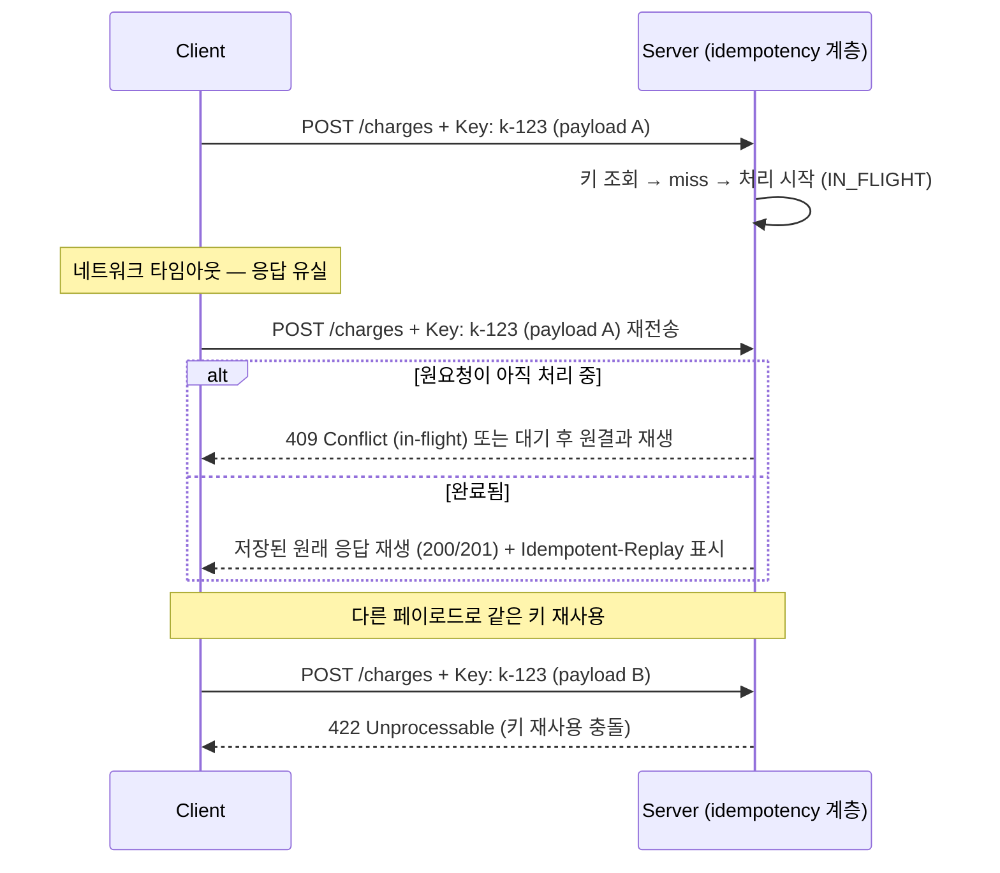

# 04. Track 4 — Rate Limiting / Idempotency 엣지케이스

> 문서 ID: `APISPEC-04` · 버전: 1.0 · 작성일: 2026-10-05 (KST)
> 대상: RateLimit 헤더 3계열 정규화, Retry-After 파싱, Full Jitter 백오프, Idempotency-Key
> 인덱스: [README.md](README.md) · 로드맵: [00_ROADMAP_AND_GAP_MATRIX.md](00_ROADMAP_AND_GAP_MATRIX.md)

## 공식 레퍼런스

| 규격 | 공식 URL | 비고 |
|---|---|---|
| IETF draft — RateLimit HTTP header fields | https://datatracker.ietf.org/doc/draft-ietf-httpapi-ratelimit-headers/ | `RateLimit-Limit/Remaining/Reset/Policy` |
| IETF draft — Idempotency-Key | https://datatracker.ietf.org/doc/draft-ietf-httpapi-idempotency-key-header/ | 키 의미론·서버 의무 |
| RFC 9110 §10.2.3 — Retry-After | https://www.rfc-editor.org/rfc/rfc9110#section-10.2.3 | delta-seconds | IMF-fixdate |
| RFC 9110 §5.6.7 — Date 형식 | https://www.rfc-editor.org/rfc/rfc9110#section-5.6.7 | IMF-fixdate |
| AWS — Exponential Backoff And Jitter | https://aws.amazon.com/blogs/architecture/exponential-backoff-and-jitter/ | Full Jitter 공식 (공식 블로그) |
| GitHub REST rate limits | https://docs.github.com/en/rest/rate-limit | `X-RateLimit-*` = epoch 대표 사례 |

## Rate Limit 헤더

### 3계열 비교 — 같은 뜻, 다른 단위

| 계열 | 헤더 | 의미 | 함정 |
|---|---|---|---|
| IETF draft | `RateLimit-Limit`, `RateLimit-Remaining`, `RateLimit-Reset`, `RateLimit-Policy` | Reset = **delta-seconds**(현재 윈도우 리셋까지 남은 초) | draft 버전별 필드명 변경 이력 있음 |
| X- 계열 | `X-RateLimit-Limit`, `X-RateLimit-Remaining`, `X-RateLimit-Reset` | Reset = **UNIX epoch 초**(예: GitHub) | draft와 키는 같아도 단위가 다름 |
| 벤더 독자 | `x-ratelimit-*` 변형, `Retry-After`, `X-Rate-Limit-*` 혼용 표기 | 벤더마다 정의 상이 | 헤더명 대소문자/하이픈 위치까지 제각각 |

`429 Too Many Requests` 응답 예시 — 두 계열이 공존할 수 있다:

```text
HTTP/1.1 429 Too Many Requests
RateLimit-Limit: 100
RateLimit-Remaining: 0
RateLimit-Reset: 42              ← draft: 42초 뒤 리셋
RateLimit-Policy: 100;w=60
X-RateLimit-Reset: 1709000042    ← 레거시: epoch 시각
Retry-After: 42
```

### 정규화 파서 규격

```python
# 수도코드 — 벤더 무관 retry-after-seconds 산출
def retry_delay_seconds(headers, now_epoch):
    # 1순위: Retry-After (가장 명시적 지시)
    if ra := headers.get("retry-after"):
        return parse_retry_after(ra, now_epoch)        # 아래 §Retry-After
    # 2순위: IETF draft Reset = delta-seconds
    if rs := headers.get("ratelimit-reset"):
        return max(0, int(rs))
    # 3순위: X-RateLimit-Reset = epoch 시각
    if xrs := headers.get("x-ratelimit-reset"):
        return max(0, int(xrs) - now_epoch)
    # 4순위: 고정 백오프 폴백 (밑의 Full Jitter)
    return None
```

파서 방어 규칙:

- **단위 추정 금지.** `RateLimit-Reset`을 epoch로 해석하면 수십 년 대기, 역방향은
  음수 → 즉시 재시도 루프가 된다. 헤더명으로 단위를 확정한다.
- 동시 존재 시 우선순위: `Retry-After` > `RateLimit-Reset`(draft) > `X-RateLimit-Reset` >
  앱 백오프. 서로 모순된 값이 오면 **큰 값**을 택한다(보수적).
- `RateLimit-Policy: 100;w=60`의 `w` 파라미터는 윈도우 초 — 정책 표기는 참고용이며
  실제 대기 시간은 Reset으로 결정한다.
- 헤더 부재 429 = 서버가 규격 미구현 → 앱 백오프로 처리하고, 반복 시 계정 단위
  스로틀링 가능성을 로그한다.

## Retry-After

### 파싱 — 두 가지 문법 + 비표준 변종

RFC 9110 §10.2.3: `Retry-After = HTTP-date | delta-seconds`

```text
Retry-After: 120                              ← delta-seconds (정수)
Retry-After: Wed, 05 Oct 2026 06:30:00 GMT    ← IMF-fixdate
Retry-After: 1.5                              ← 비표준 float (실전 관측)
Retry-After: 0                                ← 즉시 재시도 지시이지만
                                                thundering herd 주의
```

```python
def parse_retry_after(value, now_epoch):
    v = value.strip()
    if v.isdigit() or (v.replace(".", "", 1).isdigit()):   # float 관대 파싱
        return max(0.0, float(v))
    dt = parse_imf_fixdate(v)            # 실패 시 None
    return max(0.0, dt - now_epoch) if dt else None        # 파싱 불가 = 지시 없음
```

- **과거 시각의 HTTP-date** = 0초와 같지만, 클라이언트 시계가 서버보다 느리면
  미래로 읽힌다 — skew 추정치만큼 버퍼를 둔다.
- float 비표준이지만 거부하면 그 서버의 지시를 영구히 못 읽는다 — 받아들이되
  상한(cap)으로 자른다.
- `Retry-After` 없는 429/503 = 지시 없음 → Full Jitter 백오프 적용.

### Full Jitter 지수 백오프

AWS 공식 권고식:

```python
sleep = random_between(0, min(cap, base * 2**attempt))
```

| 변형 | 공식 | 특성 |
|---|---|---|
| No Jitter | `min(cap, base * 2**attempt)` | 재시도 폭풍 — 동기화된 클라이언트 군집에서 금지 |
| Equal Jitter | `t/2 + rand(0, t/2)` | 중간형 |
| **Full Jitter** | `rand(0, min(cap, base*2**attempt))` | 분산 최대 — 다수 클라이언트 재해 시 기본값 |
| Decorrelated | `rand(base, prev_sleep*3)` | 이전 대기 기억 — 상태 필요 |

실무 기본 파라미터: `base=1s`, `cap=60s`, 최대 시도 5–7회, **총 데드라인**
(예: 30s) 도 별도로 둔다 — 시도 횟수만으론 총 대기가 예측 불가하다.
재시도 자격: 429, 503, 네트워크 단절. 400/401/403/404는 재시도 금지
(단, DPoP nonce 챌린지 같은 프로토콜 정의 재시도는 예외 —
[02_ZERO_TRUST_AUTH.md](02_ZERO_TRUST_AUTH.md)).

## Idempotency-Key

### 의미론 — 같은 키, 같은 결과

`Idempotency-Key: <client-generated-unique>` 헤더를 붙인 POST/PATCH는
서버가 **첫 처리 결과를 키에 저장**하고, 같은 키의 재전송에 원래 응답을 재생한다.
"재시도해도 부수 효과가 한 번"이라는 보장 — 결제·생성류의 핵심.



### 엣지케이스 — draft가 덜 말해주는 부분

1. **In-Flight 중복 처리**: 서버가 "처리 중" 상태일 때 같은 키의 두 번째 요청 —
   `409` 즉시 거절, 대기 후 재생, 둘 다 합법적이다. 클라이언트는 409를
   "잠시 후 재시도"로 해석해야 하며 이 재시도에도 백오프가 필요하다.
2. **TTL 만료 경합**: 키 저장 TTL(통상 24h)이 만료된 직후 같은 키의 요청이 오면
   신규로 처리 → 이중 실행 가능. 클라이언트는 TTL 내에서만 키를 재사용하고,
   TTL 추정이 불가하면 재시도 윈도우를 서버 공지값 이하로 제한한다.
3. **페이로드 지문 불일치**: 같은 키+다른 본문은 모순 — 표준 합의는 요청 본문
   해시를 키 레코드에 함께 저장해 불일치 시 오류(422/400). 클라이언트는
   "재시도 시 본문을 절대 바꾸지 않는다"가 규칙 — 바꾸고 싶으면 새 키.
4. **경합 조건(삽입 경주)**: 서버 구현은 키에 대한 `INSERT ... ON CONFLICT`/
   유니크 제약으로 원자 획득해야 한다 — check-then-act는 동시 요청 2건을
   모두 통과시킨다.
5. **응답 스트리밍과의 상호작용**: 재생은 완료된 응답에만 유효 — SSE/스트림 응답의
   멱등성은 키로 해결되지 않는다 ([03_STREAMING_TRANSPORT.md](03_STREAMING_TRANSPORT.md)
   의 Last-Event-ID 패턴으로 별도 처리).

### 클라이언트 규칙 요약

- 키 생성: 요청당 1회(UUID v4+). 사용자 액션 재트리거(버튼 연타)는 **같은 키**로 묶고,
  진짜 새 의도는 새 키.
- 재시도 정책과 결합: 지수 백오프 재시도 전 구간에서 동일 키 유지.
- 키는 비밀이 아니지만 예측 불가해야 한다 — 순차 키는 타인의 키와 충돌·오인 유발.

## 엣지케이스 카탈로그

| ID | 항목 | 근거 등급 | 증상 | 방어 |
|---|---|---|---|---|
| T4-E1 | draft Reset ↔ epoch 혼동 | 사실 | 수십년 대기 또는 재시도 폭풍 | 헤더명으로 단위 확정 파서 |
| T4-E2 | 모순 헤더 동시 존재 | 실증 | 어떤 지시를 따를지 불명 | 우선순위 + 큰 값 채택 |
| T4-E3 | HTTP-date vs delta 혼재 | 사실 (RFC 9110) | 파싱 실패→기본 대기 폭주 | 이형식 파서 + skew 버퍼 |
| T4-E4 | float Retry-After | 관측 | 엄격 파서 거절 | 관대 파싱 + 상한 cap |
| T4-E5 | No-Jitter 백오프 | 사실 | 재시도 폭풍 재발 | Full Jitter + 총 데드라인 |
| T4-E6 | 비재시도 코드 재시도 | 사실 | 401 영구 루프 | 재시도 가능 상태코드 allowlist |
| T4-E7 | in-flight 동일 키 → 예외 종료 | 사실 | 사용자에게 409 노출 | 409 = 지연 재시도 해석 |
| T4-E8 | 키 TTL 경합으로 이중 실행 | 실증 | 같은 결제 2회 | 재시도 윈도우 < 서버 TTL |
| T4-E9 | check-then-act 키 삽입 | 사실 | 동시 요청 모두 실행 | 유니크 제약 원자 획득 |
| T4-E10 | 본문 변경한 재시도 | 사실 | 모순 키 충돌 | 본문 고정 + 변경 시 새 키 |
| T4-E11 | 스트림 응답에 멱등키 기대 | 사실 | 중간 단절 재생 불가 | 멱등성 채널 분리 (Last-Event-ID) |

## 미실증 항목 (Phase 2~3 과제)

- 주요 게이트웨이(Envoy/Kong/AWS API GW)가 429 응답에 어떤 헤더 계열을 붙이는지 — 매트릭스.
- Idempotency-Key draft의 최종 표준화 진행 상황 — RFC 승격 시 스펙 인용 갱신.

## 관련 문서

- [README.md](README.md) · [00_ROADMAP_AND_GAP_MATRIX.md](00_ROADMAP_AND_GAP_MATRIX.md)
- [01_AI_AGENT_PROTOCOLS.md](01_AI_AGENT_PROTOCOLS.md) — 스트림 재요청과 멱등성
- [02_ZERO_TRUST_AUTH.md](02_ZERO_TRUST_AUTH.md) — nonce 챌린지 재시도 (예외 경로)
- [03_STREAMING_TRANSPORT.md](03_STREAMING_TRANSPORT.md) — 재연결 백오프 적용점
