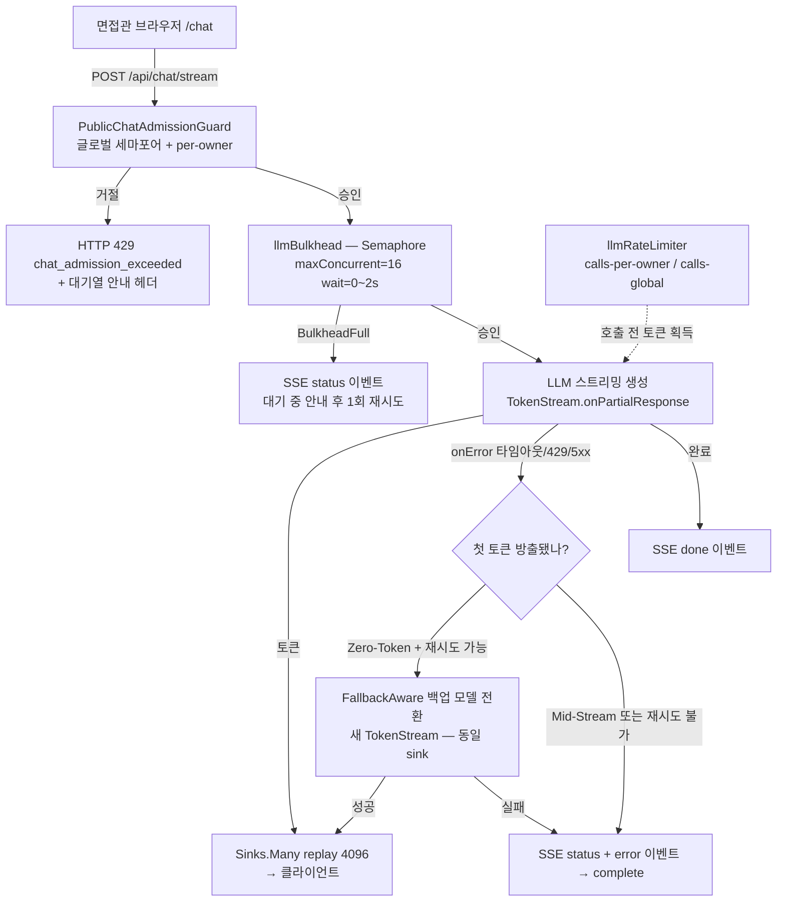

# CONCURRENCY_RESILIENCE_PLAN — 면접관 동시 접속 RAG/SSE 장애내성 설계

- 문서 ID: PASTE_DEVIN_CONCURRENCY_RESILIENCE_20261005-WP2
- 작성: 2026-10-05, Devin(SWE-2) — 구현은 Codex(Java Source Owner)가 수행
- 범위: 설계서 전용. 이 문서는 제품 소스를 변경하지 않는다.

## 1. 목표

면접관 다수가 동시에 `/chat` 스트리밍을 열 때 발생하는 네 가지 장애를 격리한다:

1. LLM 제공자 지연/타임아웃이 한 세션의 SSE를 무한정 붙잡는 문제
2. 동시 요청 폭주 시 스레드/연결 고갈(현재 `Schedulers.boundedElastic()` 의존)
3. 제공자 429/할당량 초과의 연쇄 실패
4. admission 거절(429) 시 사용자에게 무안내 종료로 보이는 문제

## 2. 현재 상태 (2026-10-05 라이브 트리 기준 사실)

| 구성요소 | 파일:라인 | 사실 |
|---|---|---|
| Admission | `main/java/com/example/lms/api/PublicChatAdmissionGuard.java:58` | `tryAcquire` = 글로벌 세마포어(64) + per-owner 맵(2). 거절 시 `Rejection` → HTTP 429 `chat_admission_exceeded`. 설정키 `public.chat-admission.*` 이미 존재 |
| Resilience Bean | `main/java/com/example/lms/config/ResilienceConfig.java:19-38` | `llmCircuitBreaker`(50%, window 20, open 30s) + `llmTimeLimiter`(20s)만 존재. **Bulkhead/RateLimiter 부재** |
| SSE 스트림 | `main/java/com/example/lms/api/ChatApiController.java:1598,1710` | `POST /api/chat/stream` → `Flux<ServerSentEvent<ChatStreamEvent>>`, `Sinks.many().replay().limit(4096)`, 워커는 `Schedulers.boundedElastic()` |
| 스트림 실패 처리 | `ChatApiController.java:3050` | 생명주기 catch → `ChatStreamEvent.error(...)` emit 후 `tryEmitComplete`. **중간 폴백 모델 재개 없음 — 실패 = 스트림 종료** |
| 동기 폴백 | `main/java/com/example/lms/llm/gateway/FallbackAwareChatModel.java:29-30` | 동기 `ChatModel` 한정: primary에 잔여 예산 60% 슬라이스(3/5), 최대 3회 bounded failover |
| 재랭커 가드 | `main/java/service/guard/RerankerConcurrencyGuard.java:11-22` | `Semaphore.tryAcquire(timeout)` → 실패 시 fallback callable — 본 설계가 재사용할 기존 패턴 |
| 의존성 | `build.gradle.kts:109,120` | `resilience4j-spring-boot3:2.2.0` + `resilience4j-reactor:2.2.0` 이미 존재 → 신규 의존성 없이 `io.github.resilience4j.bulkhead.*`·`ratelimiter.*` 사용 가능(추정: spring-boot3 스타터 전이 포함 — Codex가 컴파일로 확인) |

## 3. 아키텍처



## 4. Bulkhead 선택: Semaphore vs ThreadPool

| 기준 | Semaphore Bulkhead | ThreadPool Bulkhead |
|---|---|---|
| 실행 스레드 | 호출 스레드 그대로 사용(이미 `boundedElastic` 워커) | 전용 풀로 작업을 넘김 — 스레드 2중 관리 |
| SSE 적합성 | **적합**: 스트림은 이미 비동기. 슬롯은 "동시에 진행 중인 LLM 호출 수"만 제한하면 됨 | 부적합: 큐잉된 작업이 완료까지 스레드 점유 → 큐 길이만큼 지연 증가 |
| 거절 동작 | `BulkheadFullException` 즉시 → SSE status 안내 후 재시도 가능 | 큐 포화 시도 거절이나 대기 자체가 지연 원인 |
| 도입 비용 | Bean 1개 + `Bulkhead.decorate*()` | 풀 튜닝(core/max/queue) 추가 |

**결정: Semaphore Bulkhead.** 현재 admission 세마포어 패턴(`PublicChatAdmissionGuard`,
`RerankerConcurrencyGuard`)과 동형이라 일관되고, 워커 풀을 이중으로 만들지 않는다.

역할 분담: `PublicChatAdmissionGuard` = HTTP 진입 시점의 세션 수용(사용자 경험),
`llmBulkhead` = LLM 호출 자체의 동시 실행 상한(리소스 보호). 두 층은 다르다 —
admission은 세션 전체 수명, bulkhead는 모델 호출 구간만 점유한다.

**Reactive Subscription Boundary**: WebFlux 핸들러는 `Flux`를 조립해 즉시 반환하므로,
슬롯 획득·반납을 동기 `try`+종료 블록으로 감싸면 Flux 반환 시점에 슬롯이 즉시 새거나
반대로 스트림 생명 전체를 점유한다. 올바른 경계는 스트림 구독 생명주기다 —
`TokenStream` 구독 시점에 `tryAcquirePermission`, 첫 `onPartialResponse`에서
`firstTokenEmitted` 플래그 세팅, `onComplete`/`onError`/취소의 종료 콜백에서
정확히 1회 반납한다. 기존 admission lease가 `.doFinally(ignored -> admissionLease.close())`
로 반납되는 것(`ChatApiController.java:1522,1598,3094`)과 동일한 Reactive 패턴이다.

## 5. 파라미터 (U-1 자동결정: 권장안 a 채택)

분류기 판정 AUTO + 지시서 권장에 따라 **글로벌 16 / 세션당 1**을 기본값으로 한다.
근거: 면접 시연은 동시 면접관 수가 수십이지만 동일 세션의 병렬 생성은 없고,
로컬 VRAM과 외부 API rate limit이 실질 상한이다. 대안 (b) 32 — GPU/쿼터 여유가
확인되면 설정만으로 상향 가능. (c) 64/2 유지 — 현재 기본값, 보호 없음 상태와 같음.

**임계값 조화(역전 아님) — 사실 보정**: 현재 라이브 트리에는 `llmBulkhead`가
없고 `PublicChatAdmissionGuard` 기본값은 글로벌 64다(`§2` 표). 아래 YAML 수치는
모두 **도입 전 설계 제안값**이며 "지금 정상 세션 절반이 SSE로 거절된다"는 뜻이
아니다. admission 32(제안)는 *수용 세션* 상한, bulkhead 16(제안)은 *동시 LLM 호출*
상한으로 서로 다른 구간을 잰다 — 수용된 세션이 전부 동시에 생성하지 않으므로
bulkhead 포화는 세션 거절이 아니라 SSE `status` 안내 + 최대 2s 대기 + 1회 재시도로
흡수한다(§6 흐름표). 도입 시 `admission ≥ bulkhead`를 유지하되, bulkhead를
admission 이상으로 올리면 보호 의미가 사라진다.

```yaml
# application.yml 예시 — 값은 모두 런타임 재설정 가능 (mutable spec)
public:
  chat-admission:
    global-limit: 32        # 세션 수용(현재 64에서 보수적 하향 권장)
    per-owner-limit: 2

resilience4j:
  bulkhead:
    configs:
      llmDefault:
        max-concurrent-calls: 16      # U-1(a) — LLM 동시 호출 슬롯
        max-wait-duration: 2s         # 짧은 대기 후 거절 → SSE 안내로 전환
        writable-stack-trace-enabled: false
  ratelimiter:
    configs:
      llmDefault:
        limit-for-period: 8           # 초과 요청은 대기열 안내로
        limit-refresh-period: 1s
        timeout-duration: 0           # 즉시 거절, 기다리지 않음
  timelimiter:
    configs:
      llmDefault:
        timeout-duration: 20s         # 기존 llmTimeLimiter와 동일
```

## 6. SSE 스트리밍 장애 폴백 흐름 — Zero-Token / Mid-Stream 2단계 경계

LangChain4j 스트리밍은 모델 레벨 자동 폴백이 없다(`TokenStream.onError`가
콜백으로만 오고 재개 불가). 이미 방출된 토큰 뒤에 새 모델 스트림을 같은 sink에
이어 붙이면 텍스트 중복·문맥 왜곡(fragmented duplication)이 생기므로, 폴백
허용 여부는 **첫 토큰 방출 시점**으로 자른다.

### 6.1 Zero-Token Fallback (첫 토큰 방출 전 — 투명 전환 허용)

`onPartialResponse`가 한 번도 호출되지 않은 상태(`firstTokenEmitted == false`)에서
`onError`/타임아웃이 발생한 경우에만 백업 모델 전환을 허용한다:

1. `onError(throwable)` → `LlmGatewayFailureClassifier`로 분류(TIMEOUT_SOFT,
   PROVIDER_ERROR, RATE_LIMIT 등 재시도 가능 클래스만).
2. `firstTokenEmitted == false` + 재시도 가능 + `TimeBudget` 잔여 존재 → 먼저
   `sink.tryEmitNext(sse(ChatStreamEvent.status("일시적 지연 — 백업 경로로 전환 중")))`
   으로 사용자에게 안내.
3. `FallbackAwareChatModel`의 `nextFallbackResolver`로 백업 모델 선택 →
   새 스트림 시작, 토큰은 동일 sink로 emit (이전 모델이 이 sink에 쓴 토큰이
   0개이므로 클라이언트 무중단).
4. 백업도 실패 or 재시도 불가 → 기존 생명주기 경로(`ChatStreamEvent.error`)로
   종결 — 현재 동작과 동일.
5. CircuitBreaker OPEN 상태면 폴백 시도 없이 즉시 종결(폭주 방지).

### 6.2 Mid-Stream Failure (토큰 방출 후 — 재시작 금지, 안전 종결)

`firstTokenEmitted == true` 이후의 `onError`에는 새 모델 스트림 재연결을 금지한다:

1. `ChatStreamEvent.status("응답 생성이 중단되었습니다")` 1건 emit 뒤
   `ChatStreamEvent.error`로 명확히 종결한다.
2. 이미 방출된 토큰은 그대로 두고, 부분 답변 뒤에 다른 모델의 문장을 이어
   붙이지 않는다 — 재시도는 사용자의 새 요청으로만 한다.
3. bulkhead 슬롯과 admission lease는 종료 콜백(`doFinally`)에서 정상 반납한다.

### 에러 처리 흐름표

| 장애 | 감지 위치 | 동작 |
|---|---|---|
| admission 거절 | `tryAcquire` 실패 | HTTP 429 + `Retry-After: 5` + 클라이언트 대기열 안내 문구 |
| bulkhead 포화 | `BulkheadFullException` | SSE `status` "동시 요청이 많아 잠시 대기" → 최대 1회 내부 재시도 → 실패 시 error 종결 |
| LLM 타임아웃 | `TimeLimiter`/onError | status 안내 → Zero-Token 한정 백업 모델 1회 전환 → Mid-Stream·실패 시 error 종결 |
| 제공자 429 | `HttpException 429` | RateLimiter 통계 + (Zero-Token 한정) 백업 라우트 1회 → error 종결 |
| CB OPEN | `CallNotPermittedException` | 즉시 error 종결(`llm_unavailable`) — 추가 호출 차단 |

## 7. 검증 계획

- 오프라인: `scripts/probe_concurrency_resilience.py --dry-run` (정책 모델,
  exit 0). `--live`는 로컬 전용, 실제 생성 트리거 → 면접 시연 전 수동 1회 한정.
- 단위: `ResilienceConfigTest`(신규) — bulkhead bean 생성/한도/거절 검증.
- 통합: Codex가 `.\gradlew.bat :test --tests com.example.lms.config.ResilienceConfigTest --no-daemon` 실행.

## 8. 비목표

- 제품 소스 직접 수정(본 문서는 설계만), Kafka/외부 큐 도입, 인증 강화
  (PROTO_OPEN 유지), Display TTL/힌트 주기 변경 — 모두 범위 외.
