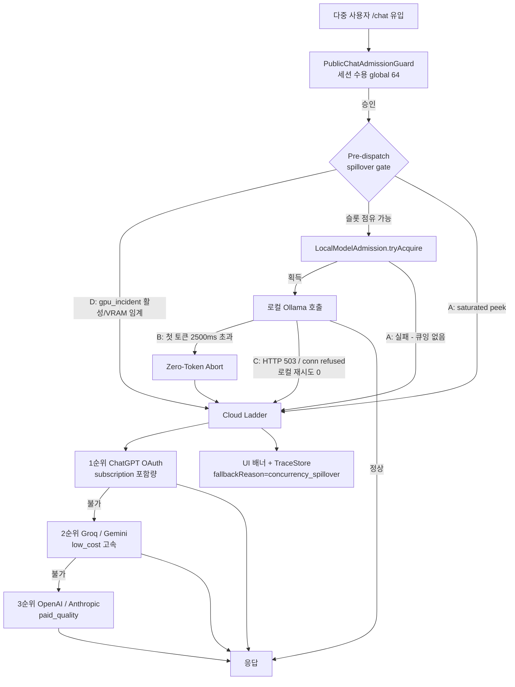

# OLLAMA_CONCURRENCY_API_FALLBACK_PLAN — 다중 사용자 동시 접속 시 로컬 병목 방어 및 Adaptive Cloud Spillover 설계

- 문서 ID: PASTE_DEVIN_OLLAMA_CONCURRENCY_API_FALLBACK_20261005-WP1
- 작성: 2026-10-05, Devin(SWE-2) — 제품 구현은 Codex(Java Source Owner)가 수행
- 범위: 설계서 전용. 제품 소스(`main/java`, `main/resources`, `src/test`)는 변경하지 않는다.
- 형제 문서: `docs/design/CONCURRENCY_RESILIENCE_PLAN.md`(SSE 스트림/세션 장애내성).
  본 문서는 **로컬 모델 슬롯 포화 → 클라우드 API 즉시 우회**만 다루며, 그 문서의
  Zero-Token/Mid-Stream 경계·Reactive 구독 생명주기 규칙을 그대로 따른다.

## 1. 목표

다중 사용자가 `/chat`에 동시 유입될 때 로컬 Ollama의 하드웨어 한계(VRAM,
`OLLAMA_NUM_PARALLEL` 슬롯, `OLLAMA_MAX_QUEUE` 적체, 503/지연)로 서비스가
멈추지 않도록, 포화·지연 징후를 감지하는 즉시 큐 대기 없이 클라우드 API로
우회하는 **Fast-Spillover(적응형 스필오버)** 경로를 규정한다.

## 2. 현재 상태 (2026-10-05 라이브 트리 기준 사실)

| 구성요소 | 파일:라인 | 사실 |
|---|---|---|
| 로컬 슬롯 | `main/java/ai/abandonware/nova/orch/router/LocalModelAdmission.java:29-44` | `(endpoint, model)` 단위 `Semaphore`. `saturated()`(peek)/`tryAcquire()`(non-blocking)/`release()`. 큐잉 없음 |
| 슬롯 한도 | `LlmRouterAspect.java:756-773` | `llm.local-admission.enabled`(기본 true), `llm.local-admission.permits-per-model`(기본 1, env `LLM_LOCAL_ADMISSION_PERMITS_PER_MODEL`) |
| 사전 포화 우회 | `LlmRouterAspect.java:491-524` | dispatch 전 `localSlotSaturated` → `preferCloudOnLocalFailure()`이면 `nextEligibleSelection(cloudOnly=true)`, 아니면 `repickUncontendedLocalArm`(로컬↔로컬 hop 먼저). reason=`local_contended` |
| invoke 경합 | `LlmRouterAspect.java:842-889` | `LocalAdmissionChatModel.doChat`이 `tryAcquire` 실패 시 `local_contended`(`SOFT_CIRCUIT_OPEN`) 또는 `local_backend_busy`(`RATE_LIMIT_COOLDOWN`, owner OAuth 대상)를 throw → `FallbackAwareChatModel` 리졸버 진입 |
| OAuth 우선 회로 | `LlmRouterAspect.java:712-741` | `ownerOAuthRoute/ownerOAuthFallback`: owner 등록 + `chatgpt.oauth.main-model` 설정 시 ChatGPT OAuth route로 우선 우회 |
| 클라우드 선호 판정 | `LlmRouterAspect.java:688-693` | `preferCloudOnLocalFailure()` = `localFailoverEnabled()` OR (`local-device-failover.enabled && enforcement=ENFORCE`) — 현재 `application-llm.yaml:30-42`에서 enabled=true/ENFORCE |
| 클라우드 재선택 | `LlmRouterAspect.java:891-937` | `nextEligibleSelection(..., cloudOnly)` — cloudOnly 시 로컬 arm 제외, `llm.gateway.fallbackReason=local_contended` 기록 |
| 세션 수용 | `main/java/com/example/lms/api/PublicChatAdmissionGuard.java:24-26,58` | 글로벌 64 / per-owner 2. 거절=HTTP 429. **슬롯 초과 트래픽은 거절이 아니라 클라우드 토스가 정답** |
| 사용자 안내 | `main/java/ai/abandonware/nova/orch/aop/FallbackBannerAspect.java:108-114` | `local_contended` 시 `answer.routeFallback` 트레이스/배너 경로 이미 존재 |
| GPU 사고 플래그 | `scripts/gpu_incident.py`, `var/incident/gpu.json` | `state`∈{`OK`,`GPU3090_LOST`,`GPU3090_DEGRADED`} + `skip_lanes:["ollama:11434"]` 계약 존재 |
| 포커스 테스트 | `src/test/java/ai/abandonware/nova/ orch/aop/LlmRouterLocalContentionTest.java` | 포화 우회/invoke 경합/로컬 repick/거절/정상/비활성 6건 이미 존재 |
| 라우팅 테이블 | `configs/api-routing.yaml:116-162` | llm: `ollama_*`(free_local) → `chatgpt_oauth`(subscription) → `groq`/`gemini`(low_cost) → `openai`/`anthropic`(paid_quality) |
| 클라우드 게이트 | `main/resources/application-llm.yaml:43-49, 481-486` | `llm.gateway.cloud.enabled=true`, `route-key=api3`; `llmrouter.api-first.enabled` 기본 false |

**추정 명시**: Ollama 데몬 내부 `OLLAMA_NUM_PARALLEL`/`OLLAMA_MAX_QUEUE` 값은
리포에서 확인 불가 — 런타임 `ollama` 환경 SSOT로 재확인 필요(본 설계의 앱 측
방어는 이 값과 무관하게 동작).

## 3. Fast-Spillover 아키텍처



## 4. 4대 트리거 (조기 탈출 규칙)

| ID | 트리거 | 감지 지점 | 동작 | 임계치 (제안 기본값) |
|---|---|---|---|---|
| A | 슬롯 포화 | `localSlotSaturated`(사전, :493) / `tryAcquire` 실패(invoke, :871) | **큐잉 0** — 즉시 cloud ladder. `eager-cloud-spillover=true`면 로컬↔로컬 hop(`repickUncontendedLocalArm`)을 건너뛴다 | `permits-per-model=1` (U-1 결정) |
| B | 첫 토큰 지연 (TTFT) | 로컬 호출 진행 중 first-token 워치독 | Zero-Token Abort 후 백업 모델로 전환. Mid-Stream(토큰 방출 후)은 절대 재시작 금지 — `CONCURRENCY_RESILIENCE_PLAN §6` 경계 동일 | `first-token-timeout-ms=2500` (U-2 결정) |
| C | 로컬 5xx/연결 거부 | `LlmGatewayFailureClassifier` 분류(`PROVIDER_ERROR`, 연결 계열) + `local-device-failover` 추적 | 로컬 재시도 **0회** — 503/conn refused 즉시 cloud. 기존 transient 쿨다운(`transient-cooldown-ms:60000`)과 조화: 스필오버는 요청 1건의 즉시 우회, 쿨다운은 엔드포인트 건강 상태 | `local-retry-on-5xx=0` |
| D | GPU 사고 선제 배제 | `var/incident/gpu.json` `state!=OK` 또는 `skip_lanes` 포함 엔드포인트 | **Pre-dispatch** 단계에서 해당 로컬 arm을 eligibility에서 제외 — 디스패치 자체를 막아 TTFT 낭비 0 | flag `state`∈{LOST,DEGRADED} + `skip_lanes` 매칭 |

## 5. 클라우드 폴백 사다리 (`fallback-ladder`)

`configs/api-routing.yaml` tier 순서를 따른다. `chatgpt_oauth`는 owner 등록
세션에서만 가용(`ownerOAuthRoute`의 `isRegisteredOwner` 게이트, :720) — 비owner/
익명 세션은 자동으로 2순위부터 진입한다. 이것은 정책상 결함이 아니라 구독 포함량
보호 규칙이다.

```yaml
llm:
  local-admission:
    enabled: true                      # 기존
    permits-per-model: 1               # 기존 (U-1: 다중 접속 시 VRAM 경합 차단)
    eager-cloud-spillover: true        # 제안: 경합 시 로컬 hop 없이 즉시 클라우드
    first-token-timeout-ms: 2500       # 제안: Zero-Token Abort 워터마크 (U-2)
    local-retry-on-5xx: 0              # 제안: 503/conn refused 로컬 재시도 금지
    fallback-ladder:                   # 제안: api-routing.yaml routes.llm 순서 반영
      - chatgpt_oauth                  # subscription, 비용 0, owner 세션 한정
      - groq                           # low_cost 초저지연
      - gemini                         # low_cost
      - openai                         # paid_quality
      - anthropic                      # paid_quality
```

## 6. 다중 세션 무결성 및 사용자 알림

- **무결성**: 슬롯 획득→호출→반납은 `LocalAdmissionChatModel`의
  try/finally 경계를 유지한다. 스트리밍 경로는 `CONCURRENCY_RESILIENCE_PLAN §4`
  의 Reactive Subscription Boundary(구독 시점 획득, 종료 콜백 1회 반납)를
  따른다 — Flux 반환 즉시 슬롯이 새는 동기 try/finally 패턴을 스트림에 쓰지 않는다.
- **사용자 안내**: 스필오버 발생 시 UI 배너
  `[안내: 동시 접속 혼잡으로 클라우드 고속 엔진으로 자동 전환되었습니다]` 1회 표시
  (기존 `FallbackBannerAspect` 배너 경로 재사용), TraceStore에는
  `fallbackReason=concurrency_spillover` + 기존 `llm.gateway.preselectionReason`/
  `llm.localAdmission.*` 키를 함께 남겨 감사 가능하게 한다.
- **PROTO_OPEN**: 인증·로그인 요구 추가 없음. `chatgpt_oauth` 미등록 세션은
  사다리 2순위로 자연 진입한다.

## 7. 검증 계획

- 오프라인 프로브: `python -B scripts/probe_ollama_concurrency_spillover.py --dry-run`
  (정책 모델, exit 0) / `--simulated`(가상 사용자 1~64, 스레드 경합 실측).
- 포커스 테스트(Codex): `.\gradlew.bat :test --tests ai.abandonware.nova.orch.aop.LlmRouterLocalContentionTest --no-daemon --console=plain`
  + 트리거 B/C/D용 신규 케이스는 `FOR_CODEX_OLLAMA_BOTTLENECK_FALLBACK.md`에 명세.
- 본 프로브의 PASS는 정책 모델 검증일 뿐 애플리케이션 완료 증거가 아니다 —
  제품 검증은 Codex의 JUnit + 라이브 확인으로 완결된다.

## 8. 비목표

- 제품 소스 직접 수정(본 문서는 설계), Ollama 데몬 튜닝(`OLLAMA_*`는 운영자 영역),
  인증 강화(PROTO_OPEN 유지), `PublicChatAdmissionGuard` 상한 변경(64/2 유지),
  Display TTL/힌트 주기 변경 — 모두 범위 외.
