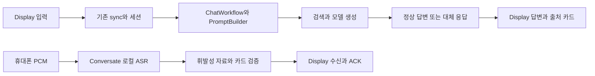

# Meta Ray-Ban Display AI 점검과 API 우선순위

**11435 Ollama의 기존 Windows 로그인 자동 시작을 복구했고, 실제 Spring 일반 RAG와 Display 브라우저에서 정상 답변을 확인했다.** 기본 Display 요청의 서버 예산을 80초로 전달하도록 수정했으며, 기존 90초 클라이언트 대기·취소·중복 방지 동작을 유지했다. 후속 질문의 “한 문장으로 답하세요”를 이전 문장 조회로 오인하는 별도 결함도 수정했다. 기존 회귀 357개와 재시작한 실제 브라우저의 첫 질문·후속 질문 2개가 모두 통과했다. 전체 AI·안경 기능 완료로 판정하지 않는다.

조사 기준은 2026-09-14 Desktop의 현재 소스와 실행 출력이다. 브랜치는 `codex/owned-runtime-browser-restart`, HEAD는 `0796a3c5b29bbb08c3314bd40649d856d4a7bce6`이다. 시작 시 기존 변경 파일 1,711개가 있어 이번 대상만 preimage/postimage로 추적했다. 과거 실패 기록은 원본 artifact에 보존하고 현재 상태와 구분한다.

## 11435 자동 시작과 실제 AI 증거

기존 사용자 시작 프로그램 `Ollama Unified E`가 가리키는 `C:/Users/nninn/AppData/Local/Ollama/Start-OllamaUnifiedEndpoints.ps1`을 보강했다. 정상 endpoint는 재사용하고 다른 실행 파일의 점유는 포트별 실패로 처리한다. 새 프로세스는 숨김 실행하며 로그·PID·생성 시각 manifest를 남긴다. 실제 즉시 시작, 정상 endpoint 중복 실행 방지, 외부 owner fixture의 exit 42를 검증했다. 로그인 등록과 활성 상태를 확인했지만 실제 로그아웃·재부팅 주기는 실행하지 않았다. 11434/11438과 기존 GPU·모델 저장소 배정은 유지했다.

일반 채팅의 실제 adapter는 LangChain4j 1.0.1의 `dev.langchain4j.model.openai.OpenAiChatModel`이다. `DynamicChatModelFactory`에서 **local + loopback + 정확한 gemma4:26b + 기존 think-false 플래그** 조건에 `OpenAiChatRequestParameters.reasoningEffort("none")`를 전달하도록 수정했다. 실제 SDK 요청 캡처에서 설정 누락 RED를 확인한 뒤 설정 on/off, 다른 모델, 토큰 상한, 텍스트·이미지 배열을 포함한 26테스트가 통과했다. native adapter로 우회하는 제안은 이미지 입력 계약을 보존하기 위해 채택하지 않았다. [Ollama thinking 문서](https://docs.ollama.com/capabilities/thinking)

| 현재 관측 | 실제 결과 | 해석 범위 |
| --- | --- | --- |
| 11435 daemon | API 버전 0.32.13, 작업 소유 PID 43552 | 도달성·소유권 증거; 모델 추론과 별도 |
| 빈 요청으로 모델 preload | HTTP200, done_reason=load, 왕복 51,547ms | 생성 없이 정확한 모델 로딩; API load_duration은 없어 0ms로 해석하지 않음 |
| 로딩 후 Spring 직접 모드 | 17,687ms, HTTP200, fallback=false, 의미 수용 | 기존 useRag=false/useWebSearch=false 모드의 실제 응답 |
| 기본 Display 본문 + 80초 예산 | 48,953ms, HTTP200, fallback=false, 의미 수용, 응답 request ID 일치 | 일반 RAG 경로 성공. source evidence 수 0; 인용 품질 전반을 인증하지 않음 |
| 수정된 Display 첫 브라우저 질문 | 정상 답변 제목과 기대 원소·개수 확인 | 실제 UI 의미 수용. 도구 관측 간격 때문에 정확한 왕복 시간은 미측정 |
| 같은 브라우저의 후속 질문 | 수정 전에는 이전 질문 반복, 수정 후에는 기대한 개수 비 정상 답변 | 회귀 RED→357 GREEN 및 실제 의미 수용. 서버 session ID 상관관계는 별도 미입증 |

빈 요청을 통한 preload는 Ollama가 안내하는 기존 API 동작을 사용했다. 테스트용 preload를 상주 warm-up이나 영구 keep_alive 설정으로 추가하지 않았다. 일반 메모리 여유와 GPU 사용량을 이번 시점에 확인했으며, 현재 메모리 압박은 관측하지 못했다. 이 관측으로 과거 실패 시점의 메모리 상태를 단정하지 않는다. [Ollama FAQ: 모델 preload와 메모리 관리](https://docs.ollama.com/faq)

기존 서버는 예산 헤더가 없으면 기본 1,500ms를 사용한다. 이번 기본 Display 본문에 80,000ms를 주는 비교 요청이 실제 성공했고, 클라이언트 계약에서 헤더 누락 RED를 재현했다. `display-core.js`가 이제 `X-Budget-Ms: 80000`을 전송한다. 서버 최대 예산 120,000ms, 요청 본문, cookie 처리, session ID, idempotency, 기존 90,000ms 클라이언트 타이머는 변경하지 않았다. 모델 cold load·교체에 따른 지연 변동은 남으며 모든 요청의 80초 완료를 보장하지 않는다.

## 추가 세션 검증과 공식 Simulator 준비

현재 변경 19파일의 해시와 작업 소유 런타임이 유지됨을 다시 확인했다. 자동 cookie 처리를 사용하는 별도 HTTP 클라이언트로 일반 sync와 문맥 후속 질문을 각각 한 번 실행했다. 두 요청 모두 HTTP200·fallback=false·의미 수용을 통과했으며, 응답 request ID가 각 요청과 일치하고 응답 헤더·본문·다음 요청의 session ID가 모두 같았다. 측정된 왕복은 첫 요청 63,125ms, 후속 요청 28,656ms였다. cookie 원문과 질문·응답 원문은 증거 파일에 저장하지 않았다. 이는 실제 서버 세션 연속성의 HTTP 증거이며, 이전 브라우저의 네트워크 헤더를 직접 읽은 결과는 아니다.

공식 Simulator 확장은 확인한 Chrome·Edge의 Default/Profile 1에 설치되어 있지 않았다. 연결된 Chrome은 사용할 수 있으며, 공식 스토어의 현재 버전은 0.5.0이다. 공식 안내는 설치 버튼 클릭에 Meta Wearables Developer Terms 동의가 포함된다고 명시하므로 설치와 약관 동의의 사용자 승인을 기다린다. 기존 앱 수정·테스트·실제 AI 응답 검증은 이 단계와 독립적으로 완료했다. [공식 Simulator 설치 안내](https://chromewebstore.google.com/detail/meta-ray-ban-display-simu/jpjlmmodokemlepklkdbimceggpbjcll)

## 기능별 판단

| 경로 | 현재 소스와 입증 상태 | 남은 조건 |
| --- | --- | --- |
| Display 일반 질문 | `/api/chat/sync`의 실제 정상 답변과 카드 표시 확인 | 후속 질문의 실제 의미 수용 확인. request-bound 서버 session ID 비교와 근거가 필요한 다양한 질문은 추가 증거 필요 |
| Conversate 음성 | 기존 `/audio` → `ConversateAsrBridge` → 로컬 CPU ASR. bootstrap은 asrAvailable=false | 현재 interview-demo 필터가 audio를 막음. 실제 권한·ASR 실행 경로·휴대폰 마이크 검증 |
| 휘발성 RAG 카드 | 준비 자료 BM25·lexical rerank·검증 및 선택적 로컬 생성 | 실제 자료/음성 입력 수용. 일반 채팅 보관 정책과 구분 |
| 운영자 Display 수신 | SSE 또는 HTTPS poll → snapshot 검증 → 표시 후 ACK | ACK는 전달 증거. AI 생성·실안경 렌즈 표시와 별도 |
| Deepgram | `DeepgramSttService`와 설정 구현 | 현재 Conversate의 실제 호출 연결 미입증 |
| 공식 Simulator·실안경 | 일반 브라우저와 구분 | 공식 확장의 실제 사용, 공개 HTTPS·계정·기기·Neural Band 관측 |

Meta Display Web Apps는 HTML/CSS/JavaScript 앱이며 DAT는 Android/iOS 앱에서 안경 기능을 쓰는 별도 경로다. text composer에서 완료된 텍스트를 받는 기능이 주변 대화의 raw PCM 또는 안경 마이크의 자동 접근 권한을 뜻하지 않는다. [Meta FAQ](https://developers.meta.com/wearables/faq/), [공식 텍스트 입력 가이드](https://raw.githubusercontent.com/facebook/meta-wearables-webapp/main/plugins/meta-wearables-webapp/skills/add-text-input/SKILL.md)

## 필요한 API 10개와 개발 순서

이 순위는 현재 프로젝트의 완성도를 높이는 **통합 작업 순서**다. 자체 서버 API, 표준 Web API, 외부 서비스 API를 포함한다. 1–6은 기존 기능을 완성하는 경계이며, 7–10은 해당 사용 사례와 실제 품질 문제가 확인된 뒤 선택할 확장이다. 순위는 의존 관계·사용자 가치·변경 위험에 대한 설계 판단이며 실측 점수나 벤치마크가 아니다.

| 순위 | API·SDK와 권장 역할 | 현재 연결 상태 | 완료를 판단할 최소 시험 |
| --- | --- | --- | --- |
| 1 | **Meta Display Web Apps 입력·표시 API** — text composer, 방향키/Enter/Escape, manifest | Display 앱 구현. 공식 Toolkit을 재사용 | 실제 composer 입력 → 전송 → 답변 페이지 → 출처 탐색. 공식 Simulator 및 안경에서 별도 확인 |
| 2 | **기존 인증·세션 API** — `/api/assist/bootstrap`, `/api/assist/sessions`, 기존 로그인·CSRF | 기존 구현. 일반 인증 모드와 interview-demo 모드의 권한이 다름 | 서로 다른 사용자 세션 접근 차단, 만료·로그아웃 처리, 비밀 값이 URL·storage·보고서에 남지 않음 |
| 3 | **기존 Display 출력 API** — assist `/output`, `/output/poll`, `/ack`, `/control` | receiver가 사용. 이번에 입력 검증 보강 | 같은 request/epoch/version의 카드만 표시. malformed/stale 입력 ACK 0회. 정지·만료 후 제거 |
| 4 | **기존 RAG 질의·근거 API** — 일반 `/api/chat/sync`, 휘발성 assist `/materials`·`/utterance` | 두 경로 모두 구현; 보관·인증 조건을 구분 | 정상 자료, 자료 없음, 상충 수치, 악성 자료, 한국어 후속 질문. 동일 요청의 출처와 답변 의미 검증 |
| 5 | **Ollama 로컬 생성 API** — 기존 LangChain4j OpenAI 호환 SDK·native adapter와 구조화 출력 | daemon 도달성 확인. Conversate 생성은 플래그·정확한 모델·loopback 경로 필요 | 정확한 모델의 시도·응답, schema·근거 검증, cold/warm 지연, 예산 초과·취소. health만으로 PASS 금지 |
| 6 | **표준 Media Capture·AudioWorklet 및 기존 PCM 입력 API** — 휴대폰 마이크 → 16 kHz mono PCM → `/audio/start`·`/audio/chunk` | 기존 Conversate UI·PCM·로컬 ASR 경로 | 명시적 시작/중지, 권한 거절, sequence 중복/누락, background·잠금·통화 후 track 해제. 실제 휴대폰 시험 필요 |
| 7 | **Deepgram Streaming STT API** — 로컬 한국어 전사의 품질·지연 부족 시 선택 | 서비스 구현, 현재 Conversate 호출 연결은 미확인 | 합성/승인 음성의 한국어 확정 전사, 중간·최종 결과, KeepAlive·CloseStream, 401/429·단절. 키·허용 입력·요청/비용 상한을 바인딩한 뒤 호출 |
| 8 | **Tavily Search API** — 준비 자료에 없는 최신 공개 정보 조회 | 저장소에 기존 검색 경로 존재. 이번 작업에서 Conversate에 추가하지 않음 | 서버 기존 provider seam에 한정. 도메인·결과 수 제한, 출처 검증, 빈 결과·timeout·키 없음. 검색 텍스트로 시스템 지시를 바꾸지 않음 |
| 9 | **DeepL Text Translation API** — 다국어 대화/용어가 실제 요구일 때 | 이번 조사 범위에서 Display 연결 미확인 | 한국어 숫자·단위·부정·고유명사 보존, 원문/번역 구분, 비용·전송 동의. 단순 한국어 RAG에는 선행조건 아님 |
| 10 | **Meta DAT camera/photo API** — 보는 장면·문서 OCR이 필수인 경우의 네이티브 확장 | 현재 웹앱과 별도의 Android/iOS 경로 | 지원 기기·SDK·권한·프레임 소유권, 명시적 캡처, OCR/시각 모델의 같은 프레임 결과. 웹앱 코드에 DAT 호출을 추측해 삽입하지 않음 |

Meta의 공식 Toolkit은 600×600, 방향키 탐색, 높은 대비, 공개 HTTPS를 안내하며 공식 Simulator 확장을 제공한다. 공개 앱 shell 호스팅과 서버의 공개 추론·접근 제어는 각각 검증해야 한다. Sites에 정적 파일을 올리는 것만으로 기존 Spring 로그인·API·SSE가 연결되지는 않는다. [Meta Toolkit](https://github.com/facebook/meta-wearables-webapp)

Ollama API는 생성 옵션과 구조화 출력에 필요한 `format` 등의 인터페이스를 제공한다. 이 프로젝트에서는 새 LLM client를 만들지 않고 기존 Java adapter와 카드 검증기를 사용한다. [Ollama 생성 API](https://docs.ollama.com/api/generate)

Deepgram 공식 언어 표에는 Nova-3의 한국어 `ko`/`ko-KR`가 포함돼 있다. 현재 Java 서비스는 `nova-3`, linear16, mono, sample rate, interim results를 설정한다. 언어 지원은 이 프로젝트·입력 장치·방언·주변 소음에서의 정확도를 보증하지 않으므로 실제 전사 품질을 시험해야 한다. [Deepgram 모델·언어](https://developers.deepgram.com/docs/models-languages-overview)

Tavily의 검색 인터페이스와 DeepL의 번역 인터페이스는 각각 최신 근거 탐색과 번역 확장을 위한 후보다. 이 순위만으로 계정 가입·구독·키 발급·유료 호출을 수행하지 않았다. [Tavily Search](https://docs.tavily.com/documentation/api-reference/endpoint/search), [DeepL Translate](https://developers.deepl.com/api-reference/translate/request-translation)

## 이번 변경

1. `display/app.js`: 기존 core가 계산한 fallback 상태를 모든 답변 페이지와 화면 읽기 알림에 **대체 응답**으로 표시한다. 답변 본문과 출처 처리, 정상 답변 표시는 유지한다.
2. `display/receiver.js`: version이 안전한 양의 정수인지, 카드 본문과 만료 시각의 형식이 올바른지 확인한 뒤 상태를 갱신한다. 잘못된 값으로 latestVersion이 오염되거나 ACK가 전송되는 것을 방지한다.
3. 기존 `chat_ui_vibe_listener.ps1`·`chat_ui_vibe_lifecycle.ps1`: `UiSurface=meta-display`를 추가해 Display 페이지·Display 자산·브라우저 URL을 함께 선택한다. 기본 chat-ui 동작과 프로세스 계보·run ID·byte hash·소유 프로세스 정리 조건을 유지한다. 임의 URL을 입력받지 않는다.
4. 실행기 회귀 테스트의 PlanOnly 조회가 일반 운영 runtime state를 읽던 부분을 테스트 전용 미사용 state 경로로 격리했다.
5. Display 스킬의 미구현 설명을 현재 소스에 맞게 수정하고, 입력 검증·fallback 표시·바이브 코딩 규칙을 기존 문서에 연결했다. 새 스킬·새 backend·새 의존성은 추가하지 않았다.
6. 실제 화면에서 보인 내부 `rag-control-projection:v1` HTML 주석만 plain-text 페이지에서 숨겼다. 서버가 의도적으로 제공하는 7단계 안전·근거 표와 원본 DTO는 보존한다. 표 전체를 삭제하거나 가짜 요약으로 대체하지 않았다.
7. 전체 스킬 검증 실패의 실제 원인인 Grok 스킬 description의 `Use for` 문구를 저장소 규칙에 맞는 `Use when` 조건으로 바꿨다. 호출 조건과 실행·과금 제한은 유지했다. 테스트와 validator는 원본 그대로 다시 통과했다.

8. `display-core.js`: 지원되는 80초 서버 예산 헤더를 보내고 90초 클라이언트 대기를 유지한다.
9. `DynamicChatModelFactory`: 정확한 로컬 Gemma26 요청의 thinking 제어를 SDK request parameters로 전달한다.
10. `ChatWorkflow`: 문장 수 출력 형식을 이전 문장 조회로 취급하던 조건을 좁힌다. 정상 조회 회귀를 함께 검증한다.

HTTP 400 오류 분류는 처음 탐색 결과와 달리 부모 에이전트의 현재 파일에 이미 존재했다. 소스는 수정하지 않고 회귀 사례만 추가했다. 이는 하위 에이전트의 분석도 현재 파일·해시와 대조해야 하는 실제 사례다.

## 바이브 코딩에서 적용할 제약

재사용 가능한 [Meta Display 에이전트 프롬프트](../agent-prompts/meta_display_vibe_coding.md)를 추가했다. 입력에 목적, 실제 경로, 재현 단계, 대상, 수용 조건, 검증 명령, 예산, 보존 항목을 적게 한다. 한 부모가 편집·통합·검증을 소유하고 독립 탐색은 한 가지 질문으로 제한한다. 이미 맞는 코드에 새 구현을 덧붙이지 않고, 재현된 실패를 가장 작은 수정으로 해결한다.

핵심 수용 조건은 “화면에 글자가 나왔다”보다 엄격하다. 같은 요청에 대한 시도·응답·출처·표시를 연결하고, 중간 실패·fallback·미확정을 명시한다. raw 음성·전사·자격 증명을 보관하지 않으며, 타임아웃 뒤 자동 재전송하지 않는다. API 지원 여부, 키 존재, health, 모델 생성, 실기기 표시를 각각 독립 증거로 취급한다.

AI coding agent 도입을 연구한 AIDev 기반 연구는 초기 속도 이익이 조건에 따라 달라지고, 정적 경고·인지 복잡도 상승이 함께 관측될 수 있다고 보고했다. 이 연구는 공개 저장소 관측 연구·arXiv preprint이며 이 프로젝트나 현재 특정 모델의 효과를 직접 측정한 결과가 아니다. 여기서는 작은 변경, 근거 추적, 반례 테스트를 채택하는 배경으로만 사용한다. [Agarwal 등, 2026, v2](https://arxiv.org/abs/2601.13597)

## 검증 증거와 한계

| 검사 | 실제 결과 |
| --- | --- |
| Display 계약 | 80초 헤더 누락 RED 후 55통과·0실패; 기존 timeout/취소/중복/페이지 계약 포함 |
| receiver 계약 | malformed 입력 RED 후 5통과·0실패 |
| Conversate UI·PCM | 43통과·0실패 |
| launcher 자산 계약 | Display·legacy·hash 불일치·허용하지 않은 surface 4조건 PASS |
| SDK factory·routing·멀티모달 | 26통과·0실패 |
| 후속 질문 분류 | 새 사례에서 RED 1개를 확인하고 수정 후 기존 workflow/debug/history 클래스 357통과·0실패 |
| Java/sourceSet | Java17, LangChain4j 1.0.1 purity, sourceSet hygiene, root/app compile 성공; 이번 빌드의 결과를 기존 증거와 구분 |
| 스킬 | Display 구조 검사와 기존 family 자체 테스트 통과. Grok description 1줄 정리, validator/테스트 완화 없음 |
| 실제 브라우저 | 수정 후 정상 첫 답변·문맥 후속 답변 2개 모두 수용. 좌우·Escape·입력·Enter 관측. 600×600 custom viewport의 페이지 넘침 없음; 공식 Simulator와 구분 |
| 런타임 자산 | 새 소유 런타임에서 core와 소스 SHA-256 일치, 컴파일된 workflow hash 기록, 11435 health 정상 |
| AWX Control Tower | 기존 감사에서 pipeline 45초 timeout/exit124. 실패를 다른 도구 결과로 대체하지 않음 |

실제 provider/wire 계보는 별도 미입증이다. `responseObserved=true`인 모델 행이 있더라도 providerAttempt/wireAttempt가 false인 기록을 wire 성공으로 바꾸지 않는다. 수정 전 런타임의 제한된 로그에서 두 브라우저 요청 각각에 바인딩된 동일 session hash를 얻지 못했고, 기존 exporter의 활성 출력 경로도 확인되지 않았다. 이전 질문을 언급하는 화면만으로 서버 session 연속성 PASS 기록을 만들지 않는다. cookie를 읽거나 보고서에 저장하지 않았다.

현재 interview-demo 모드는 일반 sync와 일부 assist bootstrap/출력 경로를 허용하지만 audio/materials/utterance 및 진단 경로를 제한한다. 이를 통과시키기 위한 인증·CSRF·admission·Redis·공개 경로 변경은 하지 않았다. 공식 Simulator·실기기·음성 전사·렌즈 지연도 실제 관측 전까지 미확인이다.

## 실패 이력과 현재 목표 상태

자동 시작 재개 전 기본 본문 sync 7회는 모두 fallback이었고, 별도 직접 모드 1회도 예산 소진으로 실패했다. 초기 30초 비교 요청의 실패 때문에 당시 30초 헤더 수정안을 채택하지 않았다. 이후 사용자가 11435 자동 시작 복구를 명시적으로 요청해 소유권 제한이 해소됐고, daemon 복구·SDK 수정·로딩/예산 검증을 거쳐 위의 새로운 성공을 얻었다. 과거 `blocked` 판정과 PID·미관측 기록은 `completion-audit-2.json` 및 `resumed-audit-1.json`에 원본으로 보존한다.

최신 상세 증거는 `data/agent-handoff/codex/report/display-ai-audit-01a09daa/resumed-audit-3.json`과 `resumed-audit-3/`에 있다.

현재 목표는 `active`다. 이번 재개 감사에서는 로컬 소스와 실제 AI 검증이 진전됐으며, 예전의 공유 Ollama 재시작 권한 부족을 현재 blocker로 재사용하지 않는다. 현재 미완료 범위는 E3의 브라우저 응답 헤더 직접 관측, 공식 Simulator·공개 HTTPS·실기기, 선택적 음성 연결이다. 별도 HTTP 클라이언트의 서버 session ID 연속성은 이번 추가 검사에서 통과했다. 후속 질문 의미 수용은 최신 실제 브라우저에서 확인했다. 저장소 전체 HOLD가 아니다.

## 근거와 복구

현재 소스 근거는 `main/resources/static/assets/display`, `main/resources/static/conversate`, `main/java/com/example/lms/assist`, `main/java/com/example/lms/service/stt/DeepgramSttService.java`, `main/java/com/example/lms/config/DeepgramProperties.java` 및 기존 집중 테스트다. 실제 명령·RED/GREEN·선행 검토·대상 해시는 `data/agent-handoff/codex/report/display-ai-audit-01a09daa/`에 보관한다.

복구는 해당 작업의 preimage와 현재 postimage가 일치하는 파일만 대상으로 한다. 현재 저장소 대상 19파일 중 13파일의 전체 preimage를 보관하며, 이번 새 파일 3개와 전체 원본이 없는 기존 스킬 문서 3개를 manifest로 구분한다. Windows 시작 스크립트의 원본·변경 해시는 별도 ollama-autostart 증거에 보관한다. 기존 스킬 Markdown의 작업 전 전체 파일 사본은 없으므로 이들에는 자동 전체 복원을 적용하지 않고 이번 문구 hunk를 검토해 되돌린다. 전체 Git reset, unknown index.lock 제거, 다른 작업의 runtime 종료, 공유 gateway 설정 변경은 복구 방법으로 사용하지 않는다. 공개 HTTPS·계정·공식 Simulator·휴대폰 마이크·실안경 조건은 실제 증거가 확보될 때만 완료로 표시한다.
