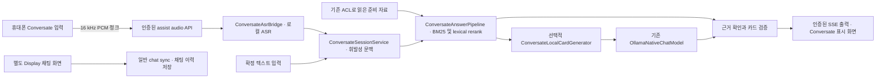

# Meta Display integration

이 저장소에는 목적과 저장 정책이 다른 두 웹 클라이언트가 있다. 연속 대화 음성, 휘발성 문맥, 짧은 한국어 카드라는 요구에는 인증된 `/conversate`와 `/api/assist/*` 경계를 사용한다. `/assets/display/index.html`은 기존 일반 채팅 `/api/chat/sync`를 사용하는 별도 클라이언트다. 두 경로의 테스트와 완료 기록을 합쳐 전체 음성 연동 성공으로 판정하지 않는다.

## 현재 구현과 호출 관계



이 도식의 연결은 현재 소스 호출 관계다. 실제 음성 전사, 모델 응답 또는 안경 표시를 이번 작업에서 모두 관측했다는 뜻은 아니다.

| 경계 | 현재 소유 구현 | 확인된 역할 |
| --- | --- | --- |
| 페이지와 인증 | `main/java/com/example/lms/assist/ConversateController.java` | `/conversate`, `/api/assist/bootstrap`, 사용자 인증, no-store 응답 |
| 음성 입력 | 같은 controller와 `ConversateAsrBridge.java` | 명시적 audio start/chunk, epoch와 sequence, PCM 크기 검사, 소유 ASR 프로세스 |
| 입력 장치·형식 | `main/resources/static/conversate/app.js`, `pcm-worklet.js` | 마이크 시작/중지, 장치 표시, 실제 PCM 변환과 전송 |
| 휘발성 세션 | `ConversateSessionService.java` | bounded context, 확정 발화 처리, pause/stop, 늦은 결과·epoch 차단 |
| 준비 자료 | `PreparedMaterialReader.java` | 기존 사용자 권한으로 허용 자료 읽기 |
| 검색과 카드 | `ConversateAnswerPipeline.java` | 준비 자료의 일시적 BM25 index, lexical reranking, 정상 NO_MATCH의 제한된 띄어쓰기 보완 |
| 선택적 생성 | `ConversateLocalCardGenerator.java` | 기존 `OllamaNativeChatModel.chatStructured`를 통한 로컬 생성 |
| 프롬프트·의미 제약 | `ConversateCardPrompt.java`, `ConversateCardVerifier.java` | 질문·근거 상한, 카드·출처·수치·조건 검증 |
| 일반 채팅 | `ChatApiController.chatSync → handleChat → ChatHistoryService` | 일반 채팅 세션 및 사용자·답변 이력 저장; 휘발성 음성 입력 경로로 사용하지 않음 |

위 assist 클래스들은 `main/java/com/example/lms/assist/`에 있다. 현재 로컬 카드는 기존 검색 및 Ollama 구현을 재사용한다. 일반 ChatWorkflow 전체, 공유 벡터·그래프·웹 검색까지 연결됐다는 주장은 하지 않는다. 필요 시 추가 연결은 실제 읽기 전용·ACL·취소·보관 경계를 증명한 뒤 기존 pipeline에서 수행한다.

## 데이터와 종료 정책

실시간 오디오·전사·문맥·카드는 assistId와 epoch에 묶인 제한된 메모리에서 처리한다. 기존 sessionId는 준비 자료 조회 식별자로 사용할 수 있지만, 실시간 대화 이력을 기존 채팅 세션이나 ctx.memory에 쓰지 않는다. 원문은 진단 보고서나 브라우저 저장소에도 보존하지 않는다.

휴대폰 입력 화면과 안경 표시 화면은 별도 역할이다. 화면을 열었다는 사실만으로 휴대폰 마이크가 선택되지는 않는다. 사용자가 마이크 시작을 선택하고 권한을 허용한 뒤 실제 준비 상태를 확인한다. pause/stop과 페이지 수명 종료는 마이크 track 및 관련 작업을 해제하며, 이전 세대의 늦은 응답이 현재 화면을 복구하지 못하게 한다.

현재 자동 검사는 16 kHz PCM 변환, 명시적 stop, background 전환의 capture 중단, SSE 유효성, 단일 요청, 최신 epoch 및 늦은 결과 방어를 확인한다. 실제 휴대폰의 잠금·전화 수신·Bluetooth 장치 변경과 장시간 동작은 별도 실기 관측이 필요하다.

## Meta Web App과 DAT 구성

### Meta AI 앱과 Premium 구독의 필요성

2026-09-13 공식 요구사항과 현재 소스를 대조했다. **Meta AI 앱은 실제 안경 페어링·Developer Mode·Web App 등록에 필요하며, Meta One Premium 구독은 현재 이 저장소 앱의 실행 조건이 아니다.** 일반 브라우저에서 소스를 개발하고 레이아웃을 시험하는 단계는 Meta AI 앱이나 안경 없이 시작할 수 있다. Premium이 개발 필수가 아니라는 판정은 공식 개발 요구사항에 구독 조건이 없고 아래 호출 경로에도 구독 검사가 없다는 근거에 따른 판단이다. [Meta Wearables FAQ](https://developers.meta.com/wearables/faq/)

| 항목 | 현재 소스에서의 역할 | 필요한 조건 |
| --- | --- | --- |
| 공식 Meta AI 앱 | 소스 밖의 안경 페어링·개발자 기능·웹앱 URL 등록 | 실제 안경 연결 단계에 필요 |
| Meta One Premium | 현재 Display·Conversate 경로에 구독 검사나 Meta AI 유료 서비스 호출 없음 | 이 앱 개발·실행의 필수 구독으로 산정하지 않음 |
| `/assets/display/index.html` | `display-core.js` → `/api/chat/sync`, `inputType=text`; 일반 채팅 이력 경로 | 기존 chat 서버와 세션·admission 의존성 |
| `/conversate` | 휴대폰 브라우저 마이크 → PCM → `/api/assist/*` → `ConversateAsrBridge`; 자료 검색과 선택적 로컬 카드 생성 | 기존 로그인, 로컬 ASR 설정, 마이크 권한, 지원 브라우저 |
| Conversate 표시 화면 | `/conversate?display#assist=<현재 assistId>` → 해당 세션 조회·SSE | 실제 표시 브라우저에서도 기존 인증·세션 소유권 확인 필요 |
| 네이티브 DAT | 현재 두 웹 클라이언트의 필수 의존성 아님 | 네이티브 안경 센서·오디오 경로를 선택할 때 별도 통합 검증 |

Meta One Premium은 Meta 자체 AI 사용량 및 부가 혜택을 제공하는 별도 상품이다. 현재 `ConversateLocalCardGenerator`는 기존 loopback `OllamaNativeChatModel`을 사용하며, 구독 결제로 자체 ASR·Ollama 준비 상태나 외부 API 크레딧이 충족된다고 처리하는 코드가 없다. 실제 Meta 혜택은 계정·지역별 조건을 따른다. [Meta One Premium 공식 안내](https://www.meta.com/en-gb/help/artificial-intelligence/1864308977565149/)

### 휴대폰 입력과 안경 표시의 연결 전제

현재 `static/conversate/app.js`의 `getUserMedia`는 브라우저가 선택한 오디오 입력을 열고 실제 track의 장치명·형식을 표시한다. 이것만으로 휴대폰 내장 마이크 또는 안경 Bluetooth 마이크가 선택됐다고 단정할 수 없다. 공식 Web App 기능 목록과 DAT/Bluetooth 오디오 경로는 구분되어 있으므로, Meta AI 앱 설치나 Premium 결제를 안경 마이크의 연속 입력 증거로 사용하지 않는다. [Meta Wearables FAQ](https://developers.meta.com/wearables/faq/)

음성 입력 중에는 Conversate 입력 화면을 전면에 유지한다. 현재 코드는 `visibilitychange`에서 화면이 숨겨지면 캡처를 멈추고 일시정지를 요청하며, `pagehide`에서 track과 출력 연결을 정리한다. 화면 잠금·백그라운드 상시 수집은 구현 완료 기능이 아니다.

안경에는 입력 화면의 **출력 화면 열기**가 생성한 현재 세션 링크를 등록한다. `/conversate?display`만 열면 기존 휴대폰 세션의 식별자가 전달되지 않는다. 링크의 `assistId`는 세션 식별자이고 로그인 자격 증명이 아니다. 출력 브라우저는 자체 same-origin cookie로 bootstrap·세션 조회·SSE를 수행하므로 휴대폰과 안경의 쿠키 공유를 가정하지 않는다. 기존 인증 또는 명시적으로 설정된 데모 모드의 실제 접근 경계를 확인한다.

다음 실기 검증은 작동하는 HTTPS에서 현재 세션 링크를 열어 짧은 시험 카드가 실제 렌즈에 표시되는지 확인하는 것이다. 공개 앱 URL 요구를 충족시키려고 Spring 전체를 무인증으로 공개하거나 기존 assist 인증·CSRF를 제거하지 않는다. 로그인 화면 통과 가능성, 실제 출력 수신, 렌즈 표시는 각각 관측해야 한다. [Meta 공식 기기 테스트 절차](https://github.com/facebook/meta-wearables-webapp/blob/main/plugins/meta-wearables-webapp/skills/test-on-device/SKILL.md)

Meta 공식 toolkit은 Web App을 표준 HTML/CSS/JavaScript 앱으로 정의한다. 기기에서 불러올 URL은 공개 접근 가능한 HTTPS여야 하며, 등록은 Meta AI 앱의 Display 설정에서 진행한다. 로컬 페이지와 600×600 미리보기는 개발 증거이며 공개 HTTPS나 안경 렌즈 표시의 증거가 아니다. [Meta Wearables Web App toolkit](https://github.com/facebook/meta-wearables-webapp)

공식 입력 방식은 지원 기기에서 표준 입력칸을 선택하고 탭하여 composer를 여는 것이다. 프로그램의 focus만으로 composer가 열리거나 연속 raw microphone stream을 얻는다고 가정하지 않는다. 현재 음성 수집은 별도 휴대폰 경로에서 검증한다. [Meta text input 안내](https://raw.githubusercontent.com/facebook/meta-wearables-webapp/main/plugins/meta-wearables-webapp/skills/add-text-input/SKILL.md)

| 자격 증명 또는 설정 | 용도 | 이 작업의 처리 |
| --- | --- | --- |
| MetaAppID / ClientToken | 네이티브 DAT 앱 attestation 구성 | 기존 값 보존; 웹앱 JS·보고서에 삽입하지 않음 |
| iOS Team ID / Bundle ID | 실제 모바일 앱 식별과 빌드·서명 | Meta 토큰이나 임의 예시 값으로 대체하지 않음 |
| Android package 다운로드 토큰 | GitHub Packages 읽기 | Meta ClientToken과 별개 |
| STT 제공자 키 | 외부 STT 호출 인증 | 현재 로컬 ASR와 별개; 예산·키·실제 호출 증거 없이 유료 STT 성공을 선언하지 않음 |
| 자체 로그인·CSRF | assist 입력·제어·자료 권한 | 기존 인증 사용; 공유 room 이름만으로 접근 허용하지 않음 |
| Meta 문서 MCP | 공개 개발 문서 검색 | 인증 없이 기존 endpoint 재사용 |

이번 실제 DAT 문서 MCP 응답은 앱 등록과 기기 권한을 구분했고, Developer Mode에서는 앱 attestation을 사용하지 않는다고 설명했다. 마이크 접근은 HFP와 플랫폼 권한 대화상자에 연결된다. 이 문서 내용은 현재 모바일 앱·기기 권한이 승인됐다는 증거가 아니다. [DAT Android 통합](https://wearables.developer.meta.com/docs/develop/dat/build-integration-android/), [프로젝트 관리](https://wearables.developer.meta.com/docs/develop/dat/manage-projects/)

기존 `metaWearables` MCP 등록은 `https://mcp.developer.meta.com/wearables`를 사용한다. 중복 등록이나 인증 헤더 추가는 하지 않았다. 현재 세션의 기본 도구 목록에는 Meta 검색 도구가 노출되지 않았지만, 설치된 Python MCP SDK로 initialize와 tools/list 후 발견한 실제 schema에 따라 두 검색 도구를 호출하여 정상 응답을 확인했다. [Meta 공식 MCP 안내](https://github.com/facebook/meta-wearables-webapp#live-documentation-mcp)

## 현재 설정과 실행

Java 17, Spring Boot와 LangChain4j 1.0.1, 기존 속성명 및 openssl/opnessl 설정을 보존한다. 기본 source owner는 root `main/java`, `main/resources`와 app의 `src/main/java_clean`, `src/main/resources`다.

Conversate controller와 생성기는 `conversate.enabled`에 의해 활성화된다. 생성기는 추가로 `conversate.generation.enabled`가 필요하며 기본값은 false다. `conversate.generation.base-url`은 기존 literal loopback endpoint, `conversate.generation.model`은 실제 설치·설정된 정확한 모델명이어야 한다. 현재 구현의 단일 생성 제한은 최대 4초와 512 출력 토큰이다. 이 제한은 실제 cold start 또는 답변 품질 목표가 충족됐다는 증거가 아니다.

다음은 이 작업의 전용 런타임 시작 요청에 사용한 기존 실행기다. 실제 종료 코드·선택된 포트·준비 상태는 검증 문서와 실행기의 result JSON을 확인한다. 실행기는 검증 후 자신이 소유한 런타임만 관리한다. 이미 동작 중인 서버의 health 확인 용도로 반복 실행하지 않는다.

```powershell
Set-Location C:\AbandonWare\demo-1\demo-1\src
$env:SERVER_ADDRESS = '127.0.0.1'
$env:MANAGEMENT_SERVER_ADDRESS = '127.0.0.1'
$env:CONVERSATE_ENABLED = 'true'
powershell -NoProfile -ExecutionPolicy Bypass -File scripts/chat_ui_vibe_listener.ps1 `
  -Port 18169 `
  -StatePath var/codex-runtime/display-postprocess-01a097f3.json `
  -BuildHostId desktop-display-01a097f3 `
  -ProjectCacheDir C:\Users\nninn\.awx-gradle-project-cache\desktop-display-01a097f3 `
  -GradleUserHome C:\Users\nninn\.gradle-awx-display-01a097f3 `
  -OutDir build/codex-smoke/display-postprocess-01a097f3 `
  -ReadyTimeoutSeconds 180
```

현재 진단에서 Java 17과 설정된 loopback Ollama의 version 응답은 확인됐다. Upstash REST URL/token의 프로세스·사용자·시스템 환경변수는 모두 없었다. 이 결과만으로 모든 Spring ConfigData 값이나 credential 유효성을 판정할 수는 없다. 일반 chat sync는 Redis/JDBC admission 의존성을 가지므로 Ollama health만으로 sync 성공을 주장하지 않는다.

중지할 때는 이 작업의 manifest와 현재 프로세스 신원을 대조하는 기존 lifecycle 함수를 사용한다. 다음은 중지 요청 시 실행할 절차이며, 이번 후처리에서는 신원 검사까지만 실행해 `owned-runtime-attributed / identity-match`를 확인했다. 서버는 검토용으로 유지했다.

```powershell
Set-Location C:\AbandonWare\demo-1\demo-1\src
. .\scripts\chat_ui_vibe_lifecycle.ps1
$displayRoot = (Get-Location).Path
$displayRuntime = Read-AwxRuntimeManifest -Path 'var/codex-runtime/display-postprocess-01a097f3.json'
$displayIdentity = Test-AwxOwnedRuntimeIdentity -Manifest $displayRuntime -Root $displayRoot
if (-not $displayIdentity.ok) { throw 'owned-runtime-identity-needed' }
Stop-AwxOwnedRuntime -Manifest $displayRuntime -Root $displayRoot | ConvertTo-Json -Depth 4
```

저장소에는 `scripts/domain_public_https_preflight.ps1`와 `scripts/domain_public_https_start.ps1`이라는 일반 공개 HTTPS 실행 경로가 있다. 그러나 현재 실제 443 소유자는 별도 프로젝트 `C:/Web/_x/ai-deal-watcher`의 기존 Python TLS 게이트웨이다. 2026-09-13 15:09 KST 재검사에서 그 listener PID11356과 명령 경로를 확인했고, 필요한 80 포트 listener는 0개였다. 기존 공개 주소의 Display GET은 앞선 검사에서 HTTP502였고 현재 Display 파일과 일치하지 않았다. 일반 demo-1 실행기를 실제 공유 443 소유자로 취급하지 않는다.

기존 소유 작업은 게이트웨이의 선택적 Conversate 경로 전달과 안전한 적용·복구 절차를 이미 준비했다. 이번 읽기 전용 대조에서 `config.py`, `proxy.py`, `tls_gateway_control.ps1` 세 파일은 그 작업의 postimage와 일치했다. [기존 게이트웨이 적용 절차](../data/agent-handoff/codex/report/meta-display-install-01a0982b/gateway-postprocess/ACTIVATION.md)에 따라 원래 MCP upstream80과 정확한 실행 경계를 먼저 복구·확인해야 한다. 이 작업은 live gateway 설정·443 프로세스·자격 증명을 변경하지 않았다.

공개 경로를 복구할 때는 실제 운영 대상과 소유자를 먼저 확인하고 기존 preflight를 사용한다. 정적 파일만 별도 Sites 호스트로 옮기면 현재 Spring 로그인, CSRF, assist API와 SSE가 연결되지는 않는다. 새 공개 배포가 필요한 경우에는 노출할 경로와 접근 제어가 검토 가능한 상태가 된 뒤 해당 공개 작업만 별도로 처리한다.

## 동시 작업과 복구

소스 변경은 최신 `TargetManifest`의 대상과 preimage를 기준으로 scoped status → begin → verify를 수행한다. 독립 파일의 다른 세션이나 Git index lock을 저장소 전체 중단으로 확대하지 않는다. 실제 같은 파일 충돌, 바뀐 preimage, Git source/index writer는 해당 작업만 보류한다. 문서와 MCP 후처리는 작업별 산출물 경로에서 진행한다.

이번 후처리는 E0 접수 기록만 현재 지침과 실제 resolver 증거로 갱신했다. 기존 E0 원문은 `data/agent-handoff/codex/report/display-postprocess-01a097f3-20260913/E0-before.json`에 보존했다. 복구가 필요하면 현재 E0가 이 작업의 postimage와 같은지 확인한 뒤 해당 기록만 되돌린다. 전체 저장소 reset, 다른 세션 lease 삭제, 기존 런타임 기록 삭제는 복구 절차가 아니다.

## 남은 완료 조건

실제 인증된 입력·출력 연결, 한국어 실음성 전사, 정확한 로컬 모델 생성·지연·취소, 공식 Simulator, 접근 제어가 검증된 공개 HTTPS, 실제 안경 표시와 마이크·잠금·통화·Bluetooth 동작을 각각 증명해야 전체 목표가 완료된다. 기존의 일반 Display E3/E4 기록은 휘발성 Conversate 전체 수용 시험을 대신하지 않는다. 상세 상태와 명령은 `meta-display-verification.md`를 따른다.

## 남은 사용자·운영자 작업

이미 전달된 MetaAppID와 ClientToken은 다시 요청하지 않는다. 아래 표는 누락된 실행 조건의 위치를 정리하며, 행 전체를 일괄 승인 요청으로 취급하지 않는다.

| 검증 단계 | 화면 또는 설정 위치 | 필요한 항목·행동 | 막힌 이유와 확인할 결과 |
| --- | --- | --- | --- |
| 전용 서버 로그인 | `http://127.0.0.1:18169/conversate` → Operator sign-in | 이 서버에서 유효한 기존 계정으로 로그인. 비밀번호는 채팅·보고서에 적지 않음 | 현재 비인증 요청은 로그인으로 이동. 로그인 후 assist bootstrap과 준비 자료 접근 확인 |
| 기존 공개 경로 복구 | `C:/Web/_x/ai-deal-watcher` 및 기존 `gateway-postprocess/ACTIVATION.md` | 원래 MCP upstream80 복구, 정확한 entrypoint 확인, 공유443 운영 설정·재시작 권한 확인 | 현재443 gateway는 존재하지만80 listener는 없음. 준비된 세 파일의 해시는 일치하며 운영 반영은 별도 |
| 안경 Web App 등록 | 휴대폰 Meta AI 앱의 App connections → Web apps → Add a web app. 메뉴는 공식 문서 경로이며 이 휴대폰에서 미관측 | 작동하고 인증 가능한 최종 HTTPS URL 등록 | 로컬 URL과 502 응답은 등록 가능한 연결 증거가 아님. 실제 메뉴·계정·기기 가용성과 렌즈 표시 확인 |
| 휴대폰 음성 입력 | 작동하는 HTTPS의 Conversate 입력 화면 | 마이크 시작, 실제 입력 장치 확인, 해당 사이트의 마이크 권한 허용, 명시적 중지 | Desktop UI·PCM 테스트와 휴대폰 실음성은 별도. 확정 전사, 중지 후 track·stream 해제 확인 |
| 네이티브 DAT 대안이 필요한 경우만 | 실제 iOS/Android 프로젝트와 Developer Center의 Configuration | 선택한 플랫폼의 실제 앱 식별·서명·권한 구성 | Web App의 선행조건이 아님. Team ID/Bundle ID 등의 과거 빈 입력란을 추정값으로 채우지 않음 |

유료 STT는 첨부에서 허용한 선택지다. 기존 로컬 ASR 재사용과 별개로 실제 유료 호출을 추가하려면 선택한 제공자의 기존 키 바인딩, 허용 예산, 승인된 음성 입력이 필요하다. 현재 키 원문이나 신규 구독을 요구하지 않는다.
