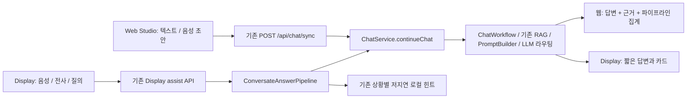

# 곁 RAG Studio

## 화면

- 웹 질의응답: `/assets/interview/studio.html`
- 기존 답변 → 120자 카드 → 수신 ACK 작업 화면: `/assets/interview/index.html`
- 안경용 음성·전사·질의 화면: `/assets/display/index.html`

기존 홈페이지에 RAG Studio 링크를 추가했다. 설치나 앱 계정 없이 브라우저에서 텍스트 질문을 보내고 근거, 라우팅, 측정 탭을 확인할 수 있다. 음성 입력은 지원 브라우저의 SpeechRecognition을 사용하며, 전사 결과를 편집한 뒤 직접 전송한다. 브라우저 제공자의 전사 서비스가 사용될 수 있다. Display의 기존 음성 캡처 경로는 변경하지 않았다.

## 공통 엔진과 전용 처리



일반 Display 질의와 웹 질의는 `ChatService.continueChat` / `ChatWorkflow`를 공유한다. Display는 휘발성 대화, 출력 길이 제한과 기존 검색 정책을 유지한다. 기존 `needsHint` 상황별 힌트의 로컬 생성 분기는 그대로 보존했다. 모든 입력이 동일한 검색 설정이나 provider를 사용한다는 의미는 아니다.

Studio는 `useWebSearch=true, useRag=false, searchMode=FORCE_LIGHT`를 명시적으로 전송한다. 검색 과정을 탐색하는 화면이므로 기존 경량 검색 모드를 사용한다. 일반 채팅의 `AUTO` 문장 휴리스틱은 일부 출처 요청 문장에서도 검색을 생략할 수 있다. 현재 `useRag`는 전역 벡터 풀 조회를 제어하며, 해당 풀이 공개 문서만 포함한다는 근거가 없으므로 웹 데모에서 활성화하지 않는다. 공개 웹 검색 문서는 기존 `PromptContext.ragEnabled(useWeb || useRag).web(...)`와 `PromptBuilder`를 거쳐 답변에 조합된다. provider 선택과 보호 조건은 기존 서버 정책이 결정한다. 요청한 검색과 실제 관측된 검색 결과는 구분한다.

## 변경 경계

| 파일 | 책임 |
|---|---|
| `main/resources/static/assets/display/display-core.js` | 기존 sync 전송·쿠키·세션·idempotency·취소. 선택적 response projector와 공개 웹 검색 옵션; Display 기본 요청과 투영 유지 |
| `main/resources/static/assets/interview/rag-inspector.js` | 기존 DTO의 공개 근거·점수 투영, nullable 지표, 제한된 수치 로그 |
| `main/resources/static/assets/interview/studio-voice.js` | 브라우저 음성 인식과 늦은 이벤트 차단 |
| `main/resources/static/assets/interview/studio.js` | 대화, 이전 답변 근거 선택, 단계 표시, 탭·입력·진단 UI |
| `main/resources/static/assets/interview/studio.html` / `studio.css` | 독립된 웹 화면과 모바일 레이아웃 |

서버 endpoint, DTO, PromptBuilder, 모델 provider, 속성명, 보안 정책은 변경하지 않았다. 원문 답변은 텍스트로 표시하고 내부 `rag-control-projection:v1` HTML 주석만 제외한다. 근거의 `filePath`, 원문 snippet, learningContext는 웹의 검사 패널과 로그로 옮기지 않는다.

## 지표 해석

| 화면 지표 | 실제 근거 | 해석 경계 |
|---|---|---|
| 문서·출처·순위·confidence | `evidence[]` | 원본 점수 및 confidenceSource. 확률이나 공통 척도로 해석하지 않음 |
| 웹·벡터·최종 컨텍스트 개수 | `pipelineSnapshot` | 서버가 반환한 최종 집계; 전체 검색 문서 원문은 아님 |
| 모델 / 검색 경로 / 계획 / 답변 모드 | 기존 DTO / snapshot | 문자열만으로 provider 호출 성공을 판정하지 않음 |
| 로컬/API 실행 경로 | 서버가 정확히 `local` 또는 `api`로 보고한 route | `hybrid` 등의 검색 경로나 모델명에서 추정하지 않음 |
| 브라우저 왕복 | 클라이언트 monotonic clock | 검색·LLM 단계 지연시간과 다름. 완료 미확인 시 미관측 |
| 인용 커버리지 / finalSigmoid | snapshot의 원본 0–1 수치 | 결측은 미관측; finalSigmoid는 정답 확률이 아님 |
| fallback | 완료 응답의 명시적 fallback 표시 | 최근 50개 요청의 대체 응답 수; 내부 재시도 횟수 아님 |
| 보류 | 서버의 정확한 v1 projection marker와 고정 안내, 또는 기존 evidence release gate의 두 고정 응답 | 응답 수신과 의미상 답변 제공을 구분; 일반 자연어에서 추측하지 않음 |

현재 sync 응답은 단계별 streaming 이벤트나 retrieval/LLM 시간, provider attempt 계보를 제공하지 않는다. 단계 완료를 타이머로 연출하지 않고 최종 응답 근거로 표시한다. 검색이 0건인 경우와 해당 정보가 없는 경우를 구분한다.

## 검증

```powershell
node --test scripts/rag_studio_contract_tests.cjs scripts/rag_studio_dom_tests.cjs scripts/interview_demo_contract_tests.cjs scripts/interview_demo_dom_tests.cjs scripts/interview_e2e_contract_tests.cjs scripts/display_receiver_rag_contract_tests.cjs
```

실제 DOM 스크립트를 실행하는 합성 HTTP 검사는 중복 요청, 503, 완료 미확인, 늦은 응답, 이전 답변 선택, 텍스트 삽입 공격, 점수 결측과 음성 이벤트 경합을 포함한다. 합성 검사는 provider나 실제 안경의 증거가 아니다.

## 실행·공개

Spring의 기존 `scripts/chat_ui_vibe_listener.ps1 -UiSurface rag-studio`를 사용한다. 이 옵션은 Studio HTML과 `studio.js`의 현재 소스/서빙 해시를 확인하며, 기존 프로세스 소유권·포트·빌드 검증은 유지한다. `chat-ui` 기본값과 `meta-display` 옵션도 그대로 동작한다. 다른 작업이 Display 파일을 수정할 때 새 웹 화면의 실행 검증이 그 파일에 의존하지 않는다. 익명 데모는 `demo.interview.enabled=true`를 유지하고, 기존 `local` 프로필의 개발용 DB 설정을 사용한다. 운영 DB에 스키마 자동 생성을 적용하지 않는다.

이 작업의 검증 런타임은 task 전용 메모리 H2 DB와 별도 Gradle 출력·캐시를 사용했다. 별도 운영 DB 데이터나 대화 영속성은 이 검증으로 입증되지 않는다. 기존 공개 고정 주소와 충돌하지 않도록 해당 자식 프로세스에서만 `demo.interview.fixed-public-origin`을 비우고 등록된 터널 origin 검증을 사용한다. 전역 환경, 원본 설정 파일, 다른 Display 서버는 변경하지 않는다.

공개 접속 전 실제 로그인/관리 경로의 404, 외부 Origin의 403, 현재 static asset 해시를 확인한다. Quick Tunnel 주소는 실행 중인 Desktop과 터널에 의존하는 임시 주소다. 장기 고정 URL은 기존 고정 도메인 배포의 별도 운영 수명과 연결 설정이 필요하다. 정적 Sites 환경에 Java/RAG를 복제하거나 다른 엔진으로 대체하지 않았다.

실제 실행 상태, 시험 결과 및 복구용 preimage/diff는 `data/agent-handoff/codex/report/rag-studio-20260915/`에 기록한다. 새로운 상주 watcher나 예약 작업은 생성하지 않는다.
