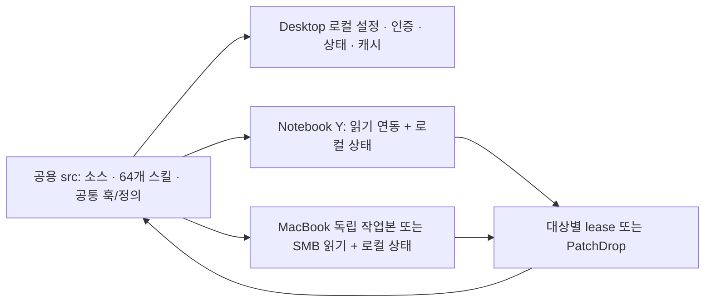

# 멀티기기 Codex 공용 정의 패치 — 구현 및 검증 기록

## 후속 완료 감사 및 최신 키트 (2026-09-13)

최신 설치 키트는 `__patch_drop__/producer-kit/multi-device-20260913-r3-producer-kit`이다.
아래 최초 구현 기록의 키트와 중간 r2 키트는 원본 그대로 보존했다. 실제 장비에는 r3를 사용한다.

- `demo1-mcp-control-tower/SKILL.md`의 이전 소스 cwd 안내를 호스트 로컬 상태 cwd + 명시적 source root로 수정했다.
- `demo1-grok-subscription-review/SKILL.md`의 설명을 `Use when considering...` 형식으로 정리했다. 식별자, 기존 검토 조건, Free SWE-2 우선순위와 blocked/provider 제한은 유지했다.
- 스킬 묶음 자체 테스트가 모든 발견 스킬을 160줄/1200단어 이하로 가정하던 문제를 수정했다. 기준은 그대로 두고 보고된 길이/단어 수, pressure, actionMode와 audit 필드의 일관성을 검증한다. 검증기 구현은 변경하지 않았다.
- 수정 후 자체 테스트 **253개 PASS**, 실제 묶음 검증 `ok=true`, `artifactCompletionStatus=artifact_ready`, required skills **7/7**, discovery/trigger quality issue **0**.
- 범용 `quick_validate.py`의 공용 64개 전체 검사: **59개 형식 통과**, **5개 기존 이름 형식 경고**. `archive.restore`, `archive.search`, `build_error_miner`, `run_pipeline`, `verify_boot`는 기존 호출 식별자이므로 보존했다. 이 경고를 이름/해시 충돌이나 신규 오류로 바꾸어 보고하지 않는다. 수정한 두 스킬은 각각 quick validation을 통과했다.
- 공용 64개/개인 12개 이름·해시 충돌은 0. 개인 config 바이트는 그대로 유지했고 로컬 registry만 갱신한 뒤 setup dry-run 변경은 다시 0.
- r3 payload **244개 해시 일치**, 공용 스킬 **64개**, secret-pattern hits **0**. manifest SHA-256: `fc813c918c40b258cb2ff0a2665c7c2b46167794c1eadb4e9c516d1d61096a19`.
- 최초 277개 구현 검사의 대상 코드는 이번 후속 작업에서 바뀌지 않았다. 새로운 자체 테스트 결과는 이 277개 결과와 별도로 기록한다.

후속 증거는 기존 로컬 run 디렉터리의 `continuation-family-green.json`,
`continuation-validator-self-test-r3.json`, `continuation-skill-tests-r3.log`,
`continuation-kit-export-r3.json`, `final-audit-r3.json`, `task-r3.diff`에 있다.
`baseline-paths-r3.json`은 최초 백업과 이번 세 파일의 정확한 추가 백업을 함께 가리킨다.
로컬 self-test 상태 경로를 명시한 검증으로 통과했으며, 공유 경로에 있던 오래된 self-test 기록을 덮어쓰지 않았다.

현재 연결 목록에는 Desktop만 있고, 확인한 기존 도구는 Notebook/MacBook 원격 실행 대신 장비에서 실행할 명령을 생성한다.
실제 Notebook/MacBook의 setup/status/stdio 증거는 여전히 `not_observed`다.
기존 SSH 별칭/저장소 경로 또는 Codex Connections 연결 정보가 필요하며 이를 사용자에게 요청했다.
물리 장비 검증은 `holdScope=physical-device-verification`, `repositoryWideHold=false`; 전체 goal은 active다.


2026-09-13. 설계 승인 후 구현을 완료하고 현재 Windows Desktop에서 검증했다.
`localImplementation=verified`, `physicalNotebookProof=not_observed`, `physicalMacbookProof=not_observed`.
설계 승인 대기는 해소됐다. 전체 목표는 실제 Notebook/MacBook 확인이 남아 `active`로 유지한다.

## 적용 결과

공용 정의는 `src/.agents/skills`, `.codex/shared-runtime.json`, `.codex/hooks.json`에서 관리한다.
각 장비의 설정, 인증, 세션, 설치 receipt, 런타임 상태와 캐시는 장비 로컬에 둔다.
현재 Desktop의 개인 설정을 실제로 병합했으며 기존 MCP 서버 8개와 기존 설정값을 보존했다.
개인 설정에 `awx-shared`와 기존 GLM 정의를 등록한 다음 프로젝트의 Windows 절대 경로를 제거했다.
인증 파일과 개인 스킬 파일은 수정하지 않았다. 적용 후 dry-run은 `outputCount=0`이다.



| 가드레일 | 구현한 동작 |
| --- | --- |
| No-Overwrite | JSON/TOML을 파싱해 키 단위 병합. 기존 스칼라/배열의 경쟁 변경은 충돌로 중단. 강제 복사 설치 루프 제거. |
| 자동 백업 | 변경 전 정확한 바이트를 로컬 `.bak_<UTC timestamp>`에 보존. 새 파일은 원래 부재했다는 기록. |
| 수정분 보존 갱신 | 설치 receipt의 이전 해시와 현재 파일을 비교. JSON은 기준/현재/새 정의의 3-way 병합, TOML은 기존 주석/키를 유지할 수 있는 추가만 허용. |
| OS 분기 | Windows `commandWindows`/PowerShell, POSIX `sh`가 같은 Python 훅 분류기를 호출. Python 3.11 이상 필요. |
| 런타임 격리 | 관리 진입점에서 로컬 cwd, Gradle user/project cache, host-id별 빌드 결과, 로컬 runtime evidence 경로를 설정. |
| 개인 스킬 우선 | 정규화한 이름과 SHA-256으로 충돌 검사. 개인 후보가 하나면 해당 공용 스킬 경로만 개인 설정에서 비활성화. 모호한 중복은 자동 선택하지 않음. |
| 원자적 적용 | 전체 입력 검증 → preimage/협력 잠금 → 백업 → stage → 파일별 원자적 rename → journal. 실패 시 자신의 postimage만 되돌림. |

TOML은 기존 레이아웃을 안전하게 확장할 수 없는 경우 `toml-layout-requires-explicit-merge`로 보존한다.
갱신 과정에서 삭제된 자산을 발견하면 `removed-assets-require-reconciliation`로 중단하며 자동 삭제하지 않는다.
롤백 중 다른 작성자의 수정이 보이면 보존하고 `recovery-required`를 기록한다.
미완료 journal이나 알 수 없는 잠금은 자동 삭제하지 않는다.

## 변경 파일과 범위

작업 시작 시의 파일별 백업을 기준으로 한 diff다. 저장소에는 사전 변경분이 다수 있어 HEAD와의 전체 diff를 이 작업의 변경으로 세지 않는다.
선언한 24개 파일 중 기존 `scripts/test_awx_mcp_node_setup.py`는 변경하지 않았다.

| 파일 | 주요 변경 |
| --- | --- |
| `scripts/awx_shared_state.py` | 파싱, 키 병합, 3-way 병합, 백업/journal/롤백 공통 처리 |
| `scripts/awx_host_runtime.py` | OS/호스트 감지, 로컬 상태 및 런타임 실행 경로 |
| `scripts/awx_skill_registry.py` | 공용/개인 스킬 이름·해시 충돌 검사와 개인 우선 설정 |
| `scripts/awx_mcp_safe_install.py` | manifest/경로/해시 검증, 수정분 보존 설치와 receipt |
| `scripts/awx_mcp_node_setup.py` | 호스트 로컬 설정 생성 및 개인 TOML 안전 병합 |
| `scripts/awx_mcp_toolbox.py` | 검증된 불변 키트 생성, 설치기 통합, 로컬 runtime 상태/캐시 연결 |
| `scripts/awx_mcp_stdio_server.py` | 로컬 cwd에서도 원래 소스 루트 유지, shared-read 변경 도구 차단 |
| `.codex/config.toml`, `.codex/shared-runtime.json` | 장비별 경로와 공통 정의 분리 |
| `.codex/hooks.json`, `.codex/hooks/source_edit_triage.{py,ps1,sh}` | 크로스플랫폼 훅 연결과 공통 의미 분류 |
| `scripts/test_awx_multi_device.py` | 병합·충돌·롤백·OS 분기·실제 stdio/설치기 회귀 검사 |
| `scripts/awx_mcp_toolbox_tests.ps1` | 실제 Windows producer 설치기 검증 |
| `scripts/demo1_source_edit_three_way_preflight_contract_tests.ps1` | Python 공통 분류기를 포함한 hook fixture |
| `main/java/com/example/lms/service/diagnostic/RuntimeDiagnosticsService.java` | 기존 Environment에서 runtime evidence 경로 읽기, 기존 기본값 유지: 3줄 추가/1줄 제거 |
| `src/test/java/com/example/lms/service/diagnostic/RuntimeToolkitProjectionTest.java` | 설정된 로컬 evidence의 invalid/missing 판별 회귀 검사 |
| `.agents/skills/demo1-mcp-control-tower/references/node-playbook.md` | 장비별 실제 명령, 충돌/복구/권한 경계 문서 |
| `docs/superpowers/specs/2026-09-13-multi-device-codex-design.md` | 승인한 설계 |
| `docs/superpowers/plans/2026-09-13-multi-device-codex.md` | 구현 체크리스트와 남은 물리 장비 검증 |
| `docs/reports/2026-09-13-multi-device-codex-evidence.md` | 이전 승인 대기를 역사적 상태로 표시하고 현재 보고서 연결 |
| 이 보고서 | 실제 검증, 백업, 설치 키트, 한계와 다음 확인 |

애플리케이션 변경은 위 Java 진단 경로 한 곳이다. Java 17, 기존 LangChain4j 1.0.1과 sourceSet을 확인했다.
해당 변경은 기존 POSITIVE/NEGATIVE/NEUTRAL 사전 검토의 양쪽 순서에서 안정된 APPLY 후 scoped lease/preimage 절차로 적용했다.
작업 소유 lease는 정상 해제했다. 기존 Git index lock과 다른 변경분은 보존했으며 commit/push/deploy를 수행하지 않았다.

## 실제 검증

| 검사 | 결과 | 증거 파일 |
| --- | --- | --- |
| Python 통합 및 회귀 | 66 tests PASS, 49.619초 | `python-tests.log` |
| PowerShell 훅 계약 | 154 PASS, 0 FAIL | `hook-tests.log` |
| Windows ProducerKit 계약 | 32 PASS, 0 FAIL | `installer-tests.log` |
| Java 진단 테스트 | 25 tests PASS, BUILD SUCCESSFUL | `java-green.log` |
| Java 의미 RED | 새 로컬 경로 테스트가 패치 전 실패, 컴파일 성공 | `java-red.log` |
| 실제 공유 TOML/JSON 및 변경 Python 파싱 | PASS | `final-audit.json` |
| 현재 공용/개인 스킬 | 64 / 12, 실제 이름·내용 충돌 0 | `final-audit.json` |
| 가상 동일 이름·동일 해시 및 다른 해시 충돌 | 개인 보존/우선 정책 PASS | Python 결과 및 `final-audit.json` |
| 현재 개인 설정 재생성 | 기존 값 보존, dry-run 변경 0 | `config-migration.json`, `final-audit.json` |
| 배포 키트 검증 | 244 payload 파일 SHA 일치, 64 스킬, secret-pattern hits 0 | `kit-export.json`, 키트 manifest |

총 277개의 자동 검사 항목이 통과했다. 전체 저장소 테스트나 물리 장비 인증을 뜻하지 않는다.
POSIX 훅·설치기는 Windows Git Bash에서 실제 실행했고 OS 분기는 fixture로 검사했다.
설치된 stdio 서버의 initialize/tools-list, shared-read 변경 거절, 공백 경로도 포함했다.
중간에 발견된 PowerShell 5 입력 인코딩 차이와 새 Python 분류기가 빠진 hook fixture는 수정한 뒤 위 계약 전체를 재실행했다.
기존 파일의 혼합 줄바꿈은 변경하지 않은 줄을 원래 바이트대로 복원한 뒤 Python/설치기 검사를 다시 통과했다.
문서 명령과 세 CLI의 인자·권한 경계는 별도 읽기 전용 확인에서 불일치가 없었다.

```powershell
$env:PYTHONPATH=(Join-Path (Get-Location) 'scripts')
$env:AWX_TEST_POSIX_SHELL='F:/git/bin/bash.exe' # 이 Desktop의 검사 실행기
python -B -m unittest scripts.test_awx_multi_device scripts.test_awx_mcp_node_setup scripts.test_awx_mcp_stdio_catalog scripts.test_awx_mcp_stdio_protocol -q
powershell -NoProfile -ExecutionPolicy Bypass -File scripts/demo1_source_edit_three_way_preflight_contract_tests.ps1
powershell -NoProfile -ExecutionPolicy Bypass -File scripts/awx_mcp_toolbox_tests.ps1 -Suite ProducerKit
```

Java 검사는 `AWX_SPLIT_BUILD_OUTPUTS=1`, `AWX_BUILD_HOST_ID=desktop-multidevice-01a09987`, 로컬 `GRADLE_USER_HOME`을 사용했다.
`gradlew.bat :test --tests com.example.lms.service.diagnostic.RuntimeToolkitProjectionTest --tests com.example.lms.service.diagnostic.RuntimeDiagnosticsServiceTest --offline --no-daemon --project-cache-dir <local-run>/gradle-project`가 성공했다.

## 증거와 복구 위치

- 로컬 실행 기록: `C:\Users\nninn\AppData\Local\AWX\multi-device\run-20260913T071709335479Z`
- 작업 전 원본: 위 경로의 `backups` 및 추가 대상의 첫 `wave-*`; `baseline-paths.json`이 정확한 파일별 백업을 지정한다.
- 최종 task-only diff와 해시/검사 요약: `task.diff`, `final-audit.json`.
- 현재 장비 상태: `C:\Users\nninn\AppData\Local\AWX\workspaces\c168e13aa6fca963\desktop-9b775e68c68d`
- 개인/프로젝트 설정 이동 journal: 위 상태 경로의 `migration/transactions/20260913T075329530663Z-29f42788/journal.json`.
- GLM 로컬 JAR: 위 상태 경로의 `artifacts/glm-agent-mcp.jar`; 기존 JAR은 보존했다. SHA-256 `4c3ca6a657103f195e7174da6c25bf96248fb14403d7d617f960c4ab19436ca9`.

복구할 때는 journal의 대상·before/after 해시를 현재 파일과 먼저 비교한다. 현재 바이트가 해당 postimage일 때만 정확한 백업을 되돌린다.
새 파일이었거나 이후 다른 작성자의 변경이 있으면 자동 전체 복원을 하지 않는다. 현재 인증 파일은 복구 대상이 아니다.
이 기록의 로컬 절대 경로는 Desktop의 증거 위치이며 다른 장비에 복사할 런타임 설정값이 아니다.

## 재사용 설치 키트

`C:\AbandonWare\demo-1\demo-1\src\__patch_drop__\producer-kit\multi-device-20260913-producer-kit`

- 244 payload 파일 + manifest 1개. 공용 스킬 64개와 필요한 참조/실행 파일 포함; 개발용 skill `tests`, 캐시, 개인 스킬과 인증은 제외.
- manifest SHA-256: `16cbba86d76e9ac0eb6e046884d246de44ba115049530495fc6659700b4d7167`.
- tool catalog SHA-256: `4f1b0682e971fec91d61ac86a72ee9dd3a227976b406ace0feb84c0d9d755da7`.
- 기준 HEAD: `0796a3c5b29bbb08c3314bd40649d856d4a7bce6`; 현재 수정 파일의 실제 bytes는 개별 manifest SHA가 고정한다.
- `INSTALL.notebook.ps1`, `INSTALL.macmini.sh`는 같은 Python safe installer를 호출한다. 이름에 macmini가 남은 셸 설치기는 기존 호환 명칭이다.
- 설치 대상은 장비의 독립 Git 작업본이다. Desktop 공용 원본이나 SMB 원본에 producer installer를 실행하지 않는다.
- 같은 export 경로의 내용이 다르면 보존/충돌 처리한다. 이후 수정은 별도 이름의 새 키트로 내보낸다.

## 장비별 적용과 남은 증거

Desktop의 개인 설정 병합은 이미 끝났다. Codex가 새 설정과 훅을 읽도록 앱을 다시 시작해야 한다.
Notebook에서 공용 루트를 읽기 연동할 때:

```powershell
Set-Location -LiteralPath 'Y:\'
python -B scripts/awx_mcp_node_setup.py --register-codex --shared-read --dry-run
python -B scripts/awx_mcp_node_setup.py --register-codex --shared-read
python -B scripts/awx_host_runtime.py status
```

MacBook 독립 작업본의 저장소 루트에서:

```sh
python3 -B scripts/awx_mcp_node_setup.py --register-codex --dry-run
python3 -B scripts/awx_mcp_node_setup.py --register-codex
python3 -B scripts/awx_host_runtime.py status
```

Mac SMB 마운트에서 읽기 연동할 때는 setup에 `--shared-read`를 추가한다. 실제 장비에서 나온 setup/status와 stdio initialize/tools-list를 수집해야 한다.
Windows Y-drive는 기존 backing identity 검증을 통과해야 하며 Mac 마운트의 identity는 이 Desktop에서 증명하지 않았다.
공용 소스 직접 수정에는 기존 대상별 lease/Notebook guarded-direct 또는 Mac 독립 작업본/PatchDrop 절차가 계속 적용된다.

`holdScope=physical-device-verification`, `firstBlockingRule=connected-target-host-evidence-missing`,
`blockingEvidence=current host inventory exposes only the local Desktop`,
`independentWorkCompleted=local implementation and focused verification`, `repositoryWideHold=false`.
이 항목은 전체 목표의 남은 증거이며 설계 재승인 요청이 아니다.

원자적 rename은 파일별 보장이다. 여러 파일을 모든 SMB 클라이언트에서 동시에 보이게 하는 분산 트랜잭션이나
임의 편집기의 잠금 무시를 해결하지 않는다. 강제 종료/연결 단절 뒤 미완료 journal은 확인 후 복구해야 한다.
격리는 관리 진입점에 적용된다. 이미 실행 중인 JVM이나 기존 개별 명령은 새 환경을 자동으로 받지 않는다.

## 검토 및 공식 설정 근거

공개 합성 병합 시나리오에 Free SWE-2 검토 1회를 사용했고 stale preimage/롤백 경쟁/배열/reparse/journal 관련 지적을 직접 검사했다.
기존 source-edit 사전 검토를 다른 심사로 대체하지 않았다. GLM은 기존 transport HOLD를 유지해 호출하지 않았고 같은 결함을 다른 유료 provider로 재시도하지 않았다.

개인 우선 구현은 [OpenAI 스킬의 경로별 비활성화](https://learn.chatgpt.com/docs/build-skills)를 사용한다.
[프로젝트/사용자 설정 우선순위](https://learn.chatgpt.com/docs/config-file/config-basic) 때문에 프로젝트의 같은 MCP 이름이 충돌하면 setup이 중단한다.
[공식 훅 문서](https://learn.chatgpt.com/docs/hooks)의 `commandWindows` 분기로 Windows와 POSIX 실행을 연결했다.
