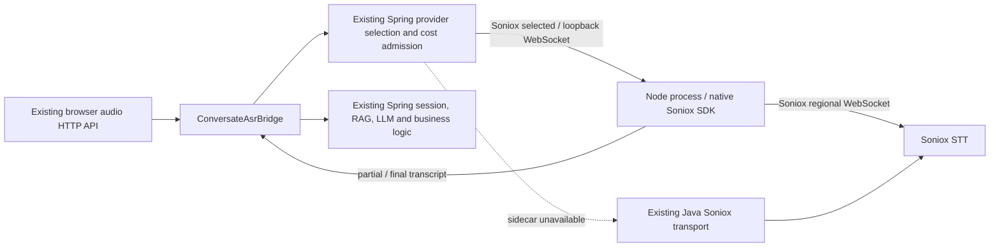

# Soniox Node.js sidecar

Spring Boot owns the speech subprocess through `SonioxSidecarManager` (`SmartLifecycle`). Starting Spring with Conversate enabled and the explicit `soniox` ASR provider starts Node automatically. Closing the Spring context stops its Node child. Node also exits when the parent stdin pipe closes, including abrupt JVM termination.



The browser routes, conversation ownership, cost checks and RAG entry point stay in Spring. HTTP is used for local health checks; the persistent Spring–Node WebSocket carries PCM and transcript events. Node binds only `127.0.0.1` on an automatically allocated port. Spring generates an ephemeral bearer for each child; browser-origin requests are rejected. Provider credentials are passed only to the child environment and are absent from command arguments, health output and logs.

## Start and configuration

Prerequisites: Java 17 and Node.js 22 or newer with npm on PATH. Node 24 is verified. Use the normal Spring command (`gradlew.bat bootRun` or `java -jar …`); no separate Node launch command is required.

The existing provider settings and admission remain authoritative:

| Setting | Meaning |
| --- | --- |
| `conversate.enabled=true` | Enables the existing Conversate feature and sidecar lifecycle |
| `conversate.asr.enabled=true` | Enables the existing audio capture bridge |
| `conversate.asr.provider=soniox` | Explicit sidecar opt-in; `auto` retains the existing Java provider routing without starting Node |
| `soniox.stt.enabled=true` / `SONIOX_STT_ENABLED=true` | Existing explicit Soniox opt-in |
| `soniox.api-key` / `SONIOX_API_KEY` | Existing server-side credential source |
| `soniox.stt.model` / `SONIOX_STT_MODEL` | `stt-rt-v5` (default) or `stt-rt-v4` |
| `soniox.stt.region` / `SONIOX_STT_REGION` | `us` (default), `eu`, `jp` or `in`; passed explicitly to the SDK |
| `conversate.asr.cloud.enabled=true` | Existing cloud cost admission |
| `conversate.asr.cloud.ledger` | Existing absolute ledger path with an existing parent directory |

The existing cloud verification/operation mode, account checks, circuit state, provider selection and spending caps apply to both Node and Java sessions. `ConversateCloudStt` admits and reserves each connection before calling `connectAdmittedStream`; the sidecar does not make a second reservation. Each provider connection reserves its full maximum duration before opening; a fallback connection makes a separate conservative reservation. Unknown charges are never refunded. A local health check never opens a provider stream or reserves provider spending. This patch does not change stored keys, persisted environment variables or the ledger.

Optional sidecar properties, all under `conversate.asr.sidecar`:

| Property | Default | Behavior |
| --- | --- | --- |
| `enabled` | `true` | `false` selects the existing Java path and starts no Node child |
| `node` | `node` | Node executable path |
| `runtime-directory` | `var/codex-runtime/soniox-sidecar` | Extracted resources and dependency cache |
| `bootstrap` | `true` | Installs pinned dependencies automatically when absent |
| `bootstrap-timeout-ms` | `90000` | Dependency installation deadline, bounded to 1–120 seconds |
| `startup-timeout-ms` | `10000` | Node readiness announcement deadline, bounded to 1–30 seconds |
| `health-interval-ms` | `2000` | Health interval, bounded to 100 ms–30 seconds |
| `health-timeout-ms` | `1000` | Full HTTP response deadline, bounded to 100 ms–5 seconds |
| `restart-delay-ms` | `2000` | Failed start delay, bounded to 100 ms–60 seconds |

The JAR contains `server.mjs`, `session.mjs`, `package.json` and the lockfile. Spring extracts these into a content-addressed directory and runs `npm ci --ignore-scripts --no-audit --no-fund --omit=dev` once using the public npm registry. The first installation requires registry access. Later starts reuse that bundle. Installation and startup happen asynchronously; if they fail or are still in progress, audio uses the existing configured Java factory. No provider call is made merely to test readiness.

## Failure behavior and bounds

- Three failed health checks retire the owned child. The supervisor permits at most three starts in a rolling minute, then waits for that window to expire.
- A capture uses Node only when the local process, explicit Soniox settings and existing cloud budget are configured. Missing or placeholder keys, invalid model/region, disabled cloud admission and exhausted budgets fail soft through the existing admission path.
- A failed local Node connection switches once to the existing Java Soniox factory, under the same Spring cloud admission owner with a new reservation for the new connection. Soniox authentication, funds, rate, format/model and provider errors do not retry the same account through Java. SDK errors retain only categorical reasons; raw messages never leave the adapter. Late callbacks from the retired stream are ignored.
- PCM already submitted before a failure has an uncertain outcome and is not replayed. Its local ACK is marked `sidecar_delivery_uncertain` so the HTTP caller does not wait for a dead process. A short transcription gap is possible around the failure. The next chunks go to Java; at most two chunks can wait for the fallback to become ready. Overflow or a 30-second fallback startup timeout ends the capture.
- Other ACK scopes distinguish local SDK acceptance (`node_sdk_accepted`) and buffering during transition (`legacy_transition_buffered`). None proves Soniox receipt or recognition.
- Audio stays PCM16, 16 kHz, mono, with Korean and English language hints. Each frame is bounded to 7,680 bytes in 640-byte increments. Provider processing backlog is capped at five seconds; each stream has a ten-minute maximum. Text is bounded to 2,048 characters per utterance.
- Token finality and utterance finality are separate: endpoint detection closes an utterance, avoiding duplicate final transcript delivery. The existing Java session decides how final speech enters RAG/LLM processing.
- Shutdown closes streams and only the child processes created by this manager. Node consumes the Spring-owned stdin pipe as its lifetime signal.
- Normal completion sends the SDK `finish()` signal, accepts final tokens during a bounded drain, and requires the provider `finished` event before reporting confirmed completion. The Node drain is at most three seconds, its Java adapter four seconds, and the bridge waits at most 4.5 seconds. Cancel closes immediately. A WebSocket close code of 1000 alone is not completion evidence. Finishing during an unavailable fallback returns `finish_unconfirmed` and releases resources.
- Existing token timestamps, speaker numbers and confidence are retained when supplied. Partial text replaces the previous partial, and utterance finalization clears committed tokens so repeated endpoint events cannot duplicate the final.

Sidecar diagnostics are included in the existing audio diagnostics: state, reason, local readiness, configured status and start count. `providerAttempt=not_observed` on lifecycle diagnostics is deliberate: a healthy local process does not prove a successful live Soniox request.

Capture runtime diagnostics include an ephemeral `diagnosticRunId`, actual `node_sdk` or `java_ws` transport, processed audio milliseconds, first partial latency, final-after-stop latency, shutdown duration and `finished`/`finish_unconfirmed`. First-partial, final-after-stop, shutdown and fallback-gap timing use server `System.nanoTime()` intervals. `captionRenderAckMs` instead measures from the server's caption timestamp to the same server receiving the browser render acknowledgement; it includes polling/network delay and is not lens display latency. Browser observation round trips use their own clock and must not be subtracted from server timestamps. The diagnostic ID is not persisted or used as an application session identifier.

## Existing Deepgram path

The same Display/Fold6 controls also use the existing server-side Deepgram transport when the existing `conversate.asr.provider=deepgram` configuration is selected. It reports `provider=deepgram`, `transport=java_ws`; it does not start a second Node sidecar. The existing server key loader, admission, ledger, rates and provider priority still apply. Selecting Deepgram does not grant another budget or bypass an exhausted Soniox/shared allowance.

The optional “마지막 전사 받고 중지” action stops new PCM, completes the owned audio publisher, and waits up to three seconds for the existing service's `CloseStream` drain. Confirmed segments may become the last caption even without `speech_final`; unconfirmed interim text is never promoted. Completion requires terminal `Metadata` after the close request plus a normal WebSocket close. Immediate stop cancels without waiting. Errors, timeout or missing terminal metadata remain `finish_unconfirmed`; no automatic account retry or PCM replay is introduced. These are termination checks, not proof of transcription meaning or microphone/hardware access. See the [official Deepgram CloseStream contract](https://developers.deepgram.com/docs/close-stream).

## Verification

`src/test/node/soniox-sidecar.test.mjs` tests incremental transcription, endpoint finality, PCM/sequence validation, timeouts and processing backpressure with an SDK fixture.

`SonioxSidecarTest` runs a real Node child from a Spring context, checks authenticated health, kills the exact owned process to observe restart, and verifies shutdown and a hanging health-response deadline. `SonioxNodeTransportTest` connects the actual Java WebSocket adapter to the Node service and the actual `@soniox/node` SDK using a synthetic loopback upstream. It checks PCM, ACK, final transcript, capacity release and parent-pipe shutdown. These tests do not require a Soniox account or send audio to an external provider.

`FailoverAsrTransportTest` covers startup/live failure, late events, cancellation, readiness buffering, lost ACKs and synchronous send failure. `SonioxSidecarBindingTest` covers selection and admission boundaries. Existing Conversate bridge/cloud/provider regression tests cover compatibility.

Run the default verification without a provider call from the Desktop root:

```powershell
pwsh -NoProfile -File scripts/verify_soniox_sidecar.ps1 -Mode Local
```

For the Deepgram transport, actual loopback WebSocket and hint-failure regressions, run this additional local-only command with task-specific outputs/cache:

```powershell
$env:AWX_SPLIT_BUILD_OUTPUTS='1'
$env:AWX_BUILD_HOST_ID='display-asr-local'
$env:GRADLE_USER_HOME=Join-Path $env:USERPROFILE '.gradle-awx-desktop'
./gradlew.bat --no-daemon --console=plain --project-cache-dir .gradle-display-asr-local test --tests 'com.example.lms.assist.*Deepgram*' --tests 'com.example.lms.service.stt.Deepgram*Test' --tests 'com.example.lms.assist.ConversateCaptionTest'
```

These fixtures make no external transcription request. The existing verifier's `-Mode File` remains specifically bound to Soniox; it is not a Deepgram live-provider verifier.

`-Mode File` is explicitly opt-in. It requires an owned loopback Spring runtime, the existing approved budget and the public bilingual PCM fixture plus its manifest. It performs one capture start without client retry, bounds connection time to 60 seconds, stores only counts/hashes/categorical evidence, and requires both Korean and English meaning, actual Node transport and confirmed drain. The output directory has a one-attempt marker to prevent replay. Local fixture tests, a real provider file request, a real microphone and real glasses are separate report fields; an absent microphone or glasses test stays `not_performed`.

The Fold6 browser supplies raw microphone PCM through the existing worklet and audio endpoints. Meta Display is an output surface. Browser microphone permission, captured PCM, Spring ACK, provider response and caption rendering are distinct evidence; do not infer one from another or equate Meta text entry with raw microphone access.

Official references: [Node SDK](https://soniox.com/docs/sdk/node-SDK), [realtime transcription](https://soniox.com/docs/sdk/node-SDK/stt/realtime-transcription), [SDK source](https://github.com/soniox/soniox-js).
