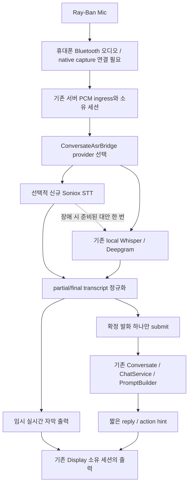

# Ray-Ban Display 대화 보조: 신규 API 선정 및 연결 설계

확인일: 2026-09-15 KST. 범위: 현재 소스·설정 감사, 공식 API 조사, 연결·장애 우회·관측 설계. 이번 사이클은 보고서만 작성했으며 애플리케이션, 키, 환경변수, 공개 배포를 변경하지 않았다.

**새 Key를 하나만 고르면 Soniox Speech-to-Text API를 선택한다. Deepgram은 이미 키가 설정되고 WebSocket STT가 구현되어 있으므로 신규 발급에서 제외한다.** Soniox의 가치는 독립적인 STT 실패 우회와 한국어 혼용·발화 종료 판단의 비교 검증이다. 현재 환경에서 Deepgram보다 정확하거나 빠르다는 실측 결론은 아니다. 새 API 없이도 기존 로컬 Whisper/Deepgram을 이용한 구현을 진행할 수 있다.

## 감사 범위와 제외 기준

- 확인한 root: `C:/AbandonWare/demo-1/demo-1/src`; branch: `codex/owned-runtime-browser-restart`; HEAD: `0796a3c5b29bbb08c3314bd40649d856d4a7bce6`.
- 활성 Gradle 선언: root `main/java`, `main/resources`; app `app/src/main/java_clean`, `app/src/main/resources`. 음성, STT, Conversate, 공유 RAG, 출력과 관련 테스트를 추적했다. 저장소의 모든 줄을 읽었다는 의미는 아니다.
- `.env`, `shared.env`, `apikey.txt`, `.env.shared/zai.env`, 관련 설정의 키 참조, 현재 프로세스와 Windows User/Machine의 관련 이름만 확인했다. 키 원문·마스킹된 일부·키 해시를 기록하지 않았다.
- **설정됨 / 신규 발급 제외:** Deepgram, OpenAI, Gemini, Google Translate, Groq, ZAI, Brave, Naver, Kakao, SerpApi, Tavily, Pinecone, Upstash. 도구용 Vercel AI Gateway, Devin, OpenCode도 설정됨으로 확인되어 신규 모델 후보에서 제외했다.
- Deepgram은 `.env`와 `shared.env`에 설정됨, 이번 Codex 프로세스에서는 미설정이다. 파일의 값이 현재 실행 중인 Spring 자식에 주입되었거나 유효하게 인증된다는 뜻은 아니다. 두 env 파일은 HardLink로 관측되었다.
- 아래 10개는 확인한 후보별 환경변수에서 **미설정**, 추적한 활성 코드에 공급자 연결 **미구현**이다. 외부 계정 전체의 미발급 여부를 증명하지는 않는다. `.secrets`는 기존 `SecretStore.load` 보안 검사에서 접근 증거가 충족되지 않아 내부 값은 읽지 않았다. 공급자 계정 조회나 인증 요청은 보내지 않았다.
- `apikey.txt`의 19개 줄은 인식 가능한 기존 공급자 이름과 설정 항목만 분류했다. 애플리케이션 설정의 `${...}` 참조를 실키로 오인하지 않도록 YAML 재검증을 수행했다.

## 1. 후보 10개

비용은 공식 페이지의 공개 조건이며 세금·계약·추가 기능 비용은 별도다. 지연시간은 공급자 표기 또는 제어 가능한 특성이고, 한국 네트워크·Ray-Ban에서 측정한 수치가 아니다. 기능 중복이 있는 STT는 독립 장애 도메인 또는 명확한 언어 기능을 얻는 경우에만 도입 가치가 있다.

| 후보 | 해결할 수 있는 구간 / 한국어 | 실시간·지연 / 연동 | 무료·비용·운영 조건 | 현재 소스와 중복 및 판단 |
|---|---|---|---|---|
| **Soniox STT** | 한국어 `ko`, 한 대화 내 언어 혼용, 화자 라벨, 발화 종료 판단 | `stt-rt-v5`, WSS, partial/final 토큰과 semantic endpoint. 서버 raw PCM 연동; 브라우저는 임시 키 방식 제공. 한국 실측 지연 미확인 | 토큰 과금, 일반 실시간 전사 약 **$0.12/h** 기준. 상시 무료 분량은 이번 공식 근거로 확정하지 않음. US/EU/JP 리전 | Deepgram과 STT 역할은 겹침. 현재 없는 독립 공급자 우회와 한국어 혼용 비교가 가능하므로 **1위**. [지원 언어](https://soniox.com/docs/stt/concepts/supported-languages), [현재 모델](https://soniox.com/docs/stt/models), [가격](https://soniox.com/pricing) |
| **Ably Pub/Sub** | transcript/hint의 안경 전달·재접속. 한국어 UTF-8 텍스트 전달이며 음성 인식 기능 아님 | WS/SSE, JS/서버 SDK. 기존 1초 폴링의 다음 조회까지 기다리는 구간을 줄일 수 있음. 전체 서비스 지연 보장 아님 | Free 월 **600만 messages**, 200 connections, 200 channels. Free는 best-effort SLO. 연결 상태 복구는 통상 2분 범위 | 기존 출력 로직은 유지하고 전달망만 보완. public relay와 실제 Display 호환성 검증 필요. **2위**. [무료 조건](https://ably.com/docs/platform/pricing/free), [연결 복구](https://ably.com/docs/connect/states) |
| **LiveKit Cloud** | 안경의 오디오를 받은 휴대폰에서 서버로 보내는 미디어 구간. 오디오는 언어 독립적 | WebRTC와 Android/iOS/웹 SDK; text streams도 제공. STT는 기존 공급자를 그대로 사용할 수 있음 | Build 무료 **5,000 participant-min/month, 50GB**. 참가자별 합산이며 STT/LLM 무료 시간을 뜻하지 않음. 한도 초과 시 신규 요청 실패 | 현재 HTTP PCM 업로드를 보완할 선택지. 미디어 연결 구조 변경이 크고 Display의 WebRTC 지원을 가정할 수 없음. **3위**. [전송·한도](https://docs.livekit.io/deploy/admin/quotas-and-limits/), [텍스트 스트림](https://docs.livekit.io/transport/data/text-streams/) |
| ElevenLabs Scribe v2 Realtime | 한국어 포함 다국어 실시간 자막 | WSS, partial/committed transcript, VAD. 광고 지연 약 150ms를 한국 E2E 지연으로 해석하면 안 됨 | 공개 API 가격 시작 **$0.39/h**; 요금제·무료 할당량은 계정 확인 필요 | STT 대안이지만 기존 Deepgram에 더해 도입할 때 Soniox보다 우선할 현장 증거가 없음. [기능](https://elevenlabs.io/docs/overview/capabilities/speech-to-text), [API 가격](https://elevenlabs.io/pricing/api) |
| Speechmatics Realtime | 한국어, 대화 전사·화자 분리 | WSS/SDK. 공급자는 1초 미만 realtime 지연을 표기하나 한국어 조건 실측 없음 | 실시간 Standard **$0.24/h**, Enhanced **$0.43/h**, 신규 **$100 credit**, 무료 동시 2 sessions. $0.129/h 배치 가격과 구분 | 정확도 비교 후보. realtime·언어·플랜을 고정해 평가해야 함. [지원 범위](https://www.speechmatics.com/use-cases/contact-center-solutions), [문서](https://docs.speechmatics.com/), [가격](https://www.speechmatics.com/pricing) |
| AssemblyAI Whisper Streaming | `whisper-rt`의 한국어 `ko`, 99+ 언어 | WSS `/v3/ws`, 자동 언어 감지; 이 모델에는 `language` 파라미터를 넣지 않음 | 공식 모델 문서 **$0.30/h**, WebSocket이 열린 전체 세션 시간 과금. 기본 Universal의 가격·언어·지연을 이 모델에 대입하지 않음 | 이미 로컬 Whisper가 있으므로 다른 ASR 계열보다 중복이 큼. [한국어 streaming 모델](https://www.assemblyai.com/docs/universal-streaming/multilingual-transcription), [모델별 가격](https://www.assemblyai.com/docs/faq/how-can-i-use-universal-1) |
| Gladia Live | 한국어 `ko`, 혼용 언어·자막/번역 | REST로 live 세션 생성 후 WSS, endpointing 조절 가능 | Starter **$0.75/h**, 가격 페이지 **€50 credit**. 별도 limits 문서의 10h/month free와 상충하므로 실제 가입 조건 확인 필요. 유료 live 동시 30, 단일 세션 3h | 기존 STT·번역과 중복. 이번 목표에 필수인 추가 가치 대비 비용 높음. [언어](https://docs.gladia.io/chapters/language/supported-languages), [Live API](https://docs.gladia.io/api-reference/v2/live/init), [가격](https://www.gladia.io/pricing), [한도](https://docs.gladia.io/chapters/limits-and-specifications/concurrency) |
| Azure Speech | `ko-KR` 실시간 인식, 한국어 사용자 어휘 대응 | Speech SDK 연속 인식; JS/Java/모바일 연동. partial 및 final 수신 | F0 실시간 **5h/month**, Standard/Custom 간 공유. 유료 금액은 리전·계약 계산기 확인 | 기존 STT와 중복하며 리소스·리전·키 관리 추가. [언어별 지원](https://learn.microsoft.com/en-us/azure/ai-services/speech-service/language-support?tabs=stt), [가격](https://azure.microsoft.com/ko-kr/pricing/details/speech/) |
| AWS Transcribe Streaming | `ko-KR`, partial/final 전사 | HTTP/2 또는 WS/SDK; 서버 서명·IAM 필요. 지역별 기능 확인 | 공식 가격 페이지: **60min/month for 12 months**, 자격·offer 제한 적용. 유료 지역별 초 단위 과금 | 단일 키보다 설정 부담이 크고 기존 STT와 겹침. 한국어 realtime STT 지원을 한국어 realtime Call Analytics 지원으로 확대하면 안 됨. [언어·기능 표](https://docs.aws.amazon.com/transcribe/latest/dg/supported-languages.html), [가격](https://aws.amazon.com/transcribe/pricing/) |
| Agora RTC / Voice Calling API | 휴대폰 오디오 전송·잡음 대응. 전송 계층은 언어 독립적 | native/web SDK의 실시간 미디어 전송. 안경 raw mic 권한을 생성하지 않음 | RTC 시작 **$0.59/1,000min**, 첫 **10,000 combined RTC min/month** 무료. 부가 기능 별도 조건 | LiveKit과 미디어 역할이 겹침. 대화 상대 음성을 제거하는 voice isolation을 잘못 켜면 목표를 해칠 수 있음. [RTC 개요](https://docs.agora.io/en/realtime-media/rtc), [가격](https://www.agora.io/en/pricing/) |

안정성 비교는 공식 지원 인터페이스, 한도, 재접속 특성까지다. 이번 감사에서 각 업체의 가동률·한국어 정확도·한국→리전 지연·Ray-Ban SDK 호환성을 측정하지 않았다. 업체의 경쟁사 대비 정확도 광고는 순위 점수로 사용하지 않았다.

## 2. 상위 3개

1. **Soniox — STT 독립 우회와 한국어 혼용 평가.** 기존 서버의 PCM16 경계를 이용할 수 있다. Deepgram을 재발급하거나 즉시 교체하지 않고, 새 공급자를 명시적으로 선택하거나 장애 예비 경로로 구성한다.
2. **Ably — 자막·힌트 데이터 전달.** Display의 현재 1초 폴링과 원격 재접속을 보완한다. 기존 카드 생성부를 유지하고 승인된 짧은 이벤트만 보낸다. 연결 복구가 오래된 힌트 재표시로 이어지지 않도록 `epoch/cueVersion/expiresAt`을 검사한다.
3. **LiveKit — 휴대폰↔서버 음성 전송.** 이동 중 네트워크에서 미디어 업링크가 실제 병목일 때 검토한다. Java 서버의 PCM ingress에 연결하는 어댑터가 필요하다. Display에는 기존 텍스트 출력 경로를 유지할 수 있다.

세 제품을 한꺼번에 도입하는 권고가 아니다. Ably와 LiveKit은 전송 기능 일부가 겹치므로 Ably는 짧은 downstream 데이터, LiveKit은 upstream 오디오로 평가 역할을 분리했다. 현재 소스 규모에서는 Soniox 하나의 bounded adapter가 더 작은 평가 변경이다.

## 3. 최종 1개: Soniox Speech-to-Text API

선택 근거:

- **신규성:** 확인된 기존 키·활성 어댑터 목록에 없고 Deepgram 재발급을 피한다.
- **현재 실패 경로 보완:** Deepgram-primary가 실패하면 현재 코드는 다른 STT로 자동 우회하지 않는다. Soniox는 같은 공급자에 대한 재시도와 독립된 대안이 된다.
- **언어·발화 특성:** 한국어를 포함한 언어 혼용, partial/final, semantic endpoint를 하나의 실시간 경계에서 다룰 수 있다. Soniox의 `<end>`는 발화 완료 판단에 사용할 수 있다. [실시간 동작](https://soniox.com/docs/stt/rt/real-time-transcription), [endpoint 계약](https://soniox.com/docs/stt/rt/endpoint-detection).
- **지리적 선택:** 공식 US/EU/JP endpoint가 있다. JP를 초기 측정 후보로 삼되 한국에서 더 빠르다는 결론은 실제 측정 이후에 낸다. [리전](https://soniox.com/docs/data-residency).
- **비용:** 일반 전사 참고치 약 $0.12/h. 100시간을 단순 환산하면 약 $12다. Deepgram 현재 monolingual streaming 프로모션 $0.0048/min은 같은 100시간에 $28.80이며 부가기능 제외 값이다. Soniox는 실제 토큰·문맥·출력량으로 청구되므로 이 계산은 인보이스 예측이나 실측 절감률이 아니다. [Soniox 가격](https://soniox.com/pricing), [Deepgram 가격](https://deepgram.com/pricing).

### Deepgram 검증 결론

사용자 가설인 Nova-3의 한국어 `ko`/`ko-KR` 실시간 인식 지원은 현재 공식 문서와 일치한다. 현재 코드도 raw PCM을 서버 WSS로 보내므로 기존 LLM/Conversate 앞에 배치하는 구조에 맞는다. 다만 **이미 그 API와 구현이 있다.** 공식 표의 Nova-3 `multi` 및 Flux multilingual 목록에 한국어는 없으므로 단일 한국어 지원을 한국어 포함 자동 code-switch 지원으로 확대해서 해석하지 않는다. [Deepgram 모델·언어 표](https://developers.deepgram.com/docs/models-languages-overview).

Soniox의 실제 한국어 정확도 우위는 미확인이다. 조용한 한국어 대화만 필요하고 기존 Deepgram이 충분하다면 새 발급을 기능 구현의 전제 조건으로 만들 필요가 없다. 하나의 신규 키를 평가 목적으로 선택하라는 조건에서 Soniox를 추천한다.

## 4. 발급해야 할 API와 환경변수

- **제품:** Soniox Speech-to-Text API.
- **공식 발급:** [Soniox Console](https://console.soniox.com/). 프로젝트를 선택하고 **API Keys**에서 생성한다. [공식 시작 문서](https://soniox.com/docs/stt/get-started).
- **필수 환경변수:** `SONIOX_API_KEY` — 서버 전용. 공식 문서와 같은 이름이다.
- **연결 설계에서 추가할 설정:** `SONIOX_STT_ENABLED=false` 기본값, `SONIOX_STT_MODEL=stt-rt-v5`, `SONIOX_STT_REGION=jp`. 이 세 설정은 **제안이며 현재 구현된 설정이 아니다.**
- 기존 `CONVERSATE_ASR_PROVIDER`에 `soniox` 선택값을 추가해야 한다. 현재 selector는 `local`과 `deepgram`만 받는다. 키만 저장해도 즉시 동작한다는 안내를 하면 안 된다.
- `config/project-resources.json`의 현재 SecretStore allowlist에도 Soniox 이름이 없으므로, 향후 구현 시 필요한 이름만 등록한다. 공유 보안 gate가 통과하지 않으면 자동 키 배포를 수행하지 않는다. 브라우저/안경 코드·URL·로그에 영구 키를 넣지 않는다.
- 서버 연결을 우선한다. client 직접 연결이 정말 필요하면 공식 임시 키 방식을 사용하되 현재 장치·세션 경계와 연결한다. [WebSocket·임시 키 계약](https://soniox.com/docs/api-reference/stt/websocket-api).

## 5. 소스에 연결할 위치

### 5.1 현재 구현 지도

| 단계 | 현재 근거 | 실제 상태 |
|---|---|---|
| 음성 입력 | `main/resources/static/conversate/app.js:194`, `pcm-worklet.js:1` | 별도 인증된 `/conversate` 휴대폰/브라우저 화면에서 getUserMedia→AudioWorklet→PCM16 mono/16k→서버 POST. 안경 마이크를 선택했다는 증거는 없음 |
| 로컬 STT | `tools/conversate-asr/stream.py:23`, `local_backend.py:42`, `managed_backend.py:16` | WebRTC VAD, faster-whisper 1.2.1, 한국어, CUDA/CPU 처리. 부분 전사는 대략 2초 프레임 간격, 종결은 600ms 무음/10초 상한. 제한된 GPU→CPU 복구 구현. 실제 모델 상주·마이크 처리는 미관측 |
| 클라우드 STT | `main/java/com/example/lms/service/stt/DeepgramSttService.java:24`, `assist/DeepgramAsrTransport.java:42`, `assist/ConversateCloudStt.java:37` | Nova-3 WSS 스트리밍. 예산 예약, 한 개 in-flight, breaker, KeepAlive, timeout. 로컬 실패의 최종 발화도 제한된 PCM WSS로 전사 |
| ASR 선택·입력 | `main/java/com/example/lms/assist/ConversateAsrBridge.java:43`, `:118`, `:128` | `local/deepgram` 선택. local→Deepgram 최종 발화 fallback만 있음. 클라우드-primary에서 local/다른 클라우드로 자동 전환 없음 |
| Display 입력 | `main/resources/static/assets/display/display-conversate.js:39`, `main/java/com/example/lms/assist/DisplayConversateController.java:47` | 익명 `/api/assist/display/bootstrap,input,poll`; `glasses_input` 확정 텍스트만. 오디오 endpoint·native Android/DAT bridge 없음 |
| 문맥·세션 | `main/java/com/example/lms/assist/ConversateSessionService.java:107` | owner/epoch/request id, 중복 억제, 최대 4턴/2048자 임시 문맥, worker queue. 휴대폰과 Display는 ID만 알아도 공유되는 세션이 아님 |
| LLM·검색·RAG | `main/java/com/example/lms/assist/ConversateAnswerPipeline.java:38`, `:45`, `:51`; `service/ChatWorkflow.java`, `prompt/PromptBuilder.java` | 기존 ChatService/Workflow/PromptBuilder 재사용. public Display는 `useRag=false`, `useWebSearch=true`, maxTokens=192. 개인 vector corpus를 사용하는 경로라고 설명하면 부정확 |
| 답변·힌트 | `ConversateAnswerPipeline.java:53`, `:66` | 답변을 120 codepoint 페이지 및 출처 제목 최대 4개로 표시. 공유 답변을 카드로 투영하는 기능은 있지만 상대방 발화에 대한 짧은 reply/action hint 의미 계약은 추가 설계 필요 |
| 출력 | `display-conversate.js:78`; `ConversateSessionService.java:171`; `static/assets/display/receiver.js:37` | 활성 Display는 1초 폴링. 별도 phone/receiver는 SSE도 사용. 수신·렌더 ACK와 실제 lens 표시 증명은 별개 |

**현실적인 첫 병목:** 안경 raw microphone→휴대폰→현재 서버 세션의 연결이다. Meta 공식 FAQ는 오디오·마이크를 모바일 toolkit/Bluetooth 프로필 경계에서 설명한다. Web App의 장치 입력 UI에서 확정 텍스트를 받는 것과 연속 raw audio를 받는 것은 다르다. 어떤 신규 STT 키도 이 입력 권한을 만들어 주지 않는다. [Meta 공식 플랫폼 FAQ](https://developers.meta.com/wearables/faq/).

또한 현재 public Display는 매 발화에 대해 웹 검색과 일반 답변을 처리할 수 있는 구조다. 상대방의 발화 내용과 상황에 맞는 짧은 답변 제안으로 만드는 작업은 기존 prompt/context 경계에서 수행해야 하며 새 LLM API 추가로 대신하지 않는다.

### 5.2 목표 데이터 흐름

요약: `Ray-Ban Mic → 휴대폰 오디오 브리지 → [Soniox, 선택 사항] → transcript → 기존 Conversate/RAG/LLM → hint → Display`.

### 5.3 최소 연결 설계

1. **기존 transport 계약 재사용:** `ConversateAsrBridge.Factory/Transport`에 맞춘 Soniox 어댑터 하나를 추가한다. 새 RAG 서비스나 또 다른 음성 orchestration 프레임워크는 만들지 않는다. `ConversateCloudStt`의 공급자별 예산/연결 상태가 Deepgram에 묶인 부분만 분리·확장한다.
2. **PCM 유지:** `audio_format=pcm_s16le`, `sample_rate=16000`, `num_channels=1`, `model=stt-rt-v5`, 초기 `language_hints=[ko,en]`, `enable_endpoint_detection=true`. 공식 JP host를 고정 allowlist의 리전 선택으로 사용한다. 배포지와 계정 권한에 맞춰 US/EU/JP를 선택하며 임의 URL 입력은 받지 않는다.
3. **토큰과 발화 구분:** Soniox의 token `is_final`은 발화 전체의 완료가 아니다. 확정 토큰은 한 번만 누적하고 미확정 suffix는 교체한다. `<end>` 이후 하나의 확정 발화를 기존 `utteranceId/revision/requestId` 의미로 전환한다. partial은 자막만 갱신하고 LLM을 호출하지 않는다. 재연결·공급자 전환으로 전달된 중복도 같은 발화로 억제한다.
4. **화자 의미 보존:** diarization의 speaker 숫자는 익명 화자 구분이지 안경 착용자/상대방의 신원이 아니다. 별도 확인 없이는 상대방이라고 단정하지 않는다. endpointing을 공격적으로 줄이면 화자 분리·인식 정확도가 나빠질 수 있으므로 한국어 실제 대화에서 조절한다.
5. **입력 소유권 유지:** 실제 안경 오디오에는 검증된 출처 구분을 추가한다. 현재 `phone_voice`를 안경 증거로 재사용하지 않는다. native capture와 Display 사이에 같은 사용자 소유권을 확인하는 일시적 pairing을 설계한다. 공개 Display로 인증된 휴대폰 session ID를 그대로 복사하거나 모든 assist route를 공개하지 않는다. 핵심 익명 텍스트 동선에는 새 로그인 화면이 필요 없다.
6. **힌트 모드:** 기존 PromptBuilder/context boundary에서 한두 줄의 답변 제안과 필요한 경우 행동 하나를 생성한다. 모든 partial·인사·머뭇거림에 검색/LLM을 호출하지 않는다. 사실 조회가 필요한 확정 발화에 기존 검색을 사용하고, 사용자 경험용 짧은 힌트와 출처 상세 카드를 분리한다. 기존 공개 경로의 private RAG 금지는 유지한다.
7. **Display 출력:** 현재 카드 외에 volatile partial caption 상태를 제공해야 한다. 한정된 요청률·소유권 검사를 만족하는 출력 transport를 선택한다. 기존 폴링을 유지한 초기 버전에서는 최대 약 1초의 다음 조회 대기가 남는다. 이후 실제 기기에서 검증된 SSE 또는 Ably를 선택할 수 있지만, 이번 Soniox 연결의 필수 조건은 아니다.

### 5.4 API 미설정·장애 시 동작 설계

- **Soniox 미설정/비활성:** 기존 provider 선택과 local→Deepgram→텍스트 흐름을 유지한다. 외부 요청은 0건, `disabledReason=missing_key|disabled`를 기록한다.
- **Soniox opt-in 사용 중 장애:** 로컬 worker가 READY이면 그 경로로, 아니면 설정·예산이 확인된 기존 Deepgram으로 자동 전환한다. 선택한 대안도 실패하면 텍스트 입력으로 내려간다. 무조건 로컬이 실행 중이라고 가정하지 않는다.
- **발화당 상한:** primary 하나와 준비된 alternative 하나만 시도한다. provider별 breaker와 전체 발화 deadline을 함께 적용하며 local fallback과 cloud fallback이 서로 재귀 호출하지 않게 한다.
- **복구 데이터:** 기존 한도인 최대 10초/320KB PCM을 RAM에만 보관하고 미완료 발화만 재처리한다. 이미 받아들인 final을 다른 공급자로 다시 submit하지 않는다. 예비 경로를 시도하기 전 기존 연결을 취소·해제하고 소유권을 확인한다. 전체 회복이 불가능하면 조각을 합성하지 말고 해당 발화 실패와 다음 발화 입력 가능 여부를 알린다.
- **초기 조절값 제안:** 연결 3초, 유음 시작 뒤 첫 transcript 2초, final drain 2초, 발화 후 처리 deadline 6초를 평가 시작값으로 삼는다. 실제 네트워크·현장 발화로 튜닝해야 할 애플리케이션 목표값이며 공급자 SLA나 현재 구현값이 아니다. 기존 capture 입력 상한·화자 pause·budget 정책과 충돌하면 분리 검증한다.
- **오류 분류:** missing_key, auth_failed, quota_exceeded, rate_limited, connect_timeout, no_transcript, final_timeout, audio_format_invalid, circuit_open, local_not_ready, cancelled. 권한 거부·사용자 중지·세션 소유권 실패는 무시하고 다른 경로로 우회하지 않는다.
- **LLM/출력 장애:** transcript를 보존 가능한 현재 세션의 임시 상태로 유지하되 허위 답변을 만들지 않는다. 오래된 힌트는 expiry 표시/제거한다. Ably를 나중에 사용해도 실패 시 원래 endpoint가 접근 가능한 경우에만 기존 poll로 우회할 수 있다. 네트워크 전체 장애에서 원격 표시가 지속된다고 약속하지 않는다.

### 5.5 디버깅 관측 계약

새 디버거 대신 기존 `AudioMetrics`, `Metrics`, `WearDiagnostics`, TraceStore의 허용 필드를 확장한다. 현재 `lastAsrMs`, 처리시간, final 입력 시각, request/cue id, render/receipt counts가 있다. prepared-material 경로에는 retrieval/rerank/verification 시간이 있지만 공유 RAG 답변 경로는 provider 단계 timing을 이 카드 경계에 노출하지 않는다. 이런 미관측 값은 `null/not_observed`로 둔다.

| 필요한 관측 | 제안 필드 | 정확한 의미 |
|---|---|---|
| 요청 시작 | requestId, utteranceId, attemptId, provider, captureOrigin, sttStartAt | 논리 발화와 공급자 시도를 구분. callback 등록만으로 provider 시작 성공으로 기록하지 않음 |
| 최초 transcript | firstTranscriptMs | 해당 ASR 시도의 시작→첫 nonempty transcript. 세션 최초와 발화별 시간을 분리 |
| 최종 transcript | finalTranscriptMs, endpointMs | final 수신 및 발화 종료 후 확정 대기. 공급자의 처리된 오디오 길이를 네트워크 지연으로 오인하지 않음 |
| 힌트 생성 | hintQueueMs, hintGenerationMs | worker 대기와 실제 기존 hint/RAG 호출 시간을 분리 |
| 전달·렌더 | publishMs, displayAckMs, cueVersion | 서버 발행과 클라이언트 ACK. 렌즈 표시 완료 증명은 별도 |
| 전체 지연 | captureToDisplayAckMs, speechEndToHintMs | 말한 시간까지 포함한 전체값과 발화 종료 뒤 체감 대기를 함께 기록 |
| 우회 | fallbackFrom, fallbackTo, fallbackReason, fallbackCount | 사유와 선택된 대안, 성공/실패를 구분 |

동일 프로세스 구간은 monotonic clock으로 계산한다. 휴대폰/서버/안경의 서로 다른 clock을 직접 빼지 않는다. 서버 round trip과 클라이언트 내부 렌더 시간을 별도로 측정하고 clock 추정 오차를 명시한다. 로그에는 원음, transcript 원문, 질문, 응답, 키, cookie, 헤더, 전체 오류 본문을 남기지 않는다. `lensVerification=not_observed`는 실제 하드웨어 확인 전까지 유지한다.

## 현재 수행한 검증과 남은 실행 증거

실제로 실행한 계약 테스트:

| 명령 | 결과 |
|---|---|
| `node scripts/meta_display_conversate_client_tests.cjs` | 8/8 PASS |
| `node --test src/test/js/conversate-ui.test.cjs src/test/js/conversate-pcm.test.cjs src/test/js/conversate-provider-disclosure.test.cjs` | 62/62 PASS |
| `python -B -m unittest discover -s src/test/python -p 'test_conversate_asr*.py'` | 25/25 PASS |

총 95개 PASS는 현재 client/PCM/ASR 계약을 검증한다. Java 빌드, 실제 Whisper 모델 로딩, Deepgram/Soniox 인증·음성 생성, 실제 안경 마이크·공개 HTTPS·렌즈 표시를 검증한 결과가 아니다. STT 우열이나 실제 지연 수치는 아직 없다.

독립 검토는 기존 GLM transport HOLD(CLI 0.144.1, gpt-5.6-sol multi_agent_version=v2)에 따라 built-in explorer 한 개로 수행했다. 초기 local worker 탐색의 미관측 주장은 테스트 import 경로를 통해 `tools/conversate-asr` 구현을 찾아 정정했다. 최종 판단은 정정된 근거를 사용한다. 공식 웹 문서 외에 사설 소스·음성·키를 외부 서비스로 보내지 않았다. Wolfram의 공개 요율 산술 요청은 결과 없음으로 반환되어 비용 예시는 단순 산술로 확인했다.

AWX task-entry registry 및 Desktop inbox(0 events)를 확인했다. shared-secret 자동 접근 증거는 미충족이었다. Display 기존 selector는 `task-binding-stale`로 E0 기록 재확인을 요구했으며 과거 기록을 fresh hardware 증거로 사용하지 않았다. 이 상태는 현재 연구 보고서의 완료를 막지 않는다.

**다음 구현의 첫 검증:** 실제 휴대폰 오디오 입력이 안경 마이크인지 확인하고 같은 소유자의 Display 세션에 한 발화·한 힌트가 연결되는지 기존 경로로 먼저 측정한다. 이어서 synthetic/명시적으로 허용된 동일 음성에 Soniox와 기존 STT를 순차 평가한다. 키 없음, 연결 timeout, quota, local 미준비, 중복 final, 늦은 partial, 중지·소유권 오류, Display 재접속을 통과해야 실제 도입 완료라고 할 수 있다.
