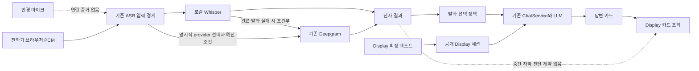

# 기존 API 미활용 기능과 Ray-Ban Display 연결 지점

기준: 2026-09-15 Desktop 소스·설정 읽기 전용 감사. 브랜치 `codex/owned-runtime-browser-restart`, HEAD `0796a3c5b29bbb08c3314bd40649d856d4a7bce6`. 작업 트리에 다른 변경이 있어 HEAD만으로 파일 내용을 대표하지 않는다. 핵심 19개 파일의 재대조 SHA-256은 작업별 source-evidence-v2.json에 기록했다. 최초 검증 중 3개 소스가 동시 변경되어 보고서만 회수한 뒤 해당 결론을 갱신했다. 감사는 이 시점의 소스 스냅샷을 대상으로 한다.

## 1. 결론

**기존 API에서 활용하지 못한 기능이 있다. 지금은 새 키 발급보다 기존 Deepgram·LLM과 Display 사이의 연결을 완성하는 편이 우선이다.**

가장 큰 병목은 API의 부재가 아니다. 현재 공개 Display는 사용자가 확정한 텍스트를 보내고 답변 카드를 받는다. 별도 전화기 음성 경로에는 로컬 Whisper와 Deepgram이 있지만, 그 중간 자막·화자 정보가 공개 Display로 전달되는 계약은 없다. 음성 입력 정책도 모든 상황에서 힌트를 만드는 방식이 아니다.

이는 소스에서 확인한 동작 조건이다. 실제 한국어 정확도, 계정 권한·잔액, 활성 프로세스의 바인딩, 외부 제공자 호출 성공, 안경 마이크와 렌즈 출력은 이번 감사에서 측정하지 않았다.

## 2. 키 설정 확인과 반증

`.env`, `shared.env`, `apikey.txt`, 관련 보조 환경 파일과 허용된 프로세스/사용자 환경 이름을 확인했다. 원문 키와 개인 환경 값은 보고서에 보관하지 않았다. `.secrets` 공유 로더의 기존 보안 확인은 conflict 상태이며 우회하지 않았다.

| API | 확인한 설정 상태 | 해석 |
|---|---|---|
| Soniox | 재대조 시 파일 미설정, 유효 환경 설정됨 | 새 provider 선택 코드와 공유 자원 카탈로그 항목이 추가됨. 실제 호출·계정 권한은 미검증 |
| Deepgram | 파일 설정됨, 프로세스 환경 미설정 | local/dev 프로필의 선택적 `.env` import가 있어 미사용·로딩 실패로 단정할 수 없음 |
| OpenAI, Groq, Gemini | 설정됨 | 기존 텍스트 모델/라우터에 연결됨. 오디오 전사 어댑터는 별도 |
| Google Translate | 설정됨 | 실제 사용 이름은 `GOOGLE_TRANSLATE_KEY` |
| Brave, Naver, SerpApi, Tavily, Kakao | 설정됨 | 검색/지역 기능 보유. Display에서 전부 실행된다는 의미는 아님 |
| Pinecone, Upstash | 설정됨 | 저장소 이름·키가 실제 원격 검색을 보장하지 않음 |
| ZAI, OpenCode, Vercel AI Gateway, Devin | 설정됨 | 모델/개발 도구 경로를 제품 음성 기능과 구분 |
| Supabase, AWX 접근 토큰 | 확인 대상에서는 미설정 | 보유 API 재활용 후보로 산정하지 않음 |

반증 1: `GOOGLE_TRANSLATE_API_KEY`가 없다는 이유로 번역 키 매핑 오류를 의심했으나, 활성 [application.properties](C:/AbandonWare/demo-1/demo-1/src/main/resources/application.properties:407)는 `google.translate.keys=${GOOGLE_TRANSLATE_KEY:}`를 사용한다. **현재 활성 설정의 이름 불일치 결함으로 확정하지 않는다.**

반증 2: Deepgram의 프로세스 환경이 비어 있어도 [application.yml](C:/AbandonWare/demo-1/demo-1/src/main/resources/application.yml:6) → [application-deepgram-local.yml](C:/AbandonWare/demo-1/demo-1/src/main/resources/application-deepgram-local.yml:4)가 local/dev에서 `.env`를 import한다. prod/production/verification은 제외된다. `APP_CONFIG_IMPORT` 재정의와 실제 활성 프로필은 별도 런타임 증거가 필요하다.

## 3. 실제 경로와 끊긴 지점

전화기 세션과 공개 Display 세션의 소유권은 별개다. 같은 assistId를 전달하는 것만으로 연결할 수 없으며 기존 owner/epoch/clientId 경계를 보존해야 한다. 안경 음성 입력 구현과 실제 장치 허용 API를 먼저 확인해야 한다.

### 직접 확인한 핵심 조건

- [DisplayConversateController](C:/AbandonWare/demo-1/demo-1/src/main/java/com/example/lms/assist/DisplayConversateController.java:33)의 입력은 `text`이고 출력 View에는 카드와 처리 상태가 있다. 중간 전사·speaker 필드는 없다. [display-conversate.js](C:/AbandonWare/demo-1/demo-1/src/main/resources/static/assets/display/display-conversate.js:85)는 정상 상태에서 1초 간격으로 조회한다. 이는 설계상 대기 구간이며 실제 종단 지연을 측정한 수치는 아니다.
- [ConversateQuestionPolicy](C:/AbandonWare/demo-1/demo-1/src/main/java/com/example/lms/assist/ConversateQuestionPolicy.java:37)는 미완료 전사를 PARTIAL로, 일반 평서문을 NEW_INFORMATION으로 분류한다. [ConversateSessionService](C:/AbandonWare/demo-1/demo-1/src/main/java/com/example/lms/assist/ConversateSessionService.java:123)는 평서문을 문맥에 저장한 뒤 생성하지 않는다. 예: “회의가 내일 시작합니다.”는 자동 행동 힌트가 되지 않는다. 공개 Display에서 사용자가 확정한 입력은 별도 explicit 정책이다.
- [ConversateCardPrompt](C:/AbandonWare/demo-1/demo-1/src/main/java/com/example/lms/assist/ConversateCardPrompt.java:18)의 별도 제안 분기는 고정 문장 3개 중 번호 하나를 선택한다. 이 제한은 해당 제안 분기에만 적용되며, 전체 ChatService가 세 문장만 생성한다는 뜻은 아니다.
- [ConversateAnswerPipeline](C:/AbandonWare/demo-1/demo-1/src/main/java/com/example/lms/assist/ConversateAnswerPipeline.java:51)은 공개 Display 요청에 `useRag=false`, `maxTokens=192`를 넣고, 출처 요청 또는 SearchDecisionService의 판단에 따라 웹 검색을 선택한다. 최초 읽기에서는 `useWebSearch=true`였으나 동시 변경으로 조건부 검색이 추가됐다. 따라서 검색 무조건 활성화를 현재 결함으로 보고하지 않는다. 기존 LLM을 호출하지만 Display 전용 모델 선택은 없다. 전화기 요청의 기본은 `useRag=true`다.

## 4. 재활용 우선순위

| 순위 | 기존 자원 | 덜 활용한 기능 | 현재 소스 근거와 최소 연결 | 우선도 |
|---|---|---|---|---|
| 1 | Deepgram Nova-3 | 화자 분리, 단어 시간·신뢰도, 발화 이벤트, 용어 힌트 | 기존 STT 서비스와 transport의 결과 모델을 확장하고 자막 출력 경계까지 전달 | 높음 |
| 2 | 기존 OpenAI/Groq/Gemini 텍스트 LLM | 상황에 맞는 짧은 답변·행동 힌트 | 기존 질문 선택 정책과 ChatRequestDto/프롬프트 경계에 제한된 힌트 모드 추가 | 높음 |
| 3 | Upstash Vector | 준비 자료에 근거한 짧은 힌트 | 이미 있는 composite embeddingStore 재사용. 공개 허용 자료 범위와 세션 소유권을 먼저 명시 | 자료가 있을 때 높음 |
| 4 | Google Translate | 원문 자막과 짧은 번역의 병렬 표시 | 기존 GTranslateClient를 전사 이후 선택적으로 재사용 | 외국어 대화에서 높음 |
| 5 | Groq Whisper | 로컬/Deepgram 실패 시 완료 발화의 보조 전사 | 기존 키를 쓰는 서버 오디오 어댑터 필요. 현재는 텍스트 모델 경로 | 보조 경로 후보 |
| 6 | Gemini Live / OpenAI Realtime transcription | 실시간 오디오 입력·전사 | 현재 소스에 해당 오디오 연결 어댑터 없음. 기존 ASR 경계 안에서 한 공급자만 별도 비교 | 후순위 실험 |
| 7 | Pinecone | 원격 지식 검색 | 현재 Pinecone 선택은 InMemoryEmbeddingStore 대체 경로. 실제 원격 어댑터가 필요 | 원격 자료 필요가 확인될 때 |

### 4.1 Deepgram: 이미 기본 스트리밍이 구현됐다

[DeepgramSttService](C:/AbandonWare/demo-1/demo-1/src/main/java/com/example/lms/service/stt/DeepgramSttService.java:67)는 Nova-3, PCM16 mono, interim results, smart format, `endpointing=600`을 사용한다. [DeepgramAsrTransport](C:/AbandonWare/demo-1/demo-1/src/main/java/com/example/lms/assist/DeepgramAsrTransport.java:42)는 16kHz·`ko`로 연결한다. 따라서 이를 “아직 없는 신규 STT”로 다시 도입할 이유는 없다.

미활용 부분은 명확하다. 요청에 diarization/keyterm/vad_events/utterance_end_ms가 없고, 파서는 Results 외 이벤트를 버린다. Transcript record에는 전사 문자열·확정 여부·구간 시간만 있어 words/speaker/confidence가 남지 않는다.

공식 문서는 Nova-3 한국어 `ko`/`ko-KR`, Nova 스트리밍 화자 구분, 단어 speaker 필드를 제공한다고 명시한다. 현재 화자 구분 권장 인자는 `diarize_model`; 스트리밍에는 `v1` 또는 `latest`를 쓰고 v2는 지원되지 않는다. 화자 번호만으로 “나/상대방” 신원을 자동 확정할 수는 없다. [모델·언어](https://developers.deepgram.com/docs/models-languages-overview), [화자 구분](https://developers.deepgram.com/docs/diarization)

Keyterm은 Nova-3 단일·다국어 인식의 용어 편향 입력이다. 한국어 회의 용어/고유명사에 대한 실제 개선 정도는 같은 음성의 비교가 필요하다. [Keyterm 공식 문서](https://developers.deepgram.com/docs/keyterm)

600ms는 무음 판정 설정이며 전체 지연시간 보장값이 아니다. 낮추기 전에 문장 끊김과 중복 힌트를 확인해야 한다. [Endpointing 공식 문서](https://developers.deepgram.com/docs/endpointing)

### 4.2 기존 LLM: 새 모델보다 힌트 호출 정책의 개선

텍스트 LLM 라우터는 이미 존재한다. 추가 가치가 큰 변경은 대화 중 어떤 시점에 힌트가 필요한지 고르고, 현재 전사와 짧은 문맥으로 “답변 한 문장 / 확인 질문 / 다음 행동” 중 하나를 만드는 것이다. 중간 전사는 자막 갱신에 쓰고 LLM은 안정된 발화에서 제한적으로 호출하는 방식이 기존 중복·비용 경계와 맞는다.

검색이 필요 없는 대화 진행 힌트까지 외부 검색을 필수로 만들 필요는 없다. 재대조한 Display는 이미 질문별 검색 선택을 한다. 실제 공급자 시도 횟수는 하위 정책·예산에 따라 달라진다. 검색 지연이 실제 병목이라는 결론은 단계별 시간 측정 이후에 내려야 한다.

### 4.3 Upstash와 Pinecone을 같은 상태로 보지 않는다

독립 소스 감사에서 [LangChainConfig](C:/AbandonWare/demo-1/demo-1/src/main/java/com/example/lms/config/LangChainConfig.java:281)의 Upstash 어댑터와 composite reader 선택 경로가 확인됐다. 읽기는 URL·키 조건을 요구하고 쓰기는 기본적으로 비활성이다. 공개 Display의 벡터 RAG 비활성은 자료 노출 경계를 포함하므로 일괄 해제하지 않는다.

같은 파일의 [Pinecone 분기](C:/AbandonWare/demo-1/demo-1/src/main/java/com/example/lms/config/LangChainConfig.java:247)는 호환 어댑터 부재로 in-memory 저장소를 반환하거나 failfast에서 실패한다. 키가 있어도 Pinecone 원격 검색은 성립하지 않는다. 실제 Pinecone 자료가 없다면 별도 어댑터보다 이미 구현된 Upstash/허용 자료 경로가 작은 변경이다.

### 4.4 Google Translate: 연결은 있으나 Display에 들어오지 않는다

[GTranslateClient](C:/AbandonWare/demo-1/demo-1/src/main/java/com/example/lms/client/GTranslateClient.java:36)는 기존 키로 v2 번역을 호출한다. [AdaptiveTranslationService](C:/AbandonWare/demo-1/demo-1/src/main/java/com/example/lms/service/AdaptiveTranslationService.java:188)는 Google 이후 Gemini를 대체 경로로 사용한다. 공식 문서에 한국어 지원이 있다. [Cloud Translation 언어](https://docs.cloud.google.com/translate/docs/languages)

Display 자막에서 이 기능을 재사용할 수 있으나 현재 inference 서비스는 번역 샘플을 DB에 저장한다. 휘발성 대화에 그대로 호출하면 보존 정책이 달라지므로, 현재 클라이언트 경계와 저장 여부를 분리해서 설계해야 한다. 자동 번역 실패 시 원문 자막을 유지하는 것이 적절하다.

### 4.5 Groq·Gemini·OpenAI의 오디오 기능은 기존 키의 확장 후보

현재 active production 경로에서 이 세 공급자의 전사 어댑터는 발견되지 않았다. LLM이 선택 가능하다는 사실과 오디오 API가 연결됐다는 사실은 다르다.

- Groq는 `/openai/v1/audio/transcriptions` 파일/URL 방식과 다국어 Whisper 모델을 제공한다. Turbo 공시 가격은 오디오 시간당 $0.04이며 요청당 최소 10초 과금이다. 짧은 청크를 매우 자주 보내면 효율이 나빠질 수 있다. 확인한 명세를 WebSocket 중간 자막 기능으로 간주하지 않는다. [Groq STT](https://console.groq.com/docs/speech-to-text)
- Gemini Live는 PCM 입력과 입력 전사 이벤트를 제공하며 언어 표에 한국어가 포함된다. 오디오 세션을 새로 관리해야 해 기존 Deepgram 옵션 확장보다 범위가 크다. [Gemini Live](https://ai.google.dev/gemini-api/docs/live-api/capabilities)
- OpenAI Realtime transcription은 서버 WebSocket 또는 브라우저 WebRTC 연결로 전사 delta/final을 받는 별도 세션이다. 현재 텍스트 Chat/Responses 경로를 그대로 켠다고 생기지 않는다. [OpenAI 전사](https://developers.openai.com/api/docs/guides/realtime-transcription)

계정별 기능 활성화·모델 접근·잔액은 키 존재로 증명되지 않는다. 이 감사에서는 실제 음성을 전송하거나 과금 요청을 실행하지 않았다.

## 5. 이미 활용 경로가 있는 검색 API

Brave/Naver는 [HybridWebSearchProvider](C:/AbandonWare/demo-1/demo-1/src/main/java/com/example/lms/search/provider/HybridWebSearchProvider.java:278)의 우회·상태 분류에 들어가고, Gemini 검색어 확장은 TRUE_ZERO 이후 조건부로 도달한다. Tavily도 [기존 retriever](C:/AbandonWare/demo-1/demo-1/src/main/java/com/example/lms/service/rag/TavilyWebSearchRetriever.java:38)에 활성화·타임아웃·실제 시도 기록 경계가 있다. 그러므로 “검색 API 키가 모두 놀고 있다”는 결론은 틀리다.

우선 필요한 것은 추가 검색 공급자가 아니라 “언제 검색할지”와 “어떤 검색이 실제 시도됐는지”의 확인이다. 실시간 대화에는 짧은 진행 힌트와 사실 확인 질문을 구분하는 정책이 유용하다. Kakao의 지역 기능은 장소 상황이 요구될 때 별도로 평가하며 핵심 음성·힌트 해결책으로 올리지 않는다.

## 6. 최소 연결 계획과 로그

다음은 구현 제안이며 이번 감사에서 적용하지 않았다.

1. **입출력 연결:** 실제 장치 마이크 허용 경로 → 기존 ASR bridge. 동일 소유자 검증을 통과한 Display에 `partial/final`, utteranceId, revision을 전달한다. 자막과 생성된 힌트를 별도 필드로 둔다.
2. **STT 활용:** 기존 Deepgram 결과 모델에 단어·화자·이벤트 정보를 보존한다. 로컬 우선과 예산 제한을 유지하고, cloud primary를 선택한다면 cloud→local 전환을 따로 구현·검증한다.
3. **힌트 활용:** 기존 LLM 경계에서 안정된 발화에 한정해 짧은 상황 힌트를 요청한다. 검색/자료가 필요한 경우에만 기존 retriever로 확장한다. 개인정보 자료를 공개 Display RAG에 자동 연결하지 않는다.
4. **선택 번역:** 원문 자막 표시를 지연시키지 않는 별도 번역으로 기존 GTranslateClient를 사용한다. 기록 저장 정책과 장애 시 원문 유지를 명시한다.

현재 기본 fallback은 로컬 실패 → 완료 발화 Deepgram이며, 재대조 중 cloud provider에 Soniox 선택 코드도 들어왔다. Soniox 키는 유효 환경에서 설정됨으로 확인되어 신규 발급 대상으로 제안하지 않는다. 이 변경의 기능·성능 통과를 이번 감사가 보증하지 않는다. [ConversateAsrBridge](C:/AbandonWare/demo-1/demo-1/src/main/java/com/example/lms/assist/ConversateAsrBridge.java:128), [ConversateCloudStt](C:/AbandonWare/demo-1/demo-1/src/main/java/com/example/lms/assist/ConversateCloudStt.java:34), [ConversateSttBudget](C:/AbandonWare/demo-1/demo-1/src/main/java/com/example/lms/assist/ConversateSttBudget.java:47)의 활성화·예산·회로 차단 조건이 적용된다. 런처의 로컬 ASR 설정 파일은 provider=local만 허용하므로 파일 값을 deepgram으로 바꾸기만 하는 해결책도 성립하지 않는다.

현재 processingMs와 ASR 카운트는 있으나 Deepgram primary의 `asrMs`가 transport에서 생성되지 않아 bridge에서 0으로 읽힐 수 있다. Deepgram transport의 primary 실패는 `ASR_STREAM_FAILED`로 축약되고 cloud 쪽의 일반 transport 오류로 분류될 수 있다. 다음 allowlist 계측이 필요하다.

| 단계 | 제안 기록 |
|---|---|
| 요청/캡처 시작 | 무작위 requestId, provider, model, monotonic 시작시각 |
| 최초 전사 | firstTranscriptMs, partialCount |
| 최종 전사 | finalTranscriptMs, utteranceCount, transcript 길이 |
| 검색·힌트 | retrievalMs, hintStartMs, firstHintMs, hintFinalMs, 실제 providerAttempts |
| 표시 | renderAckMs, totalMs. 소프트웨어 ACK와 실제 렌즈 확인을 구분 |
| 대체 경로 | fallbackFrom/To, timeout/auth/rate_limit/budget/local_failed 등의 허용된 reason |

관측하지 않은 시간은 null/not_observed로 두며 0ms 성공으로 표현하지 않는다. 원본 음성·전사·키는 일반 디버그 로그에 기록하지 않는다.

## 7. 증거 판정과 다음 단일 검증

| 가설 | 판정 | 근거 |
|---|---|---|
| STT를 새로 발급해야만 시작 가능 | 반증 | 로컬 ASR, Deepgram 한국어 스트리밍과 키 파일 존재 |
| 키 이름이 잘못돼 기존 번역이 미사용 | 활성 기본 설정 기준 반증 | application.properties의 GOOGLE_TRANSLATE_KEY 바인딩 |
| 이미 연결된 데이터가 Display·힌트 정책에서 활용되지 않음 | 지지 | 자막 출력 필드 부재, 평서문 생성 억제, 공개 벡터 RAG 비활성 |
| 벡터 키가 있으면 원격 RAG가 동작함 | 반증 | Pinecone in-memory 대체, Upstash 선택·자료 범위 조건 |

mechanismVerdict=SUPPORTED_FOR_SOURCE_PATH. intentVerdict=PARTIAL_FOR_CONVERSATION_ASSIST. confidence=high_for_static_conditions, unknown_for_runtime_quality.

현재 검증은 파일 읽기·호출 경로 추적·키 존재 여부·공식 API 사양 비교다. 이번 턴에서 build/test/제공자 generation/브라우저/안경 하드웨어 검증을 실행하지 않았다. 기존 테스트 파일의 계약은 참고했지만 이전 턴의 통과 수를 새로운 증거로 재사용하지 않는다. GLM은 기존 transport HOLD를 유지하고, 분리한 LLM/벡터 경로는 내장 explorer로 조사했다.

**다음 단일 검증:** 현재 ASR 입력/Display 출력 경계에 합성 PARTIAL → FINAL 한 발화를 넣어, 소유자 검증·중복 억제·자막 갱신과 힌트 생성 여부를 함께 확인한다. 외부 유료 호출 없이 연결 부족분을 먼저 재현할 수 있다. 실제 마이크·provider·렌즈 proof는 각각 별도 단계다.

작업 증거: [source-evidence-v2.json](C:/AbandonWare/demo-1/demo-1/src/data/agent-handoff/codex-autonomy/existing-api-reuse-01a0a38e/source-evidence-v2.json). 보고서 복구·검증: [cycle-02](C:/AbandonWare/demo-1/demo-1/src/data/agent-handoff/codex-autonomy/existing-api-reuse-01a0a38e/cycle-02).
