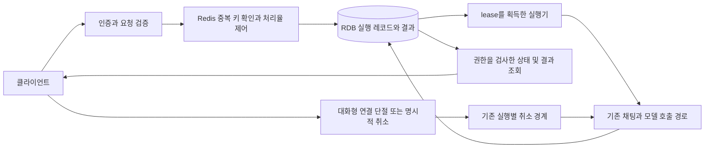

# 채팅 API 작업 영속화와 실행 제어 설계

2026-09-12 명시적 승인 반영: 설계 승인 대기는 해제되었다. 최종 목표는 한국어 Conversate의 휴대폰 입력부터 Meta Ray-Ban Display 자동 카드 출력까지다. API 신뢰성은 하위 과제이며 단독 완료로 전체 목표를 완료하지 않는다. 최신 실행 계약은 `../plans/2026-09-12-conversate-integration.md`를 따른다. 아래의 변경 전 조사와 외부 증거 미확보 기록은 역사적 근거로 유지하며, 별도 작업의 HOLD와 보안 경계는 해제하지 않는다.

이 문서는 변경 전 소스에서 확인한 결함과 승인된 구현 설계를 기록한다. 사용자의 “후처리 네마음대로 해줘”를 구현 승인으로 반영했다. 아래 소스 위치와 현재 구현 표는 변경 전 기준이며, 실제 변경 및 검증 결과는 구현 보고서와 acceptance-audit.json으로 추적한다. 목표는 작업 조회의 재시작·다중 인스턴스 일관성, 대화형 연결 단절 후 1초 이내 업스트림 중단, 동일 키 중복 요청의 단일 추론이다. 로컬 테스트 통과와 운영 수용 시험 완료는 구분한다.

## 1. 현재 구현에서 확인된 사실

| 주장 | 현재 근거 | 판정과 영향 |
|---|---|---|
| 작업 상태가 휘발성이다 | `JobConfig.java:11`은 `InMemoryJobService`를 생성한다. `InMemoryJobService.java:20` 이후 상태 맵이 프로세스에 존재한다. | 확인됨. 재시작·인스턴스 간 공통 조회가 불가능하다. |
| 작업 TTL과 축출이 없다 | `InMemoryJobService.java:23`, `:155` 이후 최대 4,096개 및 마지막 상태 갱신 후 24시간 축출이 있다. | 현재 소스와 다름. 대신 RUNNING 상태도 TTL·용량 압력으로 축출될 수 있다. |
| 결과를 GET으로 조회할 수 없다 | `TasksApiController.java:90` 이후 비동기 POST만 있고, 활성 `JobService.java:11` 계약은 상태만 조회한다. | 확인됨. 답변은 성공 콜백에 사용되며 작업 저장소에는 남지 않는다. |
| 취소 파이프라인이 없다 | `ChatRunExecutionContext.java:67`은 실행별 호출 스레드 인터럽트를 등록한다. `ChatRunRegistry.java:895` 이후 취소를 수락하고 실행 핸들을 해제한다. | 전면 부재는 아님. 명시적 Stop과 클라이언트 단절을 구분해야 한다. |
| 스트림 단절은 곧 취소다 | `ChatApiController.java:2915` 이후 ACK된 실행은 재접속을 위해 보존한다. | 요청한 동작과 충돌한다. 기존 정책을 바꿔야 한다. |
| 채팅 실행 제한이 없다 | `PublicChatAdmissionGuard.java:24` 이후 JVM 전체 64개·소유자별 2개 동시 작업 제한이 있다. | 프로세스별 동시성 제한은 있음. 시간당 처리율과 다중 인스턴스 공유 제한은 별도 과제다. |
| 채팅에서 Idempotency-Key를 처리한다 | 활성 `main/java` 검색에서 헤더 처리는 `N8nWebhookController.java:47`에만 있었다. | 채팅 API에는 확인되지 않았다. n8n 전용 레지스트리를 그대로 적용하지 않는다. |

모든 파일 경로는 `C:/AbandonWare/demo-1/demo-1/src` 기준이다. 기준 HEAD는 `0796a3c5b29bbb08c3314bd40649d856d4a7bce6`이지만 작업 트리에 많은 기존 변경이 있으므로 HEAD만으로 소스 내용을 식별할 수 없다. 이번 조사 시 핵심 파일의 SHA-256은 별도 증거 요약에 기록한다.

루트의 활성 Java 소스는 `main/java`, 테스트는 `src/test/java`이다. `:app`은 `app/src/main/java_clean`을 컴파일한다. `app/src/main/java`의 Redis 작업 큐는 활성 구현이 아니며, 활성 `com.abandonware.ai.agent.job.DurableJobService` 역시 영속 저장소가 연결된 서비스로 입증되지 않았다. 두 경로를 새 기본 구현으로 복사하지 않는다.

## 2. 접근 방식 비교와 권고

| 접근 | 장점 | 비용·조건 |
|---|---|---|
| **기존 JPA를 통한 RDB 작업 저장 + Redis 멱등성·토큰 버킷** | 작업·결과·콜백의 트랜잭션 경계를 확보하면서 요청 제어를 원자적으로 공유할 수 있다. 기존 의존성을 활용할 수 있다. | 공통 RDB와 Redis가 필요하다. Redis와 RDB 사이 장애를 별도로 설계해야 한다. |
| Redis에 작업·결과·제어를 모두 저장 | 공통 저장소 하나로 초기 구성이 가능하다. | 내구성·복제·축출 설정이 작업 손실 조건이 된다. 큰 결과, 실행 lease, 복구 큐를 모두 구현해야 한다. |
| RDB에 작업과 요청 제어를 모두 저장 | 트랜잭션 일관성을 단순하게 유지한다. | 요청마다 공유 DB 경쟁이 생길 수 있고, 요청된 Redis 제어 방식과 달라진다. |

첫 번째 접근을 권고한다. 빌드에는 JPA, MySQL 드라이버, H2, Jedis 및 기존 Upstash 클라이언트가 있다. 따라서 Bucket4j 같은 새 생산 의존성을 우선 추가할 필요는 없다. `application.properties:177`의 H2 메모리 URL은 **주석 처리된 예시**이며 활성 datasource의 증거가 아니다. 실제 적용되는 datasource는 설정 우선순위와 실행 환경을 확인해야 한다. **JPA 의존성이나 엔티티 추가만으로 재시작 영속화가 성립하지 않는다.** 수용 시험은 반드시 영속적이고 두 인스턴스가 공유하는 별도 시험 DB에서 수행한다.

Redis의 AOF/RDB 저장 방식과 동기화 설정에 따라 장애 시 손실 범위가 달라진다. Redis 사용 사실만으로 무손실을 주장하지 않는다. [Redis persistence](https://redis.io/docs/latest/operate/oss_and_stack/management/persistence/)

## 3. 작업 영속화 계약

기존 `com.example.lms.jobs.JobService`와 `JobConfig`를 활성 소유자로 유지한다. 컨트롤러에서 실행 가능한 `Runnable`을 만들어 저장소에 넘기는 방식은 재시작 시 복구할 수 없으므로, 허용된 작업 종류와 버전이 있는 직렬화 가능한 요청을 먼저 저장하고 실행기는 그 요청을 읽는다. 임의 클래스·메서드·직렬화 객체를 실행하지 않는다.

현재 입력은 `message`, `history`, `useRag`, `useWebSearch`, `sid`, `model`, `callbackUrl`이다. 현재 `history`는 무시되므로 영속화 패치에서 암묵적으로 대화 의미를 변경하지 않는다. 재실행에 필요한 요청 본문은 보호된 데이터 영역에 저장하고 로그·증거 문서에는 남기지 않는다.

예상 레코드는 다음 책임을 가진다. 이름은 제안이며 실제 migration 이름과 매핑은 구현 시 기존 DB 관례에 맞춘다.

| 레코드 | 필수 내용 |
|---|---|
| 작업 메타데이터 | taskId, 작업 종류·스키마 버전, 인증된 소유자 범위, 상태, version/fencing 번호, 생성·완료·만료 시각, 실행 lease·heartbeat, requestRef, resultRef, 제한된 실패 reason |
| 요청·결과 본문 | 별도 레코드의 보호된 입력 및 결과, 크기, checksum, 생성 시각. 상태 조회는 본문을 eager load하지 않는다. |
| 실행 중복 방지 | 인증 주체·API 버전·키 digest의 unique constraint, request fingerprint, 실행 식별자, 확정 상태·결과 참조 |
| 콜백 전달 상태 | 결과 확정 트랜잭션에 포함되는 발송 의도와 전달 시도 상태. 콜백 실패가 모델 재추론을 유발하지 않는다. |

작업 접수는 요청과 메타데이터의 커밋 후 `202 Accepted`와 taskId/Location을 반환한다. 작업을 DB에 넣고 별도의 메모리 큐에 넣는 이중 쓰기만으로 접수를 완료하지 않는다. 실행기가 주기적으로 PENDING 레코드를 원자적으로 claim할 수 있어야 한다.

상태 전이는 `PENDING → RUNNING → SUCCEEDED | FAILED | CANCELLED`이다. `CANCEL_REQUESTED`는 명령 수락을, `OUTCOME_UNKNOWN`은 외부 호출의 결과가 확정되지 않은 장애 상태를 구분하기 위한 추가 상태다. version과 lease 소유자 조건을 만족한 실행기만 결과를 확정한다. 만료된 실행기가 뒤늦게 결과를 쓰는 것은 차단한다. 긴 DB 트랜잭션을 유지한 채 모델 응답을 기다리지 않는다.

완료된 결과와 상태는 **완료 시각부터 최소 24시간** 보관한다. 실행 중 레코드는 보관 TTL로 삭제하지 않는다. RUNNING heartbeat 만료는 복구 대상으로 분류하고, 최대 실행 시간 초과는 명시적 종료 상태로 처리한 뒤 보관 기간을 시작한다. 큰 답변은 RDB 결과 레코드에 두고 작업 메타데이터에는 참조만 둔다. 1차 구현에 S3는 필요하지 않다.

접수 전·실행 전 장애는 안전하게 복구할 수 있다. 반면 외부 모델이 요청을 받았지만 결과를 저장하기 전에 실행기가 죽은 경우, 제공자의 재조회·멱등성 계약이 없으면 이전 답변을 복원하거나 물리적 추론 1회를 보장할 수 없다. 이 경우 작업을 지우거나 자동 재추론하지 않고 `OUTCOME_UNKNOWN`을 유지한다. 이는 원래 완료 기준의 예외를 승인 없이 만든다는 뜻이 아니다. 해당 장애 구간은 목표 수용 판정에서 미충족으로 남기며, 제공자 측 복구 계약 또는 명시적으로 합의한 처리 정책이 필요하다.

`GET /v1/tasks/{taskId}`는 상태·제한된 실패 이유·만료 시각·결과 참조를 반환한다. 필요하면 `GET /v1/tasks/{taskId}/result`로 본문을 분리하고, 미완료 결과는 준비 중임을 명시한다. 기존 POST는 관리자 규칙과 운영 토큰 필터를 거치므로 GET을 추가할 때도 그 보호 수준을 명시적으로 유지한다. 일반 사용자 확대는 이번 변경에 포함하지 않는다. 소유자 불일치와 존재하지 않는 작업은 구분 가능한 정보 누출 없이 처리한다. 임의 외부 스토리지 키나 다른 사용자의 결과에 접근할 수 없어야 한다.

기존 콜백과 taskId 의미를 유지한다. 콜백 송신 대상 검증과 기존 비밀 처리 경계를 재사용한다. 중복 전달에는 같은 작업·전달 식별자를 사용하며 콜백 네트워크 오류로 성공한 추론을 FAILED로 되돌리지 않는다.

## 4. 단절과 취소 계약

대화형 `/api/chat/stream`은 실행 시작 시 결정한 `cancel_on_disconnect` 정책으로 동작시키는 것을 제안한다. 취소는 세션 전체가 아니라 정확한 run identity에 결합한다. 연결이 끊긴 이전 스트림이 새 실행을 취소할 수 없어야 하며, 같은 실행을 보는 여러 구독자가 있다면 마지막 유효 구독자가 사라질 때 취소한다. 단순 작업 완료 콜백은 취소 신호로 처리하지 않는다.

현재 최초 연결과 재접속은 같은 `POST /api/chat/stream`을 사용한다. `attach=true` 분기는 sessionId와 `X-Chat-Run-Token`으로 정확한 실행을 조회한 뒤 `attachExact`의 replay Flux를 조기 반환하므로, 아래쪽 최초 스트림의 `doOnCancel`을 통과하지 않는다 (`ChatApiController.java:1610`, `:1630`). `ChatRunRegistry.java:344`의 attach 경로에는 외부 구독자 수나 연결 식별자 추적이 없다. 따라서 최초 연결의 콜백 한 곳만 바꾸는 패치는 수용 기준을 충족하지 못한다.

구현 시 최초 연결과 attach에 같은 외부 구독 lease를 연결하고, 구독 해제는 연결별로 정확히 한 번 반영해야 한다. 내부 replay bridge 구독은 외부 클라이언트 수에 포함하지 않는다. 마지막 외부 구독자 이탈과 새 attach의 진입을 같은 실행의 동기화 경계에서 결정한다. 취소가 먼저 확정됐으면 재접속은 취소된 실행의 상태를 재생하고 새 모델 추론을 자동 시작하지 않는다. 다른 외부 구독자가 남아 있으면 한 연결의 단절만으로 그 실행을 취소하지 않는다.

현재 브라우저 `main/resources/static/js/chat.js:1318`, `:1404`, `:6348`은 fetch/AbortController를 사용하며 전송 종료 후 state 조회와 exact attach로 실행을 복구한다. 이 파일에는 pagehide·beforeunload 등으로 명시적 취소를 보내는 경로가 확인되지 않았다. 기존 `ChatFrontendStreamCancellationFocusedTest.java:25`와 `ChatRunRegistryNonTerminalExpiryTest.java:68`은 재접속·ACK 후 실행 보존을 보호한다. 새 정책에서는 네트워크 재접속이 취소된 실행을 부활시키거나 중복 생성하지 않는지까지 검증하고, 확정된 취소 상태가 UI에 보이도록 이 경로를 함께 맞춘다.

이 정책에서는 이미 완료·저장된 답변의 복원은 유지되지만, 단절된 대화형 실행의 미완성 생성을 백그라운드에서 끝내는 기존 동작은 바뀐다. `202`로 접수된 내구성 백그라운드 작업은 접수 HTTP 연결이 정상 종료되는 것이므로 그 종료 자체로 취소하지 않는다. 명시적 작업 취소 명령과 실행 deadline을 사용한다. 이 구분은 구현 전 승인 대상이다.

활성 컨트롤러는 `Flux<ServerSentEvent<ChatStreamEvent>>`를 반환한다. 새로운 SseEmitter 경로를 추가하지 않고 기존 Flux 취소·오류 처리에서 `ChatRunRegistry`와 `ChatRunExecutionContext`로 전파한다. 이미 등록된 실행 핸들, JDK HTTP 호출, Ollama 호출, 필요 시 embedding 대기까지 같은 실행 경계를 사용한다. 취소 후 신규 fallback·retry·결과 저장을 허용하지 않는다. 생성 완료와 저장 경합은 기존 commit 경계에서 선후를 결정한다.

Spring MVC 6.1 문서는 클라이언트 단절을 직접 통지하지 못하는 Servlet 한계와 주기적인 쓰기로 단절을 감지할 필요를 설명한다. 따라서 콜백 추가만으로 단절 발생부터 1초를 보장할 수 없다. [Spring Framework 6.1.13 async 문서](https://raw.githubusercontent.com/spring-projects/spring-framework/v6.1.13/framework-docs/modules/ROOT/pages/web/webmvc/mvc-ann-async.adoc)

1초 수용 기준은 아래처럼 측정한다. 제안된 부분 예산은 설계 목표이며 실측치가 아니다.

| 구간 | 제안 예산 | 관찰 위치 |
|---|---:|---|
| 마지막 구독자 단절 → 취소 감지 | 500ms | 시험 클라이언트 소켓과 서버 transport hook; 필요 시 250ms heartbeat 검토 |
| 감지 → 실행·HTTP 취소 전파 | 100ms | 실행 identity와 취소 수락·전파 시각 |
| 전파 → 제공자 연산 중단 | 400ms | 제공자 측 요청 종료·토큰 진행 또는 작업 종료 신호 |

합계는 1,000ms 이하여야 한다. 단절을 감지한 시각만을 시작점으로 바꿔 목표를 완화하지 않는다. 네트워크 blackhole, 프록시 버퍼링, 외부 제공자 취소 지연에서는 이 보장이 성립하지 않을 수 있으므로 FIN/RST, 무응답 네트워크, 명시적 Stop을 별도 시나리오로 판정한다. GPU 전체 사용률만으로 특정 요청 중단을 증명하지 않는다.

Java의 `Future.cancel(true)`는 중단을 시도하는 계약이다. `true` 또는 취소 로그 자체는 원격 토큰 생성 중단의 증거가 아니다. [Java 17 Future](https://docs.oracle.com/en/java/javase/17/docs/api/java.base/java/util/concurrent/Future.html)

LangChain4j `1.0.1`의 `StreamingChatResponseHandler`에는 최신 문서의 StreamingHandle 콜백이 없다. 버전은 `1.0.1`로 유지하고 기존 transport 경로를 사용한다. [LangChain4j 1.0.1 소스](https://raw.githubusercontent.com/langchain4j/langchain4j/1.0.1/langchain4j-core/src/main/java/dev/langchain4j/model/chat/response/StreamingChatResponseHandler.java)

## 5. 멱등성과 공유 처리율 계약

적용 대상은 메시지 생성을 수행하는 `/api/chat`, `/api/chat/sync`, `/api/chat/stream`이다. 취소·ACK·조회는 생성용 토큰 버킷을 소비하지 않아야 한다. 기존 요청 크기·시간 예산 검사와 로컬 동시 실행 제한은 유지한다.

키 범위는 서버가 확정한 인증 주체와 API 버전·연산, Idempotency-Key digest를 결합한다. raw key, IP, 프롬프트 또는 전체 응답을 로그에 남기지 않는다. 같은 키에 대한 request fingerprint는 모든 의미 있는 입력, 모델·검색 설정, 첨부 참조, 대상 세션을 포함한다. mutable 세션 이력은 처음 획득한 실행의 스냅샷에 고정하고 재시도 시 이미 변한 이력을 새로 결합하지 않는다.

| 요청 상황 | 응답·실행 규칙 |
|---|---|
| 처음 보는 유효한 키 | Redis 원자적 claim과 공유 처리율 검사를 거친 뒤, RDB unique 실행 레코드가 확정된 한 요청만 모델에 진입 |
| 같은 주체·키·입력, 진행 중 | `409 idempotency_in_progress` 및 bounded Retry-After; 추가 추론 없음 |
| 같은 주체·키·입력, 완료 | 보관된 동일 결과 또는 기존 실행의 결과 위치 반환; 추가 추론 없음 |
| 같은 주체·키, 다른 의미의 입력 | `409 idempotency_key_conflict`; 추가 추론 없음 |
| 키 누락 | 기존 클라이언트 호환 경로에 처리율·동시성 제한 적용; 키 기반 중복 억제 보장은 적용되지 않음 |
| Redis 또는 실행 저장소 실패 | 공유 제어 모드에서는 생성 전에 `503`으로 거절; 노드별 메모리로 조용히 대체하지 않음 |

클라이언트가 새 메시지를 의도할 때 새 키를 만들고 네트워크 재시도에는 같은 키를 유지해야 UI 연타·재시도에서도 보장이 작동한다. 프런트엔드 변경은 실제 활성 요청 생성 경로를 확인한 뒤 동일 기능 범위에서 적용한다. 동일 키 헤더를 이미 제공하는 수용 시험은 백엔드에서 직접 검증할 수 있다.

Redis claim은 만료가 있는 고유 소유 토큰을 사용한다. 해제·연장은 소유 토큰을 원자 비교해야 하며 오래된 요청이 새 소유자의 키를 삭제할 수 없어야 한다. 긴 추론 중 claim TTL이 먼저 끝나도 RDB unique 레코드와 실행 상태가 중복 진입을 막는다. Redis 기록 성공 후 RDB 기록 실패, RDB 기록 성공 후 응답 손실을 별도 검사한다. 공유 RDB의 결과가 확정되기 전 Redis 완료 상태만 쓰지 않는다. [Redis distributed locks](https://redis.io/docs/latest/develop/clients/patterns/distributed-locks/)

처리율은 공유 Redis에서 사용자·신뢰된 클라이언트 IP별 토큰 버킷으로 계산한다. 인증 사용자 및 익명 사용자에 대해 기존 actor 결정 경계를 재사용하고, 임의 X-Forwarded-For를 신뢰해 제한을 우회하게 하지 않는다. 용량 B와 초당 충전량 r은 설정으로 두며 실제 부하 자료 없이 운영 기본치를 확정하지 않는다. 동일 주체의 토큰은 `min(B, previous + elapsed*r)`까지만 충전하고 새 추론을 접수할 때 하나를 소비한다. 키 중복 응답에는 새 추론 토큰을 소비하지 않는다.

판단과 토큰 차감은 원자적 스크립트에서 수행한다. 서버 시간을 사용하고 부족 시 `429`와 계산된 Retry-After를 반환한다. 기존 `UpstashRedisClient.incrExpire`는 INCR와 매 요청 EXPIRE 파이프라인이므로 그대로는 토큰 버킷이 아니다. 일반적인 캐시·검색 제공자 제한을 함께 바꾸지 않고 채팅용 원자 연산을 기존 Redis 경계에 추가하는 범위로 제한한다. [Redis scripting atomicity](https://redis.io/docs/latest/develop/programmability/eval-intro/)

## 6. 수용 시험과 증거의 한계

| 시험 | 필수 합격 조건 | 현재 상태 |
|---|---|---|
| 완료 작업 후 프로세스 강제 종료·재시작 | 같은 taskId, 상태, 결과 checksum·길이 일치 | 미수행 |
| 공통 DB 뒤 두 앱 인스턴스 | A 접수/B 조회 및 역방향, 중복 claim·결과 확정 0건 | 미수행 |
| 실행 lease 경합·실행기 종료 | PENDING 회복, 오래된 실행기 쓰기 거절, 외부 결과 불명확 상태 유지 | 미수행 |
| 완료 후 24시간 경계 | 경계 전 결과 유지, 이후 정리, RUNNING 삭제 없음 | 미수행 |
| 결과·콜백 장애 | 확정 결과 조회 가능, 콜백 재시도가 모델 호출을 늘리지 않음 | 미수행 |
| 동일 키 5건, 100ms 간격 | 0/100/200/300/400ms에 제출하고 첫 추론을 500ms 이상 유지; 수신 측 실제 요청 수 1, 나머지 4는 재생 또는 중복 거절 | 미수행 |
| 동일 키 다른 입력·다른 소유자 | 충돌 거절, 주체 격리, 결과 유출 없음 | 미수행 |
| 완료 이후 및 두 인스턴스 중복 요청 | 같은 결과 재생, 실제 추론 추가 0건 | 미수행 |
| 공유 처리율·장애 | 두 노드 합계 한도 준수, 429/Retry-After, Redis 장애 시 503이며 추론 0건 | 미수행 |
| 브라우저 FIN/RST 단절 | 단절부터 제공자 중단까지 1초 이하, 이후 fallback·저장 0건 | 미수행 |
| 무응답 네트워크·재접속 경합 | 1초 만족 여부를 별도 판정; 새 실행 취소·거짓 완료 0건 | 미수행 |
| 최초·attach 및 다중 구독자 단절 | 최초와 attach에 동일한 정책 적용, 내부 bridge 제외, 다른 유효 구독자 보존, 마지막 외부 구독자 이탈 시 정확한 실행만 취소 | 미수행 |

기존 `HttpTransportCancellationTest`는 명시적 Stop 후 호출 종료와 수신 소켓 EOF/reset을 각 2초 이내에 기다린다. 기존 `LlmInFlightCancellationTest`는 Stop 후 fallback 억제를 검사한다. 이 테스트들의 통과는 자동 브라우저 단절이나 1초 제공자 중단의 수용 증거가 아니다. 로컬 fixture 수신 횟수와 실제 제공자 추론 횟수도 구분한다.

이번 기준 검증 결과는 `data/agent-handoff/api-reliability/20260912-01a09365/baseline.summary.json`에 기록한다. 실행 명령과 원본 로그는 같은 디렉터리에 둔다. 결과 해석에는 테스트 개수, 실패·오류 개수, 소스 hash를 사용한다. 전체 저장소·브라우저·배포·DB 상태를 이 테스트들로 인증하지 않는다.

## 7. 구현 경계와 단계

첫 단계는 활성 JobService의 영속 요청·상태·결과 저장과 권한 있는 조회다. 테스트 DB에서 재시작·두 실행기 경쟁을 먼저 증명한다. 두 번째 단계는 같은 실행 레코드를 이용한 멱등성과 공유 처리율이며 Redis 장애 시 정책까지 검사한다. 세 번째 단계는 기존 취소 경계의 단절 정책을 변경하고 실제 클라이언트·transport·제공자 증거를 연결한다. 순서가 바뀌더라도 원래 세 수용 기준은 유지한다.

설계 승인 후 저장소의 단일 `POSITIVE_QUERY`, `NEGATIVE_QUERY`, `NEUTRAL_QUERY` 선행 검토와 기존 source-owner/lease/preimage 절차를 거친다. 별도의 동일 목적 검토를 추가하지 않는다. 각 단계는 선언한 대상과 rollback 가능한 변경만 적용하고 기존 사용자 변경을 보존한다. DB 변경문은 먼저 검토 가능한 로컬 migration으로 작성하며 운영 DB 적용·자격증명 변경·배포는 별도 권한이 필요하다.

보존할 기능은 소유자 격리, 기존 taskId/콜백 계약, 완료된 대화 복원, 명시적 Stop, 정상 완료 시 단일 저장, 기존 예산·동시성 제한, PromptBuilder 경계, Boot/LangChain4j 버전이다. 영속 모드에서 메모리로 자동 전환하는 rollback은 수용 기준을 깨뜨리므로 허용하지 않는다. migration은 추가 방식으로 설계하고 기존 데이터를 삭제하지 않는다.

이번 조사에서 index lock은 존재했지만 활성 source-edit lease와 관찰된 Git writer는 0건이었다. 이 사실만으로 잠금의 소유자나 삭제 권한을 추론하지 않는다. Git index/ref 쓰기를 보류하고 독립적인 읽기·문서화·격리 검증을 진행한다. 앱 구현은 아직 수행하지 않았다.

## 8. 승인 및 남은 결정

승인 대상은 **RDB에 작업·결과를 영속화하고 Redis로 멱등성·처리율을 공유하며, 대화형 스트림은 단절 시 취소하고 202 접수 백그라운드 작업은 명시적으로 취소하는 설계**다. 운영 Redis/RDB의 실재·공유·내구성, 제공자 측 1초 중단 관찰은 현재 입증되지 않았다. 설계 승인과 이 외부 증거의 확보는 서로 다른 사항이다.

`approvalStatus=APPROVED_2026_09_12`; `approvalHold=RELEASED_BY_EXPLICIT_USER_MESSAGE`; `executionStatus=ACTIVE`; `repositoryWideHold=false`. 운영 인프라 및 실기 증거 부족은 해당 수용 시험에만 적용한다.

## 자료

외부 자료는 공개 기술 계약의 근거이며 로컬 기능 활성화 또는 실행 성공의 증거가 아니다. 조회일은 2026-09-12이다.

1. Spring Framework, [v6.1.13 Asynchronous Requests](https://raw.githubusercontent.com/spring-projects/spring-framework/v6.1.13/framework-docs/modules/ROOT/pages/web/webmvc/mvc-ann-async.adoc): MVC의 reactive 반환형과 단절 감지 한계.
2. LangChain4j, [1.0.1 StreamingChatResponseHandler](https://raw.githubusercontent.com/langchain4j/langchain4j/1.0.1/langchain4j-core/src/main/java/dev/langchain4j/model/chat/response/StreamingChatResponseHandler.java): 고정 버전의 실제 콜백 계약.
3. Oracle, [Java SE 17 Future](https://docs.oracle.com/en/java/javase/17/docs/api/java.base/java/util/concurrent/Future.html): 취소 시도와 인터럽트 의미.
4. Redis, [Persistence](https://redis.io/docs/latest/operate/oss_and_stack/management/persistence/): AOF/RDB와 장애 내구성 조건.
5. Redis, [Distributed locks](https://redis.io/docs/latest/develop/clients/patterns/distributed-locks/): 소유권 토큰, 만료 및 안전한 해제 조건.
6. Redis, [Scripting with Lua](https://redis.io/docs/latest/develop/programmability/eval-intro/): 서버 측 원자 실행.
