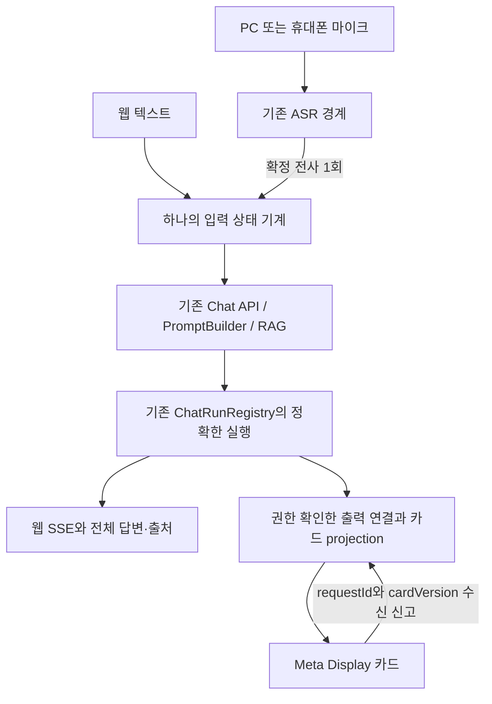

# Spring 웹 챗봇과 Meta Display 시연 설계

상태: 설계 검토 대기. 이 문서는 구현 완료 보고나 배포 승인이 아니다. 현재 `/goal`의 전체 성공 기준은 웹/마이크 → 기존 Chat/RAG → 응답 스트림 → 핵심 카드 → 실제 Meta Ray-Ban Display 확인이다.

## 권장 구성

기존 Spring `/chat-ui`를 면접 시연의 주 화면으로 사용한다. 텍스트와 PC·휴대폰 마이크 입력은 하나의 전송 상태 기계를 거쳐 기존 `/api/chat/stream`으로 들어간다. 안경은 같은 Spring origin의 기존 `/assets/display/index.html`을 사용하며, 그 질문의 정확한 실행에서 나온 답변만 수신한다. RAG 재호출 없이 검증된 답변에서 핵심 문장을 추출해 카드로 표시한다.

기기 연결은 서버가 관리하는 짧은 수명의 출력 전용 연결이다. 기존 `ChatRunRegistry`가 생성과 재생을 소유한다. 별도의 RAG 엔진, Next BFF, 상주 에이전트, 외부 메시지 버스, 두 번째 음성 인식 공급자를 만들지 않는다. 새로운 기능이 기존 세션 소유권이나 `ctx.memory`를 수정하지 않도록 한다.

기본 마이크는 PC·휴대폰의 명시적 시작/종료 입력으로 가정한다. 실제 안경 빌드에서 시스템 composer가 동작하면 보조 입력으로 연결한다. 안경 raw microphone 접근은 기본 시연의 전제에 포함하지 않는다.

## 현재 소스에서 확인한 구성

아래 경로는 `C:\AbandonWare\demo-1\demo-1\src` 기준이다. 관측일은 2026-09-13이며, 기준 HEAD는 `0796a3c5b29bbb08c3314bd40649d856d4a7bce6`, 브랜치는 `codex/owned-runtime-browser-restart`이다. 작업 트리에 다수의 기존 변경이 있으므로 HEAD만으로 현재 소스를 재현할 수 없다.

| 구성 | 현재 위치 및 사실 | 이번 작업의 재사용 방식 |
|---|---|---|
| 활성 Spring 소스 | `build.gradle.kts:780`, `app/build.gradle.kts:82`: root `main/java`, `main/resources`; app `src/main/java_clean`, `src/main/resources` | 원본 활성 소스에만 좁게 연결 |
| 기존 웹 화면 | `main/resources/templates/chat-ui.html:297`, `main/resources/static/js/chat.js` | 기존 composer, 전송, 취소, SSE 파서, 출처 표시 유지 |
| 별도 Next frontend | `frontend/package.json`: 실제 Next 앱 존재 | Spring 화면 재사용 요청에 따라 이번 기본 실행 경로에서 제외; 삭제하지 않음 |
| 생성 소유자 | `main/java/com/example/lms/api/ChatApiController.java:1641`, `service/chat/ChatRunRegistry.java:355` | 기존 begin-or-join과 admission을 그대로 사용 |
| 정확한 실행 재접속 | `ChatApiController.java:1611`, `ChatRunRegistry.java:389` | `attach=true`는 생성 없는 재생. 세션과 실행 식별자에 결속 |
| 세션 접근 검사 | `main/java/com/example/lms/api/ChatSessionAccessGuard.java:23` | 사용자 또는 기존 HttpOnly 소유 cookie의 권한 검사 유지 |
| Display client | `main/resources/static/assets/display/{display-core.js,app.js,index.html,styles.css}` | 카드, URL 필터, 포커스, IME 방어, single-flight 재사용 |
| 현재 Display 요청 | `display-core.js`의 `createClient.submit` | 현재 독립 `/api/chat/sync`. 웹과 동일 스트림 연결은 아직 없음 |
| 기존 음성/출력 | `main/resources/static/conversate/{app.js,pcm-worklet.js}`, `main/java/com/example/lms/assist/ConversateController.java` | PCM 캡처·정지·오류/출력 ACK 패턴 재사용 후보 |
| 기존 ASR | `main/java/com/example/lms/assist/ConversateAsrBridge.java` | 로컬 자식 프로세스와 bounded PCM 전달. 현재는 별도 Conversate 세션으로 전사 전달 |
| 별도 Conversate 답변 | `ConversateAnswerPipeline.java:11` | 준비 자료 검색과 stateless 요약. 기존 Chat 응답과 동일한 결과라고 간주하지 않음 |
| 카드 수신 신고 | `ConversateController.java:47`, `ConversateSessionService.java:50` | 수신 신고와 실제 안경 표시를 구분하는 기존 의미 재사용 |

### 아직 없는 연결

동일한 세션 ID를 두 브라우저에 넣는 것만으로 연결되지는 않는다. 익명 owner cookie는 브라우저마다 다르며, 기존 attach는 정확한 실행 토큰도 요구한다. 두 화면이 각각 생성 요청을 보내면 동일 질문이라는 이유만으로 같은 실행이 되지 않는다.

따라서 가장 작은 필수 추가는 기존 세션 접근 권한을 검증한 뒤 **정확한 실행을 출력 전용 기기에 연결하는 서버 경계**다. 다른 기기의 cookie를 복사하거나 전역 인증을 완화해서 해결하지 않는다.

### 현재 SSE의 의미

`ChatApiController.java:2386`은 `chatService.continueChat` 결과를 먼저 받는다. `2577` 근처에서는 검증된 `visibleFinalText`를 60자씩 나누어 token 이벤트로 보낸다. 현재 SSE 전송은 존재하지만, 이 경로는 공급자의 토큰 생성 콜백을 그대로 내보내는 구조가 아니다.

따라서 `firstVisibleTokenMs`와 `providerFirstTokenMs`를 구분한다. UI에 먼저 뜬 처리 상태나 heartbeat를 token으로 계산하지 않는다. 첫 구현은 현재 최종 답변 검증 경계를 보존하고, 추가된 입력·전달 지연을 줄인다. 공급자 생성 중 토큰 공개는 별도의 검증 가능한 경계 변경이며, 미검증 부분 답변을 안경에 흘려보내는 방식으로 이번 목표를 통과시키지 않는다.

## 공식 플랫폼 조사

### 안경 입력 지원의 조건

Meta 공식 GitHub toolkit의 현재 `add-text-input` 문서는 일반 input/textarea를 포커스한 뒤 사용자가 탭하면 손글씨·음성 composer가 열리고, 확정된 값이 `input/change`로 전달된다고 설명한다. 동시에 일부 빌드에서는 composer가 없을 수 있고, 페이지가 음성 전용 모드를 선택할 수 없다고 명시한다.[1]

이번 공식 Wearables 문서 MCP 검색 결과에는 microphone/text input을 미지원으로 분류하는 항목도 있었다. 공개 웹 문서 본문은 비로그인 상태에서 조회되지 않았다. 이 차이를 지원 보장으로 해석하지 않는다. 현재 확실한 구현 선택은 PC·휴대폰의 음성 입력을 기본으로 하고, 안경 composer를 실제 firmware·계정·기기에서 확인 후 활성화하는 것이다. Composer 사용은 안경 raw audio를 웹페이지가 받는다는 뜻이 아니다.

### Display 화면과 배포

공식 toolkit은 600×600 화면, 밝은 텍스트, 검은 바탕과 보이는 어두운 회색 UI 표면, 방향키·Enter 중심 입력을 제시한다. 화면을 읽는 중 카드가 매 token마다 교체되지 않게 하고, 200% 문자 확대와 현재 포커스 보존을 검사한다.[2]

실기기는 접근 가능한 HTTPS 주소가 필요하다. Toolkit은 자체 HTTPS 호스팅도 허용하므로 기존 Spring origin을 유지할 수 있다.[3] 정적 화면을 Sites에 올리는 것만으로 Desktop의 Spring API에 접근할 수 있게 되지는 않는다. Sites의 현재 호스팅은 Cloudflare Workers 기반이어서 Spring JVM 런타임의 직접 대체 대상으로 선택하지 않는다.

Cloudflare Quick Tunnel은 SSE를 지원하지 않는다고 공식 문서에 명시돼 있다. 실제 시연은 SSE가 통과하는 기존 HTTPS reverse proxy 또는 승인된 호스팅 경로에서 검증해야 한다.[4]

### 브라우저 마이크

`getUserMedia`는 HTTPS 또는 localhost 같은 secure context와 사용자 허가가 필요하다. 일반 HTTP LAN 주소의 모바일 페이지에서 같은 동작을 기대하지 않는다.[5] Web Speech `SpeechRecognition`은 브라우저 지원이 제한적이고 일부 구현은 원격 인식 서비스를 이용한다. 지원 여부나 네트워크 상태를 확인하지 않은 자동 fallback으로 사용하지 않는다.[6]

## 세 가지 구현 대안

| 대안 | 변경 및 충돌 | 난이도 | 면접 안정성 판단 |
|---|---|---|---|
| A. 기존 Spring Chat 실행 + 출력 전용 Display 연결 | 기존 웹/실행 registry 재사용, 작은 연결·projection 경계 추가 | 중간 | 권장. 한 질문당 생성 1회, 기존 회복 경로와 출처 유지 |
| B. Conversate를 주 인터페이스로 통합 | 마이크와 출력은 가깝지만 준비 자료 기반 별도 세션/답변 경로를 Chat/RAG에 다시 맞춰야 함 | 중간~높음 | 현재 다른 작업과 겹치며 같은 Chat 세션 요구를 자동 충족하지 않음 |
| C. Next/BFF 또는 새 WebSocket 시스템 | 새로운 프런트 배포·인증·stream 회복 경로까지 연결 | 높음 | 시연에 필요한 운영 요소와 실패 지점 증가 |

이 평가는 현재 코드와 의존성에 근거한 설계 판단이며 측정된 성공 확률이 아니다. A를 선택하고, B에서 실제로 필요한 PCM 처리와 수신 상태 패턴만 재사용한다.

## 선택한 구조



### 웹 인터페이스

기존 대화·입력창을 첫 화면의 중심으로 유지한다. 포트폴리오 소개는 짧은 기능 설명으로 제한하고 대화를 가리지 않는다. 입력창 주변에 마이크, 전송/중지, Display 연결 상태를 둔다. 개발 측정값은 접을 수 있는 기존 진단 영역에 넣는다.

텍스트는 IME 조합 중 Enter를 제출로 해석하지 않는다. 빈 입력, 연속 Enter, double click, touch 이후 합성 click은 동일 전송 함수에서 차단한다. 전송 버튼을 누르는 순간 질문 snapshot과 requestId를 고정한다. 처리 중에도 취소 상태와 연결 상태를 읽을 수 있어야 한다.

음성은 사용자가 시작하고, 한 발화의 확정 전사 조각을 모아 하나의 질문으로 동일 전송 함수에 전달한다. interim 전사는 화면에서만 갱신한다. `isFinal=true` 한 조각을 전체 발화 완료로 해석하지 않는다. 기본 시연은 명시적 녹음 종료 후 최종 결과를 제한 시간 안에 수집하고 한 번 전송하는 방식이다. 짧은 무음을 자동 전송 경계로 사용하는 선택지는 발화 종료 검증 후에만 활성화한다. 마이크 종료 시 실제 track과 AudioContext·worklet이 해제된 경우를 기록하고, 권한 요청 중 뒤늦게 도착한 stream도 세대 번호가 달라지면 즉시 정리한다. 자동 연속 재시작은 기본값에서 제외한다.

### 기기 연결과 권한

로그인한 웹 사용자가 특정 대화에 대해 Display 연결을 승인한다. 안경에는 비밀 입력이 필요한 로그인 폼 대신 짧은 연결 코드를 보여주고, 웹에서 해당 코드를 확인한다. 짧은 코드는 연결 승인용이며 대화 접근 자격 자체가 아니다.

서버는 사용자·세션·출력 기기를 연결하는 휘발성 상태를 둔다. 연결 code는 일회용이며 2분 만료, 승인 시 폐기, 시도 횟수 제한을 적용한다. 기기의 강한 임의 challenge는 HttpOnly cookie로 보관하고 code만으로 출력 데이터를 조회할 수 없게 한다. 승인 후 출력 권한은 해당 대화의 허용된 카드 읽기·수신 신고만 허용하고, 30분 무활동 또는 명시적 해제에 만료된다. 구체 수치는 설계 기본값이며 성능 측정값이 아니다.

웹에서 기존 SSE session 이벤트를 받은 뒤, 현재 사용자 권한 및 정확한 실행 일치를 다시 검사해 출력 연결을 갱신한다. `sessionId`, run token, owner cookie를 URL·QR·디버깅 로그에 넣지 않는다. Display에 기존 run token이나 주 계정 cookie를 전달하지 않는다.

새 Java 경계는 이 연결·권한 확인·projection에만 한정한다. endpoint 명칭과 최소 DTO는 구현 계획에서 고정하고 기존 chat 생성 DTO의 의미는 바꾸지 않는다. 이 경계가 필요하다는 점은 설계 승인 대상이다. API 추가 없이 별도 기기의 권한과 스트림을 안전하게 공유할 수 있다고 주장하지 않는다.

현재 `ChatOpenSecurityConfig.java:76-95`는 `/api/chat/**`를 공개 matcher와 CSRF 예외에 포함한다. 따라서 이름이 편리하다는 이유로 기기 승인·해제 endpoint를 이 prefix 아래 추가하지 않는다. 기기 연결은 별도 `/api/display` 경계에 두고, 소유자 승인·실행 결속·해제에는 기존 인증과 CSRF 검사를 적용한다. 공개 허용이 필요한 기기 최초 등록·poll·출력도 각각 정확한 경로와 전용 출력 자격을 검사한다. `permitAll`은 대화 읽기 권한으로 취급하지 않는다. anonymous 상태의 웹 채팅은 그대로 가능하지만 Display 연결 승인에는 로그인한 소유자가 필요하다.

### 동일 실행과 취소

기존 registry의 정확한 실행에 붙는 동안 질문 생성은 다시 시작하지 않는다. Display 연결이 끊기거나 숨겨지면 출력 구독만 닫는다. Display 조작으로 웹의 생성 요청을 취소하지 않는다. 생성 취소는 웹의 명시적 중지 동작과 기존 정확한 실행 취소 경계가 소유한다.

재접속은 기존 정확한 실행을 대상으로만 수행한다. 마지막 확인한 event/card version 이후의 재생을 적용하고, terminal 재생은 중복 답변·중복 수신 신고를 만들지 않는다. 이전 requestId, 이전 generation, 이전 pairing generation의 이벤트는 폐기한다. 만료된 실행은 만료 상태를 표시하고 새 생성으로 대체하지 않는다.

Display 수신 신고는 기존 `/api/chat/ack`와 별개다. `ChatApiController.java:1138-1175`의 ready/final/recovery ACK는 실행 수명에 영향을 주므로 출력 카드 수신만으로 대신 호출하지 않는다. 안경의 카드 수신 신고는 `requestId+cardVersion+pairingGeneration`을 확인한 휘발성 전달 계수만 바꾸며, 원래 웹의 final ACK·기록 확정을 대행하지 않는다.

Display는 registry의 읽기 전용 projection 구독으로 연결한다. raw `ChatStreamEvent`에는 실행 capability를 담은 session 이벤트와 trace/debug 정보가 있으므로 통째로 안경에 전달하지 않는다. 내부 스트림에서 허용한 답변·출처·상태만 새 출력 view로 변환한다. Display disconnect가 기존 interactive subscriber 취소 정책을 잘못 실행하지 않는지 집중 검증한다. 기존 웹의 마지막 구독자 종료 정책은 변경하지 않는다.

### 핵심 카드

동일 검증 답변에서 문장 단위로 1~3문장의 핵심 답변을 추출한다. 문장을 임의 글자 수에서 잘라 부정·조건·예외·수치·단위를 제거하지 않는다. 핵심을 안전하게 짧게 만들 수 없으면 짧은 확인 필요 카드와 웹의 전체 답변 안내를 보여준다. 이 상태를 요약 성공으로 세지 않는다.

카드 종류는 핵심 답변, 힌트, 다음 행동, 출처다. 힌트·다음 행동이 실제 응답에 없으면 생성해 채우지 않는다. 초기 버전은 추가 LLM 호출 없이 추출과 표시만 한다. 출처가 없는 경우 출처 없음을 유지하며, 기존 안전 URL 필터와 plain-text rendering을 재사용한다.

웹은 전체 답변과 출처를 보존한다. Display에는 검증된 문장 경계에서만 업데이트하고 사용자가 읽는 카드는 고정한다. 더 새로운 카드가 있으면 표시하고 명시적 탐색으로 이동한다. 연결 상실·새 질문·취소 시 이전 카드가 최신 답처럼 남지 않도록 상태를 구분한다.

## 입력 상태와 관측 계약

```text
IDLE → MIC_STARTING → LISTENING → TRANSCRIBING → SUBMITTING
IDLE → SUBMITTING
SUBMITTING → PROCESSING → STREAMING → COMPLETED
활성 상태 → CANCELLING → CANCELLED 또는 OUTCOME_UNKNOWN
활성 상태 → ERROR 또는 TIMED_OUT
```

마이크 수명과 요청 수명은 내부적으로 분리하되 하나의 UI controller에서 합성한다. 음성 recognition epoch, 입력 revision, logical requestId, stream run, device pairing generation은 서로 바꿔 쓰지 않는다.

같은 입력 revision에는 requestId와 Idempotency-Key를 한 번만 발급한다. 요청 timeout은 기본 90초로 제한하고, timeout/네트워크 오류 뒤 같은 질문을 자동 재전송하지 않는다. 409/422 fence와 429 Retry-After를 존중한다. ASR final 이벤트는 capture epoch와 utterance sequence로 중복 제거한다. 사용자 음성 시작 버튼 debounce는 300ms, 카드 렌더 coalescing은 250ms를 초기 기본값으로 두되 실제 장치 시험으로 확인한다.

### 후속 조사에서 확정한 STT 경계

현재 `main/java/com/example/lms/service/stt/DeepgramSttService.java:48`에 `transcribePcm16Mono(Flux<byte[]>, sampleRate, language)`가 추가됐다. 공급자 WebSocket을 소유하는 서버 client이며, 브라우저 오디오 ingress나 Chat 호출을 포함하지 않는다. 현재 transcript DTO는 문자열과 `isFinal`, `speechFinal`만 반환한다. 구독 취소는 공급자 연결을 해제하고, audio Flux 완료 시 CloseStream으로 마지막 결과를 받는다. 공급자 메시지 30초 무응답 제한은 있으나 발화 전체의 hard deadline과 사용자 중복 제출 제한은 연결 계층이 소유해야 한다.

Deepgram 공식 문서는 `is_final`을 처리 구간의 확정, `speech_final`을 감지한 음성 종료로 구분하며 여러 final 구간을 합치도록 설명한다.[7] 다음 조건을 설계의 필수 acceptance로 추가한다.

- `isFinal=true, speechFinal=false` 조각이 여러 개 온 뒤 종료하면 순서대로 합친 질문을 한 번만 제출한다.
- 같은 문장을 사용자가 실제 두 번 말한 경우를 보존한다. transcript 문자열이 같다는 이유로 구간을 삭제하지 않는다.
- 전송 이후 늦게 도착하는 final은 해당 capture epoch의 제출 latch에서 차단한다.
- 종료 후 마지막 final이 오지 않거나 연결이 실패하면 불완전 전사를 편집 가능한 초안으로 남기고 자동 제출하지 않는다.
- 동일 provider 구간의 replay를 구분하려면 start/duration/channel 같은 비민감 구간 식별자가 필요하다.[8] 현재 DTO가 이를 보존하지 않으므로, 연속 발화/구간 replay 강건성은 아직 미구현이다. 기존 STT 소유 작업과 충돌 없이 additive metadata 계약을 확정한 후 검증한다.
- 입력 전송마다 공급자 Flux를 한 번만 구독한다. UI 표시·집계용 이중 구독이 별도 유료 STT 연결을 만들지 않도록 검사한다.

이 조사는 STT 소스의 현재 계약을 확인한 것이며 공급자 호출 성공을 증명하지 않는다. 이번 후속 조사에서도 오디오·credential을 읽거나 외부 전사 요청을 보내지 않았다.

| 관측값 | 정확한 정의 | 미관측 처리 |
|---|---|---|
| microphone 상태 | 요청, track 획득, 인식 중, 종료, 오류를 각각 기록 | API/기기 미지원 코드 |
| 음성 인식 결과 | final 성공/빈 전사/인식 오류와 인식 경로 | 원문 전사는 로그에 제외 |
| `submittedAt` | 실제 요청 발송의 UTC 시각 | 발송 전에는 null |
| `firstVisibleTokenMs` | 요청 발송부터 첫 비어 있지 않은 답변 token까지 같은 클라이언트 monotonic 차이 | heartbeat/status 제외 |
| `providerFirstTokenMs` | 동일 provider attempt의 실제 첫 토큰 증거 | 현재 경로는 not_observed |
| `totalResponseMs` | 요청 발송부터 terminal까지 같은 클라이언트 차이 | terminal 종류를 함께 기록 |
| `displayAckRoundTripMs` | 서버 카드 발행부터 해당 version의 수신 신고까지 서버 monotonic 차이 | 다른 기기 시계를 직접 빼지 않음 |
| `displayDelivery` | 발행/연결 없음/수신 신고/timeout/해제 | 수신 신고는 실제 광학 표시 증명이 아님 |
| `hardwareVerified` | 실제 착용자가 해당 request/card를 읽었다는 시험 결과 | not_tested |
| `requestId`, `inputState` | 논리 요청 식별자와 현재 UI 상태 | 토큰·세션 비밀 제외 |
| `errorCode`, `fallbackPath` | allowlist 코드와 실제 선택 경로 | 성공으로 숨기지 않음 |

진단은 bounded 메모리 ring에 최대 100개의 메타데이터 이벤트만 둔다. 원문 질문·전사·응답·오디오·credential은 telemetry에 저장하지 않는다. 로컬 검사 결과와 실제 공급자/장치 결과를 구분하고, 없는 수치를 0으로 표시하지 않는다. 음성 공급자 변경은 자동 fallback이 아니라 사용자가 선택한 명시적 경로로 다룬다.

## 패치 순서와 검증

1. **웹 입력 안정화와 측정**: 기존 `chat-ui.html`, `static/js/chat.js`를 중심으로 단일 submit·IME·requestId·취소·timeout·진단을 연결한다. 새 UI 모듈은 실제 책임 분리가 필요한 경우에만 추가한다. 기존 stream parser와 recovery contract는 유지한다.
2. **출력 연결과 카드**: 작은 Java 연결/권한 경계와 기존 Display client를 수정한다. 기존 `ChatRunRegistry`가 실제 replay를 제공하고, 연결 경계는 생성·memory 쓰기를 소유하지 않는다. 인증 실패, 다른 사용자, 만료 code, 토큰 없는 접근, 잘못된 request/version, replay, 취소를 집중 검사한다.
3. **마이크 연결**: 기존 PCM·ASR 중 확정 전사를 재사용할 수 있는 가장 작은 seam을 연결한다. 현재 진행 중인 Deepgram 서비스 구현 결과를 파일/테스트로 확인한 뒤 선택한다. 해당 작업의 키·설정·서비스 파일을 병렬 수정하지 않는다. 지원되지 않는 환경은 편집 가능한 텍스트 입력으로 전환한다.
4. **시연 UI 완성**: 웹 모바일 geometry, 진행·오류 문구, Display 600×600·방향키·문자 확대를 확인한다. 기능 목록보다 입력·답변·출처·연결 상태를 먼저 보이게 한다.
5. **실행 증거**: task 전용 cache/build 출력의 Spring으로 로컬 웹+별도 브라우저 동일 실행을 확인한 뒤 공식 Simulator, 승인된 HTTPS, 실제 안경을 순서대로 검증한다. 외부 단계가 막혀도 독립 소스/fixture 검증은 완료한다.

각 애플리케이션 patch는 기존 `demo1-source-edit-three-way-preflight`의 정확한 세 query, stable APPLY, target manifest·lease·즉시 preimage 확인·focused RED/GREEN·rollback을 따른다. 기존 스킬의 공통 source/continuation 계약을 재사용하며 별도 dispatcher, watcher, 두 번째 심사 체계를 추가하지 않는다. 구현 결과에 맞춰 현재 Display 역할의 참고 계약을 보완하는 것을 우선한다.

### 합격 기준

- 텍스트 전송/Enter 연타, 동일 ASR final 연속 수신, timeout 후 재입력 없는 Enter: generation 증가가 각각 최대 1회.
- 두 개의 독립 브라우저가 한 실행의 같은 requestId·답변 revision을 표시. Display 연결로 generation·검색·history write 횟수가 증가하지 않음.
- 권한이 없는 기기는 대화 존재 여부·본문·출처·run token을 얻지 못함.
- 취소·새 질문 이후 늦은 응답/ASR 결과가 현재 카드나 입력을 덮지 않음.
- 요약 테스트에 부정, 조건, 예외, 숫자와 단위, 다국어, 근거 없음, HTML 및 위험 URL 포함.
- 인식 허가 거부·장치 없음·한 번도 final이 없는 경우·permission 요청 중 취소·페이지 숨김/복원을 검사.
- 같은 기기에서 측정한 UI 반응은 자동화된 합성 입력에서 100ms 이내를 목표로 하되 실제 결과를 보고. 공급자/ASR 지연 목표는 현재 baseline이 없어 확정하지 않음.
- 같은 LAN의 Display 수신 신고 지연은 p50/p95를 기록하고, 1초 p95를 초기 시연 목표로 삼되 실기 측정 없이 통과 처리하지 않음.
- 실제 장치에서 최소 텍스트 1회·마이크 1회·연결 복원 1회를 직접 읽고 확인. 시험용 수신 ACK만으로 대체하지 않음.

필수 기존 회귀 명령은 `node scripts/meta_display_webapp_contract_tests.cjs`, `node scripts/chat_ui_stream_contract_tests.js`, `node scripts/chat_ui_browser_fault_fixture_tests.js`다. 실제 변경에 해당하는 Java/JS 집중 검사를 추가하고, Java 경계를 바꾼 경우 해당 owner/attach/HTTP 검사와 task 전용 Gradle 소스셋·버전·컴파일·패키징 검사를 수행한다. test 목록과 실행 로그는 patch별로 고정한다.

## 이번에 실제 수행한 검사

| 검사 | 현재 결과 | 증명 범위 |
|---|---|---|
| Java | 17.0.13 | 현재 shell Java 버전 |
| sourceSet 선언 | root 및 app 경로 확인 | 이번에는 Gradle 평가 실행 전 |
| 기존 Display Node 계약 | 49/49 PASS | 현재 독립 sync client fixture |
| 기존 Chat stream 계약 | PASS | heartbeat/stream contract |
| 기존 browser fault fixture | PASS | 합성 오류 fixture; 실제 browser RAG 답변 아님 |
| 현재 Display selector | E3, acceptedStageCount=3 | 기존 기록 정합성; 현재 전체 시연 완료 아님 |
| 별도 로컬 `/conversate` 브라우저 | `/login` 화면으로 이동 | 해당 origin 접근; 실제 계정/음성 검증 아님 |
| AWX Control Tower pipeline probe | 45초 timeout, exit 124 | 도구 호출은 수행됨; pipeline green 아님 |
| GLM gate | key presence true, CLI 0.144.1 + sol multi_agent v2 | 현재 저장소 transport HOLD에 따라 GLM 호출 0회 |

이 작업은 애플리케이션 코드를 수정하지 않았으며 생성·ASR 공급자 호출도 수행하지 않았다. 현재 별도 `Read Codex goal objective` 작업이 Conversate, `Deepgram API 키 설정 구성` 작업이 STT를 변경 중인 것으로 관측했다. 그 작업들의 과거 PASS는 이번 목표의 최신 실행 증거로 승격하지 않는다.

Git index lock은 존재한다. 이는 index/ref 작업에 대한 제약이며, 자체적으로 문서 또는 검증된 disjoint 파일 수정 전체를 막는다고 해석하지 않는다. 실제 source patch 직전 대상별 lease와 preimage를 다시 확인해야 한다.

## 승인과 미완료 범위

검토할 선택은 **A안, PC·휴대폰 마이크 기본값, 기존 Chat 실행에 대한 좁은 출력 전용 기기 연결 추가, 기존 검증 답변의 추출 카드**다. 기존 RAG/메모리 정책과 공급자 검증을 바꾸지 않는다. 실제 새 API 경계의 명칭/DTO/파일은 승인된 설계에 대한 구현 계획에서 확정한다.

설계 승인 전 애플리케이션 변경 대기는 `Superpowers brainstorming`의 설계 승인 요구사항이다. HOLD 기록: `holdScope=application-implementation`, `firstBlockingRule=brainstorming-design-approval`, `blockingEvidence=design-not-yet-approved`, `independentWorkCompleted=live-source-map+official-research+existing-contract-tests+design`, `repositoryWideHold=false`.

실제 계정의 기기 연결, 공개 HTTPS 설정 변경, 실제 안경 조작은 각각 현장 조건과 해당 작업 권한 확인이 필요하다. 이들은 전체 목표에 남아 있으며 로컬 테스트만으로 완료 처리하지 않는다. 커밋·푸시·공개 배포·credential 변경은 이번 문서 작성에 포함되지 않는다.

## 출처

1. Meta, [Add Text Input](https://raw.githubusercontent.com/facebook/meta-wearables-webapp/main/plugins/meta-wearables-webapp/skills/add-text-input/SKILL.md), 현재 main, 2026-09-13 조회.
2. Meta, [Display Guidelines](https://raw.githubusercontent.com/facebook/meta-wearables-webapp/main/plugins/meta-wearables-webapp/references/display-guidelines.md), 현재 main, 2026-09-13 조회.
3. Meta, [Test on Device](https://raw.githubusercontent.com/facebook/meta-wearables-webapp/main/plugins/meta-wearables-webapp/skills/test-on-device/SKILL.md), 현재 main, 2026-09-13 조회. 호스팅 방식 설명만 참조하며 문서의 배포 명령은 실행하지 않음.
4. Cloudflare, [Quick Tunnels limitations](https://developers.cloudflare.com/cloudflare-one/networks/connectors/cloudflare-tunnel/do-more-with-tunnels/trycloudflare/), 2026-04-20 갱신, 2026-09-13 조회.
5. MDN, [getUserMedia](https://developer.mozilla.org/en-US/docs/Web/API/MediaDevices/getUserMedia), 2026-09-13 조회.
6. MDN, [SpeechRecognition](https://developer.mozilla.org/en-US/docs/Web/API/SpeechRecognition), 2026-09-13 조회.
7. Deepgram, [Configure Endpointing and Interim Results](https://developers.deepgram.com/docs/understand-endpointing-interim-results), 2026-09-13 조회.
8. Deepgram, [Live Audio response contract](https://developers.deepgram.com/reference/speech-to-text/listen-streaming), 2026-09-13 조회.

제품 문서 검색: Meta Wearables WebApps MCP의 capabilities/setup/input 검색 2회. 본문 직접 열람은 로그인 제약. 서로 다른 지원 설명은 해소되지 않은 실제 빌드 조건으로 기록했다. Wolfram·SciSpace는 이번 결정에 필요한 수학 계산·학술 주장 검증이 없어 호출하지 않았다. Data 방식의 지표 정의만 관측 계약에 반영했으며 별도 분석 앱이나 데이터베이스를 만들지 않았다. Plugin Management에서는 현재 연결 도구를 확인했으며 추가 설치는 수행하지 않았다.
