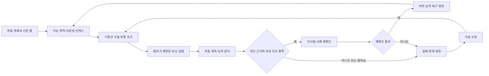

# 의미 기반 스킬 정리와 실험형 룰 개선

## 상태와 의사결정

이 설계는 사용자의 **“설계대로 진행”**으로 승인되어 구현했다. 아래 초기 조사와 승인 대기 기록은 당시 상태를 보존한 이력이다. 현재 구현·검증 결과는 [완료 보고서](../../adaptive-rule-lab-completion-2026-09-14.md)를 기준으로 확인한다. 목표는 파일을 기능·목적·의존성·관측된 사용 빈도로 찾고 연결하면서, 독자적인 실험을 실제 결과로 검증하여 룰을 개선하는 것이다.

구현은 기존 경로와 실행 권한을 보존하는 의미 메타데이터 계층과, 범위가 제한된 실험 루프를 결합한다. 새 아이디어는 탐색 대상으로 보존하고, 기본 룰의 승격은 검증된 성능 개선에만 허용한다. 최초 설계 턴은 이 문서만 작성했으며, 승인 후 저장소 스킬·실행기·인덱스·실험 이력을 추가했다. 원본 삭제와 Git 커밋은 수행하지 않았다.

## 1. 현재 파일에서 확인한 사실

확인 시점은 2026-09-14, Desktop 루트는 `C:\AbandonWare\demo-1\demo-1\src`, 브랜치는 `codex/owned-runtime-browser-restart`, HEAD는 `0796a3c5b29bbb08c3314bd40649d856d4a7bce6`이다. 조사 시 Git 변경 항목 3,074개와 index lock이 있었다. 이들은 다른 파일의 읽기 및 새 설계 문서 작성까지 막는 조건은 아니다. 기존 변경과 잠금은 보존한다.

| 확인 대상 | 관측 결과 | 해석과 한계 |
|---|---|---|
| 기존 `awx_skill_registry.py` 실행 | 저장소 64개, 개인 12개, 총 76개, 이름 충돌 0건 | 각 루트 바로 아래 `*/SKILL.md`의 선언 이름 검사. 의미 중복 검사 결과가 아님 |
| `.agents/skills` 파일 조사 | 220개 파일, Markdown 123개, SKILL.md 64개 | 숨김·ignore 항목 포함. 관련 파일 수이며 모두 독립 스킬은 아님 |
| `agent-prompts` 파일 조사 | 126개 파일, Markdown 74개 | 생성물·메타데이터와 원본을 분리해야 함 |
| `docs/superpowers/specs` 조사 | Markdown 76개 | 설계의 존재가 구현·승격을 증명하지 않음 |
| `.agents/skills/INDEX.md` | `(kind, canonicalId)`와 고정 라우팅 필드 | 필드 추가는 현재 엄격한 검증과 충돌할 수 있음 |
| `prompts.manifest.yaml` | 프롬프트 등록·병합·출력의 소유자 | 의미 분류나 실험 원장의 소유자가 아님 |
| 사용 빈도 | 항목별 실제 호출 이력을 증명하는 공통 원장 미확인 | 초기값은 `not_observed`, 0회로 추정하지 않음 |
| 기존 실험 루프 후보 | source-health 검증 결과를 내보내는 코드 확인 | 일반 후보 실험·승격·실패 영구 보존 기능은 확인되지 않음 |

주요 근거는 [라우팅 인덱스](../../../.agents/skills/INDEX.md), [현재 레지스트리](../../../scripts/awx_skill_registry.py), [인덱스 검증 계약](../../../scripts/test_codex_instruction_governance.py), [프롬프트 manifest](../../../agent-prompts/prompts.manifest.yaml), [source-health 검증 루프](../../../scripts/source_health_validation_loop.py)다. 레지스트리는 읽기 전용 CLI만 실행했으며 config 변경 함수는 호출하지 않았다.

[Stochastic Tool Lab 설계](2026-07-31-stochastic-tool-lab-design.md)는 목적이 일부 겹치지만, 지정된 `tools/stochastic_tool_lab`, `tools/stochastic-tool-lab`, 대응 scripts 엔트리와 관련 구현 파일은 이번 제한된 조사에서 찾지 못했다. 기존 설계를 참고 자료로 연결하되 실행 가능한 도구로 등록하지 않는다. [소수 신호 스킬](../../../.agents/skills/demo1-forecasting-minority-signals/SKILL.md)과 기존 반증·검증 스킬들의 역할은 유지한다.

현재 핵심 파일의 SHA-256은 다음과 같다. 구현 직전에 다시 확인해야 하며 이 값이 미래의 쓰기 권한을 부여하지 않는다.

| 경로 | SHA-256 |
|---|---|
| `AGENTS.md` | `362e13554ed4a18321f82ed4c40c73dad47baf911d207419ab926e9def5ae87a` |
| `.agents/skills/INDEX.md` | `27d69ac8eedbd5a208b34e2d6768851fb81fa556334560f153ec7988e47f241d` |
| `scripts/awx_skill_registry.py` | `9a7f0a12f192b1b50a022131b6a213aa044b00d1c7ab1993ed84afe7921d884f` |
| `scripts/test_codex_instruction_governance.py` | `59ccddb908768582ba90e127504f68a58d973622451e1099b2c7456999958ac5` |
| `agent-prompts/prompts.manifest.yaml` | `f8633327011e1e141c5f8eb970c3b10903d6dfb3c70b790ce5cae0257b30ed0f` |

## 2. 선택 가능한 접근

| 접근 | 장점 | 비용·제약 | 판단 |
|---|---|---|---|
| 기존 인덱스에 연결되는 별도 의미 메타데이터 | 원본 경로·라우팅 계약 보존, 점진적 분류와 재생성 가능 | 메타데이터와 원본 해시 연결 검증 필요 | 권장 |
| 기존 INDEX 스키마 전체 확장 | 한 곳에 모든 정보 포함 | 엄격한 검증·소비자 변경과 기존 작성자 조정 필요 | 첫 구현에는 범위가 큼 |
| 카테고리별 폴더 이동·파일 통합 | 사람에게 폴더가 단순해짐 | 참조·트리거·소유권 손실 가능, 다중 분류 표현이 어려움 | 기능 보존 근거가 있는 개별 병합에만 사용 |

권장안은 파일 위치를 정체성으로만 보지 않는다. 같은 항목에 여러 기능과 목적을 붙이고 관계를 따라 탐색한다. 상위 규칙과 원래 실행 경로는 원본 파일이 계속 소유한다. 의미상 가깝다는 판단은 검색과 검토를 돕는 정보이며 실행 권한이나 대체 가능성 판정이 아니다.

## 3. 정리 범위와 산출물

첫 구현의 읽기 범위는 저장소 `AGENTS.md`, `.agents/skills`, `agent-prompts`, `docs/superpowers/specs`, 그리고 이들에서 명시적으로 참조한 관련 도구다. 개인 스킬 두 루트는 중복·연관 관계의 참고 대상으로 읽는다. 플러그인 캐시와 시스템 스킬은 출처 링크만 연결하고 원본을 편집하지 않는다. 접근 불가 경로는 `unreadable`로 보고하여 목록에서 조용히 사라지지 않게 한다.

| 예정 산출물 | 역할 |
|---|---|
| `.agents/skills/semantic-catalog.yaml` | 에이전트가 검토한 기능·목적·관계와 근거를 소유하는 메타데이터 |
| `.agents/skills/semantic-index.json` | 원본 해시·관측 이력과 메타데이터를 결합한 기계용 검색 인덱스 |
| `.agents/skills/SEMANTIC_INDEX.md` | 기능·목적·의존성·상태별로 탐색하는 생성 문서 |
| `.agents/skills/demo1-adaptive-rule-lab/SKILL.md` 및 `agents/openai.yaml` | 자동 정리·실험 루프의 진입 조건과 작업 규칙 |
| 같은 스킬의 `scripts/catalog.py` | 수집·검색 후보 추출·근거 검사·인덱스 생성 |
| 같은 스킬의 `scripts/experiment.py` | 제한된 로컬 평가·지표 수집·비교·승격 판정·실패 기록 |
| 같은 스킬의 `references/experiment-contract.md`와 focused tests | 데이터 계약, 지표 정의, 거짓 승격 방지 사례 |
| `data/agent-handoff/adaptive-rule-lab/<runId>/` | 실행별 원본 목록, 이벤트, 계측치, 비교·병합 제안, 복구 근거 |

`INDEX.md`에는 기존 스키마에 맞는 새 진입점 한 건만 등록한다. 의미 필드를 기존 라우팅 행에 추가하지 않는다. `AGENTS.md`에는 관련 작업의 시작·종료 시 이 진입점을 사용하도록 짧은 라우팅 블록을 둔다. 기존 레지스트리의 충돌 검사와 프롬프트 manifest의 등록·출력 소유권은 재사용한다. 새 데이터베이스·임베딩 서비스·상시 프로세스는 첫 구현에 필요하지 않다.

예정 CLI 동작은 `catalog inventory`, `catalog suggest`, `catalog validate`, `catalog build`, `catalog search`, `experiment run`, `experiment compare`, `experiment promote`, `experiment rollback`이다. 이는 승인 후 구현할 인터페이스 설명이며 현재 실행 가능한 명령이라고 제시하지 않는다.

## 4. 유연한 분류와 의미 연결

### 항목 정체성과 분류

기존 경로는 `(kind, canonicalId)`를 유지한다. 서로 다른 루트의 동명 항목은 `scopeId`로 구분한다. 미등록 지시서는 종류·루트 별칭·정규화 상대 경로로 안정적인 임시 ID를 만들고, 정식 등록 후에도 별칭을 보존한다. 대소문자·Unicode·슬래시 충돌은 발견해서 보고하되 서로 다른 권한 영역의 항목을 자동 합치지 않는다.

각 항목은 `functions[]`, `purposes[]`, `inputs[]`, `outputs[]`, `dependencies[]`, `constraints[]`, `status`, `sourceHash`를 가진다. 분류 값은 확장 가능하며 한 항목이 여러 분류에 속할 수 있다. 자동 생성 라벨, 에이전트 검토 라벨, 관측된 사실을 구별한다. 새 라벨을 만들 때 유사 라벨과의 연결·별칭 가능성을 먼저 확인한다.

사용 정보에는 `observedInvocations`, `eligibleOpportunities`, `windowStart`, `windowEnd`, `lastObservedAt`, `coverage`를 기록한다. 관측 범위가 없는 항목은 값이 null이다. 수정 시각, 파일 크기, 문서 언급 횟수, 태스크 목록 등으로 실행 횟수를 대신하지 않는다. 빈도는 같은 계측 범위에서만 순위 보조 신호로 사용하고, 복구·권한·회귀 검증 기능은 별도로 보존한다.

### 관계의 종류와 신뢰도

| 관계 | 뜻 | 자동화 경계 |
|---|---|---|
| `related_to` | 목적이나 기능이 관련됨 | 근거 있는 탐색 링크 생성 가능 |
| `requires` / `produces_input_for` | 실행 의존 또는 입출력 연결 | 명시적 참조·계약으로 확인, 순환·누락 검사 |
| `alternative_to` | 같은 목적의 다른 접근 | 동시에 유지하며 실험 비교 가능 |
| `overlaps_with` | 범위가 일부 중첩됨 | 병합 후보 조사로 연결 |
| `conflicts_with` | 트리거·권한·조건·효과가 충돌함 | 충돌을 숨기지 않고 원본 우선순위 적용 |
| `duplicate_candidate` | 동등성 검토가 필요함 | 유사도만으로 alias·삭제·병합하지 않음 |
| `supersedes` | 검증된 새 버전이 해당 범위를 대체함 | 승격 근거, 이전 버전과 복구 경로 필요 |

각 관계에 양쪽 원본 해시, 근거 위치, 판단 이유, 생성 방식, 검토 상태를 붙인다. 해시가 바뀌면 관계는 `stale`이 되어 현재 검증이 필요한 후보로 내려간다. 유사도 점수와 검토 확신도는 성능 점수와 별개다.

### 에이전트가 의미를 판단하는 흐름

1. 로컬 스캐너가 제목·설명·입출력·참조를 읽고 lexical 후보를 좁힌다. 단순 키워드 일치를 의미 검증으로 표시하지 않는다.
2. 현재 에이전트가 원본의 관련 구간을 비교하여 목적·트리거·부정 조건·권한·의존성의 일치와 차이를 기록한다. 외부 서비스로 사적 문서를 일괄 보내지 않는다.
3. 원본 해시와 근거가 맞는 분류·관계만 메타데이터에 반영한다. 에이전트가 사용할 수 없으면 `semantic_review_needed`로 보존한다.
4. 인덱스 검색은 여러 facet과 관계를 결합한다. 예를 들어 ‘불확실한 가설을 세우고 반례로 검증’은 가설 생성 → 반증 검색 → 일관성 검증으로 연결하되 이들의 실행 역할은 합치지 않는다.
5. 같은 입력 해시로 재실행하면 같은 생성 인덱스를 얻는다. 변경·삭제·이동·불가독 항목은 diff에 나타내며, 생성 시각처럼 재생성 가능한 필드는 내용 해시에서 분리한다.

## 5. 중복 판단과 기능 보존

같은 이름, 같은 바이트, 같은 목적, 같은 실행 효과를 서로 다른 판정으로 기록한다. 동일 내용이어도 적용 루트나 의존 경로가 다르면 그대로 두고 연결할 수 있다. 병합 후보는 다음 조건을 모두 비교한다: 트리거, 기능과 목적, 입출력, 권한, 금지 조건, 의존성, 보호 기능, 부정 사례, 실제 사용 위치.

판정은 `keep_distinct`, `link_related`, `merge_candidate`, `merge_verified`, `evidence_needed`로 남긴다. `merge_candidate`에는 보존해야 할 기능 목록과 합친 뒤의 본문 diff를 포함한다. 중복 문장만 줄이고 고유한 복구 절차·예외·제약은 보존한다. 관계 연결만으로 충분하면 파일 이동을 하지 않는다.

병합을 적용할 때는 선언한 파일의 preimage를 다시 확인하고, 변경 전 본문과 참조를 복구 가능하게 보존한다. 다른 작성자의 변경이 발견되면 해당 병합만 보류한다. 기존 규칙을 대체하는 병합은 8절의 승격 검증도 통과해야 한다. 기존 상위 권한 규칙, 사용자 승인 조건, secret 정책은 실험 최적화 대상에서 제외한다.

## 6. 실험·창발형 작업을 지원하는 룰

아래 규칙은 구현할 스킬의 핵심 내용이다.

- 공개된 기법은 참고·비교 기준으로 쓰고, 그 기법을 따랐다는 이유로 정답이나 우월성을 부여하지 않는다. 독자적 접근의 새로움도 효과의 증거로 취급하지 않는다.
- 시작 전에 해결하려는 관측 문제, 가설, 예상되는 변화, 반증 조건, 비교 기준, 보호해야 할 기능, 시간·시도 예산을 짧게 고정한다.
- 실험의 핵심 차이를 명시한다. 여러 요소를 함께 바꾸어야 하면 각각의 기여를 구별할 수 있도록 ablation을 계획한다.
- 기준 룰, 평가 사례, 점수식, 지표 분모, 최소 의미 개선폭, 판정 기준을 후보와 별도 관리한다. 후보가 자신의 시험과 승격 기준을 유리하게 바꾸지 못하게 한다.
- 낯선 후보를 탐색할 여지를 둔다. 신규 후보의 초기 열세는 폐기 근거가 아니라 적용 조건·관측 결과를 남길 이유다. 탐색 가치와 운영 승격은 별도로 판단한다.
- 디버깅 결과는 최초 실패 경계와 재현·수정·재검증으로 기록한다. 가설에 맞는 설명만 남기지 않고 반례와 설명되지 않은 오차를 함께 남긴다.
- 실패 후 원인 후보를 수정하고, 바뀐 입력·가설·환경을 이전 실험에 연결하여 재실험한다. 바뀐 근거 없이 같은 실패를 반복하지 않는다.
- 성능이 개선되지 않거나 불확실하면 기준 룰을 유지한다. 일부 조건에서만 좋아지면 그 조건에만 후보 적용 범위를 한정한다.
- 교정할 때 구 버전과 새 버전, 변경 이유, 실제 비교 결과, 적용 범위, 되돌리는 조건을 남긴다. 실패 기록의 삭제나 성공 사례만의 선택적 보고를 금지한다.

## 7. 자동 계측과 점수

### 수집 경계

실험 실행기는 등록된 로컬 평가 명령을 실행하면서 시작·종료·timeout·exit code와 판정 파일을 수집한다. JUnit XML 같은 구조화된 결과, 명시적으로 연결한 query-quality 평가 결과, 단조 시계 기반 지연시간을 변환한다. 기존 source-health 출력은 진단 입력으로 사용할 수 있으나 그것만으로 질의 의미 품질을 증명하지 않는다.

임의의 지시서 본문에 적힌 shell 명령은 자동 실행하지 않는다. 허용된 평가 명령, 정확한 인자 배열, 작업 디렉터리, timeout을 실행 계약에 고정한다. 외부 provider와 실제 사용자 트래픽은 이 초기 로컬 계측 계약의 대상이 아니다. 명시적으로 허용한 측정 경로를 나중에 추가할 수 있다.

| 지표 | 정의 | 누락·실패 처리 |
|---|---|---|
| 의미 성공률 `S` | 사전 정의한 목표·제약을 충족한 사례 / 시작된 적격 사례 | HTTP·명령 성공으로 대체 불가. timeout·오류는 분모에 포함 |
| 오류율 `E` | 오류로 종료한 적격 사례 / 시작된 적격 사례 | skip·cancel·timeout을 별도 이유로도 표시. 관측 누락과 0을 구별 |
| 질의 품질 `Q` | 의도·제약 보존, 검색 실행 가능성, 근거 적합성의 고정 rubric | 평가자·rubric 버전과 사례를 고정. 단독 자기평가만 있으면 승격 불가 |
| 디버깅 검증률 `D` | 재현된 실패를 해결하고 관련 회귀도 통과한 결함 / 사전 고정 결함 | 로그 설명만으로 성공 처리 불가. 적용할 결함이 없으면 N/A |
| 지연 `L` | 동일 조건의 전체 적격 요청 end-to-end ms, p50/p95 | 성공 요청만 집계하지 않음. timeout은 우측 검열 정보도 남김 |
| 계측 완전성 | 기대 이벤트·case pair 대비 관측·결합 비율 | 누락·중복·해시 불일치는 승격 근거 무효 |
| 사용 빈도 | 계측된 항목별 실행 횟수와 관측 기간 | 접근·선택·실행·완료를 구별하고 반복 이벤트 중복 제거 |

평가 단위는 `runId`, `experimentId`, `revision`, `routeId`, `caseId`, `attemptId`이다. baseline과 candidate를 같은 case와 환경 블록에서 교차 순서로 실행한다. 동일 사례의 반복 실행을 서로 독립적인 사례 수처럼 세지 않는다. 소요 시간과 환경 해시를 남기고 cold/warm·장비·캐시·평가자 변경을 비교에서 섞지 않는다.

### 프로필별 점수

처음 제안하는 query 프로필은 `score = 100 × (0.50S + 0.30Q + 0.20U)`이다. 사례별 지연 효용은 사전에 고정한 지연 목표에서 1, 상한에서 0이 되는 구간 선형 함수이며 범위 밖은 0..1로 제한한다. `U`는 전체 적격 사례 효용의 평균이며 timeout은 효용 0이다. 두 지연 기준은 실험 전에 정하고 baseline과 candidate에 동일하게 적용한다. 사례별 점수의 평균이 위 집계식과 일치해야 한다. p95는 별도 지연 보호 조건에 사용하며, 검열 때문에 추정할 수 없으면 정확한 값처럼 채우지 않는다. debugging 프로필은 같은 위치의 `Q` 대신 `D`를 사용한다. 다른 작업은 이유와 버전이 있는 별도 프로필을 정의할 수 있다.

이 가중치는 **초기 설계 제안값**이며 기존 시스템에서 검증된 최적값이 아니다. 오류율은 성공률과 중복 보상을 만들지 않도록 별도 보호 조건으로 관리한다. 누락된 필수 지표에 0이나 평균을 넣거나, 결과를 본 뒤 남은 가중치를 재분배하지 않는다. `NaN`, 무한대, 음수 지연, 잘못된 분모, 범위 밖 점수는 `invalid_measurement`다.

합성 산술 확인에서 `S=0.90`, `Q=0.80`, `U=0.75`이면 점수는 84다. Wolfram 평가로 식을 확인했으며 실제 스킬 성능 측정값은 아니다. 원시 지표와 표본 수·불확실성을 점수 옆에 항상 표시한다.

## 8. 승격 조건과 통계적 한계

자동 승격은 점수식보다 먼저 권한, 보호 기능, 데이터 완전성, 평가 독립성 조건을 확인한다. 이를 통과하지 못한 후보의 높은 점수는 적용 이유가 되지 않는다. 유사성·새로움·많은 사용·모델의 찬성도 승격 근거를 대신하지 않는다.

1. **고정된 비교 계약:** baseline/candidate, 원본 해시, 평가기, cases, 실행 환경, 지표·가중치·보호 조건, 표본 계획, 시도 한도를 결과를 보기 전에 고정한다.
2. **의미 있는 개선:** 같은 사례의 쌍별 점수 차이와 불확실성으로 판정한다. 단순한 양의 차이나 전역 고정 ‘30건’ 규칙을 쓰지 않는다. baseline의 변동성과 검출하려는 최소 개선폭으로 필요한 표본을 정한다. 첫 최소 개선폭 제안은 100점 척도 3점이며 실험 시작 전에 조정·기록할 수 있다.
3. **별도 보호 조건:** 성공률·질의 품질·복구 기능을 포함한 필수 지표에 사전 정의한 열화 허용 범위를 적용한다. 원칙적으로 보호 기능 손실은 0건이어야 한다. 지연·오류율 악화는 점수 상승으로 숨기지 않는다.
4. **반복 판정 통제:** 첫 구현은 고정 표본·고정 종료 시점과 사전 등록한 최대 3후보, 후보별 최대 3revision을 사용한다. 개발 결과는 탐색용으로만 해석하고, revision별 최종 미사용 사례 검증을 최대 한 번씩 수행한다. 이 최대 9번의 최종 검증을 같은 비교 가족으로 묶고 family-wise alpha 0.05를 나눠 보수적으로 처리한다. 같은 baseline·목표·평가 집합의 계속된 세션은 예산을 임의로 초기화하지 않는다.
5. **불확실성 계산:** 연속 점수 차이는 독립 case 단위의 paired resampling으로 산출하고, 비율은 적절한 paired binary 분석을 사용한다. 작은 표본·퇴화 분포·측정 검열은 정규 근사나 0폭 신뢰구간으로 단정하지 않는다. 지원되지 않는 표본 구조는 `insufficient_evidence`로 남긴다. 방법·seed·반복 수·오차 범위를 결과에 포함한다.
6. **미사용 사례 재확인:** 개발·오차 분석에 쓰지 않은 사전 지정 평가 묶음과 다른 실행 블록에서 확인한다. 재확인 결과를 본 뒤 후보를 고치면 그 묶음은 이후 개발 자료이며 다시 미사용 자료라고 부르지 않는다. 데이터가 없으면 자동 승격을 보류한다.
7. **버전 전환:** 점수 차이의 보수적 하한이 최소 개선폭을 넘고 보호 조건도 통과한 경우에만 해당 범위에서 `promotion_eligible`이 된다. 승인된 실험 디렉터리 내 active-version 포인터는 자동 전환할 수 있다. 기존 공유 룰·스킬에 대한 변경은 검토 가능한 diff와 현재 소유자·preimage 검증을 거쳐 현재 승인 범위에서 적용한다.
8. **회귀와 복구:** 전환 전 버전·해시와 rollback 포인터를 먼저 남긴다. 이후 관련 검증에서 열화하면 소유한 변경만 복원하고 `rolled_back` 기록을 연결한다. 적용 후 파일이 다른 작성자에 의해 바뀌었으면 강제 복원하지 않는다.

여기서 3후보·3revision·3점은 조정 가능한 첫 실행 정책이며 연구가 보장한 보편 임계값이 아니다. 반복 관측 중 심각한 손상은 즉시 중단할 수 있지만, 유리한 순간의 수치로 조기 승격하지 않는다. 합성 계산에서 모든 귀무가설이 참이고 독립인 20개 검정을 각각 alpha 0.05로 수행하면 한 번 이상 오탐할 확률은 `1 − 0.95^20 = 64.1514%`다. 이 계산은 반복 실험의 주의점을 보여주며 현재 프로젝트의 오탐률 추정치는 아니다.

## 9. 실패 기록과 자동 반복

각 실행은 원본 이벤트를 덮어쓰지 않는 고유 파일로 남기고, 전체 목록·검색 인덱스는 이들로부터 재생성한다. 성공·실패·보류·timeout·중단 모두 기록한다. 동일 이벤트 재수집은 중복 제거하고, 중단된 쓰기는 완료 이벤트로 위장하지 않는다. 완료된 실행 수정은 새 revision으로만 표현한다.

실패 기록은 가설 ID, 선행 실험 ID, source/candidate/evaluator/environment 해시, 실패 분류, 기대와 관측의 차이, 영향 사례 수, 확인된 원인과 미확인 원인 후보, 반례 위치, 다음 수정, 재실험 조건을 포함한다. 비밀·원시 사용자 질의·provider 응답·인증값 대신 허용된 계측치와 비식별 근거를 보존한다. 재현에 필요한 사적 사례는 기존 보호된 저장소의 참조로 연결하고 자동 복제하지 않는다.

에이전트는 새 실험 전에 같은 목적·실패 조건·의존성·버전의 기록을 검색한다. 같은 실패는 삭제하지 않으며, 원인 수정이나 환경 변화의 근거가 없는 재시도는 `unchanged_failure`로 중단한다. 오래된 실패는 현재 버전에서 반례가 해소됐는지 확인할 수 있고, 해소되면 과거 기록에 `resolved_by` 관계만 추가한다.

자동 반복은 현재 호출 안에서 `관측 → 오차 분석 → 가설 revision → 재실험 → 비교 → 룰 교정`으로 진행한다. 기본 예산은 세션 15분, 후보 최대 3개, 후보당 최대 3revision, 로컬 평가 한 번 최대 60초다. 명시적인 더 짧은 작업 예산을 우선하며, 미사용 평가셋 부족·변하지 않은 실패·권한 부족·측정 오류에서는 해당 후보만 정지한다. 종료 후 조용히 계속 도는 watcher나 예약 작업을 뜻하지 않는다.

## 10. 자동화의 정확한 의미와 도구 경계

관련 작업 진입 시 마지막 목록의 해시를 비교해 변경된 항목만 다시 수집한다. 에이전트는 분류 후보와 관계 후보를 검토하고 결과를 구조화해 기록한다. 관련 스킬·지시서 수정 뒤에는 인덱스 검증·재생성과 실행 기록이 이어진다. 이 범위 안의 반복 작업은 매 단계 사용자에게 되묻지 않고 실행할 수 있도록 구현한다.

| 지정된 도구·영역 | 이번에 확인·사용한 것 | 구현 단계에서의 역할 |
|---|---|---|
| Superpowers | 설계 승인 규칙, 완료 전 검증 절차 | 설계 승인 후 구현 계획·focused 검증 |
| Plugin Management | 기존 연결 도구 목록과 스킬 확인 | 필요한 기능이 있을 때만 연결, 신규 설치 불필요 |
| Deep Research / SciSpace | 공개 연구 검색, SciSpace 10개 검색 결과 수신, 주요 원문 확인 | 아이디어의 참고와 반증 근거, 로컬 성능 근거 대체 불가 |
| Data | 지표 정의·분모·보호 조건 설계 절차 | 실제 로컬 계측치의 품질 검사와 비교 |
| Wolfram | 통계 참고와 합성 산술 계산 응답 | 필요한 계산 검산, 사적 입력을 보내지 않음 |
| Visualize | 정적 구조에는 Mermaid 사용 지침 확인 | 본 문서의 관계·피드백 흐름 |
| Computer / Browser | 셸·파일 API로 현황 조사 가능 | 탐색 UI를 구현하는 범위가 생기면 가시적 검증 |
| Sites | 공개 게시 필요가 없는 로컬 산출물 범위 | 별도로 사이트 산출물이 승인될 때 사용 |
| GLM worker | 키 존재만 boolean으로 확인, CLI 0.144.1 + sol v2 확인 | 현재 저장소의 task-delivery HOLD에 따라 호출 0회 |
| 기본 탐색 에이전트 | terra/medium 한 에이전트가 독립 파일 소유자 조사 | 최종 판단·파일 쓰기는 부모 에이전트가 담당 |
| AWX Control Tower / 복구 | 관련 MCP 도구가 카탈로그에 노출됨 | 실제 디버깅 로그가 연결되면 기존 오류 분류를 재사용. runtime 호출·복구 실행은 미수행 |

카탈로그 노출, 프로세스 응답, 실제 업무 성공을 구별한다. 적용 대상이 없는 도구를 형식적으로 호출하지 않는다. 이 설계가 환경·credential·권한·DB·Java/Spring runtime을 변경하는 권한을 새로 만들지 않는다. Codex 실험 산출물은 `.codex/memories`, 애플리케이션 학습 데이터, `sessionId`·`ctx.memory`와 분리한다.

## 11. 승인 후 검증할 인수 조건

| 사례 | 기대 결과 |
|---|---|
| 한국어·영어 표현이 다르지만 목적이 같은 항목 | 의미 검토 근거와 관계 링크 생성 |
| 용어는 비슷하지만 권한·대상이 반대인 항목 | 별도 유지, 충돌 또는 차이 표시 |
| 사용 이력 없는 복구 스킬 | 빈도 미관측, 삭제·비활성화되지 않음 |
| 같은 원본으로 반복 생성 | 내용 hash 동일, 중복 레코드 없음 |
| 원본 변경·삭제·접근 불가 | stale/missing/unreadable 명시, 조용한 누락 없음 |
| 기존 INDEX 검증 | 고정 스키마와 route identity 계약 유지 |
| 경로 탈출·reparse traversal·동시 원본 변경 | 해당 쓰기 거부, 원본 보존 |
| 의미 품질 저하와 지연 개선이 함께 발생 | 품질 보호 조건 때문에 승격 거부 |
| 잘못된 분모·누락·NaN·timeout·성공 요청만 집계 | 측정 오류나 실패를 반영, 거짓 고득점 차단 |
| 좋은/나쁜 sentinel 평가 | 평가기가 둘을 구분해야 실제 후보 평가 허용 |
| 사례·점수식·evaluator hash를 후보가 변경 | 비교 계약 위반으로 승격 거부 |
| 작은 개선·동점·표본 부족·재사용 holdout | baseline 유지 또는 evidence_needed |
| 미사용 사례에서 재확인된 충분한 개선 | 해당 조건의 버전만 승격 가능 |
| 실패 후 재시작·중복 이벤트 수집 | 실패 이력 보존, 이벤트 중복 없음 |
| 승격 후 회귀·원본의 동시 변경 | 자신이 소유한 버전만 rollback, 타인 변경 보호 |
| 독창적 후보가 초기에는 실패 | 실패 원인과 탐색 가치는 보존, 운영 승격은 하지 않음 |

기존 검증기는 바뀐 스킬의 frontmatter·메타데이터·등록 계약을 검사하고, 새 focused tests는 위 의사결정 경계를 검사한다. 작은 예제의 성공을 전체 스킬 정리나 실제 성능 개선으로 보고하지 않는다. Java/Gradle runtime 검증은 이 artifact/tooling 작업의 완료 기준에 포함하지 않는다.

완료는 다음 세 상태로 나누어 보고한다: `catalog_ready`는 실제 대상 수·관계·누락 보고와 인덱스 검증 완료, `loop_ready`는 수집·평가·실패 보존·승격 거부/허용 테스트 완료, `measured_improvement`는 실제 baseline 대비 동일 범위의 개선 근거가 존재하는 경우다. 첫 두 상태만으로 세 번째를 주장하지 않는다. 현재 상태는 세 가지 모두 **미완료**, `design_proposed`다.

## 12. 연구 근거와 적용 한계

**의미 분류.** W3C SKOS는 개념의 라벨·상하·관련 관계와 서로 다른 체계 사이의 가까운 일치·정확한 일치를 구별한다. 특히 가까운 일치를 전이적으로 확대하지 않는다. 이 설계는 이런 구분을 작은 로컬 메타데이터에 참고한다. RDF 서버 도입이나 스킬의 실행 동등성을 표준이 보장한다는 주장은 하지 않는다. [1]

**창발과 다양성.** Cully와 Demiris의 Quality-Diversity 연구는 단 하나의 최적해 대신 여러 행동 영역의 다양한 고성능 해를 보존하는 틀을 다룬다. 이것은 새 접근을 보존할 이유를 제공하지만, 해당 논문의 성능 결과를 스킬 운영 성능으로 이전할 수는 없다. 여기서는 대안 아이디어를 보존하고 별도 검증하는 설계 원리로만 사용한다. [2]

**지표 해석.** Microsoft의 실험 연구는 지표의 움직임을 잘못 해석하거나 세그먼트·계측 이상을 놓치면 잘못된 출시 결정을 할 수 있음을 다룬다. 따라서 단일 총점과 함께 원시 비율·분모·지연·보호 조건을 유지한다. 관측 도중의 반복 판정은 추가 오류 통제가 필요하다. [3][4]

**반복 실험.** Dwork 등의 연구는 결과를 보며 가설을 수정하고 holdout을 반복 재사용하면 holdout 자체에도 과적합할 수 있음을 보인다. 첫 구현은 그 논문의 복잡한 재사용 알고리즘을 그대로 구현하지 않는다. 평가셋 역할 구분, 재사용 추적, 고정 예산과 미사용 재확인으로 적용 범위를 제한한다. [5]

**계산과 증거.** Wolfram의 paired-test 문서는 관측값을 짝지어 비교하는 방법과 가정을 설명한다. 어떤 검정도 모든 오류·지연 분포에 자동으로 맞는 것은 아니다. 합성 산술 검산 결과는 측정 성능과 구별한다. [6]

### 출처

1. W3C. *SKOS Simple Knowledge Organization System Reference*. Recommendation, 18 August 2009. [정확한 문서](https://www.w3.org/TR/skos-reference/).
2. Antoine Cully, Yiannis Demiris. *Quality and Diversity Optimization: A Unifying Modular Framework*. arXiv/IEEE Transactions on Evolutionary Computation. [저자 초록·원문 연결](https://arxiv.org/abs/1708.09251), [DOI](https://doi.org/10.1109/TEVC.2017.2704781). SciSpace 검색 후 원문 페이지 확인.
3. Pavel Dmitriev, Somit Gupta, Dong Woo Kim, Garnet Vaz. *A Dirty Dozen: Twelve Common Metric Interpretation Pitfalls in Online Controlled Experiments*. KDD 2017. [저자 소속 기관의 PDF](https://www.microsoft.com/en-us/research/wp-content/uploads/2020/08/2017-08-KDDMetricInterpretationPitfalls.pdf).
4. Widad Machmouchi, Somit Gupta, Ruhan Zhang. *Patterns of Trustworthy Experimentation: During-Experiment Stage*. Microsoft Research, 25 January 2021. [원문](https://www.microsoft.com/en-us/research/articles/patterns-of-trustworthy-experimentation-during-experiment-stage/).
5. Cynthia Dwork, Vitaly Feldman, Moritz Hardt, Toni Pitassi, Omer Reingold, Aaron Roth. *Generalization in Adaptive Data Analysis and Holdout Reuse*. NeurIPS 2015. [학회 원문 페이지](https://papers.neurips.cc/paper_files/paper/2015/hash/bad5f33780c42f2588878a9d07405083-Abstract.html).
6. Wolfram Research. *PairedTTest / Hypothesis Tests*. [paired-test 문서](https://reference.wolfram.com/language/ref/PairedTTest.html), [검정 안내](https://reference.wolfram.com/language/guide/HypothesisTests.html). 이 태스크의 Wolfram 계산 결과: `{0.6415140775914578, 0.0025000000000000005, 84.}`. 첫 두 값은 독립 20검정 오탐 예제와 Bonferroni 예제이며, 실제 운영 통계가 아니다.

위 연구는 설계 판단의 근거이며 기존 코드의 실행 사실은 1절의 로컬 증거로만 판단한다. 문헌의 방식과 독자적 접근은 같은 사전 고정 기준으로 비교한다.

## 13. 최초 설계 시점의 결정과 보류 이력

검토할 결정은 **기존 원본·라우팅을 보존하는 의미 메타데이터 계층과 위 제한된 실험 루프를 구현할지**다. 승인되면 현재 문서를 구체화한 구현 계획을 작성하고, 실제 파일의 fresh preimage와 소유 범위를 다시 확인한 뒤 구현·focused 검증·초기 인덱스 생성을 끝까지 진행한다. 첫 구현에서는 개인·플러그인 원본을 참고만 하고, 저장소 산출물과 승인된 관련 룰만 수정한다.

- `holdScope`: 자동 분류·실험 실행기 구현과 기존 룰 적용
- `firstBlockingRule`: 명시적으로 선택된 Superpowers brainstorming의 구현 전 설계 승인
- `blockingEvidence`: 현재 설계안에 대한 승인 미수신
- `independentWorkCompleted`: 현황 수집, 기존 레지스트리 실행, 재사용 소유자 조사, 공개 연구 확인, 합성 계산 검산, 검토 가능한 설계 문서
- `repositoryWideHold`: false
- `goalStatus`: active; 설계안 전달만으로 완료 처리하지 않음

승인 요구의 정확한 근거는 [brainstorming SKILL.md](C:/Users/nninn/.codex/plugins/cache/openai-curated-remote/superpowers/6.3.0/skills/brainstorming/SKILL.md)의 “Do NOT … take any implementation action until … they have approved it.”이다. Git 잠금은 이 설계 승인 보류와 별개이며, 문서 작성 권한을 막는 이유로 사용하지 않는다.

## 14. 실제 스킬로 확인한 의미 관계와 병합 경계

다음 세 쌍은 2026-09-14의 읽기 전용 비교 결과다. 분류기의 실행 결과나 적용 완료 레코드가 아니라, 첫 구현에서 보존해야 할 의미 차이를 보여주는 검토 사례다. 관계의 방향과 적용 조건을 함께 기록해야 하며, 단순히 같이 사용된다고 무조건적인 `requires` 관계를 만들지 않는다.

| 실제 항목 쌍 | 공통 목적 | 결정적인 역할 차이 | 제안 관계·병합 판단 |
|---|---|---|---|
| 가설 생성 → 반증 검색 | 유사성에 기대지 않고 주장을 반증 가능하게 만들기 | 가설 생성은 대안 세계·unknown·반증 의도를 작성한다. 검색은 실행 질의와 정확히 세 개의 query slot·추적 근거를 소유한다 | 해당 가설 패킷을 검색 입력으로 쓸 때 `produces_input_for`; `keep_distinct` |
| 반증 검색 → 일관성 검증 | 원래 주장에 대한 근거와 판단 확보 | 검색 결과·trace는 판정이 아니다. 검증기가 증거 행렬과 authority·provenance·time·independence를 비교하고 gate 상태를 소유한다 | 새 검색 근거를 검증기에 전달할 때 `produces_input_for`; `keep_distinct` |
| 반증 삼각 검토 ↔ 소스 편집 사전 검토 | 세 관점을 다수결 없이 다루고 불확실성 보존 | 전자는 사실 주장에 대한 조건부 라우팅이다. 후자는 Desktop application-source 쓰기를 위한 고정 EvidenceSnapshot·순서 안정성·소유권 검증이다 | `related_to`; 권한 대상을 합치지 않고 `keep_distinct` |

첫 쌍의 근거는 [가설 생성 스킬](../../../.agents/skills/demo1-generating-falsifiable-hypotheses/SKILL.md)의 12·72행 부근과 [반증 검색 스킬](../../../.agents/skills/demo1-retrieving-counter-evidence/SKILL.md)의 11·51행 부근이다. 두 번째 쌍은 검색 스킬 68행 부근과 [일관성 검증 스킬](../../../.agents/skills/demo1-verifying-evidence-coherence/SKILL.md)의 13·87행 부근에 근거한다. 세 번째 쌍은 [삼각 검토 스킬](../../../.agents/skills/demo1-triangulating-counter-evidence/SKILL.md)의 13·98행 부근과 [소스 편집 사전 검토 스킬](../../../.agents/skills/demo1-source-edit-three-way-preflight/SKILL.md)의 8·31행 부근에 근거한다.

이 사례는 ‘중복 감소’를 무조건 파일 수 감소로 정의하면 기능이 손실될 수 있음을 보여준다. 첫 구현의 성공 기준에는 관련 역할의 발견과 연결, 잘못된 병합의 거부를 함께 넣는다. 합칠 수 있는 중복이 발견되지 않으면 병합 0건도 유효한 결과이며, 근거 없는 병합을 만들어 숫자를 맞추지 않는다.

조건부 의존성은 `activationCondition`과 근거 위치를 보존한다. 이미 유효한 evidence를 재사용할 수 있는 경로라면 새 검색을 필수로 만들지 않는다. relation 타입은 알려진 의미로 제한하되 기능·목적 라벨과 활성 조건은 확장 가능하게 관리한다.

## 15. 요구사항별 현재 완료 증거 감사

이 감사는 구현 산출물 확인과 최근 태스크 기록에 근거한다. 기존 태스크에는 원래 목표와 설계안 전달이 있고, 설계안 이후 명시적 사용자 승인은 아직 없다. 자동 목표 재개는 설계 승인으로 해석하지 않는다. 이전 턴은 조사와 설계 문서를 만든 `progress`였으며, 승인 응답은 live process가 아니므로 `verified wait`로 기록하지 않는다.

예정 산출물 9경로를 확인한 결과 존재하는 경로는 0개였다. 확인 경로는 의미 catalog, JSON index, Markdown index, 새 SKILL.md, agents/openai.yaml, catalog.py, experiment.py, experiment-contract.md, 실험 산출물 디렉터리다. 이 수는 임의의 기존 파일 부재를 전체 저장소 기능 부재로 확장한 값이 아니라, 본 설계가 약속한 구현 결과의 부재를 확인한 값이다.

| 원래 요구사항 | 현재 근거 | 현재 판정 | 구현 완료를 입증할 증거 |
|---|---|---|---|
| 스킬·룰·지시서 자동 정리 | 기존 스킬 이름 inventory 실행과 문서 범위 조사 | 미완료 | 대상별 수집 결과·제외/불가독 사유·안정 ID가 있는 실제 인덱스 |
| 에이전트의 의미 연결 | 14절의 실제 스킬 비교 3쌍 | 부분 근거만 있음 | 실제 catalog에 반영된 근거·해시·관계와 의미 검색 결과 |
| 기능·목적·의존성·빈도의 유연한 분류 | 필드·미관측 빈도·조건부 관계 설계 | 미완료 | 다중 facet 검색, 관측 이력, 변경 시 재검토를 검증한 출력 |
| 실험·창발형 작업 지원 룰 | 6절의 제안 규칙 | 설계만 있음 | 등록된 실행 진입점과 규칙을 사용한 한 번의 전체 실행 근거 |
| 디버깅·질의 품질·성공·오류·지연 자동 계측 | 지표 계약과 합성 산술 확인 | 미완료 | 평가기에서 수집한 사례별 실제 값·분모·환경·실패 이유 |
| 오차 분석 후 수정·재실험·비교·교정 | 루프·예산·revision·중단 조건 설계 | 미완료 | 선행 실험에 연결되는 가설 수정과 재실험·비교 기록 |
| 기존 룰 보존과 병합 가능성 우선 판단 | 원본 해시 보존, 3쌍 모두 분리 유지 판단 | 부분 근거만 있음 | 실제 병합 후보 평가·기능 보존·참조 검사와 원본 변경 검증 |
| 실제 지표가 좋아질 때만 승격 | 승격 계약과 반례 검증 계획 | 미완료 | 열화·동점·불충분 증거의 승격 거부와 적격 후보의 판정 테스트 |
| 실패 원인·결과 보존과 재실수 방지 | 실패 이벤트·재실험 조건 설계 | 미완료 | 실패 기록을 재시작 후 읽고 동일 조건 재시도를 억제한 실제 근거 |

요청은 근거 없는 승격을 막는 작동하는 체계를 만드는 것이다. 반드시 개선된 승자가 나와야만 체계가 완성되는 것은 아니다. 실제 평가에서 승자가 없으면 기준 룰을 유지한 사실을 보고한다. `measured_improvement`는 실제 개선 증거가 있는 경우에만 별도로 주장한다. 반대로, 시험용 수치 몇 개나 생성된 문서만으로 자동 정리·반복 실험 전체를 완료 처리하지 않는다.

현재 남은 결정은 13절의 설계 승인 한 가지다. 승인 전 조사와 검토 사례 보강은 끝냈으며, 반복적인 재검색이나 같은 사실의 재보고를 진척으로 세지 않는다. 실제 구현은 승인 후 진행한다.
