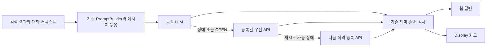

# GPU와 외부 서비스 장애 전환 설계

상태: 사용자 승인 범위의 소스 구현·장애 주입·가능한 실제 API/브라우저 검증을 진행했으며 전체 목표는 미완료다. 2026-09-15 최신 결과와 미적용 소스·실제 환경 증거는 [후속 검증 보고서](../reports/2026-09-15-gpu-service-failover-verification.md)에 기록했다. 이전 단계 보고서는 `data/agent-handoff/codex/report/gpu-service-failover-20260914/implementation-verification.md`에 보존했다. 이 설계 문서 자체와 변경 전 기준선은 완료 증명이 아니다.

## 목표와 보존 조건

RTX 3090 또는 로컬 추론 서버 장애가 RAG·Conversate 요청 전체를 중단시키지 않도록 기존 라우터와 복구 상태를 확장한다. 정상 로컬 경로, 등록 모델, 프로퍼티 이름, PromptBuilder 경계, 출처 검사와 사용자 취소 처리를 보존한다. 새 gateway 프레임워크, production 의존성, 모델 교체, 벡터 차원 변경은 필요하지 않다.

추론 장애 전환은 검색이 끝난 뒤의 동일한 메시지·대화 컨텍스트·근거 목록으로 수행한다. 검색을 다시 실행하거나 출처 번호를 재작성하지 않는다. 모델 간 답변 문구와 품질의 동일성은 보장할 수 없으므로 동일한 근거·의미 제약·출처 검사로 최종 답변을 평가한다. 검색 기능 자체가 고장 나 대체 검색을 사용하는 경우에는 실제 얻은 근거만 출처로 제시한다.

## 현재 증거

2026-09-14 Desktop 조사 기준이다. 아래는 실행 결과와 소스 관찰을 구분한다.

| ID | 관찰 | 근거 |
|---|---|---|
| E01 | Desktop root, Java 17.0.13, branch `codex/owned-runtime-browser-restart`, HEAD `0796a3c5b29bbb08c3314bd40649d856d4a7bce6` 확인 | 현재 Git/Java 명령 |
| E02 | tracked dirty 1711개, worktree 37개, index.lock 존재; source lease active/corrupt 0개, top-level patch 0개 | 현재 Git 및 기존 lease helper |
| E03 | root sourceSet은 main/java·main/resources, 테스트는 src/test/java; LangChain4j 선언은 1.0.1 | build.gradle.kts:134, 780 |
| E04 | GPU 조회에 RTX 3060·3090 모두 표시. 11434·11435 `/api/version`, `/api/tags`, `/api/ps` 응답. 각각 Ollama 0.32.13, 설치 모델 19개, 로드된 모델 0개 | 현재 read-only 명령; 추론 성공 증거 아님 |
| E05 | 이때 8080·8081·18085 listener 미관측 | 현재 포트 조회; 다른 모든 포트를 조사한 것은 아님 |
| E06 | GPU loss와 runner 종료 격리, OPEN/HALF_OPEN, 한 호출 허용 상태가 이미 존재 | ModelRuntimeHealthTracker.java:1342, 1371, 1427, 1510 |
| E07 | CLOSED 상태의 일반 timeout/연결 실패가 현재 endpoint 격리 기록으로 연결되지 않음 | OllamaNativeChatModel.java:353, DynamicChatModelFactory.java:691 |
| E08 | 현재 복귀 조건은 연속 성공 횟수이며 최소 정상 유지 시간이 없음. 기존 테스트는 1101·1103ms 성공으로 복귀를 기대 | LocalEndpointDeviceLossContractTest.java:169 |
| E09 | fallback에 동일 messages를 전달하지만 fallback 호출 실패 시 다음 모델로 이어지는 루프는 없음 | FallbackAwareChatModel.java:107, 168 이후 |
| E10 | GPU 오류에서 configured device fallback 우선, 그 다음 단일 cloud fallback 선택 | LlmRouterAspect.java:200, 265, 318, 333 |
| E11 | source 기본값은 gateway observe, local-device-failover disabled/OBSERVE, cloud disabled. 조사 shell에 네 enablement 변수 미관측 | application-llm.yaml:17–31; 실제 앱의 effective property 값은 미확인 |
| E12 | 일반 검색 chain에서 VectorDbHandler는 예외를 잡고 기존 acc를 유지하며 계속 진행 | RetrieverChainConfig.java:38–89, VectorDbHandler.java:28–58 |
| E13 | WebSearchRetriever에 deadline과 1–3회 시도 제한, backoff, 실패해도 기존 근거 보존 동작 존재 | WebSearchRetriever.java:198, 405, 496, 937 |
| E14 | LocalBm25Retriever 사용이 ConversateAnswerPipeline의 선택 자료 검색에서 확인됨. 일반 vector fallback에 같은 연결은 미확인 | ConversateAnswerPipeline.java:93–96; 활성 소스 사용처 검색 |
| E15 | 실제 Conversate audio endpoint는 로컬 자식 프로세스 기반 ConversateAsrBridge로 연결. DeepgramSttService 존재는 이 경로 사용 증거가 아님 | ConversateController.java:101–104, ConversateAsrBridge.java:18–118 |
| E16 | Display output 소실 시 pause가 context·policy·card를 비우며 epoch를 증가시킴 | ConversateSessionService.java:213–222 |
| E17 | 브라우저 audio 실패도 pause 요청으로 이어짐 | static/conversate/app.js:154 |
| E18 | Upstash cache는 로컬 캐시 fallback, admission eval은 2초 deadline 후 거부하는 별도 계약 | UpstashBackedWebCache.java:34–59, UpstashRedisClient.java:66–87 |
| E19 | 기존 replay tests는 취소, 부분 출력, tool side effect 이후 재실행을 금지 | FallbackAwareReplaySafetyTest.java:34–198 |
| E20 | Control Tower 계획 probe는 45초 timeout. GLM은 CLI 0.144.1/v2 transport HOLD 조건과 일치. 기본 explorer의 읽기 전용 증거로 보완 | 이번 도구 출력; build/provider 성공 증거 아님 |

애플리케이션 후보 파일은 이미 수정되었거나 untracked 상태다. 구현 전에 현재 해시로 선언한 TargetManifest와 기존 source-owner guard를 새로 사용한다. index.lock은 보존하며 index/ref 조작은 수행하지 않는다.

## 접근 방식

1. **기존 경계별 보강 — 권장.** endpoint 상태는 ModelRuntimeHealthTracker, 모델 순서는 LlmRouterAspect/FallbackAwareChatModel, 입력·출력 복구는 Conversate 소유자에 둔다. 요청 deadline과 기존 telemetry를 공유하되 기능별 장애 상태는 분리한다.
2. 모든 서비스 앞에 새 통합 gateway를 두는 방식은 변경 범위와 중복 retry를 늘리므로 채택하지 않는다.
3. GPU 감시 스크립트가 환경변수를 전환하는 방식은 실행 중 JVM 반영과 요청별 컨텍스트 연속성을 보장하지 못하므로 채택하지 않는다.

## 로컬 장애 차단과 복귀

기존 `llm.gateway.local-device-failover`에 필요한 필드만 추가한다. 기존 `enabled`, `enforcement`, `hard-cooldown-ms`, `runner-failure-window-ms`, `runner-failure-threshold`, `recovery-successes`, cloud 설정 이름을 보존한다.

권장 초기 정책은 아래와 같다. 신규 숫자는 조정 가능한 설계 제안이며 측정된 최적값이 아니다.

| 조건 | 동작 |
|---|---|
| 명확한 GPU Lost / 장치 소실 | 기존 즉시 OPEN 유지, 기존 hard cooldown 기본 600초 유지; 같은 장치 재시도 없이 API 선택 |
| CUDA runtime 오류, 모델 timeout, 서버 연결 실패 | 동일 endpoint/모델의 60초 구간에서 연속 3회 실패 시 OPEN; 일시 오류 cooldown 기본 60초 |
| 취소·잘못된 요청·권한 오류·컨텍스트 용량 불일치 | GPU 장애 카운트 제외. 권한 없는 provider는 건너뛰고, 의미 계약을 표현할 수 없는 경로는 호출하지 않음 |
| 정상 응답 | 해당 endpoint/모델의 연속 일시 실패 수 초기화. 다른 GPU·모델의 장애 상태는 유지 |
| cooldown 종료 | HALF_OPEN에서 단일 검증 호출만 허용; 나머지 사용자 요청은 API 경로 |
| 복귀 | 신선한 GPU 상태·Ollama 상태·대상 모델 GPU 추론 증거와 연속 2회 성공, 최소 30초 정상 유지 조건을 함께 충족 |
| 검증 실패·시간 초과 | 다시 OPEN. 부분 성공이나 다른 endpoint 성공으로 복귀시키지 않음 |

GPU 조회, Ollama `/api/version`, 설치 모델, `/api/ps`의 로드 모델·VRAM, 실제 생성 결과를 각각 기록한다. HTTP 200 또는 CPU fallback 성공을 GPU 회복으로 처리하지 않는다. `/api/ps`가 비었으면 unloaded로 표시하며 GPU lost로 단정하지 않는다. GPU sensor가 없으면 unknown이며 정상 복귀 증거를 채우지 않는다.

기존 LocalLlmProcessManager의 bounded scheduling/health와 GpuHardwareDiagnostics의 조회를 재사용한다. health sample 기본 간격 10초, endpoint probe timeout 최대 2초, single-flight를 제안한다. 신규 OS scheduler/driver 조작은 없다. 회복 생성 probe는 기존 warmup의 시간 제한을 사용하고 한 endpoint당 동시에 하나만 허용한다. HALF_OPEN permit에는 완료·취소·timeout 해제와 generation fencing을 넣어 영구 busy 및 늦은 성공에 의한 오복귀를 막는다.

소스 기본 enablement가 observe/disabled인 점은 구현 완료 검사에 포함한다. 요청한 failover가 실행되는 Desktop profile에서 기존 키로 활성화하고, 명시적인 운영자 disabled 설정은 유지한다. 설정 문자열 존재만으로 활성화 완료를 선언하지 않고 실제 바인딩과 동작을 테스트한다.

## 추론 경로와 요청 보존

- 정상 상태의 모델 선택을 유지한다. 로컬 장애 시 API를 우선한다. 기존 장치 대체 설정은 유지하되 동일 장애 GPU로 되돌아가거나 등록되지 않은 작은 모델로 변경하지 않는다.
- 첫 외부 경로는 기존 fallback-key/cloud route를 사용한다. 후속 경로는 현재 등록된 enabled provider 중 credential, 기능·컨텍스트 용량, 정책을 만족하는 경로에서 결정적인 순서로 선택한다. 동일 route 또는 정규화된 동일 endpoint/model의 순환을 금지한다.
- 추론 HTTP 시도 총합은 기본 최대 4회: 로컬 최초 1회, 재시도 가능한 일시 실패에서만 로컬 추가 최대 1회, API 최대 2곳 각각 1회. 기존 더 작은 제한은 유지한다. GPU Lost는 로컬 retry 0회다. SDK 안쪽 retry도 이 합계에 포함한다.
- 각 호출은 timeout → 남은 시간·오류 분류 판단 → 제한된 retry → fallback 순서를 따른다. 기존 전체 요청 deadline을 상속하고 새 provider로 전환할 때 시간을 초기화하지 않는다. 로컬 호출에 전체 잔여 시간을 주지 않고 fallback에 필요한 시간을 남긴다. 남은 예산이 없으면 추가 호출 0회다.
- 취소·외부 tool side effect·이미 사용자에게 전달된 부분 출력은 기존 low-level non-replayable 계약을 유지한다. 다른 모델 텍스트를 이미 표시한 답변 뒤에 이어 붙이지 않는다. 출력 전 안전한 생성 실패는 같은 요청으로 전환한다. 순수 Q&A의 출력 중단은 기존 workflow가 이전 attempt를 fencing하고, 동일 근거 묶음을 사용한 새 attempt를 API에 최대 한 번 자동 요청한 후 UI의 불완전한 답변을 교체하도록 처리한다. 이 시도도 원래 deadline·전체 4회 상한에 포함하며, 최종 답변은 한 번만 저장한다. 사용자 취소나 side effect가 시작된 요청에는 이 자동 재생성을 적용하지 않는다. 전달된 부분을 완료 답변처럼 저장하지 않는다.
- 동일 메시지, system 지시, 대화 순서, 검색 Content 목록 및 source IDs가 두 모델에 유지되는지 테스트한다. provider마다 다른 wire schema는 기존 adapter에서 변환한다. 모달리티나 컨텍스트 용량이 맞지 않으면 조용히 잘라 보내지 않는다.

## 기능별 대체 경로

| 기능 | 우선 경로와 대체 경로 | 보존·중단 조건 |
|---|---|---|
| 임베딩 | 기존 embedding 모델/cache → 호환되는 기존 fallback → BM25/웹 검색 | 차원 변경·빈 벡터 성공 위장 금지. batch 순서·개수 보존. fallback 없는 경우 unavailable로 표시 |
| 벡터 검색 | 현재 vector → 사용 가능한 실제 corpus의 BM25 → 기존 웹 검색 | 앞서 모은 acc와 source metadata 유지. 이미 실행한 WEB을 같은 요청에서 다시 무한 호출하지 않음 |
| BM25 | 실제 로컬/선택 자료 corpus → 사용 가능한 vector 또는 web | corpus 없는 index를 healthy 결과로 취급하지 않음. private/education domain 필터 유지 |
| 웹 검색 | 기존 provider 우선순위·budget 유지 → 다음 등록 provider/cache | 기존 제한 retry 재사용. 장애와 정상 empty를 분리; 가짜 결과 없음 |
| 음성/STT | 현재 ConversateAsrBridge → 호환되고 이미 설정된 대체 STT가 있으면 새 capture epoch로 전환 → 텍스트 입력 | 로컬 자식 정리, 확정 발화 보존, 중복·미확정 오디오 재전송 금지. 이용 가능한 대체 STT가 없으면 입력 UI를 자동으로 텍스트 모드로 전환 |
| Display 전송 | 동일 검증 답변/card → 기존 인증 웹 화면 | Display transport만 끊겼다는 이유로 context/card를 삭제하지 않음. 유효기간과 사용자의 stop/clear는 준수 |
| Redis 캐시 | 기존 local cache → cache miss로 원본 기능 진행 | 사용 기한과 출처 provenance 보존 |
| Redis admission/중복 방지 | 동일 권한·멱등성 계약을 충족하는 기존 대체 구현만 사용 | 증명 없는 allow-all 우회 금지. 대체 구현이 없으면 새 admission만 unavailable; 이미 표시된 답변/텍스트 UI 유지 |
| 기타 외부 서비스 | 그 기능에 등록된 적격 대체 또는 해당 선택 기능 생략 | 인증·보안·필수 저장을 임의 성공 처리하지 않음 |

Display transport 복구와 사용자 pause/stop을 분리한다. transport 유실에서는 capture 안전 정지는 유지하되 이미 확정된 문맥·검증 답변은 기존 TTL 동안 보존한다. 웹 세션을 대체 출력으로 사용할 때에도 기존 소유권과 acknowledgement 규칙을 유지한다. 자동 재연결은 연속 3회 실패 뒤 backoff/명시적 degraded 상태로 바꾸며 정지된 세션을 되살리지 않는다.

## 로그와 기존 디버그 화면

기존 TraceStore, ModelRuntimeHealthTracker, gateway breadcrumbs와 기존 진단 화면을 확장한다. 각 기능에 `selectedRoute`, `failureReason`, `fallbackCount`, `attemptCount`, `circuitState`, `latencyMs`, `remainingBudgetMs`, `healthAgeMs`를 고정 label/count/time 값으로 노출한다. GPU·endpoint·model의 상태는 서로 독립적으로 표시한다.

콘솔은 상태 전환 시 한 줄, 요청 요약 한 줄을 기본으로 하고 health polling마다 warning을 반복하지 않는다. 기존 counter/timer가 있으면 재사용한다. trace 공개 allowlist와 UI 렌더링 검사를 같이 갱신하며 질문/답변 본문, 오디오, credential, cookie, raw 오류 body는 로그에 넣지 않는다. wire attempt 미관측을 0회 성공으로 표기하지 않는다.

## 수정 후보와 검증

첫 변경 묶음의 후보는 `ModelRuntimeHealthTracker`, `LlmGatewayProperties`, `OllamaNativeChatModel`, `DynamicChatModelFactory`, `LlmRouterAspect`, `FallbackAwareChatModel`, 기존 health/probe 소유자와 `application-llm.yaml`이다. 최종 TargetManifest는 RED 재현으로 필요한 파일만 포함한다.

두 번째 묶음은 `VectorDbHandler`/실제 retrieval 소유자, `ConversateAsrBridge`, `ConversateSessionService`, `static/conversate/app.js`, 필요한 Display receiver와 기존 진단 표시다. 출력 후 중단의 자동 교체는 실제 스트리밍 workflow와 기존 request/attempt 상태 소유자를 추적한 뒤 그 좁은 경계에서 수행하며 현재 `FallbackAwareReplaySafetyTest`의 무분별한 low-level replay 금지를 해제하지 않는다. 이미 계약을 충족하는 WebSearch/Redis cache 코드는 검증만 한다. 두 묶음은 원래 목표의 연속 단계이며 첫 묶음만 통과해 전체 완료로 선언하지 않는다.

검증할 반례:

1. CUDA/GPU loss/connection refused/model timeout을 각각 주입하여 한 request의 fallback 및 다음 request의 OPEN bypass를 검증한다.
2. local → API1 실패 → API2 성공 시 동일 근거·메시지·source IDs와 기존 최종 검사 유지, 실제 attempt 상한 검증.
3. 정상 구간, 실패 threshold 미만, 서로 다른 endpoint/모델, 정상 empty, 잘못된 key, capability mismatch, 사용자 취소를 구별한다. 순수 Q&A의 부분 출력 후 실패에서는 이전 attempt의 late token·late save를 차단하고 새 API 답변으로 한 번만 교체하며 취소·tool side effect 이후에는 자동 재생성 0회임을 검증한다.
4. fake clock으로 cooldown, 30초 dwell, 2회 성공, 단일 HALF_OPEN, 취소·probe timeout·늦은 완료를 검증한다. 실제 sleep에 의존하지 않는다.
5. vector/embedding/BM25/web을 각각 실패시키고 이미 확보된 evidence가 사라지지 않는지, 제한된 다른 검색으로 이어지는지 확인한다.
6. STT child 실패에서 확정 context·텍스트 입력 유지, late transcript 차단, 미확정 frame 중복 방지 검증.
7. Display loss에서 기존 검증 카드가 웹에 표시되고 stop/TTL/owner 경계가 유지되는지 검증한다.
8. Redis cache outage와 admission outage를 구분하고 중복 실행 허용이 생기지 않는지 확인한다.
9. console/debug의 원인·경로·counter·지연을 확인하고 changed-file secret scan은 count만 기록한다.

기존 우선 테스트: `LocalEndpointDeviceLossContractTest`, `OllamaNativeChatModelTest`, `DynamicChatModelFactoryOperationalFallbackContractTest`, `LlmRouterRuntimeDeviceFailoverTest`, `LlmRouterHttpAttemptBudgetContractTest`, `FallbackAwareChatModelTest`, `FallbackAwareReplaySafetyTest`, `ConversateAsrBridgeTest`, `ConversateHttpTest`, `RetrieverChainConfigKgFixedChainTest`, `UpstashRedisAdmissionTest`.

구현 직전 단일 3-query preflight와 기존 target-scoped lease/preimage 검사를 거친다. 변경별 집중 RED/GREEN 후 `checkLangchain4jVersionPurity`, `checkSourceSetHygiene`, 영향 모듈 compile/classes 및 bootJar를 실행한다. Windows gradlew.bat, task 전용 build host/cache를 사용한다. 신규 code와 관련 없는 dirty hunk는 보존한다.

최종 browser/sync 증거는 이번 빌드로 확보한다. 고의 실제 GPU 중단 대신 loopback fault fixture로 장애를 주입한다. 실제 API 생성은 등록된 credential와 기존 사용량 정책에서 안전한 입력으로 요청 수 최대 3회·총 검증 120초를 상한으로 한다. 이용 가능한 credential·hardware·runtime이 없으면 그 proof만 evidence_needed로 남긴다. 합성 provider 성공, GET 200, 모델 목록은 실제 외부 생성 증명이 아니다.

원복은 task가 확보한 preimage와 변경 hunk만 대상으로 한다. 기존 dirty 파일 전체를 Git HEAD로 복원하지 않는다.

## 공식 자료와 적용 판단

- [Ollama — Troubleshooting](https://docs.ollama.com/troubleshooting), 2026-09-14 조회. GPU 감지와 추론 라이브러리 선택은 별도 실패 지점이므로 서버 도달만으로 GPU 정상 판정을 하지 않는다. Linux용 조치를 이 Windows 환경에 그대로 적용하지 않는다.
- [Ollama — List running models](https://docs.ollama.com/api/ps), 2026-09-14 조회. `/api/ps`는 현재 로드 모델과 VRAM 정보를 제공한다. 빈 목록은 설치 모델 부재나 서버 중단과 다르다.
- [Resilience4j — CircuitBreaker](https://resilience4j.readme.io/docs/circuitbreaker), 2026-09-14 조회. OPEN의 호출 차단, HALF_OPEN의 제한된 검증 호출 원칙을 기존 상태 머신에 적용한다. 라이브러리 신규 도입을 뜻하지 않는다.
- [AWS — Control and limit retry calls](https://docs.aws.amazon.com/wellarchitected/latest/framework/rel_mitigate_interaction_failure_limit_retries.html), 2026-09-14 조회. 제한된 backoff·jitter, 재시도 계층 중첩 방지, 멱등성 및 timeout 상한을 검증 기준으로 사용한다.

## 승인 전 보류 이력

`holdScope=application-source-implementation`, `firstBlockingRule=superpowers-brainstorming-design-approval`, `blockingEvidence=written-design-awaits-user-approval`, `independentWorkCompleted=live-intake+source-owner-traces+official-research+concrete-design`, `repositoryWideHold=false`.

위 승인 대기 조건은 사용자 명시적 승인으로 해소되었다. GPU 불안정이나 index.lock은 독립적인 소스 수정을 막지 않는다. 현재 파일 해시와 source gate를 확인하여 진행하며 goal은 구현·검증 완료까지 유지한다.

후속 기준선 검증: 기존 고유 테스트 223개가 모두 통과했다. 초기 Python 지정 누락으로 건너뛴 1개는 테스트용 자식 프로세스 단일 검사로 별도 통과를 확인했다. 구체적 결과와 한계는 `data/agent-handoff/codex/report/gpu-service-failover-20260914/baseline-verification.md`에 기록했다. 현재 Conversate 웹 클라이언트에는 이미 3회 SSE reconnect 제한이 확인되므로 재연결 장치를 중복 추가하지 않는다. 해당 client와 HTTPS receiver의 polling 경로는 별도로 취급한다. 이 기준선은 신규 fallback 구현 또는 실제 GPU/API/브라우저 완료 증거가 아니다.
