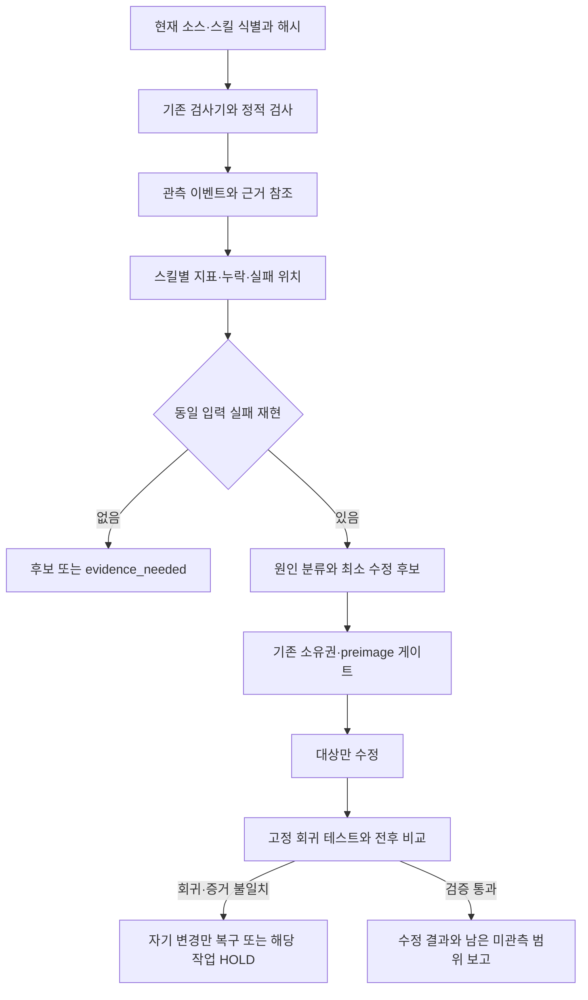

# Python 진단 메타 스킬 설계

상태: 수정 설계 승인 후 구현·로컬 검증 완료. 사용자 지시: “수정된 설계대로 구현을 진행해”. 구현 결과와 증거는 `data/agent-handoff/skill-diagnostics/implementation-20260914-01a09ef2/summary.md`에 있다. 목표는 기존 소스와 스킬을 관측 → 재현 → 원인 분류 → 최소 수정 → 재검증 순서로 안정화하는 Python 상위 스킬이다. 아래 승인 대기 기록은 승인 전 이력이다.

## 1. 현재 확인된 기반

Desktop 기준 루트는 `C:\AbandonWare\demo-1\demo-1\src`, 조사 당시 브랜치는 `codex/owned-runtime-browser-restart`, HEAD는 `0796a3c5b29bbb08c3314bd40649d856d4a7bce6`이다. Git 변경 항목 3,074개와 index lock이 관측되었다. 이는 읽기 전용 조사나 별도 Markdown 작성의 전역 중단 사유가 아니다. 구현 시 대상별 소유권과 바이트를 새로 확인한다.

현재 Gradle 선언은 root `main/java`, `main/resources`, app `app/src/main/java_clean`, `app/src/main/resources`를 활성 경계로 지정한다. Python은 3.11.15이다. 이 조사에서는 Gradle 빌드나 애플리케이션 실행 검증을 수행하지 않았다.

| 기존 소유자 | 확인된 역할 | 재사용 방식 |
| --- | --- | --- |
| `scripts/awx_skill_registry.py:11,32,39,68` | `scan_skills`, 이름 정규화, 내용/경로 해시, 충돌 분류, `awx.skills.registry.v1` | 읽기 전용 인벤토리 API를 사용한다. 설정을 변경하는 별도 helper는 호출하지 않는다. |
| `tools/ai_debug_assist.py:96,129,163,212` | 제한된 로그 진단, 소스/로그 해시 결합, 최대 3개 가설, 검증 전 `claimsVerified=false` | 빌드 로그가 있을 때 기존 진단 패킷을 참조한다. 기본 MCP/AI 사용은 끈다. |
| `tools/build_error_miner.py` | 기존 빌드 실패 분류 | 빌드 로그 분류기를 복제하지 않는다. 지원하지 않는 오류는 unknown으로 남긴다. |
| `.agents/skills/demo1-skill-family-postprocessor/` | 스킬 구조·라우팅·메타데이터 검사와 요약 | 기존 validator의 출력 스키마를 유지하고 결과를 참조한다. |
| `.agents/skills/demo1-artifact-trace-curator/` | 명시적으로 선택한 산출물의 추적·보존 | 영구 게시/정리가 필요한 경우에만 기존 소유자에게 넘긴다. |
| `.agents/skills/demo1-evidence-debugging/` | `DebugCasePacket`, E-ID, 가설·실험·수정·인수 검증의 사건 단계 연결 | 후속 현재 상태 확인에서 발견한 소유자다. 사건 계약은 이 스킬을 재사용하고 Python 관측 결과를 근거 참조로 연결한다. |

읽기 전용 registry 실행 결과는 shared 64개, personal 12개, 합계 76개, collision 0개, conflict 0개이다. 이 수는 registry의 현재 기본 탐색 범위에 대한 결과이며 설치된 모든 plugin cache를 전수 조사했다는 뜻이 아니다. `codexPrecedenceChanged=false`였다.

실행한 기준 테스트:

```powershell
python -B -X utf8 -m unittest discover -s scripts -p test_ai_debug_assist.py -q
```

결과는 19 tests, 0.135s, OK, exit 0이다. 이는 기존 진단 helper의 계약에 대한 증거이며 전체 스킬 신뢰도나 새 메타 스킬의 성능 수치가 아니다. 확인한 직접 소유자들에서는 스킬 간 공통 실행 상관관계와 요청된 지표를 함께 제공하는 계층을 찾지 못했다. 저장소 전체에 그러한 구현이 없다고 단정하지 않는다.

## 2. 선택지와 권고

| 선택지 | 장점 | 비용·한계 |
| --- | --- | --- |
| A. 기존 검사기에 얇은 Python 연결 계층 추가 — 권고 | 기존 스킬과 정상 경로를 보존하고 독립된 회귀 검증 가능 | 계측에 참여하는 실행만 실제 trace를 제공하므로 coverage 표시가 필수 |
| B. 모든 스킬과 실행기를 일괄 계측하도록 수정 | 초기 trace coverage를 넓힐 수 있음 | 변경 범위와 회귀 위험이 크고 기존 writer/권한 경계를 침범할 수 있음 |
| C. 중앙 수집 서버와 외부 대시보드 구축 | 장기 운영 분석에 유리 | 새로운 서비스·배포·데이터 이동이 필요하며 현재 목표의 최소 구현을 초과 |

A를 채택한다. 핵심은 기존 검사기의 의미를 바꾸지 않고 공통 식별자·관측 이벤트·분모가 있는 지표·수정 자격을 연결하는 것이다. 일괄 예외처리 교체나 자동 AST 재작성은 하지 않는다.

## 3. 구현 범위와 파일 소유권

새 진입점은 `.agents/skills/demo1-observed-debugging-meta/SKILL.md`와 `agents/openai.yaml`이다. 반복 실패, 임시 fallback 의심, 스킬 품질 진단 또는 명시적인 계측 요청에 적용한다. 기존 결함 처리·source-owner gate·family validator를 대체하지 않는다. 사건 기록과 진단 단계 연결은 현재 확인된 `demo1-evidence-debugging`의 `DebugCasePacket`을 재사용한다. 새 진입점은 자동 탐색·계측·정량 비교를 이 사건 계약에 연결하는 역할이다.

예정된 새 파일은 다음과 같다. 구현 전 동일 이름의 현재 존재 여부를 다시 확인한다.

- `.agents/skills/demo1-observed-debugging-meta/SKILL.md`: 관측부터 재검증까지의 실행 계약.
- `.agents/skills/demo1-observed-debugging-meta/agents/openai.yaml`: 스킬 메타데이터와 명시적 호출 안내.
- `.agents/skills/demo1-observed-debugging-meta/references/measurement-contract.md`: 이벤트, 지표, 비교와 수정 자격의 단일 계약.
- `tools/skill_diagnostics.py`: CLI, 읽기 전용 탐색/정적 검사, 제한된 계측 API, 기존 검사 결과 연결, 집계/비교.
- `scripts/test_skill_diagnostics.py`: 합성 fixture 기반 계약·회귀·계측 투명성 테스트.

표준 라이브러리를 우선 사용한다. 새 production dependency, MCP 서버, background watcher, 자동 provider 호출 또는 배포를 추가하지 않는다. 기존 파일 변경은 해당 파일의 재현 가능한 결함이나 연결에 꼭 필요한 누락이 확인된 경우에만 추가한다. source 구현을 바꾸어야 하면 기존 세 역할 preflight 및 대상별 lease/preimage/rollback 절차를 따른다. 진단 도구가 수정 권한을 발급하지 않는다.

## 4. 데이터 흐름



메타 스킬은 이 흐름에 계측 근거를 공급하는 상위 작업 지침이다. 사건 단계의 소유권은 `demo1-evidence-debugging`에 유지하며 두 번째 사건 양식이나 심사 절차를 만들지 않는다. Python은 측정 가능한 사실을 수집·검사하며, 부모 에이전트가 수정과 최종 판정을 맡는다. 진단기 실행 성공과 진단 대상 스킬의 성공을 별도 식별자로 구분한다.

## 5. 자동 탐색과 정적 검사

기본 대상은 registry가 확인한 repo skill, `scripts`, `tools`, 현재 활성 source root이다. 개인 스킬은 인벤토리 읽기 범위이며 수정하지 않는다. plugin cache나 다른 root의 추가 탐색은 명시적인 scope와 해당 root의 지침 확인 후 수행한다. 파일 발견만으로 import하거나 실행하지 않는다.

Python AST로 bare except, 넓은 except 뒤의 조용한 pass/상수 fallback, 제한이 확인되지 않는 반복/재시도 같은 구문 후보를 수집한다. Java/PowerShell/Markdown은 기존 검사기 결과와 제한된 텍스트 위치 후보까지만 다룬다. 동적 호출, reflection, 외부 도구 내부, 스킬 지침의 실제 준수 여부를 정적으로 증명하지 않는다. `candidate`, `reproduced`, `verified_defect`를 별도 상태로 둔다. 정상적인 fail-soft 예외처리를 결함으로 자동 확정하지 않는다.

증분 캐시는 파일 내용 해시, 경로 식별, 검사기/계약 버전, 설정 해시와 관련 의존 파일 해시를 키로 쓴다. mtime만 같다는 이유로 재사용하지 않는다. runtime 결과는 입력/코호트/환경과 증거 식별자가 일치할 때만 비교에 사용하며 정적 캐시로 대체하지 않는다. `filesDiscovered`, `filesRead`, `bytesRead`, `cacheHits`, `cacheMisses`, `analysisDurationMs`를 기록한다. 이를 토큰 절감량으로 환산하지 않는다.

초기 기본 상한은 파일 5,000개, 파일당 1 MiB, 총 읽기 64 MiB, JSONL 줄당 64 KiB, trace 입력 32 MiB, 검사 60초이다. 초과분은 `truncated`/`budget_exceeded`와 실제 coverage로 표시한다. 경로 탈출·symlink/reparse 우회는 거부한다. 과도한 AST는 제한된 작업 단위에서 분류하고 전체 검사 성공으로 숨기지 않는다.

## 6. 관측 이벤트 계약

새 연결 스키마는 `demo1.skill-diagnostics.event.v1`이다. 기존 출력은 `schemaVersion`, 내용 해시, 안전한 참조로 연결하며 원본 스키마를 수정하지 않는다.

| 필드 | 의미 |
| --- | --- |
| `eventId`, `runId`, `traceId`, `spanId`, `parentSpanId`, `seq` | 이벤트 중복 제거와 실행/단계의 상관관계. 다른 시계를 전역 시각만으로 정렬하지 않음 |
| `skillId`, `skillHash`, `targetSkillId`, `sourceFingerprint`, `contractVersion` | 실행 주체와 진단 대상, 현재 바이트와 계약 |
| `stage` | `input`, `decision`, `tool_start`, `tool_result`, `exception`, `run_result` |
| `toolCallId`, `attemptIndex`, `retryOf` | 하나의 논리 호출과 실제 시도 구분; 병렬 호출을 재시도로 세지 않음 |
| `status`, `reasonCode`, `durationMs` | 허용된 상태·이유 코드와 monotonic clock으로 측정한 시간 |
| `caseRef`, `evidenceRefs`, `evidenceStatus`, `validatorId` | 기존 `DebugCasePacket`과 E-ID, 근거 artifact/테스트의 식별·해시와 검사 상태; 기존 사건 내용을 복제하지 않음 |
| `location` | 허용된 repo 상대 경로·줄·심볼 또는 미관측 사유; 원문 stack trace 제외 |
| `observationSource`, `coverage`, `synthetic` | 실제 wrapper 관측, 구조화된 기존 기록 import, 에이전트 선언 또는 합성 fixture 구분 |

`decision`에는 선택한 action과 이유 코드·입력 참조·근거 참조를 기록한다. 비공개 내부 사고과정이나 장문의 추론을 기록하지 않는다. raw prompt, response, locals, exception message, 명령 인수, 환경값, 인증정보는 저장하지 않는다. 낮은 엔트로피의 민감 입력은 단순 해시 대신 사용자가 관리하는 opaque fixture/artifact 식별자를 사용한다.

기존 로그에 없는 decision 단계는 만들어 채우지 않는다. 단계 누락·잘린 마지막 줄·중복/충돌 event ID·종료 없는 run·존재하지 않는 parent·지원하지 않는 schema를 계측 품질 문제로 기록한다. 손상된 입력을 조용히 버리고 정상 100%를 계산하지 않는다.

기본 실행은 읽기 전용 scan/import/report이다. 실제 계측은 명시적으로 선택한 안전한 로컬 검사 adapter 또는 opt-in context manager에서 시작한다. 대상의 결과값과 예외 의미를 유지하고 자동 재시도는 하지 않는다. recorder 장애는 원래 결과를 가리지 않되 `telemetry_complete=false`로 남겨 완료/개선 주장을 막는다. 내부 코드 전체를 대상으로 한 상시 `sys.settrace`는 기본 경로가 아니다. 필요한 경우 별도로 선택한 재현 fixture에만 제한적으로 사용하며 thread/async/child-process coverage를 명시한다.

## 7. 지표의 정확한 정의

모든 지표는 스킬·소스/계약 버전·입력 코호트·관측 시간창별로 계산한다. 분자, 분모, 제외/미완료/무효 건수, 측정 출처를 값과 함께 남긴다. 분모 0은 `null`과 `not_observed`이고 0%가 아니다.

| 지표 | 정의와 주의점 |
| --- | --- |
| 실행 실패율 | `(failed + timed_out) / (succeeded + failed + timed_out)`; cancelled, skipped, blocked, incomplete는 별도 수와 완료 coverage로 공개 |
| 재시도 횟수 | 동일 `toolCallId`의 실제 추가 시작 시도 수; 선언된 재시도 예산과 실제 관측을 구분 |
| 예외 위치 | 중복 제거한 exception event를 위치·type/reasonCode별 집계; 한 예외의 stack 전파와 최종 실패를 이중 집계하지 않음 |
| 도구 호출 성공률 | terminal 상태가 있는 실제 시도 중 succeeded 비율; 논리 호출의 최종 성공률을 별도로 함께 표시 |
| 응답 지연 | 완결된 실행과 도구 시도 각각의 ms, n, p50, p95; p95는 정렬 표본의 ceil(0.95*n) 순서통계, 미완료 지연은 별도 표시 |
| 근거 누락 판단 수 | 근거를 요구하는 decision 중 참조가 없거나 해시/계약 검증에 실패한 수; 누락 사유별 분리 |
| 반증된 판단 수 | 독립된 테스트 또는 명시된 validator가 해당 판단과 같은 입력의 모순을 확인한 수 |
| trace coverage | 입력·판단·호출·결과 중 해당 실행에 요구되는 단계가 관측된 비율과 완전 실행 수; 수집 실패/미참여 스킬 포함 |
| 분석 비용 | 읽은 파일/바이트, cache hit, 경과 시간; 실제 token telemetry 없으면 token usage는 null |

근거 누락은 환각의 확정 판정이 아니다. 참조 존재 역시 의미적 정확성의 증거가 아니다. 근거 충분성 평가는 해당 도메인의 검증 계약이 있을 때만 수행한다. 짧은 설명을 제출하지 않았다는 이유로 내부적으로 추측했다고 단정하지 않는다.

## 8. 원인 분류와 자동 보강 경계

분류는 구조/계약 오류, 입력·파싱 오류, 근거 누락, trace 손상/미관측, 재시도 정책, timeout, 도구 실행 실패, 환경·권한·외부 가용성, 검증된 로직 결함, unknown으로 제한한다. 정적 패턴만으로 원인을 확정하지 않는다.

자동화할 부분은 발견 → 관련 기존 검사 선택 → baseline 수집 → 재현 fixture 준비 → 최소 수정 후보와 필요한 근거 묶음 생성 → 기존 owner gate로 이관 → 재검증이다. 수정은 후보의 RED 테스트, 대상 preimage, 변경 범위, 허용 권한이 모두 있을 때 부모 에이전트가 수행한다. 부족한 관측 연결이 확인되면 해당 adapter/스킬의 최소 계측 연결만 추가한다. 근거가 부족하면 해당 target을 `evidence_needed`로 두고 다른 안전한 대상을 계속한다.

한 번에 결함 하나, 가설 하나를 시험하고 동일 실패 class의 재시도는 한 번으로 제한한다. 새 증거가 없으면 반복을 중지한다. 외부 불가·권한 없음은 로직 patch의 이유가 아니다. 통과를 위해 테스트 기대값이나 성공 정의를 완화하지 않는다. 복구는 자신의 변경과 postimage가 일치하는 범위에서만 수행하고 다른 writer의 변경은 보존한다.

## 9. 전후 비교와 완료 판정

변경 전후에는 같은 fixture/case ID, 입력 해시 또는 안전한 입력 식별자, 사전 고정된 테스트/oracle, 검사기/계약 버전, 환경 설정, 시도 정책을 사용한다. sourceFingerprint만 의도한 변경으로 달라진다. 서로 다른 코호트나 coverage 저하를 더 좋은 실패율로 제시하지 않는다.

비교 결과는 `improved`, `unchanged`, `regressed`, `not_comparable`, `insufficient_evidence`이다. 고정 회귀 테스트의 기존 정상 경로 전부 통과, 해당 결함의 RED→GREEN, 새 실패 없음, 충분한 관측을 모두 확인해야 `improved`라고 판정한다. 통계적 유의성을 검정하지 않은 소표본의 지연 차이는 관측 차이로만 기록한다. 성능 비교 시 계측 on/off 조건을 맞추고 instrumentation overhead를 별도 보고한다.

실제 결함이 없으면 정상 소스를 고치지 않는다. 합성 결함의 RED→GREEN은 도구의 동작 검증으로 명확히 표시하고 운영 결함 개선으로 보고하지 않는다. 실제로 개선되었다는 주장은 실제 대상에서 같은 절차를 통과한 경우에만 한다.

## 10. 회귀 검증 계획

새 테스트는 discovery 제외 경로/UTF-8/동명이인, 내용 해시 cache 무효화, AST 정상 예외처리 후보의 과잉 확정 방지, 예외와 결과 보존, 재시도·병렬 호출 구분, 중복/잘린 JSONL, 누락/0분모, timeout/cancellation, p95, 근거 없는 claim의 잘못된 성공 판정, snapshot/코호트 불일치, 경로 탈출, 크기 제한, recorder 실패와 민감값 비노출을 검증한다.

고정 합성 시나리오는 성공, 실패 후 성공, 반복 실패, timeout, 근거 누락, 반증된 판단, 불완전 trace를 포함한다. 각 예상 분자·분모는 구현과 독립적으로 작성한다. 정상 시나리오는 계측 전후 결과/예외가 같아야 한다.

기존 19개 `test_ai_debug_assist`를 회귀 기준으로 유지하고 새 helper 테스트, 개별 `quick_validate.py`, 필요한 family validator/self-test를 실행한다. family 전역의 기존 실패는 새 변경과 분리한다. 필요한 기준 실패가 의미 있는 검증을 막을 때만 해당 작업을 HOLD한다.

각 진단 실행 산출물은 명시적으로 선택한 `data/agent-handoff/skill-diagnostics/<run-id>/`에 새로 만든다. `inventory.json`, `findings.json`, `events.jsonl`, `metrics.json`, `comparison.json`, `summary.md`는 필요할 때만 생성한다. 기존 run을 덮어쓰지 않고 수집 범위·한도·누락·해시를 남긴다. 자동 기억 저장이나 application runtime memory 변경은 하지 않는다.

## 11. 공개 근거와 적용 한계

- [OpenTelemetry traces](https://opentelemetry.io/docs/concepts/signals/traces/)는 span/parent 관계로 실행을 연결하는 근거다. 본 설계는 그 관계 모델을 참고하며 새 SDK 의존성이나 완전한 OTel 호환성을 주장하지 않는다.
- [OpenTelemetry exception recording](https://opentelemetry.io/docs/specs/otel/trace/exceptions/)은 예외를 실행 span과 연결한다. 본 저장소의 개인정보 정책 때문에 원문 exception message/stack은 수집하지 않는다.
- [Python 3.11 AST](https://docs.python.org/3.11/library/ast.html)는 AST 파싱과 방문 API를 제공하지만 파싱 성공이 실행 가능성을 보장하지 않으며 과도한 입력은 stack 문제를 만들 수 있다고 명시한다. 따라서 정적 탐지와 실제 재현을 분리하고 입력을 제한한다.
- [Python 3.11 tracing](https://docs.python.org/3.11/library/sys.html#sys.settrace)은 thread별 trace 등록이 필요하다. 전체 에이전트 또는 외부 도구 내부를 자동 관측할 수 있다는 주장의 근거로 쓰지 않는다.
- [Python subprocess](https://docs.python.org/3.11/library/subprocess.html)에서 timeout과 child 정리의 범위를 확인했다. 임의 발견 명령을 자동 실행하거나 프로세스 트리 전체 종료를 보장한다고 해석하지 않는다.
- [TDFlow, v2 / EACL 2026](https://arxiv.org/abs/2510.23761v2)는 사람 작성 테스트를 사용한 제한된 작업 분리·반복 검증을 연구한다. 재현 테스트의 품질과 test hacking의 검출이 중요한 한계다. 논문의 점수를 본 저장소의 예상 성공률로 전용하지 않는다.
- [Beyond Accuracy, v2, 2026-06-05](https://arxiv.org/abs/2511.11012v2)는 수정 정확도와 별도로 localization, regression, 자원/시간을 분석한다. SciSpace 결과에 포함된 구판 표본/수치와 최신 원문이 달라 원문 버전을 기준으로 삼았다. 특정 agent/model의 논문 수치는 현재 설치 모델에 대한 평가가 아니다.
- [Wolfram Survival Analysis](https://reference.wolfram.com/language/guide/SurvivalAnalysis)는 완결되지 않은 event time을 별도 취급하는 개념 근거다. 이번 Wolfram 호출에서는 요청한 지표의 직접 계산값을 얻지 않았으며 새 스킬에 대한 관측 수치나 통계 검정은 아직 없다.

## 12. 실행 단계와 승인 대상

검토 대상은 A안, 위 5개 새 파일, 기존 검사기 재사용, 기본 읽기 전용/선택적 계측, 재현된 결함만 기존 gate로 수정하는 범위다. 설계 승인 후 구현 계획을 구체화하고 합성 RED부터 구현·회귀 테스트·실제 registry/adapter smoke를 진행한다. 첫 실제 스킬 결함이 확인되면 해당 target의 최소 수정과 동일 코호트 비교까지 수행한다.

현재 구현 승인 대기로 보류된 범위는 새 Python/스킬 구현이다. `firstBlockingRule=superpowers:brainstorming design approval`, `blockingEvidence=explicit approval of this design not yet received`, `independentWorkCompleted=live inventory, reuse exploration, baseline 19 tests, cited design`, `repositoryWideHold=false`이다. goal은 아직 완료되지 않았다.

태그별 현재 상태: Superpowers 설계 조사, 독립 Codex 탐색 1개, SciSpace/공식 원문 연구, Wolfram 개념 조회, Plugin Management 도구 탐색, Control Tower 기존 소유자 확인을 수행했다. GLM은 CLI 0.144.1 + sol v2의 기존 transport HOLD로 0회 호출했다. Data는 측정 계약 범위로 적용했고 아직 운영 데이터 분석은 수행하지 않았다. Visualize는 정적 Mermaid 흐름으로 사용한다. 별도 웹사이트/배포/Windows UI 검증은 현재 artifact 목표에 필요하지 않아 실행하지 않았다.

## 13. 추가 기준 검증

자동 계속 턴에서 기본 family validator 요약은 기존 self-test 기록이 2026-08-06 기준으로 오래되어 `stale`, exit 1, `artifactCompletionStatus=evidence_needed`를 반환했다. 구조 트리거 오류와 discovery 접근 오류는 각각 0건이었다. 오래된 green을 현재의 성공으로 사용하지 않는 동작이 관측되었다.

자체 테스트를 실행할 때 작업자가 TEMP를 저장소 내부로 바꾼 첫 시도는 118개 assertion 통과 후 `generic stale fixture uses git unknown hint`에서 실패했다. 해당 fixture는 Git 저장소 밖의 임시 경로를 전제로 한다. 기본 TEMP가 Git 저장소 밖임을 확인하고 기존 테스트의 기본 임시 경로 동작으로 복원한 재검증은 254개 assertion, exit 0, 완료 표식 관측, 39,975ms로 통과했다. 기존 스크립트나 기대값은 수정하지 않았다. 이 전후 차이는 테스트 환경 복구이며 제품 결함 개선 수치가 아니다.

```powershell
powershell -NoProfile -ExecutionPolicy Bypass -File .agents\skills\demo1-skill-family-postprocessor\scripts\validate_demo1_skill_family_tests.ps1 -Root . -StatusPath data\agent-handoff\skill-diagnostics\design-baseline-20260914-01a09ef2\validator-self-test-status.json
```

현재 작업 전용 self-test 상태는 `verified`, `ok=true`, 원문 비밀값 패턴 0건이다. 기본 공유 status 파일은 갱신하지 않았다. 이후 validator는 위 명시적인 status 경로를 선택하고 그 시점의 freshness를 다시 확인해야 한다.

증거는 `data/agent-handoff/skill-diagnostics/design-baseline-20260914-01a09ef2/`의 `baseline-summary.json`(첫 실패), `baseline-summary-revalidated.json`(환경 복구 후 통과), `validator-self-test-status.json`에 있다. self-test 상태 파일의 SHA-256은 `B3666FAF0ECBB2E2AADABA16C69746C6033841CB6D91672DC0A0F91FD42DC213`이다. raw 실행 출력은 저장하지 않았다. 새 메타 스킬 구현은 여전히 설계 승인 대기다.
