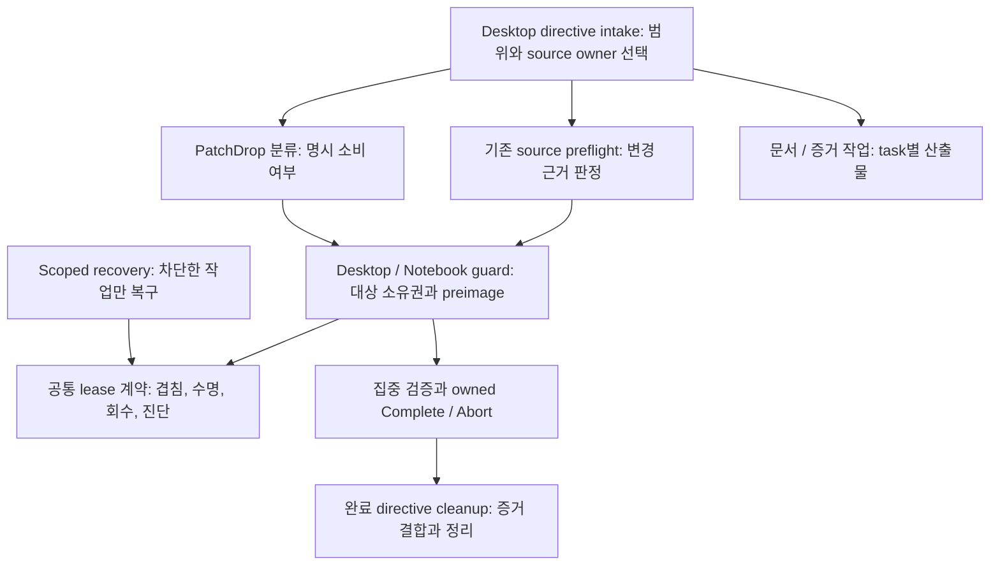

# 파일 범위 락과 스킬 역할 정리

상태: 사용자 승인 후 구현 및 범위별 검증 완료. 아래 현재 사실/재현은 설계 당시 baseline이며, 최종 동작과 검증 한계는 [구현 결과](2026-09-14-scoped-lock-and-skill-roles-result.md)에 기록한다.

## 목표와 보존 조건

서로 다른 파일을 수정하는 Desktop·Notebook 작업을 병행하고, 실제로 겹치는 수정과 공유 산출물 게시만 직렬화한다. 비정상 종료로 남은 소스 편집 락을 소유권 증거에 따라 자동 회수하며, 디버깅 출력으로 작업·소유자·대상 경로·차단 이유를 추적할 수 있게 한다. 오래된 스킬은 현재 호출 관계를 보존하면서 역할과 상세 절차의 소유자를 명확히 한다.

보존해야 할 기능은 경로 정규화, 대상 preimage SHA-256 검사, 원본 파일 보존, 동일 대상 동시 진입 방지, canonical Y-drive 및 공유 경로 신원 확인, Notebook 완료·중단·복원 증거, 필요한 소스 preflight, PatchDrop 소비 절차다. 분석·문서 작성·증거 수집은 애플리케이션 소스 락을 요구하지 않는다. Git index/ref 작업은 별도 자원으로 취급한다.

## 현재 확인된 사실

기준 checkout은 `C:\AbandonWare\demo-1\demo-1\src`, branch는 `codex/owned-runtime-browser-restart`, HEAD는 `0796a3c5b29bbb08c3314bd40649d856d4a7bce6`이다. 관찰 시각은 2026-09-14 08:05 UTC다. 기존 tracked 변경 1,711개가 있었고, 락 헬퍼 일부는 untracked 상태다. 이는 기존 작업의 현재 파일이며 복원·재생성 대상이 아니다.

| ID | 확인된 사실 | 현재 근거 |
| --- | --- | --- |
| E1 | 저장소 지침은 이미 target-scoped 동시 편집을 요구한다. | `AGENTS.md:49-59` |
| E2 | 공통 계약은 대소문자·slash·dot alias를 정규화하고 동일 경로와 부모/자식 경로 겹침을 검사한다. | `__patch_drop__/source_edit_lease_contract.ps1:152-207` |
| E3 | 기존 `.promotion.lock`은 등록 구간의 OS 파일 핸들 락이며, 편집 세션 동안 보유하지 않는다. 기본 대기는 5초다. | 같은 파일 `134-149`, `source_edit_session.ps1:181-262` |
| E4 | 만료 락은 충돌 계산에서 건너뛰지만, 같은 topic 디렉터리가 있으면 새 begin은 거절한다. | 공통 계약 `203`, 세션 `205-208` |
| E5 | 생성되는 lease에는 소유자 문자열과 만료 시각은 있으나 실제 소유 프로세스 신원이나 heartbeat가 없다. 상태 로그는 락 이름·상태만 출력한다. | 공통 계약 `360-384`, 세션 `139-140` |
| E6 | Notebook은 별도 TTL/24시간 디렉터리 나이 기반 cleanup을 수행한다. Desktop과 회수 정책이 갈라져 있다. | `.agents/skills/demo1-macsrc-smb-direct-patch/scripts/macsrc_smb_patch_guard.ps1:398-511,569` |
| E7 | 증거 수집·감사만 수행하는 생성 Desktop wrapper가 범위 없는 source lease를 먼저 획득한다. | `scripts/awx_mcp_toolbox.py:6181-6214` |
| E8 | 증거 intake는 역할별 JSON을 쓰고 실패 시 이전 증거를 정리하므로, 같은 증거 경로를 쓰는 작업에는 여전히 산출물 단위 조정이 필요하다. | 같은 파일 `3822-3844` |
| E9 | PatchDrop 기본 스킬과 참조는 아직 `source-edit-locks=0`을 요구한다. Notebook planner 문구에도 범위를 한정하지 않은 active-lock HOLD가 남아 있다. | 독립 의존성 조사 결과; 아래 수정 목록 참조 |
| E10 | Notebook planner 실행기는 이미 target overlap 판단을 사용한다. 이 부분은 문구를 실행기에 맞추는 작업이다. | `.agents/skills/demo1-macsrc-guarded-patch-session/scripts/new_guard_session_plan.ps1:188-199` |
| E11 | 프롬프트 manifest에는 고유 ID 39개, 고유 system 경로 39개가 있고 참조 system 파일 누락은 없었다. | 독립 manifest 조사 |
| E12 | 유효기간이 남은 Notebook lease도 디렉터리 mtime만 25시간 전이면 다음 Prepare가 삭제한다. 기존 작업의 Verify는 source-lease-missing으로 실패한다. | 아래 추가 격리 재현; Notebook guard `439-485`의 directory-age fallback |

Astra 업데이트가 원인이라는 인과관계는 확인되지 않았다. 현재 입증된 문제는 코드와 오래된 호출 지침 사이의 차이, 락 수명 판단의 불일치, 부족한 진단 출력이다.

## 수행한 검증

기존 테스트를 현재 파일로 실행했다. 소스 쓰기는 임시 Git fixture 안에서만 일어났고 실제 공유 소스를 수정하지 않았다.

| 검증 | 결과 |
| --- | --- |
| 서로 다른 두 대상의 병렬 진입 | PASS |
| 동일 대상 병렬 진입의 단일 승자 | PASS |
| 같은 topic·다른 owner·다른 대상의 독립 해제 | PASS |
| target-scoped status가 무관한 lease를 허용 | PASS |
| 존재하는 Git index lock을 보존하면서 파일 편집 허용 | PASS |
| 달라진 preimage 거절 | PASS |
| Notebook의 같은 watch root·다른 파일 병행 및 독립 완료 | PASS |
| Notebook의 index lock 보존 및 Prepare/Verify/Abort | PASS |
| Notebook의 겹침·달라진 preimage 거절 | PASS |

Desktop 6 tests / 11.555초, Notebook 3 tests / 13.944초, 실패 0. 이는 기존 동작의 baseline이며 제안된 수정의 검증 결과가 아니다.

만료 lease의 별도 격리 재현 결과:

```json
{"statusExit":0,"sameTopicRestartExit":7,"sameTopicReasonPathExists":true,"otherTopicSameTargetExit":0,"oldLeaseStillPresent":true,"statusShowsOwner":false,"statusShowsTarget":false,"hasOwnerProcessIdentity":false,"hasHeartbeat":false}
```

따라서 동일한 만료 lease가 같은 topic 재시작에는 장애물이지만 다른 topic의 같은 파일 진입은 허용한다. 이 재현은 실제 살아 있는 writer의 충돌까지 증명한 것은 아니다. 소유 프로세스 정보가 없어 살아 있는지 확인하지 않는다는 설계상 공백을 입증한다.

live inventory는 active/corrupt/expired source lease 모두 0, top-level pending patch 0, Git index lock 존재, 실제 Git writer 0, 읽기용 Git 프로세스 2였다. 실제 락은 삭제하거나 변경하지 않았다.

추가 조사에서는 기존 소유권·scope binding·경로 alias 검사 3개와 Notebook 스킬/프롬프트 연결 검사 4개가 통과했다(7 tests / 8.936초). 최초 9개와 합쳐 기존 baseline 테스트는 16개다.

Notebook 회수 오분류 재현은 TTL 180분의 새 lease를 만든 뒤, 내용과 만료 시각은 그대로 두고 락 디렉터리 mtime만 25시간 전으로 변경했다. 다른 파일의 Prepare는 성공했지만 기존 lease를 삭제했다.

```json
{"probe":"old-directory-active-lease","fixtureOnly":true,"leaseTtlMinutes":180,"directoryAgeHours":25,"secondDisjointBeginExit":0,"cleanupDeletedCount":1,"firstLeaseStillPresent":false,"firstVerifyExit":2,"firstVerifyReason":"source-lease-missing"}
```

이는 디렉터리 나이와 lease 유효성을 독립적으로 판정해야 한다는 직접 근거다. 새 회귀 검증은 같은 조건에서 `cleanupDeletedCount=0`, 기존 lease 유지, 기존 Verify 성공을 요구한다. 실제 원격 host crash를 재현한 결과는 아니다.

스킬 검증기 self-test는 작업 전용 상태 경로에서 새로 실행해 253개 assertion이 통과했다. 로그와 상태는 `data/agent-handoff/lock-skill-refactor-20260914/preimplementation-02/`에 저장했다. 기존 공유 self-test 상태 파일은 교체하지 않았다.

이 상태를 명시적으로 사용한 full family 검증은 required skills 7개 모두 유효, quick validation 생략 0, trigger 검사 49개/문제 0, discovery·coverage·metadata 오류 0이었다. compact 결과는 같은 디렉터리의 `skill-family-summary.json`이다. 여기서 `artifact_ready`는 현재 required skill artifact 상태만 뜻하며 미적용 락 패치의 완성을 뜻하지 않는다.

## 선택한 접근

세 가지 접근을 비교했다.

1. **기존 공통 계약을 보강하고 호출 경로를 정리한다 — 권장.** 이미 검증된 대상 겹침 계산을 유지하고, 생명주기·회수·로그만 공통화한다. 기존 스킬 이름과 guard 진입점을 보존한다.
2. 문구만 수정한다. 작업 지시의 전역 차단은 줄어들지만 만료 lease의 불일치와 자동 회수·진단 요구가 남는다.
3. 새로운 락 서버 또는 별도 분산 락 프레임워크로 교체한다. 배포·운영·복구 의존성을 추가하므로 현재 결함에 비해 변경 범위가 크다.

권장안에는 새 production dependency, DB, daemon, 파일 watcher가 필요하지 않다. 회수는 begin/verify/recovery 호출 시 수행한다.

## 락 범위와 동시성

| 작업 조합 | 제안 동작 |
| --- | --- |
| 다른 파일, 같은 소스 폴더 | 동시 편집 허용 |
| 같은 topic, 다른 owner, 다른 파일 | 독립 세션 허용 |
| 동일 파일 또는 명시적으로 겹치는 경로 | 충돌하는 수정만 직렬화 |
| 부모 경로 예약과 그 내부 파일 수정 | 해당 경로에만 충돌 적용 |
| 같은 파일의 서로 다른 코드 영역 | 분석·후보 생성은 병행; 실제 파일 반영은 최신 preimage를 검사하며 짧게 직렬화 |
| 읽기·문서/지시서 작성·다른 작업의 증거 출력 | 애플리케이션 소스 락 없이 진행 |
| 같은 증거 파일/완료 산출물 게시 | 그 출력 경로 또는 task ID에만 게시 락 적용 |
| Git index/ref 변경, checkout/merge/rebase | 해당 Git 자원의 충돌 규칙 유지 |

기존 manifest는 파일과 preimage를 선언한다. 경로 prefix 예약은 권한 부여가 아니라 충돌 범위를 넓히는 선언으로만 취급한다. 경로 예약만으로 그 아래 임의 파일을 수정할 수 없고, 실제 수정 파일은 계속 개별 preimage를 제출한다. 일반 수정에서 디렉터리 전체 예약을 자동 생성하지 않는다.

동일 파일의 비중첩 줄 범위를 곧바로 동시 쓰기 허용으로 바꾸지 않는다. 현재 편집기는 파일 단위 읽기/쓰기와 교체를 사용할 수 있어 한쪽의 쓰기가 다른 쪽 결과를 덮어쓸 수 있다. 이 범위는 파일 반영 직전에만 직렬화하고 작업 준비는 병행한다.

`.promotion.lock`의 짧은 등록 조정은 유지한다. begin/end/renew/recover의 registry 변경은 동일 조정 구간에서 관찰·신원 재검사·게시를 수행한다. 장시간 해시 계산, 테스트, 빌드, 네트워크 호출과 사용자 응답 대기를 이 구간에 넣지 않는다. 파일이 존재한다는 사실을 핸들 락이 잡혀 있다는 증거로 취급하지 않는다.

## 소유권과 자동 회수

기존 `lease.json`의 소유자·대상·fingerprint 의미를 유지하고, 세션별 무작위 lease ID, task ID, 검증된 host 신원, 실제 writer owner의 PID와 시작 시각을 추가한다. 짧게 실행 후 종료하는 begin 헬퍼 PID를 writer owner로 기록하지 않는다. owner 프로세스를 증명할 수 없으면 `ownerState=unknown`으로 기록한다.

heartbeat는 immutable lease fingerprint에 결합된 별도 상태로 관리하여 기존 Notebook session hash와 Desktop lease fingerprint가 단순 갱신으로 깨지지 않게 한다. 같은 lease ID/소유권만 갱신할 수 있다. 갱신·회수·해제는 현재 fingerprint를 재검사하며, 교체된 세션에 이전 heartbeat나 해제 요청을 적용하지 않는다. Desktop과 Notebook의 유효성 판정은 공통 계약을 사용한다.

| 관찰 | 자동 처리 |
| --- | --- |
| 소유 host·PID·시작 시각이 일치하고 프로세스가 살아 있음 | 오래된 생성 시각만으로 회수하지 않음 |
| 동일 host에서 기록된 writer 프로세스 종료가 확인됨, lease 신원 불변 | 충돌 대상 lease를 자동 퇴역·격리하고 새 세션을 허용 |
| PID가 재사용되어 시작 시각 불일치 | 이전 프로세스의 종료 증거로 분류하되 새 프로세스를 중단하지 않음 |
| 원격 host의 heartbeat가 늦거나 네트워크가 끊김 | stale candidate로 표시; 단독으로 사망 판정하지 않음 |
| 원격 owner host가 자신의 프로세스 종료/완료를 확인 | 동일 lease ID에 결합한 회수 증거로 자동 퇴역 가능 |
| legacy lease의 만료 시각만 있거나 JSON/소유권을 읽을 수 없음 | 관련 범위의 `evidence_needed`; mtime만으로 삭제하지 않음 |

자동 해제는 registry에서 더 이상 예약하지 않도록 퇴역시키는 것이다. 유일한 복구 증거를 지우지 않고, 검증된 소스 락 디렉터리를 task별 격리 위치로 이동하고 회수 사유·전후 fingerprint·시각을 남긴다. 실제 source/index 파일, 임의 내용물, reparse 경로는 회수 대상이 아니다. 불명확한 락의 대상 경로를 증명할 수 있으면 그 대상만 HOLD하며, 범위를 증명할 수 없는 source lease는 source-write lane에 보수적으로 적용하고 읽기·다른 산출물 작업은 계속한다.

새 세션 게시 중 비정상 종료는 완전한 lease 데이터를 준비한 뒤 registry에 게시하는 방식으로 줄인다. 불완전한 기존 디렉터리는 자동으로 소유자를 추정하지 않는다. 기존 Notebook의 24시간 directory-age fallback은 공통 회수 정책으로 대체해 정상 세션을 오래됐다는 이유로 제거하지 않게 한다.

이 정책은 협력하는 기존 guard 호출자의 보호다. guard를 우회한 외부 편집기를 OS 수준에서 완전히 차단하거나, 네트워크 단절만으로 원격 프로세스 종료를 증명한다고 주장하지 않는다. 실제 쓰기 직전 preimage 확인과 소유권 확인은 계속 필요하다.

## 진단 출력

`status`는 계속 읽기 전용이다. 사람이 읽는 상세 상태와 기계가 읽는 JSON 모두 같은 정제된 projection을 사용한다.

필드는 `leaseId`, `taskId`, `ownerHash`, 검증된 owner의 `pid`와 `processStartUtc`, `role`, `targetPaths`, `effectiveExpiryUtc`, `heartbeatAgeSeconds`, `ownerState`, `conflictingPaths`, `waitMs`, `recoveryAction`, `reason`이다. task/owner 원문은 자유 텍스트를 그대로 출력하지 않고 허용 형식 또는 hash로 제한한다. 경로는 검증된 repo-relative 경로만 출력하고 대상이 많으면 표시 개수와 생략 개수를 함께 제공한다. JSON에서는 임의 lease 속성 전체를 직렬화하지 않는다.

일반 출력에서 토큰, 환경 변수 값, UNC 매핑, source 내용, prompt, provider 응답, 전체 프로세스 명령줄을 노출하지 않는다. bounded debug JSONL에는 획득·충돌·갱신·퇴역·해제 이벤트와 회수 실패 사유를 남긴다. 실패하거나 회수된 lease도 어떤 파일 예약을 막았는지 추적할 수 있어야 한다.

## AWX 지시서 경로

`scripts/awx_mcp_toolbox.py`의 Desktop 증거 intake/audit wrapper에서는 애플리케이션 source lease 의존성을 제거한다. 해당 코드는 증거 JSON을 쓰므로 출력은 topic/task별 경로를 사용하고, 필요한 공유 latest 게시 구간에만 산출물 락을 사용한다. 입력·출력·SHA sidecar·오류 전파는 보존한다.

별도 `janitor_apply_gate_next_action`은 실제 PatchDrop source 소비 경로다. 이 경로의 source guard를 증거 wrapper와 함께 삭제하면 안 된다. 확인된 bundle 대상으로 예약을 선언할 수 있는 범위만 좁히고, top-level 소비·promotion·index 작업의 기존 독점 조건은 유지한다. 기존 생성 파일을 최신 파일이라는 이유로 일괄 다시 쓰지 않는다. 생성기 수정과 새 task별 fixture를 검증한다.

## 역할별 스킬 구조



스킬 ID와 prompt route는 유지한다. preflight 판정, 작업 계획, 실제 source mutation, lease 복구, 완료 정리, artifact 검증을 하나의 거대한 스킬로 합치지 않는다.

| 변경 대상 | 좁은 변경 |
| --- | --- |
| `demo1-patchdrop-manual-default/SKILL.md`와 `references/patchdrop-manual-default-reference.md` | 전역 zero-lease 조건을 target overlap 결과로 교체. 명시 bundle 소비 규칙 보존 |
| `demo1-macsrc-guarded-patch-session/SKILL.md`와 `references/session-contract.md` | active-lock 전역 HOLD 문구를 이미 scoped인 planner/guard 동작과 일치시킴 |
| `scoped-blocker-recovery/SKILL.md` 및 필요한 decision table | 생명주기와 회수는 공통 계약을 호출하도록 설명. 반복된 별도 프로토콜을 만들지 않음 |
| `demo1-debugging-with-two-tools/SKILL.md` | AI observation 상세 절차를 새 `references/ai-assisted-observation.md`로 보존 이동. entrypoint에는 trigger, 두 도구 제한, 반증·권한 규칙 유지 |
| `demo1-desktop-canonical-goal-intake/SKILL.md` | 중복 Stage 1/2 절차는 기존 `directive-rebinding-contract.md`가 단독 소유. 완료 정리 상세는 기존 cleanup owner로 연결하되 필수 증거 결합 유지 |
| `demo1-macsrc-smb-direct-patch/SKILL.md`와 기존 `references/direct-patch-contract.md` | 중복 실행 예제는 reference가 소유. entrypoint에는 Y-drive, scope, 모드와 안전 경계 유지 |

독립 조사에서 PatchDrop·planner의 `agents/openai.yaml`에는 전역 락 문구가 없었다. 따라서 그 파일은 수정 대상이 아니다. 프롬프트 manifest의 새 의존성 schema나 route rename도 현재 근거로는 필요하지 않다.

스킬 discovery에서는 조사 오류 0개와 entrypoint 크기 초과 후보 3개가 나왔다: `demo1-debugging-with-two-tools` 182줄/1,035단어, intake 177줄/1,335단어, Notebook direct 161줄/1,115단어. 줄 수만으로 삭제하지 않고 실제 중복·조건부 상세를 이동한다. validator self-test는 2026-08-06 기록이어서 stale 상태였다. 이번 discovery는 `-SkipQuickValidate`를 사용한 조사이며 artifact 완성 검증으로 사용하지 않는다.

## 구현 경계와 검증 계획

주요 실행 변경 대상은 기존 공통 lease 계약, Desktop session entrypoint, Notebook guard의 lease 수명 경로, AWX Desktop 증거 wrapper 생성기다. helper의 구체 flags/JSON은 기존 호출자와 테스트를 유지하며 필요한 필드만 추가한다. observer의 status 읽기는 live cleanup을 시작하지 않는다.

검증은 다음 순서로 수행한다.

1. 현재 만료 락 재현을 regression으로 고정한다. 같은 topic 재시작, 다른 topic 동일 대상 진입, 상세 owner/path 출력의 기대를 명시한다.
2. 기존 Desktop·Notebook 동시성 tests를 재실행한다. 다른 대상은 병행, 동일 대상은 단일 승자, preimage 변화와 다른 owner의 release는 거절해야 한다.
3. 새 수명 tests에서 살아 있는 owner, 종료 owner, PID 재사용, remote unknown, legacy, corrupt metadata, reparse, lease 교체, heartbeat/recover 경합을 검증한다. 특히 유효기간이 남은 lease의 디렉터리 mtime만 25시간 전인 경우를 고정해 다른 작업의 Prepare가 기존 lease를 제거하지 못하게 한다. 자동 회수는 검증된 fixture만 대상으로 한다.
4. prefix 예약의 부모/자식 충돌, case/slash/dot alias, 무관한 경로를 검증한다. 예약 범위와 실제 수정 권한이 분리됨을 확인한다.
5. 생성된 Desktop 증거 명령을 격리 fixture에서 실행해 source lease 없이 동작하고 같은 산출물 게시만 조정되는지 검증한다. 실제 PatchDrop 적용 경로의 guard는 보존한다.
6. 기존 prompt/skill 연결 검증, 변경한 skill의 `quick_validate.py`, family self-test, full quick-validation summary를 수행한다. 옮긴 본문의 해시/문구 대조로 필수 기능 손실을 검사한다.
7. 모든 target의 전후 hash와 이번 작업의 diff를 확인하고 secret 검사는 count만 기록한다. 실제 Notebook/SMB 호스트에서 수행하지 않은 것은 fixture proof와 분리한다.

관련 기존 명령은 `python -B -m unittest scripts.test_scoped_blocker_recovery`, `python -B -m unittest scripts.test_concurrent_source_edit`, `python -B -m unittest scripts.test_macsrc_defect_session_skill_family`다. AWX wrapper 검증은 기존 `scripts/awx_mcp_toolbox_tests.ps1`의 해당 사례를 사용하며 현재 단정된 전역 source lease 기대도 새 역할 경계에 맞춰 바꾼다. Java runtime은 이 변경의 대상이 아니므로 무관한 전체 Gradle/서버 증명을 완료 조건으로 추가하지 않는다.

독립 테스트 조사에서 새 회귀 위치를 `scripts/test_concurrent_source_edit.py`의 기존 disjoint lifecycle 사례 다음과 `scripts/demo1_macsrc_smb_direct_patch_contract_tests.ps1`의 expiry cleanup 사례 다음으로 특정했다. 기존 PowerShell suite는 만료 cleanup과 corrupt-directory-age cleanup을 검사하지만, 유효한 lease의 오래된 directory mtime을 다루지 않는다. 기존 테스트가 시간만으로 신원 미확인 락을 지우도록 요구하는 부분은 그 자체로 안전 근거가 아니며, 위 소유권 기반 회수 정책에 맞춰 기대를 수정해야 한다. 안전하게 확인된 자동 회수 기능과 그 완료 증거는 보존한다.

rollback은 이번 target의 owned hunks 또는 보존한 exact preimage만 사용한다. 이미 다른 writer가 바꾼 postimage에는 덮어쓰지 않는다. 기존 dirty/untracked 파일을 정리하거나 삭제하지 않는다. 실제 source gate는 패치 직전에 현재 target manifest로 다시 확인한다.

## 외부 근거와 적용 한계

Microsoft는 프로세스가 종료하거나 핸들을 닫으면 OS가 파일 범위 락을 해제한다고 설명한다. 그러므로 OS handle의 수명과 disk에 남아 있는 lease/marker 파일을 같은 것으로 취급해서는 안 된다. 이 문서는 Win32 동작의 근거이며 현재 `.promotion.lock`의 운영 동작은 저장소 코드와 fixture가 증명한다. [Microsoft, LockFileEx](https://learn.microsoft.com/en-us/windows/win32/api/fileapi/nf-fileapi-lockfileex).

etcd의 공식 concurrency API는 lease와 소유권 key를 연결하고, transaction과 그 key를 함께 사용해 소유권이 유지될 때만 갱신하도록 설명한다. 이 설계는 만료 시각뿐 아니라 현재 소유권 신원을 다시 확인해야 한다는 원칙을 참고한다. etcd를 도입하거나 일반 파일 시스템이 etcd transaction과 같은 보장을 제공한다고 가정하지 않는다. [etcd v3.6, concurrency API](https://etcd.io/docs/v3.6/dev-guide/api_concurrency_reference_v3/).

## 현재 완료 범위

2026-09-14 사용자 지시 `설계대로 진행해`로 설계 승인이 완료됐다. 기존 경로별
동시성 보존, 소유자 확인 자동 격리, heartbeat/진단, 증거 산출물 범위 조정 및
스킬 역할 정리를 구현했다. 수정 후 검증과 변경 전후 해시는
[구현 결과](2026-09-14-scoped-lock-and-skill-roles-result.md)를 따른다.
이 문서의 이전 설계 승인 HOLD는 해소됐으며 추가 승인 조건이 아니다.
